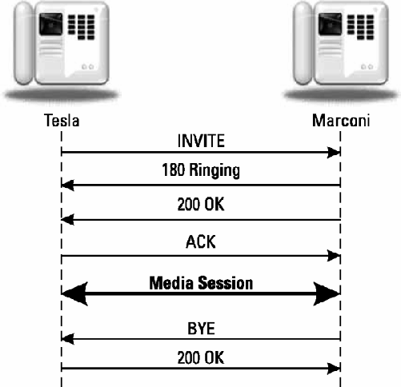

### a simple SIP session establishment example


### INVITE request
```text
INVITE sip:Marconi@radio.example.org SIP/2.0
Via: SIP/2.0/UDP lab.high-voltage.example.org:5060;branch=z9hG4bKfw19b
Max-Forwards: 70
To: G. Marconi <sip:Marconi@radio.example.org>
From: Nikola Tesla <sip:n.tesla@high-voltage.example.org>;tag=76341
Call-ID: j2qu348ek2328ws
CSeq: 1 INVITE
Subject: About That Power Outage...
Contact: <sip:n.tesla@lab.high-voltage.example.org>
Content-Type: application/sdp
Content-Length: ...
v=0
o=Tesla 2890844526 2890844526 IN IP4
s=Phone Call
c=IN IP4 100.101.102.103
t=0 0
m=audio 49170 RTP/AVP 0
a=rtpmap:0 PCMU/8000
```
1. 该请求的后半部分是什么，是SDP message body

### 180 ringing
```text
SIP/2.0 180 Ringing
Via: SIP/2.0/UDP lab.high-
voltage.example.org:5060;branch=z9hG4bKfw19b;received=100.101.102.103
To: G. Marconi <sip:marconi@radio.example.org>;tag=a53e42
From: Nikola Tesla <sip:n.tesla@high-voltage.example.org>;tag=76341
Call-ID: j2qu348ek2328ws
CSeq: 1 INVITE
Contact: <sip:marconi@tower.radio.example.org>
Content-length: 0
```
1. 响应首行的结构 `<协议/版本号> <response code> <response reason phrase>` 其中response code很多是基于http 1.1的，而reason phrase并非固定，是可用户自定义的短语
2. `Via` 头部字段, received的ip值通常与URI解析后的值是相同的
3. `To`和`From`字段, 不管是在SIP的request还是在response中，都是表示固定的request的方向，即在reponse中的to和from分别是接收者和发送方, 注意是一个事务中
4. 根据`To`和`From`确定方向以后，报文生成方对自己所处位置的字段，进行tag生成即为`To`字段生成一个tag

### 200 ok
```text
SIP/2.0 200 OK
Via: SIP/2.0/UDP lab.high-voltage.example.org:5060;branch=z9hG4bKfw19b
;received=100.101.102.103
To: G. Marconi <sip:marconi@radio.example.org>;tag=a53e42
From: Nikola Tesla <sip:n.tesla@high-voltage.org>;tag=76341
Call-ID: j2qu348ek2328ws
CSeq: 1 INVITE
Contact: <sip:marconi@tower.radio.example.org>
Content-Type: application/sdp
Content-Length: ...
v=0
o=Marconi 2890844528 2890844528 IN IP4 tower.radio.example.org
s=Phone Call
c=IN IP4 200.201.202.203
t=0 0
m=audio 60000 RTP/AVP 0
a=rtpmap:0 PCMU/8000
```
1. 这是连续的第二条响应，表示被呼叫者`called party`接收了呼叫者`caller`的呼叫
2. `To` 和 `From`保持不变，尤其是`To`的tag保持不变
3. 附带上SDP 报文消息

### ACK request
```text
ACK sip:marconi@tower.radio.example.org SIP/2.0
Via: SIP/2.0/UDP lab.high-voltage.example.org:5060;branch=z9hG4bK321g
Max-Forwards: 70
To: G. Marconi <sip:marconi@radio.example.org>;tag=a53e42
From: Nikola Tesla <sip:n.tesla@high-voltage.example.org>;tag=76341
Call-ID: j2qu348ek2328ws
CSeq: 1 ACK
Content-Length: 0
```
??? 为什么SIP还需要一个`ack request`来表示会话的完整建立?需要的消息已经交换了，其次tcp的链接建立难道不够表示两端已经连接上了吗?
1. 首先SIP的类握手交互设计，是将这一逻辑实现抽象到应用层，可以同时兼容UDP和TCP;

???SIP中的事务的定义?为什么最后的ACK又是一个独立的transaction使用newer的branch tag. 对比SIP中的`transaction` `call` `dialog` `session` `message`概念.
0. 本质上就是围绕交互的规则而定义的概念
1. 首先是 概念层级 message -> transaction -> dialog -> session->call
2. message 分请求和响应，这是由通信双方的消息内容决定的，根据响应和请求的交互关系，分为 临时响应和最终响应，比如在SIP中1xx是临时响应，2xx是最终响应。
3. 在请求和响应的消息类型基础上，事务是针对某个具体的请求和相关响应的交互规则，事务即规则，但不是通用规则，是因请求而异. 这个规则包含了请求响应的交互，以及正常异常的处理。是一个新的分割单位。
一个事务定义了通信过程中的c/s的划分，请求，与响应以及交互
4. 总结一下 transaction 是 一组message 的 规则集合
5. dialog 可以理解为在session中是具体的点对点通信交互，类似进程中的线程，而session则是进程，一个session可能会拥有多个线程

???为什么这里的From-To方向是服务端到客户端?
1. 复制错了，已经纠正

### BYE request
```text
BYE sip:n.tesla@lab.high-voltage.example.org SIP/2.0
Via: SIP/2.0/UDP tower.radio.example.org:5060;branch=z9hG4bK392kf
Max-Forwards: 70
To: Nikola Tesla <sip:n.tesla@high-voltage.example.org>;tag=76341
From: G. Marconi <sip:marconi@radio.example.org>;tag=a53e42
Call-ID: j2qu348ek2328ws
CSeq: 1392 BYE
Content-Length: 0
```
?? 为什么又是request了，SIP中的client和server关系是如何定义的?
1. 当结束时，双方都可以进行主动结束，那么此时主动方就切换为了client，这就是为什么报文中附带双方的ip了，这可以为切换C/S的角色提供信息.


1. 此时的方向是由客户端到服务端的，即一个事务中的客户端request到服务端

### 200ok response for Bye request
```text
SIP/2.0 200 OK
Via: SIP/2.0/UDP
tower.radio.example.org:5060;branch=z9hG4bK392kf;received=200.201.202.203
To: Nikola Tesla <sip:n.tesla@high-voltage.example.org>;tag=76341
From: G. Marconi <sip:marconi@radio.example.org>;tag=a53e42
Call-ID: j2qu348ek2328ws
CSeq: 1392 BYE
Content-Length: 0
```
1. branch tag 和 bye request保持了一致
??? 为什么需要session的概念，直接有dialog点对点的不就行了吗?
??? to from 的tag 和 call-id,branch 具体解决了什么标识问题呢? 什么情况下会变化更新?to-from tag是否和call-id有关？各自是如何计算的?
??? CSeq是干什么的? invite之后的ACK是否属于一个请求? command 事务?
1. 在书中描述，CSeq是在一个新请求中递增计数的，ACK并不属于一个请求，invite和bye属于
2. command 可以理解为跟随一个请求的相关报文，invite之后的ack属于跟随同一个command，CSeq 不变
