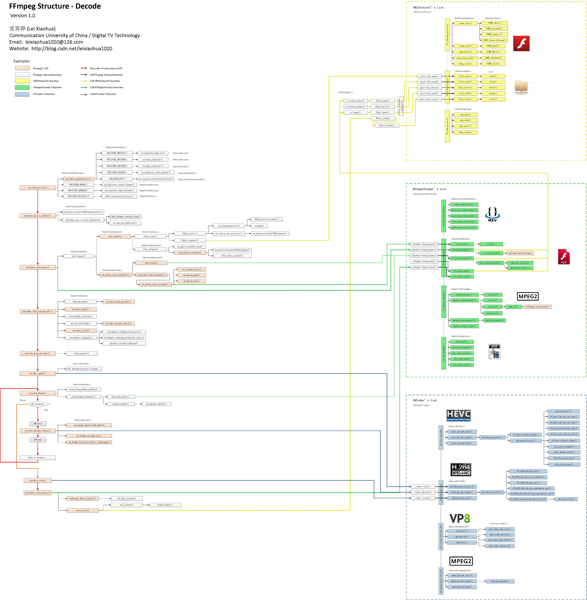
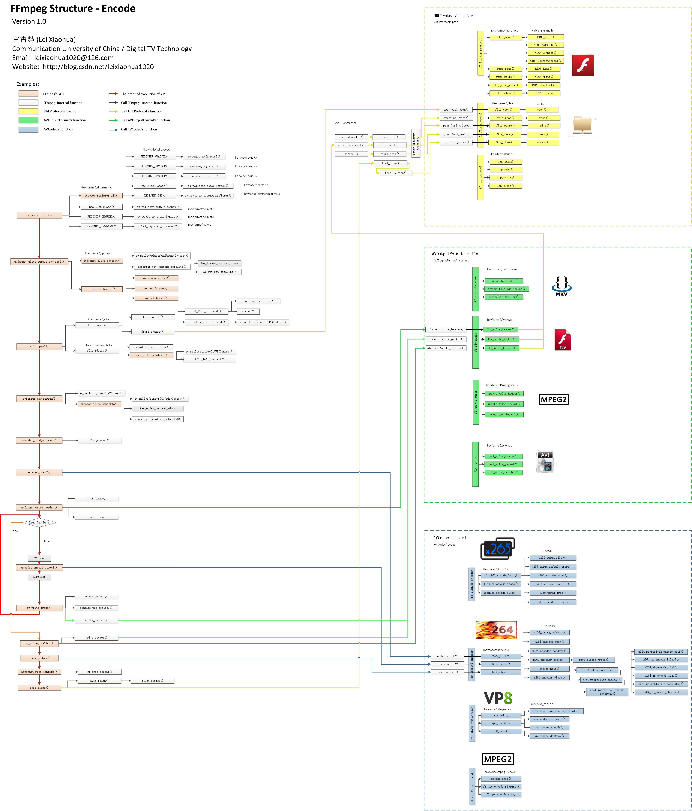
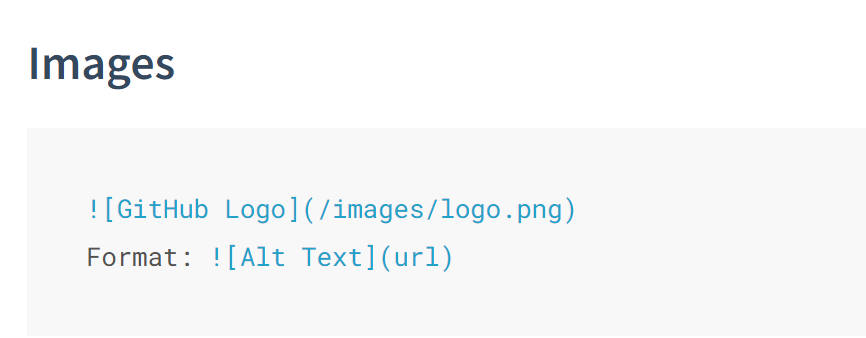

#### core idea
ffmpeg 本身只是编解码算法和应用在代码层面的抽象和实现
核心 还是 音视频 编解码 数据压缩 的基础架构和标准

#### module
编解码器:编解码功能的抽象集合，每一个具体的编解码器实体都对应了一个具体的标准类型,以及功能
音视频流: 何为流? 一个独立的，随时间变化的连续的数据实体, 而一个视频文件本身就是由多个不同的流实体组合而成
数据单元: 一个完整的音视频文件大小是不可预计的，所有的编解码操作都基于将数据内容量化为合适的数据单元，对单元进行操作转化，来完成整个媒体数据的加工, 原始数据(解码后数据)单元 <==> 压缩数据(编码后数据)单元
解复用-复用: 对标: 解封装-封装, 与io复用中的复用类似，都是在一个载体中实现多个通道或者实体的共存
所以这里的 muxer 即是各种数据流封装复用在一个媒体文件中，demuxering则是逆转这一过程

#### framediagram

#### book
**section**
FFMPEG 教程完美排版.pdf <icloud>
FFMpeg SDK 开发手册 <icloud>

FFmpeg 从入门到入土 <icloud>
ffmpeg 的tutorial中文版.pdf <icloud>
ffdoc.pdf <icloud>

**import**
FFmpeg Basics <icloud>
Understanding FFmpeg With Source Code <icloud>

****

#### web refe
[offical documentation](https://ffmpeg.org/documentation.html)
[ffmpeg tv from book <<FFmpeg Basics>>](https://ffmpeg.tv/)
[csdn: blog](https://blog.csdn.net/tonychan129/article/details/127022339)
[blog: ffmpeg 框架简读 -- 初始化部分](https://posts.careerengine.us/p/6314284c2291025e6a087f41?from=mostSharedPostSidePanel)
#### FFmpeg Decode
#### relative concept
****