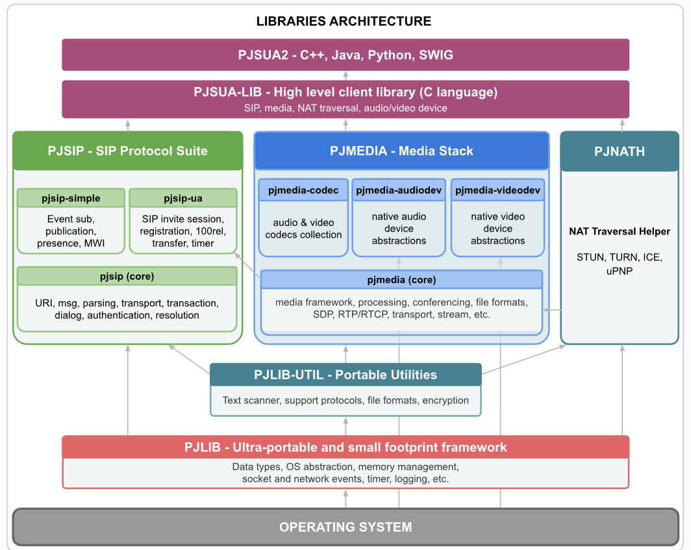

### ref
- [PJSIP PROJECT DOC](https://docs.pjsip.org/en/latest/overview/intro.html)
- [github](https://github.com/pjsip/pjproject?tab=readme-ov-file)
- [知乎：PJSIP在Android上的应用](https://zhuanlan.zhihu.com/p/688451265)
- [github: wvp-GB28181-pro](https://github.com/648540858/wvp-GB28181-pro?tab=readme-ov-file)

### book
- SIP Understanding the Session Initiation Protocol (Alan B. Johnston) (Z-Library)
- SIP demystified (Gonzalo Camarillo) (Z-Library)
- Internet Communications Using SIP Delivering VoIP and Multimedia Services with Session Initiation Protocol (Henry Sinnreich, Alan B. Johnston) (Z-Library)

### concept

### what can this do
multimedia communication
implementing standard based protocols: `SIP,SDP,RTP,STUN,TURN,ICE`
NAT traversal functionality
pure c language
**particular feature: https://docs.pjsip.org/en/latest/overview/features.html**

### API level
**了解一个库或者项目的api-level就是一个解析其层次结构的好方式**
1. 最底层的抽象: pjlib
   1. 数据结构: types,guid,fifo,except,config等
   2. 基础组件: timer,ssl,socket-qos,pool,error,log,io_queue,
2. 在pjlib的基础上的工具封装: pjlib-util
   1. network: dns,
   2. protocol: json, base64, md5,sanner,string,xml,http,sha1
3. pjsip, pjmedia, pjnath 等中间模块: 负责几个核心大类，如媒体，网络处理，以及协议交互
4. pjsua-lib: 在c语言层的高层次抽象，封装核心模块的接口，面向用户层
5. pjsua2: 在语言层面的封装，为主流面向对象语言提供接口

other: pjsua里面的sua是什么含义的缩写: session user agent 会话用户端

### document pass
- [x] overview
- [x] get started
  - [x] getting pjsip
  - [x] getting guidelines
- [ ] pjsua2 guide
  - [ ] using pjsua2
  - [ ] sample application
- [ ] specific guide
- [ ] api reference and samples

### todo task
- [ ] install pjsua2 for python3 on windows
- [ ] read book about sip protocol
- [ ] sample python app
- [ ] c++ app of bilibili course

### log
- 2025/01/10/13:45 book SIP understanding p25