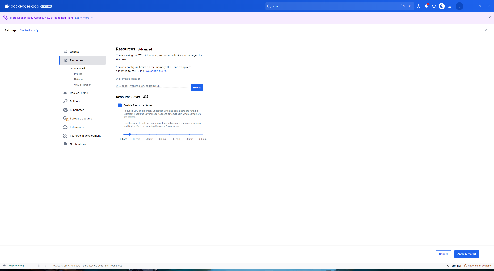
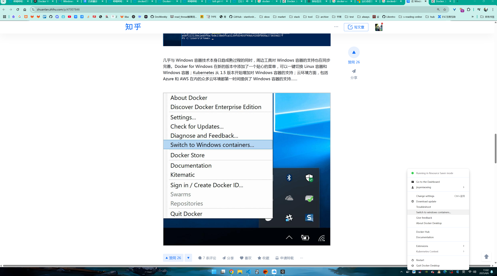

## ref

- [offical docker](https://www.docker.com/)
- [廖雪峰: docker](https://www.ruanyifeng.com/blog/2018/02/docker-tutorial.html)
- [windows offical: wsl-container](https://learn.microsoft.com/zh-cn/windows/wsl/tutorials/wsl-containers)
- [blog: Windows远程连接Docker服务](https://www.cnblogs.com/lvbok/p/18546439)
- [offical: docker layers](https://docs.docker.com/get-started/docker-concepts/building-images/understanding-image-layers/)

## windows docker desktop

1. configure wsl resouce image save path

2. question
   1. docker的基础架构? windows docker desktop 扮演了什么角色?和wsl2的关系?
        首先docker是 `client-server` 架构，windows destop 就是client，负责docker的可视化配置管理。
        docker基于`linux-container`技术，也就意味着docker的服务目标是`linux`平台应用，假设docker需要支持windows平台应用，也就意味着需要windows提供`windows-container`相关的原生支持，这在目前的docker中是支持的，即`windows-container`，在docker desktop中可以进行切换。
        
        docker的管理配置可以通过远程的api，即`docker-client`，而docker的运行则依赖于目标系统上的`docker-server`，即需要运行容器的系统上必须安装`docker-server`，在windows上安装`docker desktop`后，会自动为当前系统中的`wsl2`部署docker服务，并默认使用wsl2的docker后端。

3. 相关概念
    1. docker daemon: 对应程序实体 dockerd
    2. docker server: daemon提供的功能以及在程序架构上的角色
    3. docker client: 对应程序实体 docker
    4. docker host: 运行docker服务及容器的宿主机系统
    5. docker container: docker镜像的运行时对象

    ```bash
    xjf1127@MARK-I:/home$ docker version
        Client:
        Version:           28.0.4
        API version:       1.48
        Go version:        go1.23.7
        Git commit:        b8034c0
        Built:             Tue Mar 25 15:06:08 2025
        OS/Arch:           linux/amd64
        Context:           default

        Server: Docker Desktop 4.0.0 ()
        Engine:
        Version:          28.0.4
        API version:      1.48 (minimum version 1.24)
        Go version:       go1.23.7
        Git commit:       6430e49
        Built:            Tue Mar 25 15:07:22 2025
        OS/Arch:          linux/amd64
        Experimental:     false
        containerd:
        Version:          1.7.26
        GitCommit:        753481ec61c7c8955a23d6ff7bc8e4daed455734
        runc:
        Version:          1.2.5
        GitCommit:        v1.2.5-0-g59923ef
        docker-init:
        Version:          0.19.0
        GitCommit:        de40ad0
        xjf1127@MARK-I:/home$ docker info
        Client:
        Version:    28.0.4
        Context:    default
        Debug Mode: false
        Plugins:
        ai: Docker AI Agent - Ask Gordon (Docker Inc.)
            Version:  v1.1.3
            Path:     /usr/local/lib/docker/cli-plugins/docker-ai
        buildx: Docker Buildx (Docker Inc.)
            Version:  v0.22.0-desktop.1
            Path:     /usr/local/lib/docker/cli-plugins/docker-buildx
        cloud: Docker Cloud (Docker Inc.)
            Version:  0.2.20
            Path:     /usr/local/lib/docker/cli-plugins/docker-cloud
        compose: Docker Compose (Docker Inc.)
            Version:  v2.34.0-desktop.1
            Path:     /usr/local/lib/docker/cli-plugins/docker-compose
        debug: Get a shell into any image or container (Docker Inc.)
            Version:  0.0.38
            Path:     /usr/local/lib/docker/cli-plugins/docker-debug
        desktop: Docker Desktop commands (Beta) (Docker Inc.)
            Version:  v0.1.6
            Path:     /usr/local/lib/docker/cli-plugins/docker-desktop
        dev: Docker Dev Environments (Docker Inc.)
            Version:  v0.1.2
            Path:     /usr/local/lib/docker/cli-plugins/docker-dev
        extension: Manages Docker extensions (Docker Inc.)
            Version:  v0.2.27
            Path:     /usr/local/lib/docker/cli-plugins/docker-extension
        init: Creates Docker-related starter files for your project (Docker Inc.)
            Version:  v1.4.0
            Path:     /usr/local/lib/docker/cli-plugins/docker-init
        sbom: View the packaged-based Software Bill Of Materials (SBOM) for an image (Anchore Inc.)
            Version:  0.6.0
            Path:     /usr/local/lib/docker/cli-plugins/docker-sbom
        scout: Docker Scout (Docker Inc.)
            Version:  v1.17.0
            Path:     /usr/local/lib/docker/cli-plugins/docker-scout
        WARNING: Plugin "/usr/local/lib/docker/cli-plugins/docker-feedback" is not valid: failed to fetch metadata: fork/exec /usr/local/lib/docker/cli-plugins/docker-feedback: no such file or directory

        Server:
        Containers: 0
        Running: 0
        Paused: 0
        Stopped: 0
        Images: 0
        Server Version: 28.0.4
        Storage Driver: overlay2
        Backing Filesystem: extfs
        Supports d_type: true
        Using metacopy: false
        Native Overlay Diff: true
        userxattr: false
        Logging Driver: json-file
        Cgroup Driver: cgroupfs
        Cgroup Version: 1
        Plugins:
        Volume: local
        Network: bridge host ipvlan macvlan null overlay
        Log: awslogs fluentd gcplogs gelf journald json-file local splunk syslog
        CDI spec directories:
        /etc/cdi
        /var/run/cdi
        Swarm: inactive
        Runtimes: runc io.containerd.runc.v2 nvidia
        Default Runtime: runc
        Init Binary: docker-init
        containerd version: 753481ec61c7c8955a23d6ff7bc8e4daed455734
        runc version: v1.2.5-0-g59923ef
        init version: de40ad0
        Security Options:
        seccomp
        Profile: unconfined
        Kernel Version: 5.15.167.4-microsoft-standard-WSL2
        Operating System: Docker Desktop
        OSType: linux
        Architecture: x86_64
        CPUs: 20
        Total Memory: 31.21GiB
        Name: docker-desktop
        ID: 6aeaf1d2-44d8-48ac-b5c1-ace481d8b3c7
        Docker Root Dir: /var/lib/docker
        Debug Mode: false
        HTTP Proxy: http.docker.internal:3128
        HTTPS Proxy: http.docker.internal:3128
        No Proxy: hubproxy.docker.internal
        Labels:
        com.docker.desktop.address=unix:///var/run/docker-cli.sock
        Experimental: false
        Insecure Registries:
        hubproxy.docker.internal:5555
        ::1/128
        127.0.0.0/8
        Live Restore Enabled: false
    ```

## wsl2 opt

1. user group setting
   1. 确定当前用户信息

   ```bash
    xjf1127@MARK-I:/home$ whoami
    xjf1127
    xjf1127@MARK-I:/home$ id
    uid=1000(xjf1127) gid=1000(xjf1127) groups=1000(xjf1127),4(adm),20(dialout),24(cdrom),25(floppy),27(sudo),29(audio),30(dip),44(video),46(plugdev),117(netdev),1001(docker)
    xjf1127@MARK-I:/home$ groups
    xjf1127 adm dialout cdrom floppy sudo audio dip video plugdev netdev docker
   ```

2. 为什么需要打开windows端的docker desktop，wsl2端的docker命令才能生效?
    docker desktop本身就内置了一个专用的wsl2系统，所以实际上当前电脑是存在两个wsl2系统

   ```bash
    C:\Users\XuJiaFei>wsl -l
    适用于 Linux 的 Windows 子系统分发:
    Ubuntu-22.04 (默认)
    docker-desktop

    C:\Users\XuJiaFei>wsl --list --verbose
    NAME              STATE           VERSION
    * Ubuntu-22.04      Running         2
    docker-desktop    Stopped         2
   ```

3. 在`docker desktop`的`docker hub`中选择了镜像并且进行pull操作后，发生了什么?

   ```bash
    #反馈
    Status: Image is up to date for kitware/cmake:ci-debian10-x86_64-2023-07-31
   ```

## docker grammar

1. RUN
   1. 执行内容是否会对当前系统造成影响?不会
   2. 能否引用其他已有docker镜像内容，比如直接引用现有的cmake的docker镜像?
   3. 在容器中路径是如何处理的呢，也是虚拟隔离的? 完全隔离，即使绝对路径也是独属于当前docker镜像。
   4. 如何制作更通用的兼容多系统的镜像?如何判断当前docker镜像是否存在宿主系统的一些特殊依赖呢?
   5. 当dockerfile中的`FROM baseimage`和当前宿主系统不同时，docker镜像的运行是按哪一方的系统进行依赖检查和引用的? 按照指定环境进行检查和运行
   6. docker引用或者使用其他镜像的方式?docker镜像既然是从文件系统开始就进行了隔离，那么在引用其他镜像时，如何处理依赖和合并呢?
    通过 FROM 继承镜像：最常见的方式，直接继承镜像内容并在此基础上进行增量修改。
    通过容器挂载文件系统：运行一个容器并挂载它的文件系统到另一个容器中，这样容器内的内容就能被引用。
    通过 Docker Compose：可以让你同时运行多个镜像，通过服务间的交互（比如共享卷、依赖关系）来引用其他镜像的内容。
    容器间共享卷：多个容器可以共享数据卷，从而相互引用和传递数据。
   7. 如何解析一个镜像内容呢，如文件系统内容，以及构建内容，比如docker hub上的
      1. 查看历史记录

        ```bash
            xjf1127@MARK-I:/home$ docker history kitware/cmake:ci-debian10-x86_64-2023-07-31
            IMAGE          CREATED         CREATED BY                                      SIZE      COMMENT
            1273e4b6be2f   20 months ago   RUN /bin/sh -c sh /root/install_deps.sh # bu…   586MB     buildkit.dockerfile.v0
            <missing>      20 months ago   LABEL maintainer=Brad King <brad.king@kitwar…   0B        buildkit.dockerfile.v0
            <missing>      2 years ago     /bin/sh -c #(nop)  CMD ["bash"]                 0B        
            <missing>      2 years ago     /bin/sh -c #(nop) ADD file:4bf66d4081da52e8b…   114MB 
        ```

2. FROM
   1. 一份dockerfile中连续多个from行为，这是进行镜像切换还是进行的镜像合并? 答: 是进行镜像切换，即一种多阶段构建方式，将要做的任务分解为多个阶段，每个阶段切换环境进行处理，提取成果物后切换到下一个阶段，合并要通过`COPY`方式
3. COPY
4. COMPOSE
   1. 能否组织比如cmake这样的单用途容器，使用场景? 答: docker-compose可以看作是docker run的增强，替代的是最终的容器运行阶段
5. WORKDIR
6. volume
7. 缓存机制
   1. 存储位置?
   2. 能否手动管理呢?
   3. 如何检查是否存在某个镜像?
   4. 进行镜像清理?
8. 能否直接命令行操作容器来替代dockerfile进行镜像打包?

   

### `kitware/cmake:ci-debian12-x86_64-2025-01-23`镜像实操

0. 查看镜像历史图层，使用--no-trunc可以防止内容过长被截断

   ```bash
    xjf1127@MARK-I:~/wsl_workspace/prj/learn_docker/example_1$ docker history --no-trunc kitware/cmake:ci-debian12-x86_64-2025-01-23
    IMAGE                                                                     CREATED        CREATED BY                                                                                                                                   SIZE      COMMENT
    sha256:d964a41a0dcfd0a730094fd039a7ad0e9a768d728e84bd1b8b0afa7f09186e87   2 months ago   RUN /bin/sh -c tar -C /usr/local -xf /root/rvm.tar # buildkit                                                                                55.8MB    buildkit.dockerfile.v0
    <missing>                                                                 2 months ago   RUN /bin/sh -c tar -C / -xf /root/iwyu.tar  && ln -s /usr/lib/llvm-15/bin/include-what-you-use /usr/bin/include-what-you-use-15 # buildkit   8.81MB    buildkit.dockerfile.v0
    <missing>                                                                 2 months ago   RUN /bin/sh -c sh /root/install_deps.sh # buildkit                                                                                           4.11GB    buildkit.dockerfile.v0
    <missing>                                                                 2 months ago   ENV RBENV_ROOT=/opt/rbenv                                                                                                                    0B        buildkit.dockerfile.v0
    <missing>                                                                 2 months ago   LABEL maintainer=Ben Boeckel <ben.boeckel@kitware.com>                                                                                       0B        buildkit.dockerfile.v0
    <missing>                                                                 2 months ago   # debian.sh --arch 'amd64' out/ 'bookworm' '@1736726400' 
   ```

1. 安装后进入镜像 `docker run -it --rm kitware/cmake:ci-debian12-x86_64-2025-01-23 bash`，发现的确存在一些cmake配置文件，但根本没有cmkae可执行文件
2. 推测: 结合镜像名称前缀`ci-`，很有可能，该镜像就不是用于普通用于引用cmake功能的，而是用于cmake开发者用于持续集成(Continuous Integration)或者测试

### dockerfile cmake 环境构建实操

```dockerfile
# 使用 Ubuntu 22.04 作为基础镜像
FROM ubuntu:22.04

# 设置环境变量，确保 apt-get 不会提示交互式配置
ENV DEBIAN_FRONTEND=noninteractive

# 更新包列表并安装构建依赖
RUN apt-get update && \
    apt-get install -y \
    build-essential \
    wget \
    curl \
    ca-certificates \
    libssl-dev \
    libcurl4-openssl-dev \
    libtool \
    pkg-config \
    git \
    cmake \
    && rm -rf /var/lib/apt/lists/*

# 安装 CMake 3.31.6
WORKDIR /tmp
RUN wget https://github.com/Kitware/CMake/releases/download/v3.31.6/cmake-3.31.6.tar.gz && \
    tar -zxvf cmake-3.31.6.tar.gz && \
    cd cmake-3.31.6 && \
    ./bootstrap && \
    make && \
    make install

# 设置工作目录
WORKDIR /workspace

# 设置默认的入口点
CMD [ "bash" ]
```

```bash
docker build -t base_image_cmake_3.31.6 .
xjf1127@MARK-I:~/wsl_workspace/prj/learn_docker/example_2$ bash docker_execute.sh 
[+] Building 33.6s (3/3) FINISHED                                                                                                                                                                                     docker:default
 => [internal] load build definition from dockerfile                                                                                                                                                                            0.0s
 => => transferring dockerfile: 816B                                                                                                                                                                                            0.0s
 => ERROR [internal] load metadata for docker.io/library/ubuntu:22.04                                                                                                                                                          33.5s
 => [auth] library/ubuntu:pull token for registry-1.docker.io                                                                                                                                                                   0.0s
------
 > [internal] load metadata for docker.io/library/ubuntu:22.04:
------
dockerfile:2
--------------------
   1 |     # 使用 Ubuntu 22.04 作为基础镜像
   2 | >>> FROM ubuntu:22.04
   3 |     
   4 |     # 设置环境变量，确保 apt-get 不会提示交互式配置
--------------------
ERROR: failed to solve: DeadlineExceeded: DeadlineExceeded: DeadlineExceeded: ubuntu:22.04: failed to resolve source metadata for docker.io/library/ubuntu:22.04: failed to authorize: DeadlineExceeded: failed to fetch oauth token: Post "https://auth.docker.io/token": dial tcp 54.234.18.200:443: i/o timeout
```

通过`docker hub`进行`ubuntu:22.04`镜像安装成功

```bash
xjf1127@MARK-I:~/wsl_workspace/prj/learn_docker/example_2$ bash docker_execute.sh 
[+] Building 283.9s (5/8)                                                                                                                                                                                             docker:default
 => [internal] load build definition from dockerfile                                                                                                                                                                            0.0s
 => => transferring dockerfile: 816B                                                                                                                                                                                            0.0s
 => [internal] load metadata for docker.io/library/ubuntu:22.04                                                                                                                                                                 0.0s
 => [internal] load .dockerignore                                                                                                                                                                                               0.0s
 => => transferring context: 2B                                                                                                                                                                                                 0.0s
 => [1/5] FROM docker.io/library/ubuntu:22.04                                                                                                                                                                                   0.0s
 => ERROR [2/5] RUN apt-get update &&     apt-get install -y     build-essential     wget     curl     ca-certificates     libssl-dev     libcurl4-openssl-dev     libtool     pkg-config     git     cmake     && rm -rf /v  283.8s
------                                                                                                                                                                                                                               
 > [2/5] RUN apt-get update &&     apt-get install -y     build-essential     wget     curl     ca-certificates     libssl-dev     libcurl4-openssl-dev     libtool     pkg-config     git     cmake     && rm -rf /var/lib/apt/lists/*:                                                                                                                                                                                                                                  
9.960 Get:1 http://archive.ubuntu.com/ubuntu jammy InRelease [270 kB]                                                                                                                                                                
21.56 Err:2 http://security.ubuntu.com/ubuntu jammy-security InRelease                                                                                                                                                               
21.56   502  Bad Gateway [IP: 91.189.91.82 80]                                                                                                                                                                                       
27.82 Get:3 http://archive.ubuntu.com/ubuntu jammy-updates InRelease [128 kB]
41.50 Get:4 http://archive.ubuntu.com/ubuntu jammy-backports InRelease [127 kB]
62.15 Get:5 http://archive.ubuntu.com/ubuntu jammy/restricted amd64 Packages [164 kB]
112.2 Ign:6 http://archive.ubuntu.com/ubuntu jammy/universe amd64 Packages
128.1 Get:7 http://archive.ubuntu.com/ubuntu jammy/multiverse amd64 Packages [266 kB]
146.1 Get:8 http://archive.ubuntu.com/ubuntu jammy/main amd64 Packages [1792 kB]
161.1 Get:9 http://archive.ubuntu.com/ubuntu jammy-updates/main amd64 Packages [3097 kB]
196.2 Get:10 http://archive.ubuntu.com/ubuntu jammy-updates/multiverse amd64 Packages [55.7 kB]
210.5 Get:11 http://archive.ubuntu.com/ubuntu jammy-updates/universe amd64 Packages [1540 kB]
224.6 Get:12 http://archive.ubuntu.com/ubuntu jammy-updates/restricted amd64 Packages [4154 kB]
234.5 Get:13 http://archive.ubuntu.com/ubuntu jammy-backports/universe amd64 Packages [35.2 kB]
244.7 Get:14 http://archive.ubuntu.com/ubuntu jammy-backports/main amd64 Packages [82.7 kB]
282.4 Get:6 http://archive.ubuntu.com/ubuntu jammy/universe amd64 Packages [17.5 MB]
283.3 Reading package lists...
283.8 E: Failed to fetch http://security.ubuntu.com/ubuntu/dists/jammy-security/InRelease  502  Bad Gateway [IP: 91.189.91.82 80]
283.8 E: The repository 'http://security.ubuntu.com/ubuntu jammy-security InRelease' is not signed.
------
dockerfile:8
--------------------
   7 |     # 更新包列表并安装构建依赖
   8 | >>> RUN apt-get update && \
   9 | >>>     apt-get install -y \
  10 | >>>     build-essential \
  11 | >>>     wget \
  12 | >>>     curl \
  13 | >>>     ca-certificates \
  14 | >>>     libssl-dev \
  15 | >>>     libcurl4-openssl-dev \
  16 | >>>     libtool \
  17 | >>>     pkg-config \
  18 | >>>     git \
  19 | >>>     cmake \
  20 | >>>     && rm -rf /var/lib/apt/lists/*
  21 |     
--------------------
ERROR: failed to solve: process "/bin/sh -c apt-get update &&     apt-get install -y     build-essential     wget     curl     ca-certificates     libssl-dev     libcurl4-openssl-dev     libtool     pkg-config     git     cmake     && rm -rf /var/lib/apt/lists/*" did not complete successfully: exit code: 100               
```

似乎wsl2上docker网络存在问题，关闭飞机场后速度提升

### 配置镜像源

- [blog: weixin](https://mp.weixin.qq.com/s?__biz=Mzg4ODQ1NTE2Mg==&mid=2247571299&idx=1&sn=ea28bde03f70837b6b8bf1196ed617d6&chksm=ce23225d56e50c2db02161e0688682480e17a22d8100f19dfc1905b2a59bfbcbbb0ff19e9856&scene=27)

- 更换docker pull 镜像
- 更换apt-get 镜像源
- docker desktop 配置
- 临时镜像源设置

```dockerfile
# 使用 Ubuntu 22.04 作为基础镜像
FROM ubuntu:22.04

# 设置环境变量，确保 apt-get 不会提示交互式配置
ENV DEBIAN_FRONTEND=noninteractive

# 更换为阿里云镜像源
RUN sed -i 's|http://archive.ubuntu.com/ubuntu/|http://mirrors.aliyun.com/ubuntu/|g' /etc/apt/sources.list && \
    sed -i 's|http://security.ubuntu.com/ubuntu/|http://mirrors.aliyun.com/ubuntu/|g' /etc/apt/sources.list

# 更新包列表并安装构建依赖
RUN apt-get update && \
    apt-get install -y \
    build-essential \
    wget \
    curl \
    ca-certificates \
    libssl-dev \
    libcurl4-openssl-dev \
    libtool \
    pkg-config \
    git \
    cmake \
    && rm -rf /var/lib/apt/lists/*

# 安装 CMake 3.31.6
WORKDIR /tmp
RUN wget https://github.com/Kitware/CMake/releases/download/v3.31.6/cmake-3.31.6.tar.gz && \
    tar -zxvf cmake-3.31.6.tar.gz && \
    cd cmake-3.31.6 && \
    ./bootstrap && \
    make && \
    make install

# 设置工作目录
WORKDIR /workspace

# 设置默认的入口点
CMD [ "bash" ]

```

```bash
xjf1127@MARK-I:~/wsl_workspace/prj/learn_docker/example_2$ bash docker_execute.sh                                                                                                                                                    
[+] Building 976.2s (10/10) FINISHED                                                                                                                                                                                  docker:default 
 => [internal] load build definition from dockerfile                                                                                                                                                                            0.0s 
 => => transferring dockerfile: 1.06kB                                                                                                                                                                                          0.0s 
 => [internal] load metadata for docker.io/library/ubuntu:22.04                                                                                                                                                                 0.0s
 => [internal] load .dockerignore                                                                                                                                                                                               0.0s
 => => transferring context: 2B                                                                                                                                                                                                 0.0s
 => CACHED [1/6] FROM docker.io/library/ubuntu:22.04                                                                                                                                                                            0.0s
 => [2/6] RUN sed -i 's|http://archive.ubuntu.com/ubuntu/|http://mirrors.aliyun.com/ubuntu/|g' /etc/apt/sources.list &&     sed -i 's|http://security.ubuntu.com/ubuntu/|http://mirrors.aliyun.com/ubuntu/|g' /etc/apt/sources  0.3s
 => [3/6] RUN apt-get update &&     apt-get install -y     build-essential     wget     curl     ca-certificates     libssl-dev     libcurl4-openssl-dev     libtool     pkg-config     git     && rm -rf /var/lib/apt/lists  221.7s
 => [4/6] WORKDIR /tmp                                                                                                                                                                                                          0.0s 
 => [5/6] RUN wget https://github.com/Kitware/CMake/releases/download/v3.31.6/cmake-3.31.6.tar.gz &&     tar -zxvf cmake-3.31.6.tar.gz &&     cd cmake-3.31.6 &&     ./bootstrap &&     make &&     make install              752.0s 
 => [6/6] WORKDIR /workspace                                                                                                                                                                                                    0.0s 
 => exporting to image                                                                                                                                                                                                          2.2s 
 => => exporting layers                                                                                                                                                                                                         2.1s 
 => => writing image sha256:a65c73cac1d8ac9f9b7fe42a5d6e6704b9d970fe1dc95e8ff159d12d5e72928c                                                                                                                                    0.0s 
 => => naming to docker.io/library/base_image_cmake_3.31.6                                    
```

构建成功，镜像被成功导出，名称:base_image_cmake_3.31.6

### 使用挂载方式，来使用镜像环境进行编译

```bash
#!/bin/bash

# 设置路径（当前脚本路径）
ROOT_DIR=$(cd "$(dirname "$0")"; pwd)
SRC_DIR="$ROOT_DIR"
BUILD_DIR="$ROOT_DIR/build"

# 创建 build 输出目录
mkdir -p "$BUILD_DIR"

# 镜像名（假设你已经构建好了，叫 cpp-builder:latest）
IMAGE_NAME=base_image_cmake_3.31.6:latest

# 调用 Docker 编译
docker run --rm \
    -v "$SRC_DIR":/workspace \
    -v "$BUILD_DIR":/workspace/build \
    $IMAGE_NAME \
    bash -c "cd /workspace/build && cmake .. && make -j$(nproc)"

```

### 二次构建镜像，添加gui框架，以及调试工具

### 多次构建出来的镜像，能否根据history进行回退呢

### 如何添加说明信息

### 如何修改已构建镜像名称

```bash
docker tag mybuilder:base xjf_dev:v2.0
docker rmi mybuilder:base
```

### vscode 能否连接 docker镜像进行开发

准确说是连接docker容器
关键词在于attach
问题1：vscode attach docker之后使用的vscode的插件是否需要重新安装，答案是需要重新安装
问题2：vscode 在contian上安装了插件以后，销毁容器是否会一同销毁，如何打造包含目标vscode插件的镜像?

方案1：首次attcah容器之后，手动安装所有需要插件，然后进行commit，打包当前镜像用于后续复用
方案2：按照vscode dev contains方案走，编写配置文件，容器持久化缓存，仅在镜像的首次运行进行准备缓存
方案3：将当前wsl2的vscode插件打包，在使用容器时进行拷贝或者挂载
合理性: 2 > 1 > 3

- [offical: wsl vscode docker container](https://code.visualstudio.com/blogs/2020/07/01/containers-wsl)
- [zhihu: vscode connectd container](https://zhuanlan.zhihu.com/p/507699035)
- [microsoft: wsl-containers](https://learn.microsoft.com/zh-cn/windows/wsl/tutorials/wsl-containers)
- [vscode: container templates](https://containers.dev/templates)
- [vscode: Developing inside a Container: 新鲜!](https://code.visualstudio.com/docs/devcontainers/containers)
- [vscode: container configure](https://code.visualstudio.com/remote/advancedcontainers/overview)
- [bilibili: 一口气搞懂docker的100+概念](https://www.bilibili.com/video/BV12jQDYREBR/?spm_id_from=333.788.videopod.sections&vd_source=4bc1ade93cb885bbaa0fcb3326790a95)
- [offical: volume](https://docs.docker.com/engine/storage/volumes/)

### docker volume

0. 核心主题?
   1. docker 的数据存储管理
      1. 容器层读写: 速度较慢: 容器是在镜像层的基础上追加可写层，如果需要修改镜像相关文件，会触发`写时复制`，即会先将目标文件复制到容器写层，然后对这个副本进行修改，来保证镜像的完整性，那么此时效率较低
      2. 挂载方式1: 非持久性存储 tmpfs --> mount: memory
      3. 挂载方式2: 持久存储 volume 首先默认存储在host中的特定位置，并且权限只能有docker进程访问
      4. 挂载方式3: 持久存储 bind mount 任意存储位置，无访问权限设置，host以及contianer均能访问
1. what is volume? docker中一种受管理的挂载方式
2. mount a volume to a contain
   1. direct mount
   2. mount by read-only
   3. mount the subdirectory of volume: 在多容器共享volume时，可以隔离各容器访问内容
   4. anonymous volume？意义何在? 开辟一块空间持久化存储，不与容器生命周期同步，注意 --rm 命令会将 volume和contain周期绑定，即自动销毁
   5. volume backup: 将一个volume数据保存为本地的.tar文件
      1. 通过临时容器，使用--volumes-from命令将已有容器volume导入，然后再挂载host路径，将volume路径打包到host路径中
      2. 直接一个临时容器，同事挂载volume和host路径，将volume内容打包到host路径中
   6. volume restore: 将一个.tar文件数据恢复到volume中
      1. 同样的套路，挂载好volume和host路径，将host路径中的打包文件解压到volume对应的路径中
3. docker volume的访问权限? 非docker进程不能修改
4. diff between mount and volume? 安全性不同
5. 可以看作是一个隔离的文件中间层，隔离了host操作，对该层的操作都要经过docker进程处理，也就意味着避免很多非安全操作，而直接使用挂载最为直接，但无法控制host对挂载目录的直接操作
6. 如果启动一个容器并mount一个volume，当volume不存在时，docker会自动创建
7. 如果挂载volume的目标docker目录已经存在文件，那么此时是会将docker目录中的文件复制到volume中，还是隐藏docker目录中已有的文件?

   ```bash
   If you start a container which creates a new volume, and the container has files or directories in the directory to be mounted such as /app/, Docker copies the directory's contents into the volume. The container then mounts and uses the volume, and other containers which use the volume also have access to the pre-populated content.
   ```

   docker会将文件进行拷贝
8. 紧接问题7，如果在使用了一段时间volume后卸载volume，那么此时容器目录中的文件是什么状态?


### 容器优化: 体积缩减

- [bilibili: Docker镜像最佳实践：从1.2GB到10MB！](https://www.bilibili.com/video/BV1QmkVYiEjg/?spm_id_from=333.337.search-card.all.click&vd_source=4bc1ade93cb885bbaa0fcb3326790a95)

### concept outline

1. docker engine
2. docker build
   1. dockerfile
   2. build context
   3. cache
   4. exporter
   5. building
      1. multi-stage: each `FROM` correspond to one stage
      2. environment variables
      3. secrets
      4. multi-platform
      5. best practices
      6. container commit
3. docker compose

### 交叉编译环境搭建

1. 容器存储方式选型，使用哪种方式来存储源码?
   1. 直接`bind mount`，保证源码透明性


### vscode opt record

1. 现象: 下载失败
2. 解决: 规避:如何使用本地镜像进行构建?
    使用vscode右键上下文菜单中的`build image`会默认使用`--pull`参数，从云端拉去镜像`

```bash
------
 > [internal] load metadata for docker.io/library/gcc:latest:
------
Dockerfile:6
--------------------
   4 |     # tags from Docker Hub.
   5 |     # See https://docs.docker.com/samples/library/gcc/ for more on how to use this image
   6 | >>> FROM gcc:latest
   7 |     # FROM registry.cn-hangzhou.aliyuncs.com/google_containers/gcc:latest
   8 |     
--------------------
ERROR: failed to solve: DeadlineExceeded: DeadlineExceeded: DeadlineExceeded: gcc:latest: failed to resolve source metadata for docker.io/library/gcc:latest: failed to authorize: DeadlineExceeded: failed to fetch anonymous token: Get "https://auth.docker.io/token?scope=repository%3Alibrary%2Fgcc%3Apull&service=registry.docker.io": dial tcp 174.37.54.20:443: i/o timeout

 *  The terminal process "/bin/bash '-c', 'docker build --pull --rm -f 'Dockerfile' -t 'examplevscode1:v0.0.1' '.''" terminated with exit code: 1. 
 *  Terminal will be reused by tasks, press any key to close it. 
```
