### image build

- [x] non-dev container
   1. tag_base: gcc cmake gdb ... host tool installed
   2. tag_sdk: rv1126_sdk base compile
      1. 以什么方式将sdk注入镜像，并且修改好路径?
         1. 先build一层临时镜像，copy sdk文件压缩包到镜像中，再在container中进行配置，最终生成新镜像
         2. 准备好需要注入的sdk文件，进行mount，再在contianer中进行配置，最终进行commit生成新镜像
   3. tag_sdk: rv1126_sdk + qt5 base compile
   4. tag_sdk: rv1126_sdk + qt5 + ... tool

- [ ] devcontainer pre-build image
  1. install dev container cli
     1. 最快方式，通过vscode的dev container插件中的install dev container cli命令进行安装，添加到shell的环境路径中
     2. 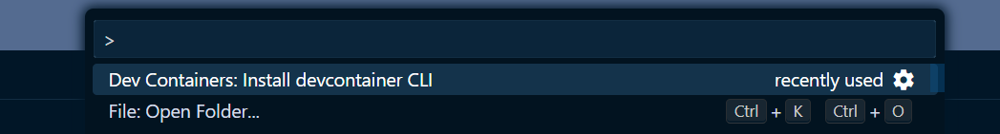
     3. 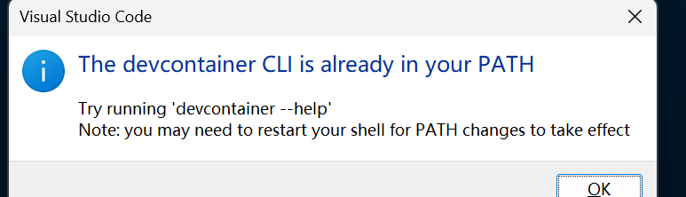
     4. 在关闭所有vscode窗口后再启动打开wsl 终端，可以找到
  2. prepare devcontainer data
  3. build image by dev container cli
  4. 报错

   ```bash
   ERROR: failed to resolve source metadata for docker.io/docker/dockerfile:1.4:
   failed to do request: Head "https://docker.mirrors.ustc.edu.cn/v2/docker/dockerfile/manifests/1.4?ns=docker.io": EOF
   ```

   devcontainer.json中存在feature字段，触发构建特性注入流程，会临时生成Dockerfile.extended，内部强制指定一些镜像依赖
   devcotnainer cli 需要该镜像用于语法解释，但从镜像源拉去失败https://docker.mirrors.ustc.edu.cn 存在网络问题
   处理: 1. 从docker设置中去除镜像源配置，失败 2. 手动直接从 docker desktop中拉取成功，本地安装成功，但devcontainer还是会远程拉取，导致失败
   3. 去除feature字段，跳过特性注入步骤，成功

   5. 新镜像对比老镜像inpsect
   多了 "Comment": "buildkit.dockerfile.v0",说明是通过buildkit进行构建的，configure的很多字段都变成了false
   6. 通过docker run运行当前pre-build镜像，并不会解析devcontainer中的内容，比如安装vscode插件，并进行vscode交互
   7. 本质上，devcontainer的配置内容还是由devcontainer cli，即规范实现来进行解析操作的
   8. 包含了devcontainer元数据的pre-build image 使用价值在哪里?
      1. 似乎vscode的devcontainer插件并不能跳过*.json配置文件来创建devc容器
      2. 以及devc cli命令行工具也不能以pre-build作为容器创建运行入口
      3. 猜测：仅仅是存储元信息，启动devc容器还是得以指定.devcontainer相关文件来作为入口?即pre-build image还是运用在.devcontainer文件夹中
   9. 将带有两个vscode插件配置元数据的pre-build image作为devcontainer.json的image配置后，通过vscode的dev container open folder打开后，发现并没有自动安装元数据中的两个vscode插件??
      1. 猜测：vscode不会读取image中的devc元数据，只基于devc.json的内容进行容器创建?
      2. 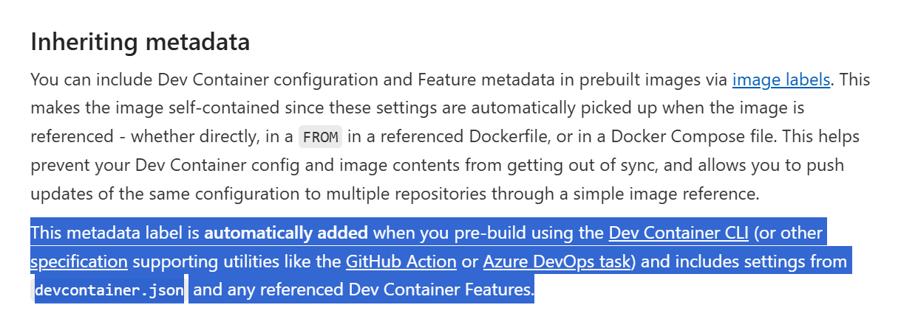 在vscode 文档中只提到了CLI命令行和github工具会进行元数据合并
      3. 在容器中配置中加入extension，然后通过vscode dev container 的rebuild命令，也同样无效，没有自动安装
      4. 关闭当前容器，然后再通过`open folder in container`命令打开，还是没有自动安装
      5. 尝试删除容器，然后重新打开
      6. 观察容器的inspect，发现有两个customizations对象，一模一样的，说明的确配置文件中的信息和镜像元数据进行了合并
   10. 观察 vscode devcontainer template 模式创建容器
       1. 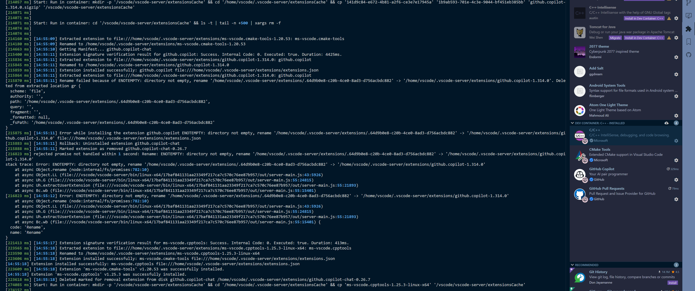 可以发现已经安装了插件
       2. 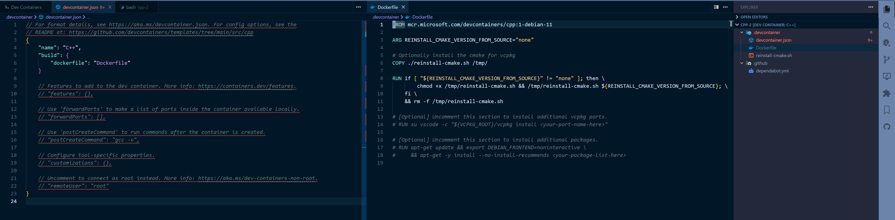 但是在文件夹配置文件中并没有，意味着template的设置并不会同步到配置文件中
   11. 猜测: 得以template启动作为容器起点，然后才能通过更新devc.json来自动安装? 还是说有一些特性没有触发？
       1. 尝试通过添加feature来触发自动安装
       2. 问题又回归到了vscode dockerfile:1.4自动拉取失败问题
       3. 尝试直接手动 docker pull docker.io/docker/dockerfile:1.4，安装成功，解决vscode feature执行失败问题
       4. 依旧没有解决，自动安装插件问题
       5. 尝试容器创建后，手动命令行安装插件，但是容器rebuild会消失
       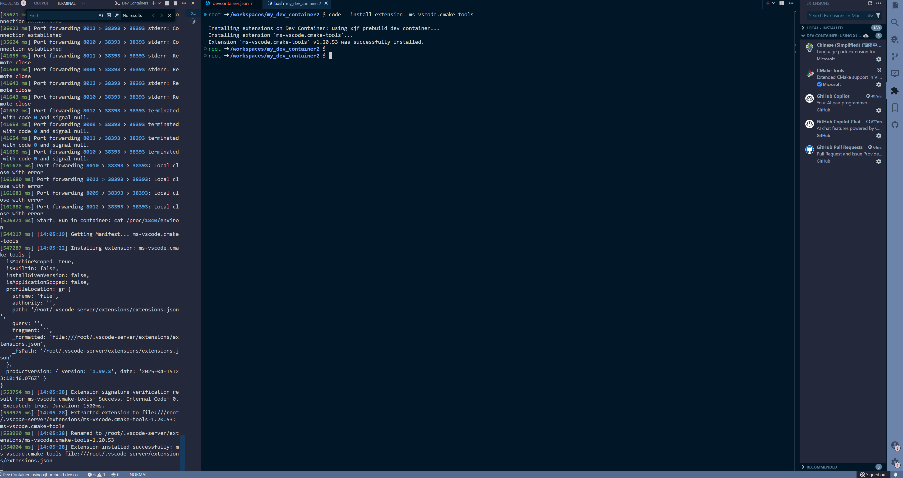
       6. 实验在image1中命令行安装插件，生成image2，运行容器后是否能够使用? 
       7. 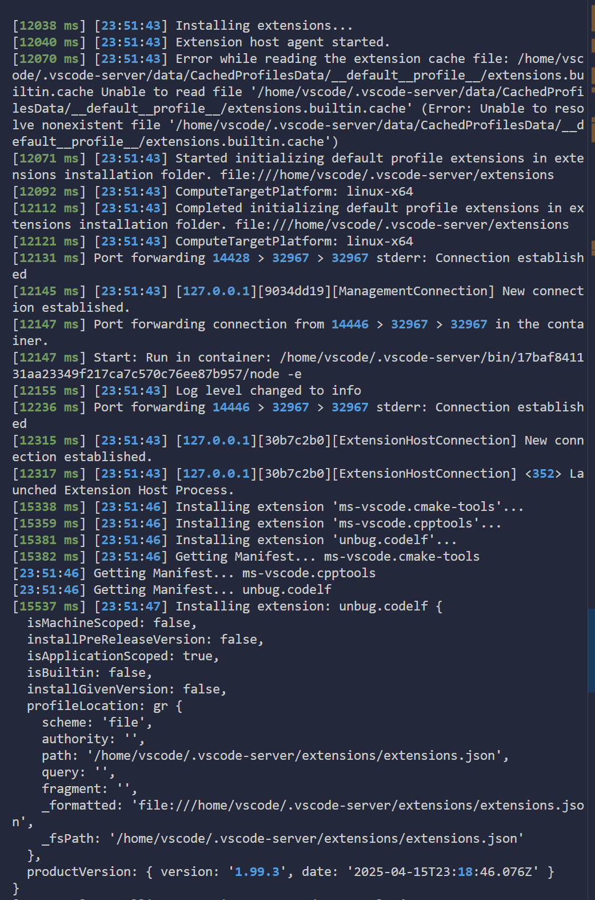 从模板创建的container 日志总可以看到，extension自动安装流程中有profile以及extension host agent，难道和这个有关？试着对比手动devc.json的构建日志
       8. 最终发现异常，解决 插件自动安装问题，`remoteUser`为非远程用户时会自动安装，为`root`用户时不会
          1. 尝试不同用户名rebuild时的日志，可以发现很多行为是基于用户名相关的路径，那root就有可能具有特殊性
       9. remoteUser? https://code.visualstudio.com/remote/advancedcontainers/add-nonroot-user
       10. 现在的问题是，如何在 startup container 之后，切换回超级用户?

         ```bash
         "postCreateCommand": [
            "id vscode || useradd -m -s /bin/bash vscode",
            "sudo -lU vscode | grep -q NOPASSWD || (echo 'vscode ALL=(ALL) NOPASSWD:ALL' > /etc/sudoers.d/vscode && chmod 0440 /etc/sudoers.d/vscode)"
         ],
         vscode ➜ /workspaces/my_dev_container2 $ sudo -i
         root ➜ ~ $ id
         uid=0(root) gid=0(root) groups=0(root)
         ```

      11. 突然又不行了，使用非root的用户名，使用 root 编译成功，但是插件无法自动安装 
   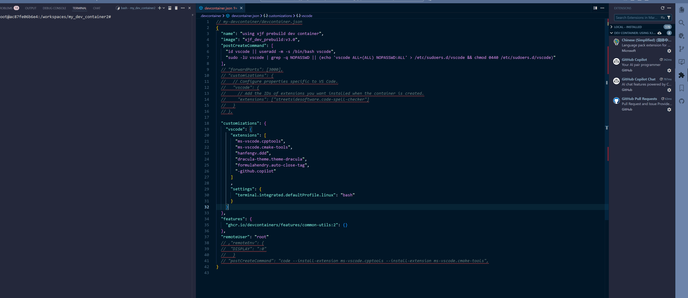
   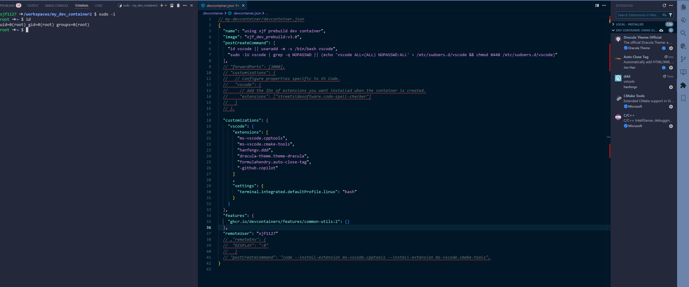 
   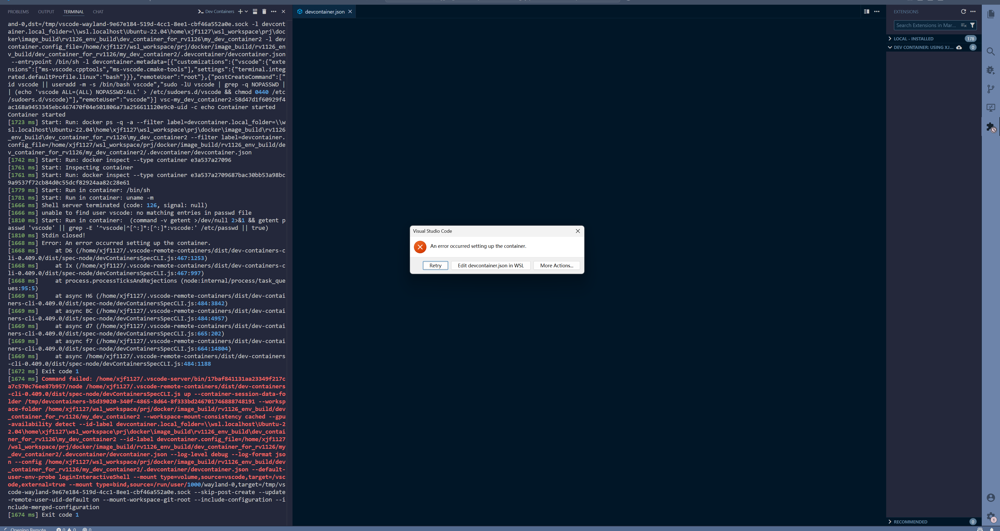
   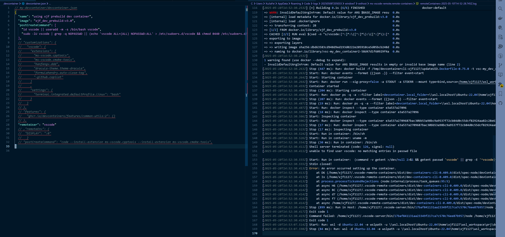
   猜测: 第一次build container需要root，rebuild不需要? 当前的实验：第一次root时，无法安装插件，但是root后修改用户名为任意非root，触发插件安装
   1. -> 注释掉extension内容->rebulid成功，并且image 元数据的extension被安装，说明的确是生效的
   2. -> 注释掉整个extension的key和value，rebuild成功，与第一个场景一样
   3. 注释掉 vscode 整个key和value，成功
   4. 注释掉customizations，同样成功
   5. 注释掉 features 的key value，rebuild发生异常，开始提示账号问题
   6. 释放注释 customizations下vsocde的settings，无效
   7. 释放整个customizations，无效
   8. 只释放feature中的配置，触发vscode 设置用户名，并且自动安装插件
   9. 如果释放了customizations,注释了feature，会报错用户名问题
   10. 从成功的日志分析，开始创建容器流程
       1. 在host端执行一些测试脚本
       2. 执行docker一些命令，查询和关闭容器
       3. 开始执行dev container命令，检查和更新信息
       4. 然后开始优先处理feature
       5. 并且调用了docker的buildx，加载了image的元数据metadata，以及挂载vscode的volume
       6. docker build
       7. docker run
       8. run in contianer
          1. 开始测试，创建 vscode相关文件和文件夹
          2. 运行一些系统服务如x11
          3. 处理系统配置
       9. 开始安装extension，处理插件缓存
       10. 开始插件host agent运行
       11. 插件安装成功
       12. 分析容器数据存储结构
       13. 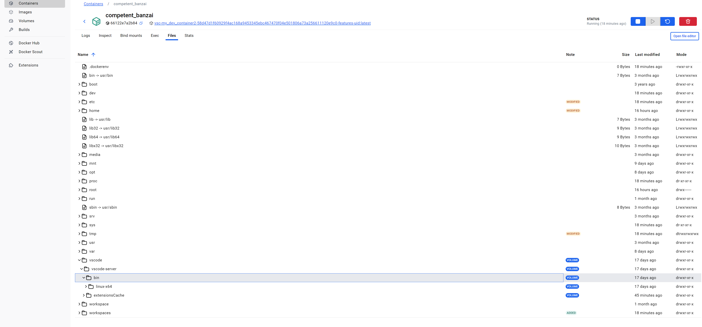
       14. 可以看出，整个vscode的devcontainer自动化流程是需要 run in container + run in host 进行配合的，为什么在前面非root名已经成功rebuild过以后，再去除devc中feature的配置字段进行rebuild，还是会报错，找不到非root名，我的猜测：feature特性会影响是否使用一些镜像的中间layout层，这些层包含了vscode remoteuser中指定的用户名
       15. 目前的第一次构建时，需要以基础镜像定义的用户名进入容器，在devcontainer 容器构建过程中，会预构建一些镜像层来包含vscode设置的用户名，后续的再次rebuild会复用这些层，所以再进入以后用户名能够通过
       16. 待实验: 增加dockerfile，仅仅来指定构建包含启动用户名的镜像，以此镜像为基础，再在无customizations配置的情况启动rebuild，看看是否成功 https://code.visualstudio.com/remote/advancedcontainers/add-nonroot-user
   11. 分析：目前的问题现象主要集中在 对于原基础镜像，要求指定root用户，否则失败; 而对于触发vscode功能，root用户无法触发，而通过devc指定非root用户，如果原镜像没有该用户，那有必须配置了feature这个非root指定才能被创建覆盖生效，然后才会进行主动安装插件(所以目前的疑惑：feature到底是不是必需品？还是说feature只是正好触发了非root容器的创建，这才是vscode自动安装插件的直接条件?)
   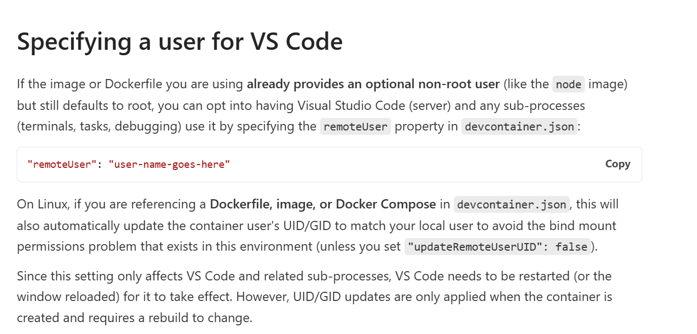
   文档中的说明是，镜像中先包含了可选的非root用户
       1. 是否有方案，可以直接非root用户首次构建容器
       2. 不设置feature配置，能否自动化安装vscode插件
       - [x] 尝试: 1. 增加dockerfile来构建指定用户名的中间镜像，然后直接运行。成功！！！！成功自动安装image内部的meatdata！！！！，问题解决，归根接地就是image用户名问题
       3. 存在问题
       4. 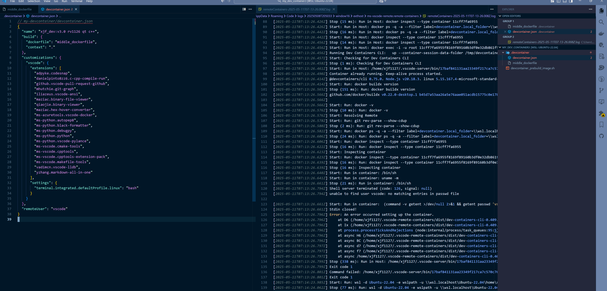
       5. 无法构建成功，似乎devcontainer中build的顺序在vscode用户名验证之后，导致根本无法进行
       6. 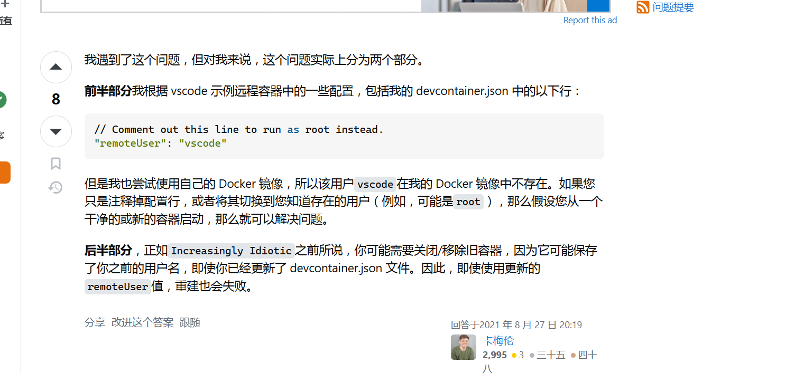
       7. 需要重新删除旧的container，里面保存了旧镜像的引用


- [ ] dev container vscode complete
   1. using pre-build image + devcontainer.json
   2. just using devcontainer.json + vscode extension
   3. or by command pallete `add dev container configuration files`
      1. how to custom the template which can be used on vscode dev... selection
      2. refe: https://containers.dev/implementors/templates/

### container status

1. Exited (129) 34 minutes ago (exited) 通常是持久容器，终端关闭后，如果强行关闭会照成非0错误码
   1. 使用 `run` 是创建并运行
   2. 使用`stop` 和 `start` 进行已创建容器状态转换
      1. docker start <container_name_or_id>
      2. docker stop <container_name_or_id>
   3. attach 和 exec 有什么区别?
      1. 容器的主进程即 ENTRYPOINT 和 CMD 进程
      2. start 以后并不会直接进入终端，仅仅是激活而已
      3. exec的启动前提是container已经有一个primary process了，即(PID 1)，并且如果container进行重启，这些额外进程就不会跟随重启
      4. exec工作在默认的工作目录，并且如果要运行命令，必须指定解释器程序，然后添加命令参数，单纯的双引号命令或者链式命令不起作用
      5. attach的前提是container已经在运行，并且attach的目标进程是`ENTRYPOINT`或者`CMD`进程，如果是交互式程序，那么将把程序的输入输出错误连接到当前终端，如果是非交互的程序，那么直接显示输出即可
      6. 开启多个终端，然后attach同一个container会发生什么？
         1. 猜测1：新attach的终端会挤掉旧attach的终端
         2. 猜测2：各自独立开启终端，但不太合理，这样本质上进程一样了
         3. 猜测3：两个终端同步所有操作，包括输入输出错误
         4. 实验证实为猜测3
2. Up 14 seconds (running)
3. (created 创建但未启动)
   1. 使用 `create` 命令触发，创建，但不运行
4. (restarting 正在重启)
   1. 使用 `restart` 命令触发
5. Up 37 seconds (paused 暂停)
   1. `docker pause <container_name>` 进行暂停，`docker unpause <container_name>` 恢复
   2. 进程pause后，终端将无法交互，不接收任何指令
   3. 重新unpause后恢复指令
6. --rm 临时容器删除后，通过`docker ps -a`是查询不到状态的
7. stoped(exited)和paused的区别，一个终止进程，一个是暂停进程，数据还是在内存中，可以快速恢复
8. 查询命令
   1. stats
   2. top
9. 更新配置
   1. update
10. other
    1. 等待容器退出
    2. rm 删除容器

### dockr run

1. 参数 --rm 创建并运行一个 临时容器，容器rm后或者终端退出后会清理整个容器内容
2. 参数 --name 参数表示开启一个持续容器，多个终端可以使用该名称来 进入容器
   1. run --name <my_container> -it 启动容器，进入交互，此时容器状态
   2. ru -rm -it <my_container> 出啊关键启动临时容器

### dev container

- [x] 配置vscode插件自动安装工作流
- [x] 容器build之后，如何关闭，和重新连接容器，工作流
   1. 关闭前
   2. 
   3. 点击左下角连接图标，close connect
   4. 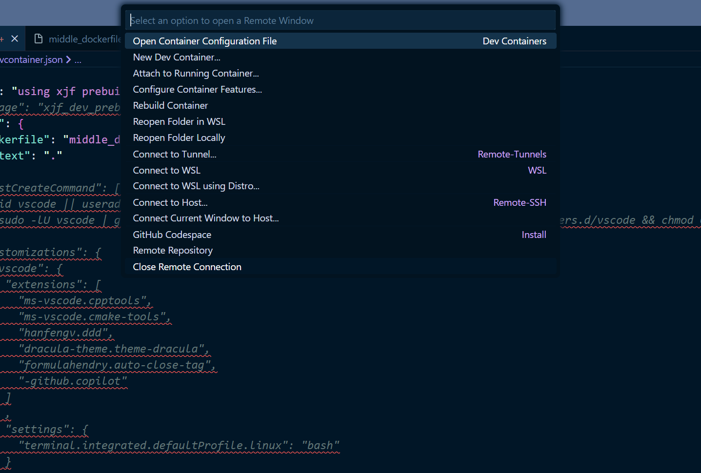
   5. 
   6. 再次开启，通过open recent
   7. 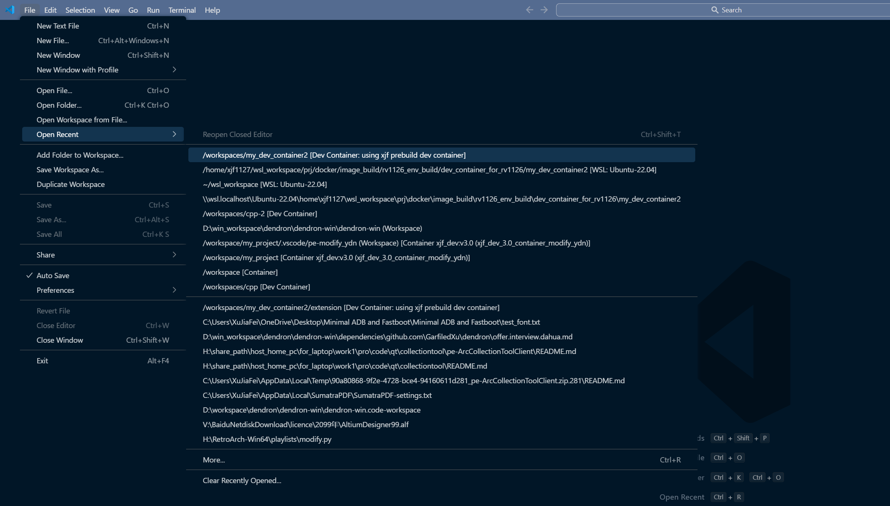
   8. 
   9. 
   10. 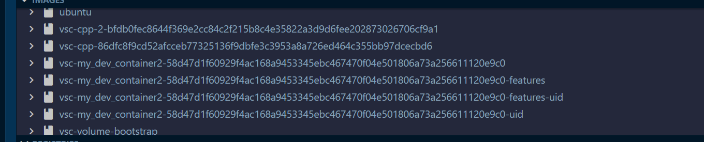 存在多个中间镜像
   11. 的确都是同一个uid
   12. 是否还有其他方式，打开已经停止的，但创建好的此前的容器
   13. attach 容器的差异： 在侧边栏的docker一栏中，start container and attach container即可
      但是创建的容器似乎名字不对，并且容器内命令面板找不到rebuild命令
      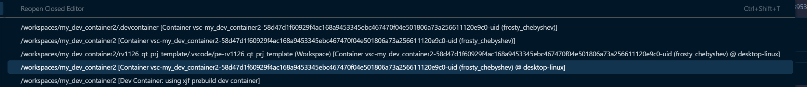
      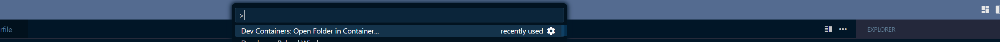
      二者方式不同，前者是基于docker的attach，比较原始，后者是基于dev container的额外功能，所以，直接通过后者open folder的形式进入即可，如果 configure 没有被修改，是不会rebuild的
   14. 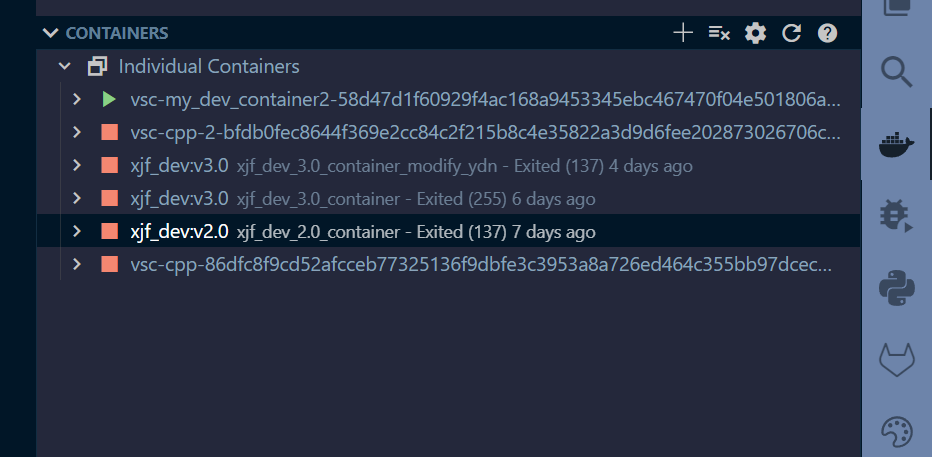
- [x] 容器中的 vscode user setting 继承机制
   1. 是否继承自host的user setting? 如何判断当前容器使用的vscode setting来源?
   2. 如何覆盖，指定容器使用的user setting?
   3. 或者换种说法将host中的user setting，迁移到容器中，使之在其他电脑上生效
   4. cat ~/.vscode-server/data/Machine/settings.json 查看后，并没有内容
   5. 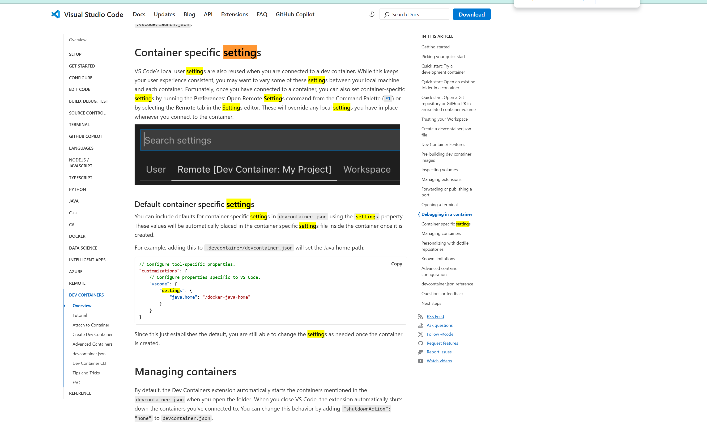
   6. 在官方文档中说明了 host 的local user setting 会被使用，当连接到一个容器中，来保持你的用户习惯一致
   7. 覆盖user setting的方法，一个在创建容器时，devcotainer.json中的json字段进行修改，里面的值会覆盖当前值，另一个方法就是 Preferences: Open Remote Settings 可以在ui或者json中进行修改，另一点，就是通过workspace下的setting配置进行覆盖

- [x] 在容器中workspace的工作流验证

- [x] 在容器中的插件面板 add to devcontainer的行为
  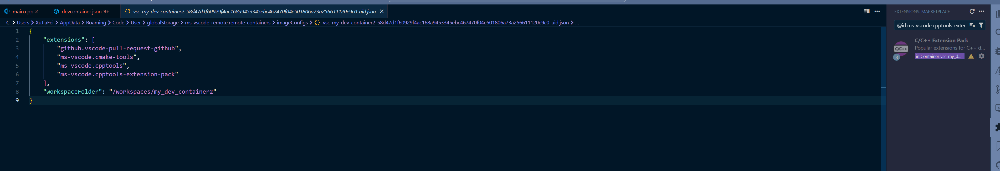
  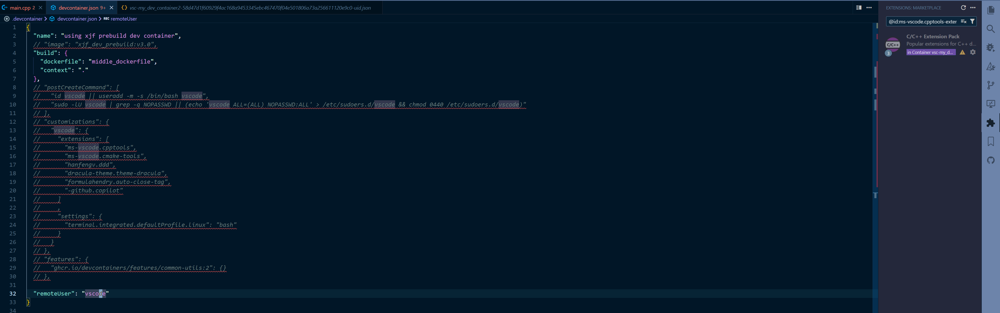
  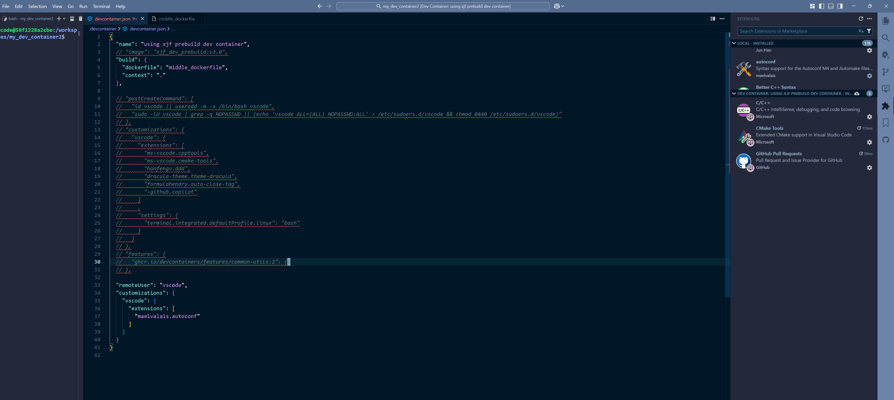
  
  采用docker形式进入的容器，可以发现add之后是添加到一个容器归属的配置文件中，并不是源配置.devcontainer中的，从路径上可以猜测这是vscode处理的容器归属配置，应该是各种meta数据合并后的配置，包括vscode的操作添加的配置
  而使用dev container形式进入的容器，add to devc之后会自动添加到当前关联的devc.json中

### 整理同步 vscode extension

1. 搜集extension
   code --list-extensions > extensions.txt

   ```bash
   adpyke.codesnap
   danielpinto8zz6.c-cpp-compile-run
   github.vscode-pull-request-github
   mhutchie.git-graph

   iliazeus.vscode-ansi
   maziac.binary-file-viewer
   qiaojie.binary-viewer
   maziac.hex-hover-converter

   ms-azuretools.vscode-docker

   ms-python.autopep8
   ms-python.black-formatter
   ms-python.debugpy
   ms-python.python
   ms-python.vscode-pylance

   ms-vscode.cmake-tools
   ms-vscode.cpptools
   ms-vscode.cpptools-extension-pack
   ms-vscode.makefile-tools
   vadimcn.vscode-lldb
   yzhang.markdown-all-in-one
   ```

2. 