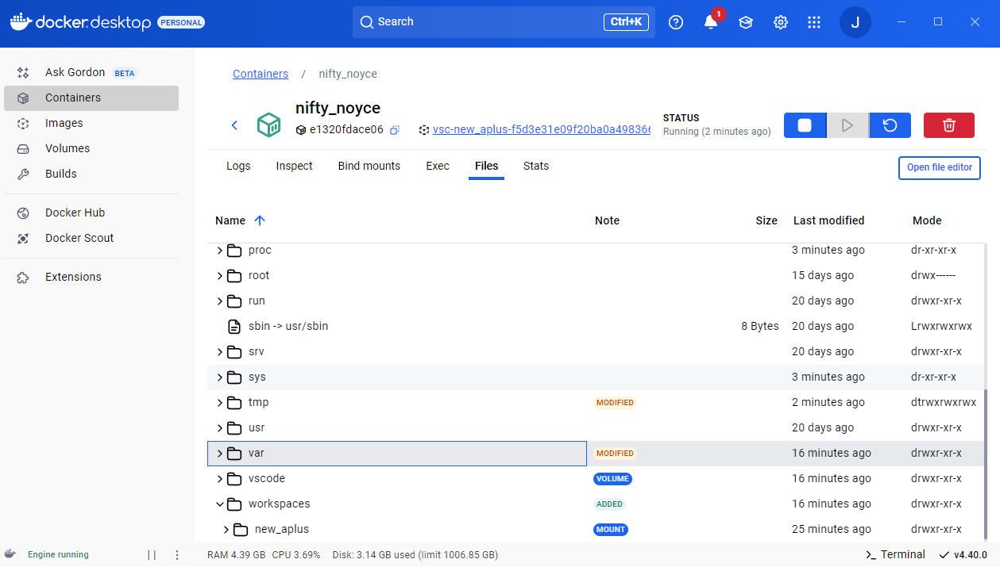
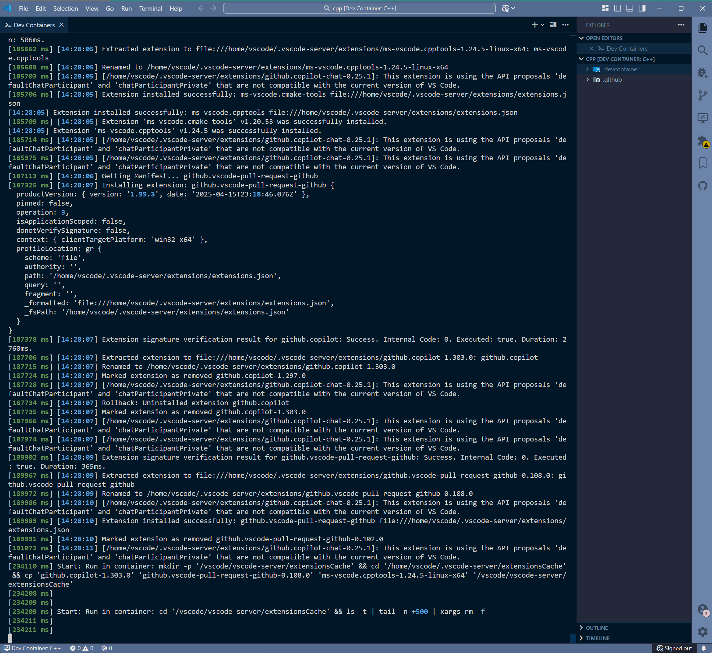

## refe

- [visual studio offical: vscode dev container](https://learn.microsoft.com/zh-cn/training/modules/use-docker-container-dev-env-vs-code/3-use-as-development-environment)
- [vscode offical: devcontainer](https://code.visualstudio.com/docs/devcontainers/containers) : 位于overview DEV CONTAINERS 一栏

## vscode 扩展工作原理

1. 首先vscode可以将容器作为完全的开发环境，并在容器上使用vscode完全的功能，通过扩展连接容器后，装载或者复制方式将本地文件集成到容器中，根据项目中 `.devcontainer` 文件夹，作为配置文件，来处理容器相关配置和默认行为
2. `.devcontainer/devcontainer.json`存放由`dev container`规范编写的元数据，会影响vscode对开发容器的创建开发行为，如vscode插件注入，在镜像基础上额外的环境依赖注入等
3. 官方文档结构:
   1. overview
      1. docker
      2. dev containers
   2. dev container
      1. quick create container by shortcut way
      2. quick create container by diff opt
         1. open local folder on container
            1. 根据 command panel: dev container 命令启动
            2. 根据命令生成对应的./devcontainer.json 配置，然后创建容器
            3. install feature的功能，受网络因素影响，很容易造成容器打开失败
            4. 需要验证: vscode相关插件文件是以什么形式集成到容器中的，容器中安装过插件后，后面再创建容器是否还需要安装
               1. 通过vscode命令面板普通的关闭连接和重新打开，插件是存在的
               通过docker desktop的管理面板可以发现，vscode的插件缓存本质上是存储在宿主机上的volume，容器创建后直接挂载的，可以得出结论 vscode的配置位于volume中缓存
               
               2. 是否所有容器共享这个插件缓存呢
               3. 同一个目录不能open in multi container
               4. window 文件和 wsl2 文件均可以在容器中打开，以mount方式
            5. 能否每次open folder on contianer可以选择一份提前配置的好的专门用于通用复用的devcontainer.json?
               1. 对于本地存储的项目，将dev container配置复制到项目文件中即可
               2. 对于git远程仓库项目，vscode判断到副本项目没有配置文件后，会提供交换选项
      3. isolate git repository on container
         1. 使用命令: `Dev Containers: Clone Repository in Container Volume..`
         2. 该模式，是使用volume来独立存储远程仓库副本，来隔离主机文件系统
         3. 优点: volume的文件性能是高于mount的，该模式可以更丝滑的配合git PR开发流程
         4. 远程仓库项目没有配置 .devcontainer.json 文件如何处理?
            1. vscode判断到没有.devcontainer.json文件后会主动交互，提供可筛选列表用于选择一些环境模板
      4. attach an existed contianer
      5. devcontainer.json的创建: pre-built env and reuse dockerfile docker-compose
         1. vscode command palette add file to current prj
         2. by hand
         3. container-feature 功能添加:
            1. 使用命令创建配置文件时，获得feature选择提示
            2. 在已经创建配置文件的基础上，使用命令: `Dev Containers: Configure Container Features`可以触发ui更新configure feature
         4. 如何默认vscode中所有dev container添加对应feature: 在user setting中配置默认feature，将会"Always installed" Features

            ```bash
            "dev.containers.defaultFeatures": {
               "ghcr.io/devcontainers/features/github-cli:1": {}
            },
            ```

         5. 更加定制化的feature: 创建自己的feature，根据 `OCI artifact` 规范，创建之后进行发布
      6. 文档提及的 `pre-building dev container images`?
         1. 这里的 pre-building 和 build images 指的是每次创建容器时需要的image的来源是即时通过dockerfile构建，或者提前准备好的image，可以来源自手动构建，或者CICD流程

      7. simple dev container standard breif
      8. manual create a dev container
      9.  Dev Container CLI
      10. dev container standard configure file `devcontainer.json` linker
      11. some tips and tricks and FAQ
4. vscode提供的基本操作方式:
   1. 命令面板
   2. 插件面板 按钮 + 上下文菜单
   3. 文件浏览面板 上下文菜单
   4. 左下角的 remote status bar + command select
5. 基本工作流:
   1. remote status bar quick start:
      1. 点击 remote status bar
      2. 选择 new contaner
      3. 选择 对应与构建的 image
      4. 连接容器成功，进入容器
      5. 
   2. 远程开发容器: 将本地源码通过ssh 挂载到远程host的container中
      1. 优点: 本地不需要一个docker客户端