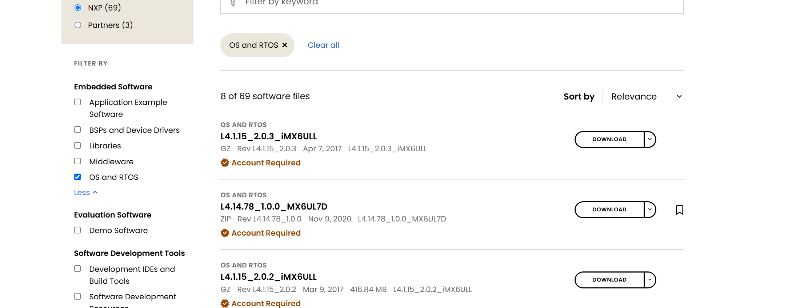
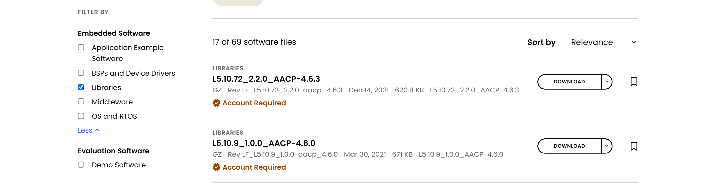
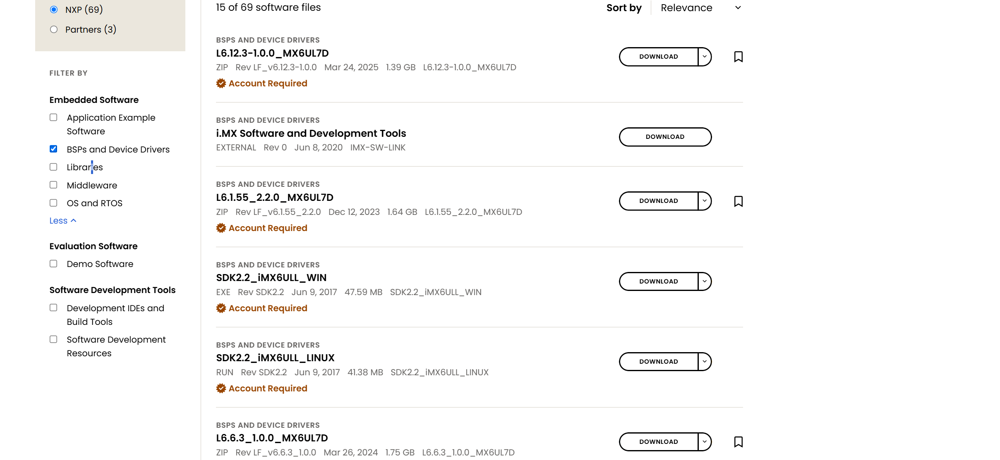
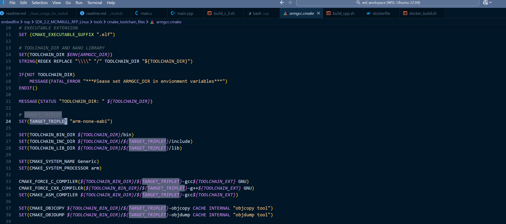
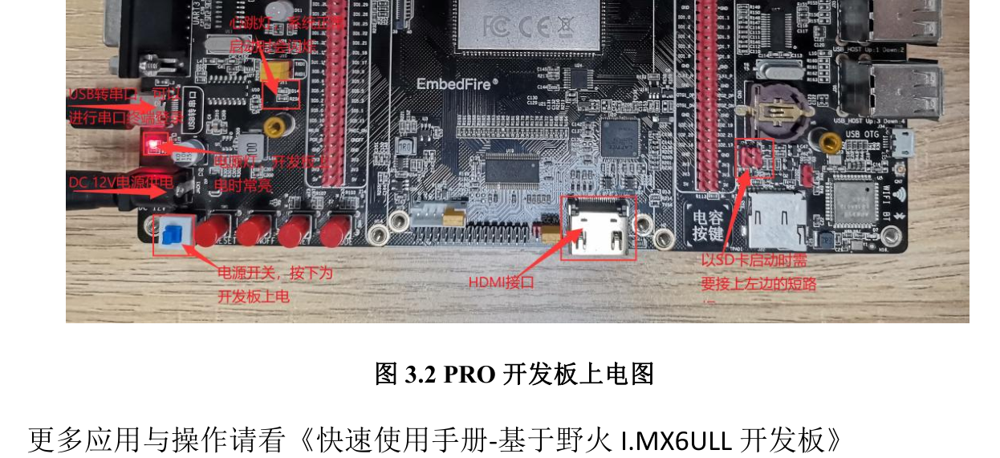
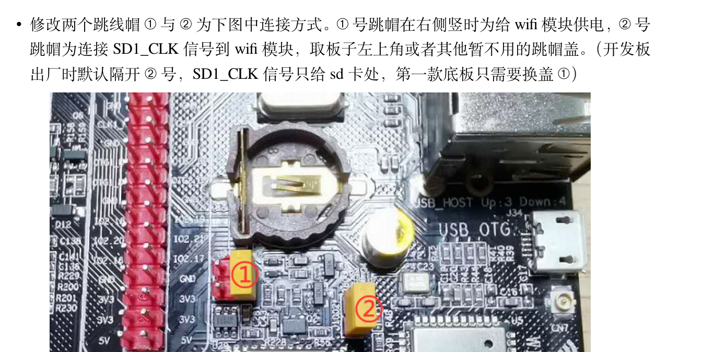
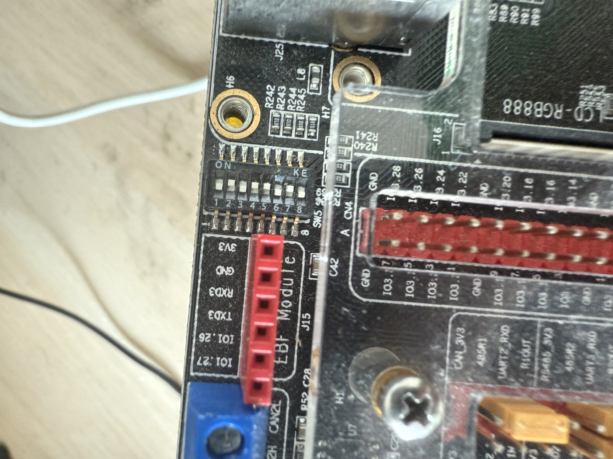
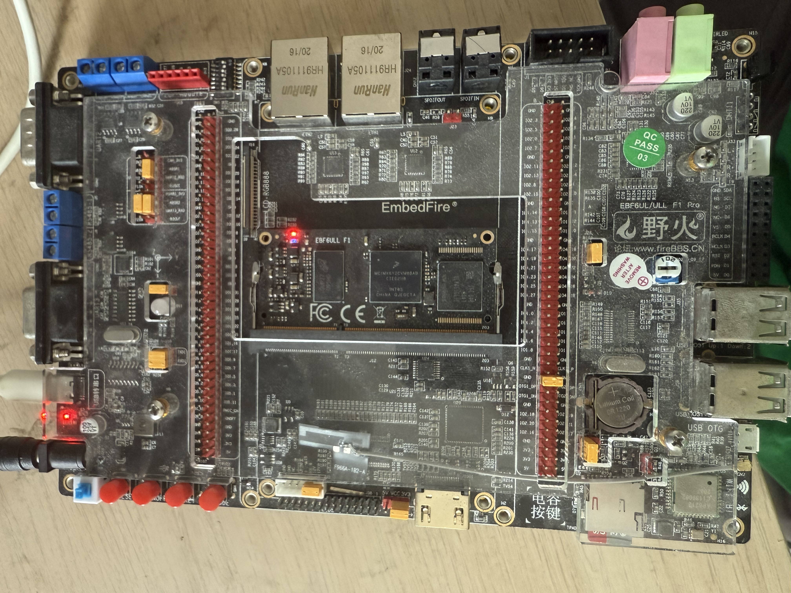

## refe SDK

- [offical nxp](https://www.nxp.com/design/design-center/development-boards-and-designs/i-mx-evaluation-and-development-boards/evaluation-kit-for-the-i-mx-6ull-and-6ulz-applications-processor:MCIMX6ULL-EVK)

## ref book

1. 嵌入式linux开发实战指南-基于imx6ull开发板

## 官方sdk结构解析以及相关概念整理

1. 官网
   1. 
   2. 
   3. 
   4. 
   5. 裸机SDK使用的编译器 `arm-none-eabi` 没有系统以及glibc的标识，因为这是为裸机开发所准备的，并且使用通用编译器
2. concept
   1. 官方评估板: 由芯片原厂针对具体芯片进行设计或者授权设计的评估开发板，用于展现芯片功能和性能，提供电路设计参考，作为适配官方sdk demo程序的硬件. 价格对比三方开发板会略高.
   2. CMSIS: Cortex Microcontroller Software Interface Standard ARM 官方推出的一个标准软件接口规范，用于简化 Cortex-M/Cortex-A 系列处理器的开发，那么具体是集成了哪些功能?当前sdk该分类仅一个cmsis_gcc.h，封装了哪些东西？TODO:封装了汇编指令，屏蔽平台汇编指令的差异，提供相关标准接口
   3. SDK中的MCI: 芯片型号前缀
   4. SDK中的RFP: relase for production 量产发布版本
   5. SDK包名中的linux: 表示当前SDK适用的开发主机host的环境系统
   6. CORTEXTA: 为ARM Cortex-A 架构芯片提供的底层封装
   7. iar: 嵌入式集成开发环境
   8. lwip: 嵌入式专用的网络协议栈，库层面
   9. fatfs: 嵌入式专用文件系统
3. 文件格式: 生成方式? 是否为纯文本脚本?
   1. LF_v6.12.3-1.0.0_images_IMX6UL7D
      1. .bin: 二进制镜像
      2. .uuu: Universal Update Utility NXP 官方烧录工具 uuu 脚本文件
      3. .auto: uuu相关的自动化脚本
      4. .dtb: Device Tree Blob，是设备树的编译结果
      5. .imx: 封装了启动头（IVT + DCD）的 bootloader 镜像格式
      6. .wic: Yocto 使用的磁盘镜像格式文件
   2. L6.1.55_2.2.1_AACP-4.8.2
      1. .bb: BitBake 配方文件
      2. .bbappend: BitBake 的附加配方文件（append）
      3. .bin: 和上面一样，二进制文件（可能是预构建的工具、固件或 bootloader）

## 裸机程序的编译，烧写，运行流程

1. 环境安装

      ```bash
      cmake
      sudo apt-get install gcc-arm-none-eabi
      xjf1127@MARK-I:~/wsl_workspace$ arm-
      arm-linux-gnueabi-addr2line      arm-linux-gnueabi-gcc-11         arm-linux-gnueabi-gcov-tool      arm-linux-gnueabi-readelf        arm-none-eabi-g++                arm-none-eabi-ld.bfd
      arm-linux-gnueabi-ar             arm-linux-gnueabi-gcc-ar         arm-linux-gnueabi-gcov-tool-11   arm-linux-gnueabi-size           arm-none-eabi-gcc                arm-none-eabi-lto-dump
      arm-linux-gnueabi-as             arm-linux-gnueabi-gcc-ar-11      arm-linux-gnueabi-gprof          arm-linux-gnueabi-strings        arm-none-eabi-gcc-10.3.1         arm-none-eabi-nm
      arm-linux-gnueabi-c++filt        arm-linux-gnueabi-gcc-nm         arm-linux-gnueabi-ld             arm-linux-gnueabi-strip          arm-none-eabi-gcc-ar             arm-none-eabi-objcopy
      arm-linux-gnueabi-cpp            arm-linux-gnueabi-gcc-nm-11      arm-linux-gnueabi-ld.bfd         arm-none-eabi-addr2line          arm-none-eabi-gcc-nm             arm-none-eabi-objdump
      arm-linux-gnueabi-cpp-11         arm-linux-gnueabi-gcc-ranlib     arm-linux-gnueabi-ld.gold        arm-none-eabi-ar                 arm-none-eabi-gcc-ranlib         arm-none-eabi-ranlib
      arm-linux-gnueabi-dwp            arm-linux-gnueabi-gcc-ranlib-11  arm-linux-gnueabi-lto-dump-11    arm-none-eabi-as                 arm-none-eabi-gcov               arm-none-eabi-readelf
      arm-linux-gnueabi-elfedit        arm-linux-gnueabi-gcov           arm-linux-gnueabi-nm             arm-none-eabi-c++                arm-none-eabi-gcov-dump          arm-none-eabi-size
      arm-linux-gnueabi-g++            arm-linux-gnueabi-gcov-11        arm-linux-gnueabi-objcopy        arm-none-eabi-c++filt            arm-none-eabi-gcov-tool          arm-none-eabi-strings
      arm-linux-gnueabi-g++-11         arm-linux-gnueabi-gcov-dump      arm-linux-gnueabi-objdump        arm-none-eabi-cpp                arm-none-eabi-gprof              arm-none-eabi-strip
      arm-linux-gnueabi-gcc            arm-linux-gnueabi-gcov-dump-11   arm-linux-gnueabi-ranlib         arm-none-eabi-elfedit            arm-none-eabi-ld        
      # 发现：
      ```

2. 编译
   1. cmake
   2. `sudo apt-get install gcc-arm-none-eabi` and `export ARMGCC_DIR=/usr`
   3. install offical linux sdk
   4. 待编译项目 `/home/xjf1127/wsl_workspace/embedfire/nxp/imx6ull/sdk/SDK_2.2_MCIM6ULL_RFP_Linux/boards/evkmcimx6ull/demo_apps/hello_world`
   5. 执行编译
      1. 设置环境变量 `export ARMGCC_DIR=/usr`
      2. `cd sdk/SDK_2.2_MCIM6ULL_RFP_Linux/boards/evkmcimx6ull/demo_apps/hello_world/armgcc && bash build_ddr_debug.sh`
      3. 生成结果文件 <release/debug/ddr_debug/ddr_release>/*.</elf></bin>
   6. 结果文件说明
      1. `.elf`包含调试信息
      2. `.bin`纯二进制
3. 烧写
   1. 相关径说明： [[note.embed.embedfire]]
   2. 官方烧录工具说明

      ```bash
      /home/xjf1127/wsl_workspace/embedfire/nxp/imx6ull/sdk/SDK_2.2_MCIM6ULL_RFP_Linux/tools/imgutil
      ├── bin
      │   ├── dcdgen.bin
      │   ├── dcdgen.exe
      │   ├── imgutil.bin
      │   └── imgutil.exe
      ├── evkmcimx6ull
      │   ├── dcd.config
      │   └── mkimage.sh # 执行该脚本，附加编译生成的bin文件，以及设备配置信息，可以生成dcd.bin和添加头信息的镜像
      └── readme.txt
      ```

   3. 相关名称说明
      1. `dcd` device configuration data 芯片启动配置数据
      2. `evk` evaluation kit 开发评估板
      3. `rom` 和 `ram` 前者读 /roʊm/ 全称：read-only memory 只读存储器，后者读 /ræm/ 全称 random access memory 随机存取c存储. ddr是ram的一种，而flash emmc 都属于广义rom，细分一些属于 `eeprom` 可电擦除rom
      4. `bootROM` 存储于rom中的固化程序
      5. ref: https://blog.csdn.net/qq_44894504/article/details/141466055
   4. 烧写
      1. 由于wsl无法访问usb硬件，所以直接使用windows端工具将bin文件烧写到sd卡中
      2. 使用工具：`balenaEtcher`, 存在`（0，h.requestMetadata）is not a function`问题
      3. 使用`win32diskimager` 读写正常
      4. 开发板设置启动方式为sd卡 [[note.embed.embedfire.driver]]
         1. 需注意!!! 蓝牙wifi模块与sd卡座共用硬件接口，所以无法同时使用，需切换跳帽
         2. 设置boot拨码开关 `2-5-8`
         3. 
         4. 
         5. 拨码设置 
         6. 跳帽设置 
4. 运行
   1. 电源开启后自动运行，输出hello world到串口
5. 调试

## 了解芯片的内存映射和启动方式

## 基础的gpio控制

### relative path

1. wsl turoiral work space: /home/xjf1127/wsl_workspace/tutorial/embedfire/nxp/imx6ull
2. windows turorial file dir: S:\archive\dev\embed_fire
   1. the correspond mount path on wsl: ls /mnt/s/archive/dev/embed_fire
   2. 野火教程中整理的镜像处理和烧写工具: xjf1127@MARK-I:/mnt/s/archive/dev/embed_fire/github_source_code/embed_linux_tutorial-master/embed_linux_tutorial-master/base_code/bare_metal/download-tool/download_tool$ cat mkimage.sh
   3. 手动配置挂载路径：

   ```bash
   sudo mkdir -p /home/xjf1127/win_sdk
   sudo mount --bind "/mnt/c/Users/xjf1127/wsl_workspace" /home/xjf1127/win_sdk
   ```

   4. 配置文件设置：

   ```bash
   nano /etc/wsl.conf
   #内容
   [automount]
    enabled = true
    options = "metadata,umask=22,fmask=11"
    mountFsTab = true

   ```

3. wsl nxp sdk: /home/xjf1127/wsl_workspace/embedfire/nxp/imx6ull/sdk/
4. 说明野火开发板跳帽和拨码设置的文档: S:\archive\dev\embed_fire\1-野火开源图书_教程文档\【野火】《i.MX Linux开发实战指南》\0-[野火]《快速使用手册——基于i.MX6ULL开发板》