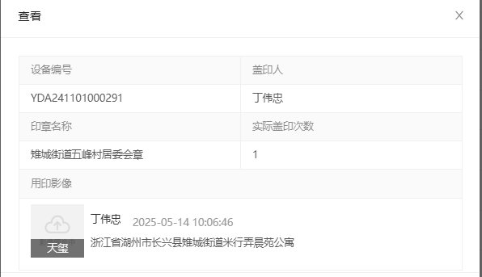
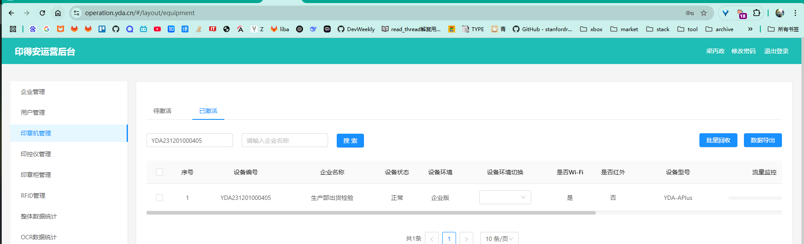
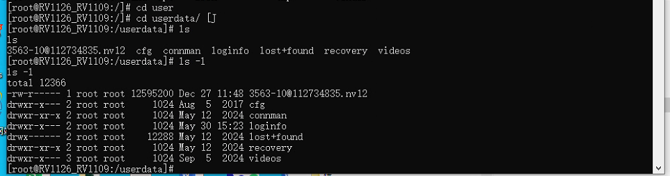

### ref

- [embedfire doc](https://doc.embedfire.com/products/link/zh/latest/linux/ebf_i.mx6ull.html#)
- [6ull](https://doc.embedfire.com/linux/imx6/quick_start/zh/latest/README.html)

### 自定义文本符号设计

1. 待解决 TODO:
2. 疑问 QST:

### learning plan

- [x] 确定当前硬件规格
  1. 6ULL-F1 pro板_eMMC版本
  2. EBF6ULL金手指接口核心板
- [ ] 文档结构
  1. 开发板硬件资料
     1. 底板
        1. 机械尺寸图: 野火_EBF6ULL F1 Pro 底板_机械尺寸.pdf (标注的是外形轮廓，开孔，位置坐标信息，用于pcb板材切割，以及外壳配套验证)
        2. 原理图: 野火_EBF6ULL F1 Pro 底板_原理图_20220308.pdf
        3. 装配图: 野火_EBF6ULL F1 Pro 底板_装配图.pdf (标注的是焊接时元器件的编号/位号，以及特殊标记，用于贴片插件焊接)
        4. pcb元器件封装库
        5. .dxf格式的CAD结构图纸
     2. 核心板
        1. 原理图
        2. 机械尺寸图
        3. 装配图: 野火_EBF6ULL F1 核心板_装配图.pdf (官方网站下载连接失效)
        4. 封装库
        5. .dxf格式的CAD结构图纸
  2. 野火开发板产品规格说明书: 野火® EBF6ULL核心板与开发板规格书.pdf
     1. 内容包含了: 产品简介（配套资料，学习视频，图书教程，芯片官方手册说明，开发工具和镜像说明），硬件规格说明，使用说明（如何上下电，注意事项），免责说明，售后服务网站
  3. 硬件补充说明
     1. 各部分硬件变更的记录及通知
     2. 掉电保护说明：设备在突然掉电时，存在根文件系统被损坏可能
        1. 文件系统和根文件系统的概念差异？gpt：文件系统是“组织数据的格式”，根文件系统是“系统启动后挂载的核心文件目录集合”。
     3. 电源参考设计
  4. 开发板引脚分配说明：有专门的软件对引脚进行分配复用设置
  5. 检测报告
     1. CE（Conformité Européenne）标志是欧盟的强制性认证标志，表明产品符合欧盟安全、健康、环保和消费者保护等要求
     2. RE 是 “Radio Equipment” 的缩写，通常指的是无线发射模块的合规性测试报告
  6. datasheet: 板载芯片的数据手册
     1. 内容 TODO:

- [ ] 开发板使用
  - [x] 通电
  - [x] 启动和登录开发板
      1. 
      2. 当前开发板默认的拨码组合: 2-4-5-7 对应emmc启动
      3. 登录控制方式：串口，网络ssh
         1. 串口连接
         2. https://doc.embedfire.com/linux/imx6/linux_base/zh/latest/linux_basis/board_startup/board_startup.html
         3. http://www.wch.cn/products/CH340.html 安装驱动
         4. mobaxterm 波特率 115200 登录
         5. 账户-密码: 1. debian temppwd 2. root root
         6. 网络ssh连接
         7. 
         8. 
         9. 没有找到wlan模块，需要硬件切换
         10. 
         11. https://doc.embedfire.com/linux/imx6/quick_start/zh/latest/quick_start/bluetooth/bluetooth.html
         12. 
         13. 按图中的跳帽配置，还缺一个跳帽，从其他部位借用
         14. https://doc.embedfire.com/linux/imx6/quick_start/zh/latest/quick_start/wifi/wifi.html 按该流程使能wifi模块，并且使用终端ui进行配置
         15.  重启后进入，可以查询到wlan0网口

         ```bash
         root@npi:/home/xjf1127# wpa_passphrase 扶老奶奶过马路 Xjf.13587122513 > wpa_supplicant.conf

         root@npi:/home/xjf1127# cat wpa_supplicant.conf
         network={
               ssid="扶老奶奶过马路"
               #psk="Xjf.13587122513"
               psk=c9b68aa2d1ca9e219a5bec5403f97d69cdfba202e2bb1bed5693ddefa2cb0c16
         }

         root@npi:/home/xjf1127# wpa_supplicant -B -c wpa_supplicant.conf -i wlan0
         Successfully initialized wpa_supplicant
         rfkill: Cannot open RFKILL control device
         rfkill: Cannot get wiphy information
         root@npi:/home/xjf1127# [ 3959.047191] [dhd-wlan0] wl_run_escan : LEGACY_SCAN sync ID: 68, bssidx: 0
         [ 3960.232060] [dhd-wlan0] wl_cfg80211_connect : Connecting with 18:3c:b7:a6:1e:90 ssid "扶老奶奶过马路", len (21), sec=wpa2psk/mfpn/tkipaes, channel=11
         [ 3960.232060]
         [ 3960.514512] [dhd-wlan0] wl_iw_event : Link UP with 18:3c:b7:a6:1e:90
         [ 3960.522165] [dhd-wlan0] wl_ext_iapsta_event : [S] Link UP with 18:3c:b7:a6:1e:90
         [ 3960.537759] [dhd-wlan0] wl_bss_connect_done : Report connect result - connection succeeded
         [ 3961.395901] [dhd-wlan0] wl_add_keyext : key index (0)
         [ 3961.665093] [dhd-wlan0] wl_run_escan : LEGACY_SCAN sync ID: 69, bssidx: 0
         root@npi:/home/xjf1127# ifconfig wlan0
         wlan0: flags=4163<UP,BROADCAST,RUNNING,MULTICAST>  mtu 1500
               inet 192.168.10.45  netmask 255.255.255.0  broadcast 192.168.10.255
               inet6 fe80::96a1:a2ff:fe71:12fc  prefixlen 64  scopeid 0x20<link>
               ether 94:a1:a2:71:12:fc  txqueuelen 1000  (Ethernet)
               RX packets 2321  bytes 144028 (140.6 KiB)
               RX errors 0  dropped 0  overruns 0  frame 0
               TX packets 443  bytes 143944 (140.5 KiB)
               TX errors 0  dropped 0 overruns 0  carrier 0  collisions 0

         root@npi:/home/xjf1127# ping -c 4 8.8.8.8
         PING 8.8.8.8 (8.8.8.8) 56(84) bytes of data.
         64 bytes from 8.8.8.8: icmp_seq=1 ttl=109 time=102 ms
         64 bytes from 8.8.8.8: icmp_seq=2 ttl=109 time=142 ms
         64 bytes from 8.8.8.8: icmp_seq=3 ttl=109 time=45.5 ms
         64 bytes from 8.8.8.8: icmp_seq=4 ttl=109 time=116 ms

         --- 8.8-
         4 packets transmitted, 4 received, 0% packet loss, time 8ms
         rtt min/avg/max/mdev = 45.509/101.658/142.491/35.496 ms
         ```

         可以发现，连接5Gwifi，对于当前模块无法识别，将临时wifi配置加入到/etc/wpa_supplicant/wpa_supplicant.conf后，`wpa_cli -i wlan0 reconfigure` 重启服务

         16. 登录ssh，username: debian passwd: temppwd
         https://doc.embedfire.com/linux/imx6/linux_base/zh/latest/linux_basis/ssh_login/ssh_login.html#
         
             1. 修改密码: passwd
             2. 添加用户: adduser xjf1127
             3. 添加到用户组: usermod -aG sudo xjf1127
             4. 查看所有用户: cat /etc/passwd
             TODO: 为什么添加了xjf1127后，再重启通过串口登录，无法使用root登录，debian的可以

             ```bash
             #查看当前用户
             debian@npi:~$ whoami
             debian
             #查看用户是否存在
             id username
             #修改某个用户密码
             sudo passwd username
             #修改某个用户名
             sudo usermod -l new_username old_username
             #修改用户主目录
             sudo usermod -d /new/home/directory username
             #添加到sudo用户组
             sudo usermod -aG sudo username
             ```

         17. TODO: 为什么用ssh的文件窗口无法传输文件?提示权限不够？
            
             1. 切换为root: 通过`su`修改了权限，但是仅修改当前shell的临时权限，并不能对打开时的mobaxterm生效
             2. root切换为普通用户: `exit`
             3. 查看文件夹所属用户和权限，`ls -ld`
             4. 修改文件夹的属主为xjf1127，sudo chown -R xjf1127:xjf1127 /home/xjf1127

             ```bash
               xjf1127@npi:~$ whoami
               xjf1127
               xjf1127@npi:~$ groups
               xjf1127 sudo

               xjf1127@npi:~$ sudo chown -R xjf1127:xjf1127 /home/xjf1127
               [sudo] password for xjf1127:
               xjf1127@npi:~$ ls -ld
               drwxr-xr-x 2 xjf1127 xjf1127 4096 Dec 25  2021 .
             ```

             root和sudo的区别，sudo是用户组，可以让普通用户短暂获取root权限执行单条命令，而root是账户，管理员账户，持续拥有root权限
             

  - [ ] TODO: 寻找demo持续，并运行
  - [ ] TODO: 实验远程桌面显示

- [ ] 应用程序开发工具链
  1. https://doc.embedfire.com/linux/imx6/linux_base/zh/latest/linux_app/arm_gcc_hello_world/arm_gcc_hello_world.html 介绍了野火这里实用的是开源的交叉编译器，以及编译器命名方式和差异
  2. https://github.com/Embedfire/embed_linux_tutorial/tree/master
  3. 不同角色与交叉编译工具链的关系
     1. 提供者	目的 / 特点	举例
      芯片厂商	为了让你能编译针对该芯片运行的低层代码（如启动代码、裸机或某特定 RTOS），一般是最原始的适配	- ARM Cortex-M 裸机 gcc 工具链
      - Amlogic 提供的交叉编译链（用于 u-boot、kernel）
      - NXP i.MX 提供的 Yocto SDK 工具链
      系统厂商	目的是让你构建运行在它系统上的 App、库，工具链往往打了定制补丁并配套系统头文件和 libc	- Android 提供 NDK 工具链（Clang + bionic libc）
      - QNX SDP 提供 QCC 工具链（GCC + QNX 特定补丁）
      - Buildroot/Yocto 提供面向 rootfs 的 toolchain
      你自己构建（如 crosstool-ng）定制功能、精简体积、版本可控，特别适合嵌入式 Linux、裁剪系统、裸机等	- 使用 musl libc 构建一个最小 Linux 工具链
      - 为 RISC-V 构建裸机工具链
     2. 差异点在 ABI，运行时库，bin工具集，补丁，支持的代码层级: 芯片厂商低层级，以及工具集复杂度
  4. 编译器名称解读
     1. 列举
        1. `arm-linux-gnueabihf-gcc`:
        2. `armeb-linux-gnueabihf-gcc`:
     2. 规则
        1. `<target-triple>-<tool_name>`: 第一个部分是 具体的类型修饰，通常是三部分关键字段构成`<chip-arhicve:芯片架构>-<system:系统>-<abi:libc库类型-二进制接口规范-浮点模式>`，第二部分则是具体的工具名称如`g++` `gcc` `ld` 这些配套工具
        2. 额外其他属性: 厂商名称，大小端模式等
     3. 正式标准和事实标准
        1. 正式标准是经过标准化组织制定发布，审定，公布的标准规范，具有行业甚至法律效力的
        2. 事实标准则是在行业内 默认或者通用的，一种约定成俗的规范，没有经过标准化的组织进行发布的
     4. 何为浮点模式，更完整或者更具体的说法是浮点的什么模式?为何在编译器名称中通常单拎出这一属性，或只单拎出这个数据类型的属性? 为什么libc库类型和abi以及浮点模式通常拼接在一起? 浮点模式与寄存器的关系? 为什么一个编译器程序不能兼容多个浮点模式，然后暴露编译选项，而是在编译器名称上面就明确浮点模式?(即为什么一个具体的交叉编译器，固定一种浮点模式，而不是内置可选项?)
        1. 首先浮点存储和计算方式的实现并非默认且只有一种，是一个多选项，并且和芯片架构硬件是相关的，所以需要在编译时就确定具体的模式来指导编译器转译代码
        2. 为何要单拎，浮点模式直接影响了ABI层面函数调用的传参方式，以及额外模式的支持会直接影响整套编译相关工具链，所以这里的属性标准可以理解为 快速明确编译器是否支持该功能
        3. 并非编译器固定浮点模式，而是在名称上加入相关描述，来明确编译器是否支持该功能，而具体编译选项则是配置该功能
     5. refe:
        1. https://releases.linaro.org/components/toolchain/binaries/
        2. https://doc.embedfire.com/linux/imx6/linux_base/zh/latest/linux_app/arm_gcc_hello_world/arm_gcc_hello_world.html#id9
  5. 动态编译和静态编译
     1. 差异具体在哪些动态库？
     2. 这些库对程序运行影响的行为和层次是怎么样的?
        1. 参与动态库链接的，系统级别的: libld，libdl 这部分同样属于glibc
        2. c运行时库: libc libm libapthread
        3. c++层面的语法运行时相关功能: libstdc++(STL支持)，libc++(LLVM的STL支持)，libgccs_s(汇编，异常处理)
        4. 应用功能实现层面: libssl，libz
  6. 当前选用编译器来源
     1. 通过apt安装`arm-linux-gnueabihf-gcc`
     2. 本质上就是linaro组织发布的开源第三方交叉编译器
  7. 编译器安装步骤
     1. 更新本地软件索引，以便apt install操作成功，故执行命令: `apt update`
     2. 安装编译器工具集: `arm-linux-gnueabihf`，具体包含了一些列以`arm-linux-gnueabihf-`为前缀的二进制工具集，以及对应的include和lib
     3. 检查安装结果: 
  8. 编译器测试
     1. 直接编译命令，动态编译
     2. 直接编译命令，静态编译
     3. 动态编译，指定好链接器
     4. 
     5. 
     6. 
     7. 紧接步骤三，处理运行时glibc版本问题:
        1. 拷贝目标设备文件，制作sysroot，用于交叉编译的动态编译
        2. 跳过动态编译，使用静态编译
  9. 直接使用编译器命令简单编译和平时使用完整的编译工具链编译的差别
     1. 会包含目标`sysroot`，以及更全面的开发依赖库
  10. TODO: 查看编译依赖和环境的相关开发工具使用: 了解不同层次依赖在目标系统上的文件位置，并且如何查看目标环境各种依赖版本和具体名称
      1. ldd 和 ld.so 前者是一个查看工具，查看库运行时依赖，后者是链接器，程序运行时，进行动态链接就是通过ld.so进行操作，可以理解为运行动态编译的程序所使用的解释器(解释需要的动态库)
      2. file </bin>
      3. 
      4. TODO: sysroot:模拟的是目标设备上的文件系统结构，包含了编译时所需的头文件（headers）和库文件（libraries）
      5. TODO: --staic -Wl,-Bstatic 静态编译具体的行为规则?
      6. TODO: cmake 交叉编译的行为对应哪些 基础命令的组合？
  11. TODO: 通过不同方式为设备制作完整的 根文件系统，并且自己整合对应的开发交叉编译工具链 [10h]

- [ ] build dev container
  1. 当前困境
     1. 都是使用apt中的交叉编译工具链，并没有与当前设备文件系统完全对应的编译工具链，动态库不匹配，只能使用静态编译
     2. 缺少三方软件包开发依赖，如qt
     3. 当前系统是裁剪定制化的，系统gui默认输出的是卖家定制qt界面
  2. 当前决定
     1. 先不使用dev container以及docker镜像，直接在当前host主机系统上进行开发
- [ ] 学习计划
  - [ ] 罗列当前开发板支持的硬件模块
    1. 蓝牙
    2. wifi
    3. led灯
    4. 串口
    5. 按钮
    6. 电源
    7. 蜂鸣器
    8. 陀螺仪
    9. 光感传感器
    10. 红外
    11. SDK卡座
    12. LCD 显示屏接口
    13. rtc
  - [ ] 学习方向: 系统裁剪，镜像构建，文件系统定制，驱动开发，驱动移植，三方软件包编译 buildroot，ota
  - [ ] 计划学习的驱动内容
       1. 裸机运行（没有系统）官方sdk例程
       2. 下载安装官方sdk: https://www.nxp.com/design/design-center/development-boards-and-designs/i-mx-evaluation-and-development-boards/evaluation-kit-for-the-i-mx-6ull-and-6ulz-applications-processor:MCIMX6ULL-EVK
       3. 编写驱动