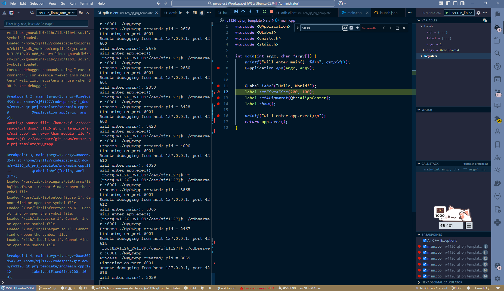

### download gdb source code

```bash
https://sourceware.org/pub/gdb/releases/?C=M;O=D
```

### cross compile

```bash
cd build
../gdb-7.12/configure --target=arm-linux-gnueabihf --host=arm-linux-gnueabihf \
CC=/home/xjf1127/codespace/toolchain/rk1126_sdk_vunknow/compiler/gcc-arm-8.3-2019.03-x86_64-arm-linux-gnueabihf/bin/arm-linux-gnueabihf-gcc \
CXX=/home/xjf1127/codespace/toolchain/rk1126_sdk_vunknow/compiler/gcc-arm-8.3-2019.03-x86_64-arm-linux-gnueabihf/bin/arm-linux-gnueabihf-g++ \
AR=/home/xjf1127/codespace/toolchain/rk1126_sdk_vunknow/compiler/gcc-arm-8.3-2019.03-x86_64-arm-linux-gnueabihf/bin/arm-linux-gnueabihf-ar \
--prefix="$PWD/../output"

make
make install
``` 


### problem

version_16
```bash
checking for /home/xjf1127/codespace/toolchain/rk1126_sdk_vunknow/compiler/gcc-arm-8.3-2019.03-x86_64-arm-linux-gnueabihf/bin/arm-linux-gnueabihf-gcc option to accept ISO C89... none needed
checking for /home/xjf1127/codespace/toolchain/rk1126_sdk_vunknow/compiler/gcc-arm-8.3-2019.03-x86_64-arm-linux-gnueabihf/bin/arm-linux-gnueabihf-gcc option to accept ISO C99... none needed
checking whether we are using the GNU C++ compiler... yes
checking whether /home/xjf1127/codespace/toolchain/rk1126_sdk_vunknow/compiler/gcc-arm-8.3-2019.03-x86_64-arm-linux-gnueabihf/bin/arm-linux-gnueabihf-g++ accepts -g... yes
checking whether g++ accepts -static-libstdc++ -static-libgcc... yes
checking for arm-linux-gnueabihf-gnatbind... no
checking for gnatbind... no
checking for arm-linux-gnueabihf-gnatmake... no
checking for gnatmake... no
checking whether compiler driver understands Ada and is recent enough... no
checking for arm-linux-gnueabihf-gdc... no
checking for gdc... no
checking whether the D compiler works... no
checking for cargo... no
checking how to compare bootstrapped objects... cmp --ignore-initial=16 
𝑓
1
f1f2
checking for objdir... .libs
checking for the correct version of gmp.h... no
configure: error: Building GDB requires GMP 4.2+, and MPFR 3.1.0+.
Try the --with-gmp and/or --with-mpfr options to specify
their locations. If you obtained GMP and/or MPFR from a vendor
distribution package, make sure that you have installed both the libraries
and the header files. They may be located in separate packages.
```

version_7.1
```bash
                 from ../../gdb-7.12/gdb/location.c:19:
../../gdb-7.12/gdb/utils.h:78:24: warning: unnecessary parentheses in declaration of ‘make_cleanup_free_section_addr_info’ [-Wparentheses]
 extern struct cleanup *(make_cleanup_free_section_addr_info
                        ^
../../gdb-7.12/gdb/location.c: In function ‘event_location* string_to_explicit_location(const char**, const language_defn*, int)’:
../../gdb-7.12/gdb/location.c:527:19: error: ISO C++ forbids comparison between pointer and integer [-fpermissive]
       || *argp == '\0'
                   ^~~~
make[2]: *** [Makefile:1141: location.o] Error 1
make[2]: Leaving directory '/home/xjf1127/codespace/toolchain/gdb/cross_compile_gdb_7/build/gdb'
make[1]: *** [Makefile:9191: install-gdb] Error 2
make[1]: Leaving directory '/home/xjf1127/codespace/toolchain/gdb/cross_compile_gdb_7/build'
make: *** [Makefile:2254: install] Error 2
```
**改进: 修改编译脚本**
```bash

```
继续报错，在结尾
```bash
/home/xjf1127/codespace/toolchain/gdb/cross_compile_gdb_7/gdb-7.12/missing: 81: makeinfo: not found
WARNING: 'makeinfo' is missing on your system.
         You should only need it if you modified a '.texi' file, or
         any other file indirectly affecting the aspect of the manual.
         You might want to install the Texinfo package:
         <http://www.gnu.org/software/texinfo/>
         The spurious makeinfo call might also be the consequence of
         using a buggy 'make' (AIX, DU, IRIX), in which case you might
         want to install GNU make:
         <http://www.gnu.org/software/make/>
make[5]: *** [Makefile:498: gdb.info] Error 127
make[5]: Leaving directory '/home/xjf1127/codespace/toolchain/gdb/cross_compile_gdb_7/build/gdb/doc'
make[4]: *** [Makefile:1514: subdir_do] Error 1
make[4]: Leaving directory '/home/xjf1127/codespace/toolchain/gdb/cross_compile_gdb_7/build/gdb'
make[3]: *** [Makefile:1250: install-only] Error 2
make[3]: Leaving directory '/home/xjf1127/codespace/toolchain/gdb/cross_compile_gdb_7/build/gdb'
make[2]: *** [Makefile:1245: install] Error 2
make[2]: Leaving directory '/home/xjf1127/codespace/toolchain/gdb/cross_compile_gdb_7/build/gdb'
make[1]: *** [Makefile:9191: install-gdb] Error 2
make[1]: Leaving directory '/home/xjf1127/codespace/toolchain/gdb/cross_compile_gdb_7/build'
xjf1127@DESKTOP-E1M5RHH:~/codespace/toolchain/gdb/cross_compile_gdb_7$ ^C
xjf1127@DESKTOP-E1M5RHH:~/codespace/toolchain/gdb/cross_compile_gdb_7$ ^C
xjf1127@DESKTOP-E1M5RHH:~/codespace/toolchain/gdb/cross_compile_gdb_7$ sudo apt-get install texinfo
```
**继续重新编译**

version_8
```bash
fi
mv GDBvn.new GDBvn.texi
/home/xjf1127/codespace/toolchain/gdb/cross_compile_gdb_8/gdb-8.3.1/missing makeinfo --split-size=5000000 --split-size=5000000   -I ../../../gdb-8.3.1/gdb/doc/../../readline/doc -I ../../../gdb-8.3.1/gdb/doc/../mi -I ../../../gdb-8.3.1/gdb/doc \
        -o gdb.info ../../../gdb-8.3.1/gdb/doc/gdb.texinfo
/home/xjf1127/codespace/toolchain/gdb/cross_compile_gdb_8/gdb-8.3.1/missing: 81: makeinfo: not found
WARNING: 'makeinfo' is missing on your system.
         You should only need it if you modified a '.texi' file, or
         any other file indirectly affecting the aspect of the manual.
         You might want to install the Texinfo package:
         <http://www.gnu.org/software/texinfo/>
         The spurious makeinfo call might also be the consequence of
         using a buggy 'make' (AIX, DU, IRIX), in which case you might
         want to install GNU make:
         <http://www.gnu.org/software/make/>
make[5]: *** [Makefile:486: gdb.info] Error 127
make[5]: Leaving directory '/home/xjf1127/codespace/toolchain/gdb/cross_compile_gdb_8/build/gdb/doc'
make[4]: *** [Makefile:1998: subdir_do] Error 1
make[4]: Leaving directory '/home/xjf1127/codespace/toolchain/gdb/cross_compile_gdb_8/build/gdb'
make[3]: *** [Makefile:1759: install-only] Error 2
make[3]: Leaving directory '/home/xjf1127/codespace/toolchain/gdb/cross_compile_gdb_8/build/gdb'
make[2]: *** [Makefile:1753: install] Error 2
make[2]: Leaving directory '/home/xjf1127/codespace/toolchain/gdb/cross_compile_gdb_8/build/gdb'
make[1]: *** [Makefile:9156: install-gdb] Error 2
make[1]: Leaving directory '/home/xjf1127/codespace/toolchain/gdb/cross_compile_gdb_8/build'
make: *** [Makefile:2223: install] Error 2
```
同样问题


#### 远程gdb调试记录
pc client 端调用
```bash
xjf1127@DESKTOP-E1M5RHH:~/codespace/git_down/rv1126_qt_prj_template$ /home/xjf1127/codespace/toolchain/rk1126_sdk_vunknow/compiler2/gcc-arm-8.3-2019.03-x86_64-arm-linux-gnueabihf/bin/arm-linux-gnueabihf-gdb ./MyQtApp
/home/xjf1127/codespace/toolchain/rk1126_sdk_vunknow/compiler2/gcc-arm-8.3-2019.03-x86_64-arm-linux-gnueabihf/bin/arm-linux-gnueabihf-gdb: error while loading shared libraries: libtinfo.so.5: cannot open shared object file: No such file or directory
xjf1127@DESKTOP-E1M5RHH:~/codespace/git_down/rv1126_qt_prj_template$ sudo apt install libtinfo5
[sudo] password for xjf1127: 
Reading package lists... Done
Building dependency tree... Done
Reading state information... Done
The following NEW packages will be installed:
  libtinfo5
0 upgraded, 1 newly installed, 0 to remove and 14 not upgraded.
Need to get 100 kB of archives.
After this operation, 557 kB of additional disk space will be used.
Get:1 http://archive.ubuntu.com/ubuntu jammy-updates/universe amd64 libtinfo5 amd64 6.3-2ubuntu0.1 [100 kB]
Fetched 100 kB in 2s (49.2 kB/s)    
Selecting previously unselected package libtinfo5:amd64.
(Reading database ... 69767 files and directories currently installed.)
Preparing to unpack .../libtinfo5_6.3-2ubuntu0.1_amd64.deb ...
Unpacking libtinfo5:amd64 (6.3-2ubuntu0.1) ...
Setting up libtinfo5:amd64 (6.3-2ubuntu0.1) ...
Processing triggers for libc-bin (2.35-0ubuntu3.9) ...
/sbin/ldconfig.real: /usr/lib/wsl/lib/libcuda.so.1 is not a symbolic link

xjf1127@DESKTOP-E1M5RHH:~/codespace/git_down/rv1126_qt_prj_template$ /home/xjf1127/codespace/toolchain/rk1126_sdk_vunknow/compiler2/gcc-arm-8.3-2019.03-x86_64-arm-linux-gnueabihf/bin/arm-linux-gnueabihf-gdb ./MyQtApp
/home/xjf1127/codespace/toolchain/rk1126_sdk_vunknow/compiler2/gcc-arm-8.3-2019.03-x86_64-arm-linux-gnueabihf/bin/arm-linux-gnueabihf-gdb: error while loading shared libraries: libncursesw.so.5: cannot open shared object file: No such file or directory
xjf1127@DESKTOP-E1M5RHH:~/codespace/git_down/rv1126_qt_prj_template$ sudo apt install libncurses5 libncursesw5
Reading package lists... Done
Building dependency tree... Done
Reading state information... Done
The following NEW packages will be installed:
  libncurses5 libncursesw5
0 upgraded, 2 newly installed, 0 to remove and 14 not upgraded.
Need to get 241 kB of archives.
After this operation, 717 kB of additional disk space will be used.
Get:1 http://archive.ubuntu.com/ubuntu jammy-updates/universe amd64 libncurses5 amd64 6.3-2ubuntu0.1 [107 kB]
Get:2 http://archive.ubuntu.com/ubuntu jammy-updates/universe amd64 libncursesw5 amd64 6.3-2ubuntu0.1 [134 kB]
Fetched 241 kB in 7s (35.6 kB/s)                                                                                                    
Selecting previously unselected package libncurses5:amd64.
(Reading database ... 69774 files and directories currently installed.)
Preparing to unpack .../libncurses5_6.3-2ubuntu0.1_amd64.deb ...
Unpacking libncurses5:amd64 (6.3-2ubuntu0.1) ...
Selecting previously unselected package libncursesw5:amd64.
Preparing to unpack .../libncursesw5_6.3-2ubuntu0.1_amd64.deb ...
Unpacking libncursesw5:amd64 (6.3-2ubuntu0.1) ...
Setting up libncurses5:amd64 (6.3-2ubuntu0.1) ...
Setting up libncursesw5:amd64 (6.3-2ubuntu0.1) ...
Processing triggers for libc-bin (2.35-0ubuntu3.9) ...
/sbin/ldconfig.real: /usr/lib/wsl/lib/libcuda.so.1 is not a symbolic link

xjf1127@DESKTOP-E1M5RHH:~/codespace/git_down/rv1126_qt_prj_template$ /home/xjf1127/codespace/toolchain/rk1126_sdk_vunknow/compiler2/gcc-arm-8.3-2019.03-x86_64-arm-linux-gnueabihf/bin/arm-linux-gnueabihf-gdb ./MyQtApp
/home/xjf1127/codespace/toolchain/rk1126_sdk_vunknow/compiler2/gcc-arm-8.3-2019.03-x86_64-arm-linux-gnueabihf/bin/arm-linux-gnueabihf-gdb: error while loading shared libraries: libpython2.7.so.1.0: cannot open shared object file: No such file or directory
xjf1127@DESKTOP-E1M5RHH:~/codespace/git_down/rv1126_qt_prj_template$ sudo apt install libpython2.7
Reading package lists... Done
Building dependency tree... Done
Reading state information... Done
The following additional packages will be installed:
  libpython2.7-minimal libpython2.7-stdlib
The following NEW packages will be installed:
  libpython2.7 libpython2.7-minimal libpython2.7-stdlib
0 upgraded, 3 newly installed, 0 to remove and 14 not upgraded.
Need to get 3488 kB of archives.
After this operation, 15.4 MB of additional disk space will be used.
Do you want to continue? [Y/n] y
Get:1 http://archive.ubuntu.com/ubuntu jammy-updates/universe amd64 libpython2.7-minimal amd64 2.7.18-13ubuntu1.5 [347 kB]
Get:2 http://archive.ubuntu.com/ubuntu jammy-updates/universe amd64 libpython2.7-stdlib amd64 2.7.18-13ubuntu1.5 [1977 kB]
Get:3 http://archive.ubuntu.com/ubuntu jammy-updates/universe amd64 libpython2.7 amd64 2.7.18-13ubuntu1.5 [1164 kB]
Fetched 3488 kB in 3s (1008 kB/s)      
Selecting previously unselected package libpython2.7-minimal:amd64.
(Reading database ... 69792 files and directories currently installed.)
Preparing to unpack .../libpython2.7-minimal_2.7.18-13ubuntu1.5_amd64.deb ...
Unpacking libpython2.7-minimal:amd64 (2.7.18-13ubuntu1.5) ...
Selecting previously unselected package libpython2.7-stdlib:amd64.
Preparing to unpack .../libpython2.7-stdlib_2.7.18-13ubuntu1.5_amd64.deb ...
Unpacking libpython2.7-stdlib:amd64 (2.7.18-13ubuntu1.5) ...
Selecting previously unselected package libpython2.7:amd64.
Preparing to unpack .../libpython2.7_2.7.18-13ubuntu1.5_amd64.deb ...
Unpacking libpython2.7:amd64 (2.7.18-13ubuntu1.5) ...
Setting up libpython2.7-minimal:amd64 (2.7.18-13ubuntu1.5) ...
Setting up libpython2.7-stdlib:amd64 (2.7.18-13ubuntu1.5) ...
Setting up libpython2.7:amd64 (2.7.18-13ubuntu1.5) ...
Processing triggers for libc-bin (2.35-0ubuntu3.9) ...
/sbin/ldconfig.real: /usr/lib/wsl/lib/libcuda.so.1 is not a symbolic link

xjf1127@DESKTOP-E1M5RHH:~/codespace/git_down/rv1126_qt_prj_template$ /home/xjf1127/codespace/toolchain/rk1126_sdk_vunknow/compiler2/gcc-arm-8.3-2019.03-x86_64-arm-linux-gnueabihf/bin/arm-linux-gnueabihf-gdb ./MyQtApp
GNU gdb (GNU Toolchain for the A-profile Architecture 8.3-2019.03 (arm-rel-8.36)) 8.2.1.20190227-git
Copyright (C) 2018 Free Software Foundation, Inc.
License GPLv3+: GNU GPL version 3 or later <http://gnu.org/licenses/gpl.html>
This is free software: you are free to change and redistribute it.
There is NO WARRANTY, to the extent permitted by law.
Type "show copying" and "show warranty" for details.
This GDB was configured as "--host=x86_64-pc-linux-gnu --target=arm-linux-gnueabihf".
Type "show configuration" for configuration details.
For bug reporting instructions, please see:
<https://bugs.linaro.org/>.
Find the GDB manual and other documentation resources online at:
    <http://www.gnu.org/software/gdb/documentation/>.

For help, type "help".
Type "apropos word" to search for commands related to "word"...
Reading symbols from ./MyQ
```

安装环境后成功进入client


#### vscode wsl2 配置 adb端口转发

```bash
### wsl2打开adb后
adb -L tcp:5037 fork-server server --reply-fd 4 
```


#### 当前困难点在于修改wsl2端adb的tcp和端口后，启动adb服务会卡住，说明网络存在问题
**方案:**
1. windows端对本地adb的5037端口进行转发，5037->5038,移除wsl2向window转发防火墙限制， 然后在wsl2端设置adb服务端口为windows ip+ 5038
2. windows端本地adb使用deamon模式并且监听所有5037，移除wsl2想windows转发防火墙限制，然后在wsl1端配置adb 服务端路径为windows ip+ 5037,即可直接访问

```bash
xjf1127@DESKTOP-E1M5RHH:~/codespace/git_down/new_aplus$ strace -f -o adb_trace.log adb shell
adb W 03-14 20:41:55 3619337 3619337 network.cpp:147] failed to connect to '192.168.2.52:5038': Connection timed out
* cannot start server on remote host
error: cannot connect to daemon at tcp:192.168.2.52:5038: failed to connect to '192.168.2.52:5038': Connection timed out

#### strace 输出
3619337 futex(0x7f107442077c, FUTEX_WAKE_PRIVATE, 2147483647) = 0
3619337 rt_sigaction(SIGPIPE, {sa_handler=SIG_IGN, sa_mask=[PIPE], sa_flags=SA_RESTORER|SA_RESTART, sa_restorer=0x7f1073f07520}, {sa_handler=SIG_DFL, sa_mask=[], sa_flags=0}, 8) = 0
3619337 socket(AF_INET, SOCK_STREAM, IPPROTO_TCP) = 3
3619337 fcntl(3, F_GETFL)               = 0x2 (flags O_RDWR)
3619337 fcntl(3, F_SETFL, O_RDWR|O_NONBLOCK) = 0
3619337 connect(3, {sa_family=AF_INET, sin_port=htons(5038), sin_addr=inet_addr("192.168.2.52")}, 16) = -1 EINPROGRESS (Operation now in progress)
3619337 pselect6(4, [3], [3], NULL, NULL, NULL) = 2 (in [3], out [3])
3619337 getsockopt(3, SOL_SOCKET, SO_ERROR, [ETIMEDOUT], [4]) = 0
3619337 close(3)                        = 0
3619337 openat(AT_FDCWD, "/etc/localtime", O_RDONLY|O_CLOEXEC) = 3
3619337 newfstatat(3, "", {st_mode=S_IFREG|0644, st_size=561, ...}, AT_EMPTY_PATH) = 0
3619337 newfstatat(3, "", {st_mode=S_IFREG|0644, st_size=561, ...}, AT_EMPTY_PATH) = 0
3619337 read(3, "TZif2\0\0\0\0\0\0\0\0\0\0\0\0\0\0\0\0\0\0\0\0\0\0\0\0\0\0\0"..., 4096) = 561
3619337 lseek(3, -342, SEEK_CUR)        = 219
3619337 read(3, "TZif2\0\0\0\0\0\0\0\0\0\0\0\0\0\0\0\0\0\0\0\0\0\0\0\0\0\0\0"..., 4096) = 342
3619337 close(3)                        = 0
3619337 getpid()                        = 3619337
3619337 gettid()                        = 3619337
3619337 write(2, "adb W 03-14 20:41:55 3619337 361"..., 117) = 117
3619337 write(2, "* cannot start server on remote "..., 37) = 37
3619337 close(-2)                       = -1 EBADF (Bad file descriptor)
3619337 futex(0x431058, FUTEX_WAKE_PRIVATE, 2147483647) = 0
3619337 write(2, "error: cannot connect to daemon "..., 121) = 121
3619337 exit_group(1)                   = ?
```

```bash
## windows 端开启本地端口转发，将本地adb 5037转发到5038
netsh interface portproxy add v4tov4 listenaddress=0.0.0.0 listenport=5038 connectaddress=127.0.0.1 connectport=5037

netsh interface portproxy show all

## windwos端 powershell 管理员方式打开，5038端口 wsl2端口转发防火墙白名单设置
PS C:\Users\Administrator> New-NetFirewallRule -DisplayName "<Alias>" -InterfaceAlias "vEthernet (WSL)" -Direction Inbound -Protocol TCP -LocalPort 5038 -Action Allow


Name                          : {13cef344-ca72-4876-96f6-3c8106f0612f}
DisplayName                   : <Alias>
Description                   :
DisplayGroup                  :
Group                         :
Enabled                       : True
Profile                       : Any
Platform                      : {}
Direction                     : Inbound
Action                        : Allow
EdgeTraversalPolicy           : Block
LooseSourceMapping            : False
LocalOnlyMapping              : False
Owner                         :
PrimaryStatus                 : OK
Status                        : 已从存储区成功分析规则。 (65536)
EnforcementStatus             : NotApplicable
PolicyStoreSource             : PersistentStore
PolicyStoreSourceType         : Local
RemoteDynamicKeywordAddresses :
PolicyAppId                   :


PS C:\Users\Administrator> Get-NetFirewallRule | Where-Object { $_.DisplayName -eq "Allow WSL Access" }
PS C:\Users\Administrator> Set-NetFirewallRule -DisplayName "<Alias>" -NewDisplayName "Allow WSL Access"
PS C:\Users\Administrator> Get-NetFirewallRule | Where-Object { $_.DisplayName -eq "Allow WSL Access" }


Name                          : {13cef344-ca72-4876-96f6-3c8106f0612f}
DisplayName                   : Allow WSL Access
Description                   :
DisplayGroup                  :
Group                         :
Enabled                       : True
Profile                       : Any
Platform                      : {}
Direction                     : Inbound
Action                        : Allow
EdgeTraversalPolicy           : Block
LooseSourceMapping            : False
LocalOnlyMapping              : False
Owner                         :
PrimaryStatus                 : OK
Status                        : 已从存储区成功分析规则。 (65536)
EnforcementStatus             : NotApplicable
PolicyStoreSource             : PersistentStore
PolicyStoreSourceType         : Local
RemoteDynamicKeywordAddresses :
PolicyAppId                   :

## wsl2端 通过环境变量 设置adb默认服务端口为5038
ip route show | grep -i default | awk '{ print $3}'

export ADB_SERVER_SOCKET=tcp:172.19.192.1:5038


## 准备就绪后 adb shell成功打开设备
adb shell

```

```bash
### 即使wsl2端操作端口转发，这个转发本质上是windows端的adb与windows端的端口进行转发，意味着，wsl2还需要设置一个端口，来将wsl2本地的gdb client端口转发到windows端口，再通过windows adb进行转发到设备端的gdb server

## windows
netsh interface portproxy add v4tov4 listenaddress=0.0.0.0 listenport=6001 connectaddress=127.0.0.1 connectport=6000


## wsl2


```

```bash
xjf1127@DESKTOP-E1M5RHH:~/codespace/git_down/rv1126_qt_prj_template$ adb shell
[root@RV1126_RV1109:/]# exit
xjf1127@DESKTOP-E1M5RHH:~/codespace/git_down/rv1126_qt_prj_template$ adb shell^C
xjf1127@DESKTOP-E1M5RHH:~/codespace/git_down/rv1126_qt_prj_template$ adb forward tcp:6000 tcp:6000
adb: error: cannot bind listener: cannot bind to 0.0.0.0:6000: 通常每个套接字地址(协议/网络地址/端口)只允许使用一次。 (10048)
```

```bash
### vscode 配置路径
{
    "version": "0.2.0",
    "files.exclude": {
        "/home/xjf1127/codespace/git_down/rv1126_qt_prj_template/**": true
    },
    "search.exclude": {
    },
    "configurations": [
        {
            "name": "rv1126_linux_arm_remote_debug",
            "type": "cppdbg",
            "request": "launch",
            "program": "${workspaceFolder}/MyQtApp",
            "cwd": "/home/xjf1127/codespace/git_down/rv1126_qt_prj_template",
            "stopAtEntry": true,
            "linux": {
                "MIMode": "gdb",
                "miDebuggerPath": "/home/xjf1127/codespace/toolchain/rk1126_sdk_vunknow/compiler2/gcc-arm-8.3-2019.03-x86_64-arm-linux-gnueabihf/bin/arm-linux-gnueabihf-gdb",
                "miDebuggerServerAddress": "172.19.192.1:6001",
                // "launchCompleteCommand": "exec-run",
                // "customLaunchSetupCommands": [
                //     {
                //         "description": "Connecting to linux target qdebug",
                //         "text": "target remote 172.19.192.1:6001",
                //         "ignoreFailures": false
                //     }
                // ]
            },
            "logging": {
                "engineLogging": false,
                "trace": false, 
                "traceResponse": false 
            },
            "targetArchitecture": "arm64"
        }
    ]
}
```




