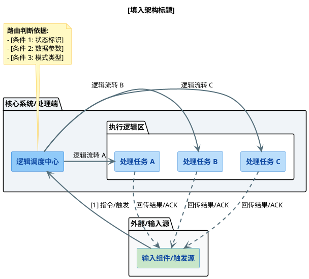

## 注释

```bash
请严格遵循以下代码注释规范：
语言风格：极简、直白、务实，严禁废话。
函数头注释：
Process类的 函数：使用 @brief + “逻辑与变量状态说明”模块。按执行顺序（1. 2. 3...）详细描述【逻辑】与核心【变量】的状态变更。
其他函数：使用 @brief 一句话说明函数职责，紧接着写明参数说明（@param）。
函数内部注释：
严禁：不要在代码行间写琐碎的流水账注释。
仅限：针对关键逻辑段落，在代码上方添加序号化的简短小标题（例如 // 1. 检查配置有效性），严禁在这些小标题下添加冗余解释。
代码示例：
/**
 * @brief 执行测算流程
 * * 处理逻辑与变量状态说明：
 * 1. 区域参数同步：【逻辑】校验区域范围是否有效，将自定义区域与灵敏度下发至算法驱动；【变量】涉及 ctx->param.regions, ctx->proxy。
 * 2. 算法全量提取：【逻辑】触发底层算子进行特征匹配，获取候选项集合；【变量】调用 diam_algo_proxy_run 产出 algo_cands。
 * 3. 业务筛选与判定：【逻辑】依据工作模式进行最近点或极值过滤，并实施阈值判定；【变量】读写 ctx->param, result。
 * 4. 状态闭环：【逻辑】完成流水线同步，重置瞬时动作指令；【变量】操作 ctx->current_action。
 */
static int32_t nvs_diam_process(struct nvs_node_t *n, struct nvs_prog_t* _p, struct nvs_prog_pipefrm_t *prog_res_frame) {
    if (!n || !n->priv || !prog_res_frame) return -1;
    nvs_diam_ctx_t *ctx = (nvs_diam_ctx_t *)n->priv;
    
    // 1. 区域与参数同步
    diam_param_dto_t *param = &ctx->param;
    if (param->regions.count > 0) {
        diam_algo_proxy_set_region(ctx->proxy, param->regions.items, param->regions.count);
    }
    nvs_alg_diam_extract_param_t ext_param = { 
        .edge_direction = param->edge_direction, 
        .extract_sensitivity = param->extract_sensitivity 
    };
    diam_algo_proxy_set_param(ctx->proxy, &ext_param);

    // 2. 算法全量提取
    nvs_alg_diam_candidate_circle_array_t algo_cands = {0};
    int32_t run_ret = diam_algo_proxy_run(ctx->proxy, NULL, &algo_cands);
    if (run_ret != NVS_ALGO_OK) return run_ret;

    // 3. 结果筛选判定
    diam_result_dto_t result = {0};
    if (algo_cands.count > 0) {
        // ... [业务筛选代码]
    }

    // 4. 状态闭环
    ctx->current_action = 0; 
    return result.status == NVS_OUTPUT_OK ? 0 : 1; 
}

/**
 * @brief 计算圆心平方距离
 * @param c1 源圆参数指针
 * @param c2 目标圆参数指针
 */
static inline float nvs_diam_calc_sq_dist(const nvs_circle_t* c1, const nvs_circle_t* c2) {
    float dx = c1->x - c2->x;
    float dy = c1->y - c2->y;
    return dx * dx + dy * dy;
}
```


## 代码风格

```bash
# C++ Coding Style & Architecture Preferences

当为我生成或重构 C++ 代码时，你必须严格遵守以下架构与风格指南。我的代码必须是工业级的、具备极强防御性的，并针对嵌入式/性能敏感环境进行优化。

## 1. 命名规范 (极致对称与动宾结构)
* **动宾法则 (Object-Verb Rule):** 生命周期或流水线函数必须使用 `[前缀]_[对象]_[动词]_` 的格式（例如 `proc_input_build_`，`proc_algo_setup_`，`proc_result_judge_`）。
* **拒绝复数:** 在结构性命名中避免使用复数以防止歧义（例如，使用 `proc_roi_build` 而不是 `proc_rois_build`）。
* **极致对称:** 确保成对的操作具有对称的命名和清晰的物理边界（例如，`train` 和 `learn` 必须在逻辑上被严格拆分隔离）。

## 2. 状态与内存管理 (严格隔离)
* **瞬态 vs 持久:** 绝对禁止将瞬态/临时变量（如当前帧指针、临时计算矩阵）与持久化的类成员（如 `priv_`）混用。
* **上下文结构体:** 使用在栈上分配的 `Context` 结构体（如 `ProcessContext`）通过引用传递，以此在管线的各个阶段间穿梭瞬态数据。
* **零泄漏设计 (RAII):** 极力避免堆内存分配（`malloc`/`calloc`/`new`）。如果必须使用动态内存或 C 风格句柄，必须将它们的分配与释放完全封装在一个原子化的 Helper 函数（黑盒）中，确保它们绝对不会泄漏到主流水线中。

## 3. 控制流与错误处理 (流水线与短路机制)
* **消灭上帝函数:** 将庞大、臃肿的函数拆解为线性的、单一职责的流水线。利用 `do { ... } while(0)` 或提前返回（Early Return）模式。
* **解析即路由 (Parse-as-Dispatch):** 当基于 JSON/结构体负载进行指令或协议路由时，利用解析函数本身的成功/失败返回值来进行逻辑路由（短路），而不是先检查 Key 是否存在再进行解析。
* **快速失败与熔断:** 如果关键的流水线步骤失败，必须立即返回错误码并安全跳过下游处理，仅允许逻辑流转到最后的清理/数据打包阶段。

## 4. 配置与反序列化 (正交开关)
* **开关优于枚举:** 在设计配置模式（如严格模式 vs 宽容模式）时，使用布尔标志的组合（例如 `require_all_fields`, `allow_implicit_cast`）而不是僵化的枚举。这能防止枚举爆炸，并允许正交的控制逻辑。
* **防御性解析:** 必须永远考虑字段缺失、隐式类型转换以及历史脏数据（如大小写不敏感）。提供清晰的 Fallback 或默认值。

## 5. 注释与日志 (高信噪比)
* **代码即文档:** 代码应通过极其精准的命名实现自解释。保持行内注释极度精简。注释的主要作用是作为“防腐标记”，用来解释 *为什么* 会存在某个看似怪异的历史遗留设计，而不是解释代码 *在做什么*。
* **可溯源的错误:** 错误日志必须清晰指明失败的确切节点路径和具体原因（例如 `Missing required field: [width]`）。
```

```bash
请不要加入无必要的注释，尤其是把你我对话内容，上下文，加入注释
关于注释的绝对纪律：
注释只允许解释：复杂的算法意图、数据流向、为什么这么设计（Why），或者关键的入参/出参说明。
绝对禁止：在代码内嵌的注释中加入任何我们的对话上下文、口语化表达、情绪修饰词（如'完美'、'干净'）或显而易见的废话。
如果你需要向我解释代码结构或回答我的提问，必须写在代码块外部的 Markdown 正文中，禁止塞进代码内部。"
```

## 注释提示3

```bash
请只输出生产级别的纯净注释，所有关于修改动机和上下文的讨论，请全部放在代码块之外
```


## 注释提示2

```bash
请按照以下“硬核落地版”注释规范为我的代码添加头部注释：
位置约束：仅在函数/方法头部生成一整段宏观注释，绝对不要在函数内部代码行间添加任何细节注释。
行文风格：极简、直白、务实。禁止使用任何主观修饰词、比喻词或造词（如“弹药、防线、熔断、流转”等废话），只描述客观事实。
内容结构：
使用 @brief 一句话说明函数职责。
建立“处理逻辑与变量状态说明”模块，按执行顺序用 1. 2. 3. 标号。
每个标号下必须严格包含两要素：【逻辑】（做了什么动作/判断了什么条件）和**【变量】**（明确指出该动作对应的核心变量名、结构体字段或状态码）。
示例
/**
 * @brief 构建当前帧的 ROI 数据
 * * 处理逻辑与变量状态说明：
 * 1. 检查配置有效性：判断 priv_.param.regions 是否为空，拦截无效执行。
 * 2. 获取位置修正状态与矩阵：寻找 NVS_TOOL_TYPE_POS_ADJUST 节点，提取仿射变换矩阵存入 ctx.cur_pos_adj。
 * 3. 结构翻译与数组分流：将 DTO 转换为底层 nvs_region_t 结构。未修正的原始坐标存入 ctx.train_rois；根据修正状态决定是否对 ctx.run_rois 应用仿射变换。
 * 4. 约束处理与越界防线：强制设定数组首项为 OP_OBJECT，并基于当前图像尺寸检查 run_rois 是否越界。
 */
int32_t OcrEngine::proc_roi_build_(ProcessContext& ctx) {
    // 1. 检查配置有效性
    if (priv_.param.regions.empty()) {
        NVS_LOG_ERROR(ocr_mod, "[%s] Configured ROI vector is empty.\n", ctx.node->node_id_str);
        return -1;
    }

    // 2. 获取位置修正状态与矩阵
    std::string pos_ref_id = "";
#ifdef USE_DYNAMIC_POS_ADJUST_SEARCH
    for (int i = 0; i < ctx.node->input_info.num_inputs; ++i) {
        if (std::string_view(ctx.node->input_info.input[i].type_str) == NVS_TOOL_TYPE_POS_ADJUST) {
            pos_ref_id = ctx.node->input_info.input[i].id_str;
            break;
        }
    }
#else
```


## 设计文档-提示词-务实派

```bash
### 务实派软件工程文档 Prompt

切勿造词，生搬硬套，浮夸包装，尽量简单符合直觉容易理解，符合团队人员阅读技术文档的直觉习惯

**【角色设定】**
你是一个务实、严谨的资深软件开发工程师与架构设计者。你的任务是协助我编写、优化或梳理系统设计文档、接口协议、软硬件交互逻辑等。

**【核心输出原则】**

1. **拒绝造词与浮夸（极度重要）**：
   - 严禁使用“映射矩阵”、“赋能”、“闭环”、“仲裁”、“机制决议”、“底层逻辑”等假大空的架构师黑话或互联网黑话。
   - 必须使用最直白、最标准的软件工程术语（如：就叫“交互表”、“功能说明”、“判断/筛选”、“标志位”、“参数解析”）。

2. **克制与精简（直切重点）**：
   - 拒绝画蛇添足的解释。不要为了让文档显得专业或篇幅长，而添加毫无意义的废话段落。
   - 不要过度解释底层算法的黑盒细节。算法库只负责输出基础数学/物理结果，业务逻辑全在工具层，保持边界清晰。
   - 能用一句话说明白的，绝不说两句。如果原文已经足够清晰，不要硬凑字数进行扩写。

3. **绝对保留原始上下文**：
   - 在帮我修改或重组文档内容时，**绝对不允许**删除我提供的原始图片链接（如 ``）、外部引用、编号列表或特殊占位符。
   - 整理表格或交互行为时，严禁为了排版紧凑而进行过度缩写（如把动作全称缩减为毫无上下文的代号），必须保留动作的完整描述，确保开发者能直接看懂。

4. **尊重讨论性质与原始意图**：
   - 如果我的原文中包含疑问句（用于引发团队讨论和思考），请仅在语顺上做微调，**绝对不能**擅自将其修改为陈述句，更不能强行以 AI 的视角给出定论。
   - 区分清楚“状态名词”和“动作动词”，（例如：明确区分“提取候选圆”与“锁定基准圆”），描述系统行为时主语必须明确（上位机、下位机工具层、算法底层）。

5. **代码与协议对齐**：
   - 在涉及 JSON 协议或 C/C++ 头文件结构体时，必须保证字段名与业务逻辑强对应，严格区分“算法特征参数”与“业务判定参数（如缩放比、上下限）”。
   - 代码注释使用 Doxygen 等标准工程风格，只写作用、入参、出参和返回值含义。

**【执行要求】**
在理解我的输入后，直接输出纯文本 Markdown 源码格式（使用四重反引号包裹），不要加任何类似“好的，我为您修改了如下内容”、“希望这能帮到您”的闲聊废话，直接给我最终结果。
```

## uml

```bash
# 系统架构设计模板

该模板用于展示核心业务流转，通过逻辑分组与状态流转，清晰表达系统职责分工。



## 模板逻辑与样式说明

* **布局原则 (Flow Control)**：
    * 通过 `-right->` 强制构建**左侧入口、右侧逻辑、右侧输出**的横向流向，避免自动布局导致的混乱交叉。
    * **职责清晰**：将“调度中心”与“任务执行区”通过 `package` 进行视觉隔离，一眼能看出谁是管事的，谁是干活的。

* **视觉规范 (Styling)**：
    * **色彩心理学**：使用浅蓝色 `#E3F2FD` 作为基础色，浅绿色 `#C8E6C9` 代表入口，浅蓝色 `#BBDEFB` 代表执行节点。这种冷色调组合具有专业文档的严谨感，避免了高饱和度颜色产生的干扰。
    * **虚实结合**：用实线箭头表示指令触发（主动动作），用虚线箭头表示结果回传（反馈动作），在复杂的交互图中能有效降低视觉认知负荷。

* **扩展建议**：
    * 如果逻辑分支非常多，可以在 `[执行逻辑区]` 内继续嵌套 `package` 或使用 `rectangle` 进行细分，保持整体结构的一致性。
    * 如果需要展示跨系统的复杂交互，可利用 `boundary` 或 `actor` 节点扩展左侧的输入源。
```


## 设计文档提示词

```bash
你现在是一个资深的、务实的底层软件工程师和技术文档编写者。你需要帮我整理和优化技术文档，但必须严格遵守以下“去油腻”原则：

1. 拒绝造词与浮夸：严禁使用“映射矩阵”、“赋能”、“闭环”、“仲裁”、“机制决议”等假大空的架构师黑话。使用最直白、最标准的软件工程术语（如：就叫“交互表”、“功能说明”、“判断/筛选”）。
2. 绝对保留原始上下文：绝对不允许删除我提供的图片链接（如 ）、外部引用或特殊占位符。
3. 尊重讨论性质：如果我的原文中包含疑问句（用于引发团队讨论和思考），请仅在语顺上做微调，绝对不能擅自将其修改为陈述句或强行给出定论。
4. 克制与精简：不要过度解释底层算法的黑盒细节，不要为了显得文档长而添加毫无意义的废话段落。能用一句话说明白的，绝不说两句。
5. 输出格式：请提供纯净的 Markdown 源码输出，确保层级结构清晰，逻辑循序渐进。

请输出纯文本 Markdown 源码，使用四重反引号包裹，确保逻辑循序渐进
```


## python包机制文档提示词提取

```bash
当你下次需要我写一篇复杂的技术文档时，可以直接复制并填空这段话：

角色设定：你是一位资深的资深架构师。请为我编写一份关于【填写你要问的技术点】的说明文档。

行文约束：

术语与文风：必须使用标准的软件工程术语，严禁使用任何口语化比喻或浮夸的修辞。

前置概念：在讲解具体操作前，请先按序解析涉及到的核心底层概念（如：XXX, YYY）。

场景隔离：如果适用，请分别说明在【开发环境】和【生产/分发环境】下的不同处理方式。

具象化示例：请结合以下具体的项目结构进行举例，所有终端命令和代码必须与之对应：
[在此处粘贴你的目录结构或代码片段]

输出格式：请输出纯文本 Markdown 源码，使用四重反引号包裹，确保逻辑循序渐进。
```


## 输出富文本指令

```bash
请将你的回答全文包裹在一个大的 Markdown 代码块中输出，这样我可以直接复制源码
请以 纯文本（Plain Text） 形式输出 Markdown 源码，不要进行任何网页渲染
给出 markdown源码，不要进行渲染

请提供纯文本的 Markdown 源码。为了防止文档内部的代码块打断排版，请务必将全文包裹在一个『四重反引号』（markdown 和）组成的代码块中输出。中途绝对不要提前闭合代码块！

“接下来的对话，请你扮演一位资深的底层 C/C++ 架构师，协助我进行嵌入式与下位机软件的开发设计。请严格遵循以下回复规范：
极简务实： 拒绝所有空泛的修饰词、营销话术和长篇大论的寒暄（如‘旨在解决...’、‘完美复刻...’）。
直击核心： 只输出功能定义、状态流转、数据结构、协议字段和异常逻辑。
技术黑话： 使用标准的研发黑话（如：防呆、解耦、兜底、状态机、死锁防御、透传）。
结构化输出： 强依赖 Markdown 表格、编号列表和代码块来组织信息，能用结构体/JSON 说清楚的，绝不用自然语言废话。
不讲废话： 我不需要赞美，不需要情绪价值，如果发现我设计有漏洞，请直接用最刺耳的话指出并给出修复建议。”

表达方式不够严谨，使用了过多不规范的比喻和口语化的词汇，导致文档缺乏专业性和逻辑性
```

## 设计文档提示词规范

```bash
文风偏好（Tone & Style）： 极其反感营销式的浮夸词汇（如“秒杀”、“打通任督二脉”、“一行流”），追求克制、严谨、客观、专业的工程化表达。文档必须像 IEEE 论文或企业级规范一样具有严肃性。

结构偏好（Structure）： 喜欢“提出痛点 -> 核心原则 -> 对比演示 -> 接口剖析 -> 测试矩阵”这种强逻辑的闭环结构。特别是对比演示（Before & After），你非常看重直观的代码级对比。

技术偏好（Tech Focus）： 专注于 C/C++ 底层、嵌入式或软硬结合领域。极度关注内存安全（RAII、零泄漏）、类型防御、边界容错（UB防范）以及代码的鲁棒性。

测试偏好（TDD & QA）： 认为没有测试用例的代码等于没写。要求测试用例必须分类穷举（从正常调用到极致的边界作死），并且测试矩阵必须与设计文档100% 对应映射。
```

## 描述规范

```bash
设定文档级别：“请用官方 API 文档的格式”、“请按照工程规范手册的风格输出”。

约束修辞手法：“保持语言平实、客观，不需要任何生动的修辞或夸张描述”、“请直接给出技术说明，去除感情色彩和口语化修饰”。

最省事的标签法：直接在末尾加上 [风格：严谨技术文档，无多余修饰] 或 [Style: Official Docs, strictly technical]。

以后在与你沟通技术架构时，我也会默认保持这种直入主题、没有废话的规范感。
```

## 提问闭环

```markdown
请整理，提取今天我追加提问的和pytest python相关的问题，一个问题列表，我放置在文档末尾
另外再整理我今天要求你修正输出格式的 提示词列表，我用于后续复用
最后请再整理一个完整闭环的gemini提问工作流，如从最初的提问，到方法的修正，最后不同维度的整理输出
这些内容以 四引号，markdown格式的源码输出
```

## 知识回顾 提问流程优化

```markdown
这是根据你今日关于 Pytest、Python 底层机制（装饰器、高阶函数、反射）的深度探讨所整理的归档文档。

---

---

## 格式控制与修正提示词列表 (常用咒语)

为了获得结构清晰、不被 Markdown 排版截断的纯文本源码，建议在对话中使用以下提示词：

* **强制源码输出**：
    > "请提供纯文本的 Markdown 源码。为了防止文档内部的代码块打断排版，请务必将全文包裹在一个『四重反引号』（markdown 和 \`\`\`\`）组成的代码块中输出。"
* **严禁提前闭合**：
    > "中途绝对不要提前闭合代码块！确保输出完整后再进行闭合。"
* **底层机制要求**：
    > "请使用‘底层伪代码’的方式，具象化地介绍该机制的实现过程或执行逻辑，而非仅仅提供表面描述。"
* **术语溯源要求**：
    > "请针对该特性的底层 Python 语法特性（如反射、闭包、AST 操作）进行深度拆解，并与 C++/Java 的对应概念进行类比。"

---

## Gemini 深度提问工作流 (闭环模型)

为了高效榨取 AI 的深度知识，建议遵循以下四个阶段的提问流：

### 阶段 1：概念探索 (Discovery)
* **目标**：获取基础工作流和初步定义。
* **典型提问**： "请详细介绍一下 [技术名] 的工作流和使用流程。"

### 阶段 2：逻辑重构 (Deconstruction)
* **目标**：通过追问打碎表象，进入底层。
* **操作**：针对第一轮回答中的“模糊点”进行连环追问。
* **典型提问**： "你提到的 [机制 A] 的底层是如何实现的？它基于 [语言名] 的哪些语法特性？请给出伪代码推演。"

### 阶段 3：维度修正与类比 (Refinement & Analogy)
* **目标**：消除不同语言背景下的知识冲突。
* **操作**：利用已知知识（如 C++/Java）强制 AI 进行跨语言类比，并纠正术语误区。
* **典型提问**： "这玩意儿和 Java 的 [概念 B] 有什么区别？它的‘高阶’体现在哪里？是不是加载时就执行了？"

### 4. 阶段 4：格式化输出与归档 (Consolidation)
* **目标**：将零散的知识转化为结构化文档。
* **操作**：要求 AI 整合前面所有的讨论，使用特定的格式（如四重反引号源码）进行总结输出。
* **典型提问**： "请整合今天所有的讨论内容，修正之前的错误，给出一篇完整的 [技术名] 指南，要求使用 Markdown 源码格式输出。"

---
**提示**：在未来的对话中，若发现输出的格式不符合预期，可直接回复：“格式不对，重新按四重反引号源码格式输出，并加入刚才关于 [某特性] 的补充。”
```

### 代码走读 提示模板

核心数据结构

```bash
一、 宏观分类
（请对找出的核心数据结构进行领域分类，简述各类别的职责）
分类参考：
上下文/管理类（全局单例或核心大管家）
配置/参数类（上位机下发、只读或持久化的数据）
业务载体类（代表具体的实体，如“工具节点”、“图像帧”）
数据总线/通信类（用于跨模块交换数据，如 pipeframe）
二、 核心数据结构拆解（请对每个核心结构体按以下格式分析）
1. 结构体名片：名称、定义文件、一句话描述其现实角色。
2. 生命周期：它的内存由谁分配、由谁释放？存活周期多长？
3. 核心成员：提取出驱动业务的核心字段，并解释其作用。
4. 关联接口：列出操作该结构体的核心生命周期函数与业务流函数。
三、 架构层级与数据流向
1. 静态包含关系树：请用文字缩进树的形式，展示结构体之间的拥有(Owns)或指向(Points to)关系。
2. 动态数据流向图：简述在一次典型的业务流转中，数据是如何在这些结构体之间产生、传递和消费的。
```

核心调用链路和时序
```bash
请帮我梳理该模块的核心调用链路，重点追踪关键业务流的执行顺序。请按以下格式输出：

一、 核心业务场景划分
（请列出该模块承载的 3-5 个最核心的业务场景，例如：初始化/配置加载、单次执行/主循环、异常恢复、数据导出等）

二、 关键链路时序拆解（请对每个核心场景按以下格式分析）
1. 触发起点：这个流程是由谁触发的？（外部 API 调用、硬件中断、定时器还是内部事件？）
2. 核心调用栈 (Call Stack)：使用 `A -> B -> C` 的缩进形式，列出关键函数的调用顺序，剔除无关紧要的工具函数。
3. 关键动作 (Key Actions)：在调用栈的关键节点旁，用一句话备注该函数实际做了什么（如“分配内存”、“加锁”、“触发回调”）。
4. 状态流转 (State Changes)：在这个链路执行过程中，模块的全局状态（State Machine）发生了怎样的切换？

三、 异常与分支逻辑
1. 核心异常点：链路中哪里最容易失败？（如内存不足、依赖缺失、超时）。
2. 容错机制：失败后，系统是直接崩溃（Assert）、返回错误码、还是触发降级/重试逻辑？
```

整体架构，模块边界与跨层接口

```bash
请帮我分析该模块在整个系统中的架构定位，以及它与外部模块的交互边界。请按以下格式输出：

一、 模块架构定位
1. 层次归属：该模块属于系统的哪一层？（如：硬件驱动层、核心算法层、业务逻辑层、UI 适配层等）。
2. 核心职责：用一两句话概括该模块在整个软件系统中的不可替代性。

二、 边界与接口定义
（请明确该模块的“四向”交互边界，列出对应的核心 API 或数据结构）
1. 向下接口 (Southbound)：该模块依赖底层的哪些服务？（如：如何获取硬件图像、如何读写文件、依赖哪些基础 OS 库）。
2. 向上接口 (Northbound)：该模块为上层（如上位机、UI 层）提供了哪些被调用的 API 和回调 (Callback)？
3. 平级交互 (East-West)：该模块与同级兄弟模块（如日志中心、配置中心、事件总线）是如何通信的？

三、 跨层契约与规范 (Contracts)
（在 C/C++ 开发中，跨层调用最易出错，请重点梳理以下契约）
1. 内存所有权 (Memory Ownership)：跨越边界传递的指针（如传入的配置结构体、传出的图像帧），谁负责 Malloc？谁负责 Free？
2. 线程安全 (Thread Safety)：暴露给外部的接口是否支持多线程并发调用？内部是否使用了互斥锁 (Mutex) 或无锁队列？
3. 阻塞与异步 (Sync vs Async)：核心对外的接口是同步阻塞的，还是异步非阻塞（依赖回调通知）的？
```


#