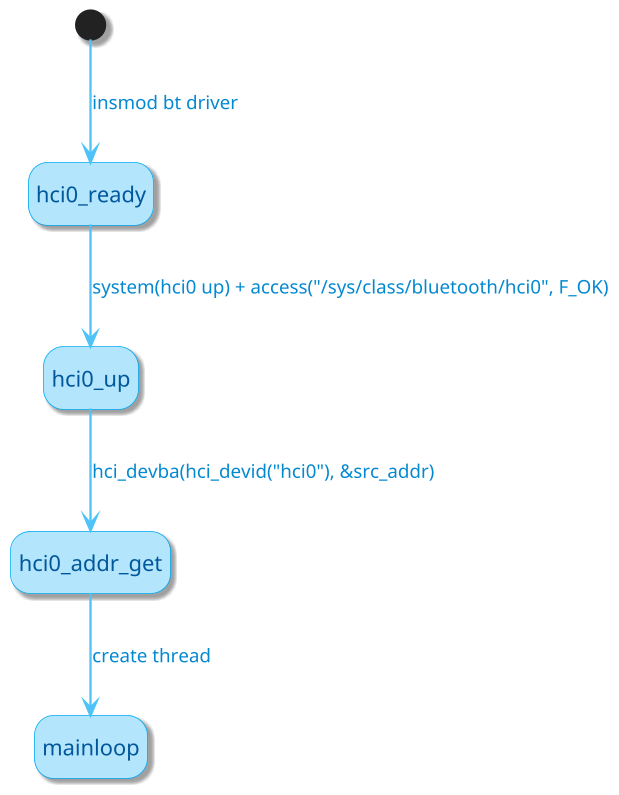
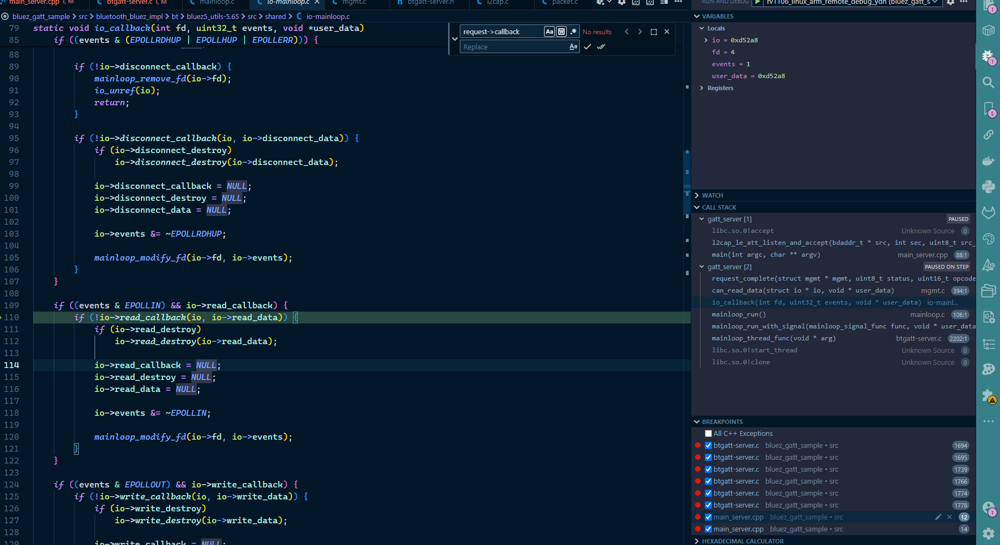

## ref

1. src/bluetooth_bluez_impl/bt/bluez5_utils-5.65/tools/btgatt-server.c (tool)
2. src/bluetooth_bluez_impl/bt/bluez5_utils-5.65/tools/btgatt-client.c

## base logic

```plantuml
@startuml

' hide empty description 隐藏状态的空描述
hide empty description

' ==== 状态图样式：天蓝可爱风 ====
skinparam state {
    ' 状态背景色：浅天蓝
    BackgroundColor #B3E5FC

    ' 状态边框色：亮天蓝
    BorderColor #03A9F4

    ' 状态字体颜色：深蓝
    FontColor #01579B

    ' 字体大小
    FontSize 14

    ' 开启立体阴影
    ' Shadowing true
}

skinparam shadowing true

' 箭头颜色：亮蓝
skinparam ArrowColor #4FC3F7

' 箭头字体颜色：中蓝
skinparam ArrowFontColor #0288D1

skinparam ArrowFontSize 12
skinparam ArrowThickness 1.5

' 背景白色，简洁
skinparam backgroundColor #FFFFFF
skinparam dpi 150

[*] --> hci0_ready: insmod bt driver
hci0_ready --> hci0_up: system(hci0 up) + access("/sys/class/bluetooth/hci0", F_OK)
hci0_up --> hci0_addr_get: hci_devba(hci_devid("hci0"), &src_addr)

hci0_addr_get --> mainloop: create thread


@enduml
```

## crash

1. 