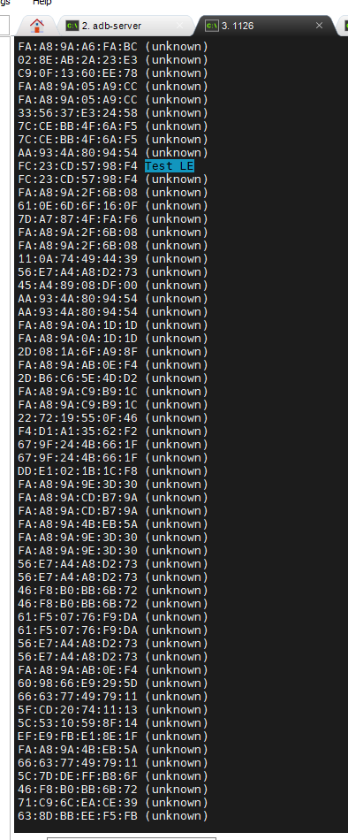

## current protocol

前端

1. BLE GATT

## other protocol

1. RFCOMM: 经典蓝牙协议，功能：实现蓝牙设备点对点的字节数据传输，所以可以进行socket编程

## insmod manual

```bash
insmod /oem/usr/ko/hci_uart.ko
rtk_hciattach -s 115200 /dev/ttyS0 rtk_h5 &
```

## 对比试验

1. 1126 开机后，如果killall 配置了蓝牙gatt的程序，然后将hci down再up，手机电脑无法扫描到设备
2. 1126 重新启动应用程序，程序内初始化了gatt服务，发现电脑和手机均能扫描到，并且正常连接服务，并且进行读写
3. 服务代码片段

    ```c++
    #define BLE_UUID_SERVICE    "0000180A-0000-1000-8000-00805F9B34FB"
    #define BLE_UUID_WIFI_CHAR  "00009999-0000-1000-8000-00805F9B34FB"
    #define BLE_UUID_PROXIMITY  "7B931104-1810-4CBC-94DA-875C8067F845"
    #define BLE_UUID_RECV       "00009999-0000-1000-8000-00805F9B34FB"
    #define BLE_UUID_SEND       "dfd4416e-1810-47f7-8248-eb8be3dc47f9"
    void RK_BLEWifiInit(const char *deviceNumber,
                        RK_BLE_RECV_DATA_CALLBACK recv_data_cb,
                        RK_BLE_REQUEST_DATA_CALLBACK request_data_cb,
                        RK_BLE_STATE_CALLBACK ble_state_cb,
                        RK_BT_MTU_CALLBACK bt_mtu_cb,
                        RK_wifi_state_callback wifi_state_cb)
    {
        RkBtContent bt_content;
        memset(&bt_content, 0, sizeof(RkBtContent));

        //MUST TO SET 0
        bt_content.bt_name = strdup(deviceNumber/*"ROCKCHIP_BT"*/);//经典蓝牙名称
        bt_content.ble_content.ble_name = strdup(deviceNumber);//低功耗蓝牙名称
        bt_content.ble_content.server_uuid.uuid = BLE_UUID_SERVICE;
        bt_content.ble_content.server_uuid.len = UUID_128;
        bt_content.ble_content.chr_uuid[0].uuid = BLE_UUID_RECV;
        bt_content.ble_content.chr_uuid[0].len = UUID_128;
        bt_content.ble_content.chr_uuid[1].uuid = BLE_UUID_SEND;
        bt_content.ble_content.chr_uuid[1].len = UUID_128;
        bt_content.ble_content.chr_cnt = 2;
        bt_content.ble_content.cb_ble_recv_fun = recv_data_cb;
        if (request_data_cb)
            bt_content.ble_content.cb_ble_request_data = request_data_cb;
        bt_content.ble_content.advDataType = BLE_ADVDATA_TYPE_SYSTEM;

        //BSA BLE必须注册数据接收回调，无法删除
        rk_ble_register_recv_callback(recv_data_cb);
        rk_ble_register_status_callback(ble_state_cb);
        rk_bt_init(&bt_content);

        sleep(3);
        printf(">>>>> Start ble ....\n");
        if (bt_mtu_cb)
            rk_ble_register_mtu_callback(bt_mtu_cb);
        rk_ble_start(&bt_content.ble_content);

        usleep(100 * 1000);
        RK_wifi_register_callback(wifi_state_cb);
    }
    ```

    ```c++
    // ble_server/main.c
    // 简化版 BlueZ GATT 服务程序，定义 UUID，自动启动

    #include <stdio.h>
    #include <stdlib.h>
    #include <unistd.h>
    #include <string.h>
    #include <glib.h>
    #include <gio/gio.h>

    #include "lib/bluetooth.h"
    #include "lib/uuid.h"
    #include "src/shared/mainloop.h"
    #include "src/shared/gatt-db.h"
    #include "src/shared/gatt-server.h"
    #include "src/shared/util.h"
    #include "src/shared/adapter.h"

    #define BLE_UUID_SERVICE     "0000180A-0000-1000-8000-00805F9B34FB"
    #define BLE_UUID_RECV        "00009999-0000-1000-8000-00805F9B34FB"
    #define BLE_UUID_SEND        "dfd4416e-1810-47f7-8248-eb8be3dc47f9"

    static struct gatt_db *db = NULL;
    static struct gatt_server *server = NULL;

    static void recv_write_cb(uint16_t att_id, const uint8_t *value, size_t len,
                            void *user_data)
    {
        printf("[BLE RECV] Write value: ");
        for (size_t i = 0; i < len; i++)
            printf("%02X ", value[i]);
        printf("\n");
    }

    static void server_ready_cb(void *user_data)
    {
        printf("[BLE] GATT server ready.\n");
    }

    static void setup_gatt_server(void)
    {
        bt_log_init("ble_server");
        db = gatt_db_new();
        if (!db) {
            fprintf(stderr, "[ERR] Failed to create GATT DB\n");
            exit(EXIT_FAILURE);
        }

        bt_uuid_t svc_uuid;
        bt_string_to_uuid(&svc_uuid, BLE_UUID_SERVICE);
        int service_id = gatt_db_add_service(db, &svc_uuid, true, 6);

        bt_uuid_t recv_uuid;
        bt_string_to_uuid(&recv_uuid, BLE_UUID_RECV);
        gatt_db_attribute_handle_t recv_handle = gatt_db_add_characteristic(db,
            service_id, &recv_uuid,
            GATT_PERM_WRITE | GATT_PERM_WRITE_ENCRYPT,
            GATT_CHRC_PROP_WRITE | GATT_CHRC_PROP_WRITE_WITHOUT_RESP);

        gatt_db_attribute_set_write_cb(db, recv_handle, recv_write_cb, NULL, NULL);

        bt_uuid_t send_uuid;
        bt_string_to_uuid(&send_uuid, BLE_UUID_SEND);
        gatt_db_add_characteristic(db, service_id, &send_uuid,
            GATT_PERM_READ,
            GATT_CHRC_PROP_READ | GATT_CHRC_PROP_NOTIFY);

        gatt_db_service_set_active(db, service_id, true);

        server = gatt_server_new(adapter_get_path(), db);
        gatt_server_register(server_ready_cb, NULL);
    }

    int main(int argc, char *argv[])
    {
        printf("[BLE] Starting BLE GATT server...\n");

        if (!mainloop_init()) {
            fprintf(stderr, "[ERR] Failed to init mainloop\n");
            return EXIT_FAILURE;
        }

        if (!adapter_init()) {
            fprintf(stderr, "[ERR] Failed to init adapter\n");
            return EXIT_FAILURE;
        }

        setup_gatt_server();

        mainloop_run();

        return 0;
    }

    ```
    

4. 如何使用bluez的工具集，运行一个gatt服务，脱离应用程序的配置，让pc端进行读写连接



5. 1106同样使用该工具运行服务进行功能对照，没有问题则开始通过bluez接口编码