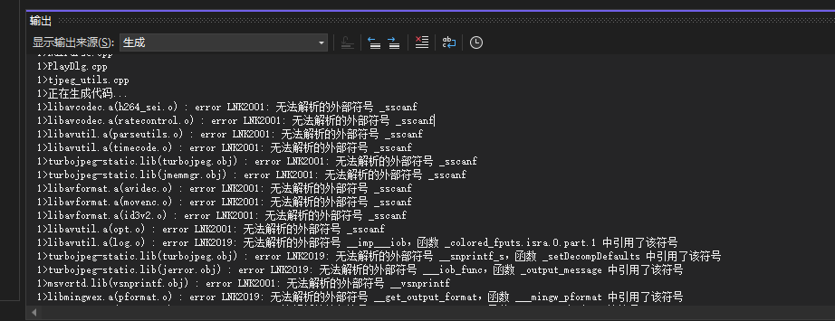
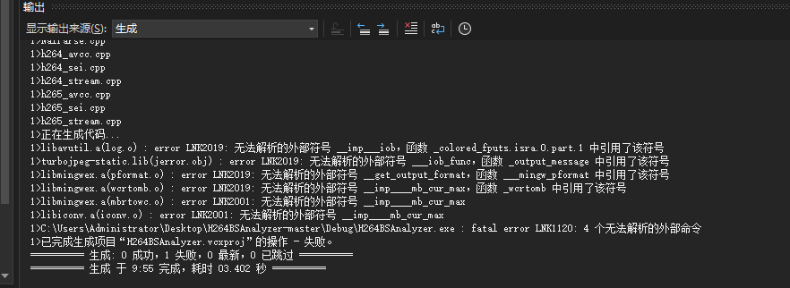

### ref

- [mp4文件格式解析](https://www.cnblogs.com/ranson7zop/p/7889272.html)
- [超轻量级MP4封装方法介绍](https://www.cnblogs.com/liwen01/p/17925462.html)
- [音视频技术入门课- 03 如何做音视频的封装和转码](https://www.cnblogs.com/xyjk1002-rejuvenation/p/16658960.html)
- [流媒体（视频）开发常用调试工具](https://blog.csdn.net/huweijian5/article/details/104275479)
- [在线解析视频帧结构](https://lulebo.github.io/)
- [github: h264bsanalyzer](https://github.com/latelee/H264BSAnalyzer)
- [github: bento4](https://github.com/axiomatic-systems/Bento4)
- [offical doc: bento4](https://www.bento4.com/documentation/mp4info/)
- [软件园: gui mp4info](https://www.xue51.com/soft/4117.html#xzdz)


### question

- MP4的文件作用?主要做了什么?
- 图形化分析媒体文件内容的工具？
- mp4的文件结构树?
- 能否手动实现封装?

### concept

- QuickTime容器格式

### bento: mp4info usage

```bash
C:\Users\Administrator\Downloads\Bento4-SDK-1-6-0-641.x86_64-microsoft-win32\bin>mp4info.exe --show-layout C:\Users\Administrator\Desktop\data\MuxerCbTest_0.mp4
File:
  major brand:      isom
  minor version:    200
  compatible brand: isom
  compatible brand: iso2
  compatible brand: avc1
  compatible brand: mp41
  fast start:       no

Movie:
  duration:   30634 (movie timescale units)
  duration:   30634 (ms)
  time scale: 1000
  fragments:  no

Found 1 Tracks
Track 1:
  flags:        3 ENABLED IN-MOVIE
  id:           1
  type:         Video
  duration: 30634 ms
  language: und
  media:
    sample count: 540
    timescale:    15360
    duration:     470528 (media timescale units)
    duration:     30633 (ms)
    bitrate (computed): 4818.345 Kbps
  display width:  3840.000000
  display height: 2160.000000
  frame rate (computed): 17.628
  Sample Description 0
    Coding:       avc1 (H.264)
    Codec String: avc1.64C033
    AVC Profile:          100 (High)
    AVC Profile Compat:   c0
    AVC Level:            51
    AVC NALU Length Size: 4
    AVC SPS: [6764c033ac1b1aa03c0043e840000003004000000f23c2211a80]
    AVC PPS: [68ee31b21b]
    Width:       3840
    Height:      2160
    Depth:       24
  00000000 [V] (1)* size=134959, offset=      48, dts=0 (0 ms)
  00000001 [V] (1)  size= 33388, offset=  135007, dts=512 (33 ms)
  00000002 [V] (1)  size= 46428, offset=  168395, dts=1536 (100 ms)
  00000003 [V] (1)  size= 14565, offset=  214823, dts=2048 (133 ms)
  00000004 [V] (1)  size= 21023, offset=  229388, dts=3072 (200 ms)
  00000005 [V] (1)  size= 47264, offset=  250411, dts=4096 (267 ms)
  00000006 [V] (1)  size= 50494, offset=  297675, dts=5120 (333 ms)
  00000007 [V] (1)  size= 49037, offset=  348169, dts=5632 (367 ms)
  00000008 [V] (1)  size= 38067, offset=  397206, dts=6656 (433 ms)
  00000009 [V] (1)  size= 22702, offset=  435273, dts=7680 (500 ms)
  00000010 [V] (1)  size= 30343, offset=  457975, dts=8192 (533 ms)
  00000011 [V] (1)  size= 34488, offset=  488318, dts=9216 (600 ms)
  00000012 [V] (1)  size= 18969, offset=  522806, dts=10240 (667 ms)
  00000013 [V] (1)  size= 16855, offset=  541775, dts=10752 (700 ms)
  00000014 [V] (1)  size= 22893, offset=  558630, dts=11776 (767 ms)
  00000015 [V] (1)  size= 17046, offset=  581523, dts=12800 (833 ms)
  00000016 [V] (1)  size= 12802, offset=  598569, dts=13824 (900 ms)
  00000017 [V] (1)  size= 19613, offset=  611371, dts=14336 (933 ms)
  00000018 [V] (1)  size= 13566, offset=  630984, dts=15360 (1000 ms)
  00000019 [V] (1)  size= 21619, offset=  644550, dts=16384 (1067 ms)
  00000020 [V] (1)  size= 15457, offset=  666169, dts=16896 (1100 ms)
  00000021 [V] (1)  size= 12631, offset=  681626, dts=17920 (1167 ms)
  00000022 [V] (1)  size= 23061, offset=  694257, dts=18944 (1233 ms)
  00000023 [V] (1)  size= 16505, offset=  717318, dts=19456 (1267 ms)
  00000024 [V] (1)  size= 13852, offset=  733823, dts=20480 (1333 ms)
  00000025 [V] (1)  size= 23629, offset=  747675, dts=21504 (1400 ms)
  00000026 [V] (1)  size= 19300, offset=  771304, dts=22016 (1433 ms)
  00000027 [V] (1)  size= 24279, offset=  790604, dts=23040 (1500 ms)
  00000028 [V] (1)  size= 20800, offset=  814883, dts=24064 (1567 ms)
  00000029 [V] (1)  size= 18820, offset=  835683, dts=24576 (1600 ms)
  00000030 [V] (1)* size=138157, offset=  854503, dts=25600 (1667 ms)
  00000031 [V] (1)  size= 19946, offset=  992660, dts=26624 (1733 ms)
  00000032 [V] (1)  size= 16753, offset= 1012606, dts=27648 (1800 ms)
  00000033 [V] (1)  size= 26096, offset= 1029359, dts=28160 (1833 ms)
  00000034 [V] (1)  size= 22950, offset= 1055455, dts=29184 (1900 ms)
  00000035 [V] (1)  size= 29621, offset= 1078405, dts=30208 (1967 ms)
  00000036 [V] (1)  size= 28150, offset= 1108026, dts=30720 (2000 ms)
  00000037 [V] (1)  size= 27608, offset= 1136176, dts=31744 (2067 ms)
  00000038 [V] (1)  size= 26131, offset= 1163784, dts=32768 (2133 ms)
  00000039 [V] (1)  size= 25617, offset= 1189915, dts=33280 (2167 ms)
  00000040 [V] (1)  size= 24486, offset= 1215532, dts=34304 (2233 ms)
  00000041 [V] (1)  size= 31631, offset= 1240018, dts=35328 (2300 ms)
  00000042 [V] (1)  size= 31486, offset= 1271649, dts=36352 (2367 ms)
  00000043 [V] (1)  size= 31925, offset= 1303135, dts=36864 (2400 ms)
  00000044 [V] (1)  size= 31830, offset= 1335060, dts=37888 (2467 ms)
  00000045 [V] (1)  size= 31202, offset= 1366890, dts=38912 (2533 ms)
  00000046 [V] (1)  size= 30228, offset= 1398092, dts=39424 (2567 ms)
  00000047 [V] (1)  size= 31286, offset= 1428320, dts=40448 (2633 ms)
  00000048 [V] (1)  size= 31836, offset= 1459606, dts=41472 (2700 ms)
  00000049 [V] (1)  size= 32312, offset= 1491442, dts=41984 (2733 ms)
  00000050 [V] (1)  size= 30809, offset= 1523754, dts=43008 (2800 ms)
  00000051 [V] (1)  size= 31820, offset= 1554563, dts=44032 (2867 ms)
  00000052 [V] (1)  size= 31964, offset= 1586383, dts=44544 (2900 ms)
  00000053 [V] (1)  size= 32133, offset= 1618347, dts=45568 (2967 ms)
  00000054 [V] (1)  size= 32470, offset= 1650480, dts=46592 (3033 ms)
  00000055 [V] (1)  size= 31806, offset= 1682950, dts=47616 (3100 ms)
  00000056 [V] (1)  size= 33306, offset= 1714756, dts=48128 (3133 ms)
  00000057 [V] (1)  size= 31798, offset= 1748062, dts=49152 (3200 ms)
  00000058 [V] (1)  size= 33045, offset= 1779860, dts=50176 (3267 ms)
  00000059 [V] (1)  size= 31950, offset= 1812905, dts=51200 (3333 ms)
  00000060 [V] (1)* size=327815, offset= 1844855, dts=51712 (3367 ms)
  00000061 [V] (1)  size= 29137, offset= 2172670, dts=52736 (3433 ms)
  00000062 [V] (1)  size= 29084, offset= 2201807, dts=53760 (3500 ms)
  00000063 [V] (1)  size= 28796, offset= 2230891, dts=54272 (3533 ms)
  00000064 [V] (1)  size= 28471, offset= 2259687, dts=55296 (3600 ms)
  00000065 [V] (1)  size= 29260, offset= 2288158, dts=56320 (3667 ms)
  00000066 [V] (1)  size= 28849, offset= 2317418, dts=56832 (3700 ms)
  00000067 [V] (1)  size= 27666, offset= 2346267, dts=57856 (3767 ms)
  00000068 [V] (1)  size= 28116, offset= 2373933, dts=58880 (3833 ms)
  00000069 [V] (1)  size= 28683, offset= 2402049, dts=59392 (3867 ms)
  00000070 [V] (1)  size= 29169, offset= 2430732, dts=60416 (3933 ms)
  00000071 [V] (1)  size= 28849, offset= 2459901, dts=61440 (4000 ms)
  00000072 [V] (1)  size= 29266, offset= 2488750, dts=62464 (4067 ms)
  00000073 [V] (1)  size= 29052, offset= 2518016, dts=62976 (4100 ms)
  00000074 [V] (1)  size= 28921, offset= 2547068, dts=64000 (4167 ms)
  00000075 [V] (1)  size= 28417, offset= 2575989, dts=65024 (4233 ms)
  00000076 [V] (1)  size= 28177, offset= 2604406, dts=65536 (4267 ms)
  00000077 [V] (1)  size= 29207, offset= 2632583, dts=66560 (4333 ms)
  00000078 [V] (1)  size= 27881, offset= 2661790, dts=67584 (4400 ms)
  00000079 [V] (1)  size= 29786, offset= 2689671, dts=68608 (4467 ms)
  00000080 [V] (1)  size= 28993, offset= 2719457, dts=69120 (4500 ms)
  00000081 [V] (1)  size= 28627, offset= 2748450, dts=70144 (4567 ms)
  00000082 [V] (1)  size= 27683, offset= 2777077, dts=71168 (4633 ms)
  00000083 [V] (1)  size= 28306, offset= 2804760, dts=71680 (4667 ms)
  00000084 [V] (1)  size= 28975, offset= 2833066, dts=72704 (4733 ms)
  00000085 [V] (1)  size= 28648, offset= 2862041, dts=73728 (4800 ms)
  00000086 [V] (1)  size= 29049, offset= 2890689, dts=74240 (4833 ms)
  00000087 [V] (1)  size= 28734, offset= 2919738, dts=75264 (4900 ms)
  00000088 [V] (1)  size= 28479, offset= 2948472, dts=76288 (4967 ms)
  00000089 [V] (1)  size= 36168, offset= 2976951, dts=77312 (5033 ms)
  00000090 [V] (1)* size=451142, offset= 3013119, dts=77824 (5067 ms)
  00000091 [V] (1)  size=  4468, offset= 3464261, dts=78848 (5133 ms)
  00000092 [V] (1)  size=  5940, offset= 3468729, dts=79872 (5200 ms)
  00000093 [V] (1)  size= 13322, offset= 3474669, dts=80384 (5233 ms)
  00000094 [V] (1)  size= 13148, offset= 3487991, dts=81408 (5300 ms)
  00000095 [V] (1)  size= 13102, offset= 3501139, dts=82432 (5367 ms)
  00000096 [V] (1)  size= 13488, offset= 3514241, dts=82944 (5400 ms)
  00000097 [V] (1)  size= 17501, offset= 3527729, dts=83968 (5467 ms)
  00000098 [V] (1)  size= 19086, offset= 3545230, dts=84992 (5533 ms)
  00000099 [V] (1)  size= 18780, offset= 3564316, dts=86016 (5600 ms)
  00000100 [V] (1)  size= 18592, offset= 3583096, dts=86528 (5633 ms)
  00000101 [V] (1)  size= 18420, offset= 3601688, dts=87552 (5700 ms)
  00000102 [V] (1)  size= 18579, offset= 3620108, dts=88576 (5767 ms)
  00000103 [V] (1)  size= 19353, offset= 3638687, dts=89088 (5800 ms)
  00000104 [V] (1)  size= 19225, offset= 3658040, dts=90112 (5867 ms)
  00000105 [V] (1)  size= 18507, offset= 3677265, dts=91136 (5933 ms)
  00000106 [V] (1)  size= 18282, offset= 3695772, dts=91648 (5967 ms)
  00000107 [V] (1)  size= 22011, offset= 3714054, dts=92672 (6033 ms)
  00000108 [V] (1)  size= 21434, offset= 3736065, dts=93696 (6100 ms)
  00000109 [V] (1)  size= 17961, offset= 3757499, dts=94720 (6167 ms)
  00000110 [V] (1)  size= 18086, offset= 3775460, dts=95232 (6200 ms)
  00000111 [V] (1)  size= 17571, offset= 3793546, dts=96256 (6267 ms)
  00000112 [V] (1)  size= 18067, offset= 3811117, dts=97280 (6333 ms)
  00000113 [V] (1)  size= 18207, offset= 3829184, dts=97792 (6367 ms)
  00000114 [V] (1)  size= 17791, offset= 3847391, dts=98816 (6433 ms)
  00000115 [V] (1)  size= 17208, offset= 3865182, dts=99840 (6500 ms)
  00000116 [V] (1)  size= 18295, offset= 3882390, dts=100864 (6567 ms)
  00000117 [V] (1)  size= 21760, offset= 3900685, dts=101376 (6600 ms)
  00000118 [V] (1)  size= 22262, offset= 3922445, dts=102400 (6667 ms)
  00000119 [V] (1)  size= 21495, offset= 3944707, dts=103424 (6733 ms)
  00000120 [V] (1)* size=392194, offset= 3966202, dts=103936 (6767 ms)
  00000121 [V] (1)  size=  4152, offset= 4358396, dts=104960 (6833 ms)
  00000122 [V] (1)  size= 11546, offset= 4362548, dts=105984 (6900 ms)
  00000123 [V] (1)  size= 11726, offset= 4374094, dts=106496 (6933 ms)
  00000124 [V] (1)  size= 12300, offset= 4385820, dts=107520 (7000 ms)
  00000125 [V] (1)  size= 12098, offset= 4398120, dts=108544 (7067 ms)
  00000126 [V] (1)  size= 12685, offset= 4410218, dts=109056 (7100 ms)
  00000127 [V] (1)  size= 18096, offset= 4422903, dts=110080 (7167 ms)
  00000128 [V] (1)  size= 17919, offset= 4440999, dts=111104 (7233 ms)
  00000129 [V] (1)  size= 11380, offset= 4458918, dts=112128 (7300 ms)
  00000130 [V] (1)  size= 18137, offset= 4470298, dts=112640 (7333 ms)
  00000131 [V] (1)  size= 18806, offset= 4488435, dts=113664 (7400 ms)
  00000132 [V] (1)  size= 18463, offset= 4507241, dts=114688 (7467 ms)
  00000133 [V] (1)  size= 18132, offset= 4525704, dts=115712 (7533 ms)
  00000134 [V] (1)  size= 18199, offset= 4543836, dts=116224 (7567 ms)
  00000135 [V] (1)  size= 20792, offset= 4562035, dts=117248 (7633 ms)
  00000136 [V] (1)  size= 21864, offset= 4582827, dts=118272 (7700 ms)
  00000137 [V] (1)  size= 21273, offset= 4604691, dts=118784 (7733 ms)
  00000138 [V] (1)  size= 22274, offset= 4625964, dts=119808 (7800 ms)
  00000139 [V] (1)  size= 21539, offset= 4648238, dts=120832 (7867 ms)
  00000140 [V] (1)  size= 21877, offset= 4669777, dts=121344 (7900 ms)
  00000141 [V] (1)  size= 22006, offset= 4691654, dts=122368 (7967 ms)
  00000142 [V] (1)  size= 22167, offset= 4713660, dts=123392 (8033 ms)
  00000143 [V] (1)  size= 22469, offset= 4735827, dts=124416 (8100 ms)
  00000144 [V] (1)  size= 22661, offset= 4758296, dts=124928 (8133 ms)
  00000145 [V] (1)  size= 22934, offset= 4780957, dts=125952 (8200 ms)
  00000146 [V] (1)  size= 22831, offset= 4803891, dts=126976 (8267 ms)
  00000147 [V] (1)  size= 22309, offset= 4826722, dts=127488 (8300 ms)
  00000148 [V] (1)  size= 22617, offset= 4849031, dts=128512 (8367 ms)
  00000149 [V] (1)  size= 23215, offset= 4871648, dts=129536 (8433 ms)
  00000150 [V] (1)* size=329805, offset= 4894863, dts=130560 (8500 ms)
  00000151 [V] (1)  size= 23612, offset= 5224668, dts=131072 (8533 ms)
  00000152 [V] (1)  size= 24984, offset= 5248280, dts=132096 (8600 ms)
  00000153 [V] (1)  size= 24321, offset= 5273264, dts=133120 (8667 ms)
  00000154 [V] (1)  size= 23909, offset= 5297585, dts=133632 (8700 ms)
  00000155 [V] (1)  size= 23995, offset= 5321494, dts=134656 (8767 ms)
  00000156 [V] (1)  size= 23521, offset= 5345489, dts=135680 (8833 ms)
  00000157 [V] (1)  size= 24939, offset= 5369010, dts=136192 (8867 ms)
  00000158 [V] (1)  size= 25307, offset= 5393949, dts=137216 (8933 ms)
  00000159 [V] (1)  size= 24862, offset= 5419256, dts=138240 (9000 ms)
  00000160 [V] (1)  size= 24889, offset= 5444118, dts=139264 (9067 ms)
  00000161 [V] (1)  size= 27047, offset= 5469007, dts=139776 (9100 ms)
  00000162 [V] (1)  size= 26537, offset= 5496054, dts=140800 (9167 ms)
  00000163 [V] (1)  size= 25948, offset= 5522591, dts=141824 (9233 ms)
  00000164 [V] (1)  size= 25918, offset= 5548539, dts=142848 (9300 ms)
  00000165 [V] (1)  size= 26044, offset= 5574457, dts=143360 (9333 ms)
  00000166 [V] (1)  size= 27086, offset= 5600501, dts=144384 (9400 ms)
  00000167 [V] (1)  size= 26088, offset= 5627587, dts=145408 (9467 ms)
  00000168 [V] (1)  size= 26014, offset= 5653675, dts=145920 (9500 ms)
  00000169 [V] (1)  size= 26307, offset= 5679689, dts=146944 (9567 ms)
  00000170 [V] (1)  size= 25191, offset= 5705996, dts=147968 (9633 ms)
  00000171 [V] (1)  size= 26694, offset= 5731187, dts=148480 (9667 ms)
  00000172 [V] (1)  size= 26031, offset= 5757881, dts=149504 (9733 ms)
  00000173 [V] (1)  size= 25887, offset= 5783912, dts=150528 (9800 ms)
  00000174 [V] (1)  size= 26087, offset= 5809799, dts=151552 (9867 ms)
  00000175 [V] (1)  size= 25089, offset= 5835886, dts=152064 (9900 ms)
  00000176 [V] (1)  size= 25813, offset= 5860975, dts=153088 (9967 ms)
  00000177 [V] (1)  size= 26253, offset= 5886788, dts=154112 (10033 ms)
  00000178 [V] (1)  size= 26006, offset= 5913041, dts=154624 (10067 ms)
  00000179 [V] (1)  size= 26149, offset= 5939047, dts=155648 (10133 ms)
  00000180 [V] (1)* size=459329, offset= 5965196, dts=156672 (10200 ms)
  00000181 [V] (1)  size= 23495, offset= 6424525, dts=157184 (10233 ms)
  00000182 [V] (1)  size= 24379, offset= 6448020, dts=158208 (10300 ms)
  00000183 [V] (1)  size= 24703, offset= 6472399, dts=159232 (10367 ms)
  00000184 [V] (1)  size= 25313, offset= 6497102, dts=160256 (10433 ms)
  00000185 [V] (1)  size= 24820, offset= 6522415, dts=160768 (10467 ms)
  00000186 [V] (1)  size= 23207, offset= 6547235, dts=161792 (10533 ms)
  00000187 [V] (1)  size= 22773, offset= 6570442, dts=162816 (10600 ms)
  00000188 [V] (1)  size= 22919, offset= 6593215, dts=163328 (10633 ms)
  00000189 [V] (1)  size= 22866, offset= 6616134, dts=164352 (10700 ms)
  00000190 [V] (1)  size= 22598, offset= 6639000, dts=165376 (10767 ms)
  00000191 [V] (1)  size= 22666, offset= 6661598, dts=166400 (10833 ms)
  00000192 [V] (1)  size= 23024, offset= 6684264, dts=166912 (10867 ms)
  00000193 [V] (1)  size= 22600, offset= 6707288, dts=167936 (10933 ms)
  00000194 [V] (1)  size= 22719, offset= 6729888, dts=168960 (11000 ms)
  00000195 [V] (1)  size= 22977, offset= 6752607, dts=169472 (11033 ms)
  00000196 [V] (1)  size= 23219, offset= 6775584, dts=170496 (11100 ms)
  00000197 [V] (1)  size= 21683, offset= 6798803, dts=171520 (11167 ms)
  00000198 [V] (1)  size= 22323, offset= 6820486, dts=172544 (11233 ms)
  00000199 [V] (1)  size= 22806, offset= 6842809, dts=173056 (11267 ms)
  00000200 [V] (1)  size= 22640, offset= 6865615, dts=174080 (11333 ms)
  00000201 [V] (1)  size= 23355, offset= 6888255, dts=175104 (11400 ms)
  00000202 [V] (1)  size= 22197, offset= 6911610, dts=175616 (11433 ms)
  00000203 [V] (1)  size= 22579, offset= 6933807, dts=176640 (11500 ms)
  00000204 [V] (1)  size= 22455, offset= 6956386, dts=177664 (11567 ms)
  00000205 [V] (1)  size= 16512, offset= 6978841, dts=178688 (11633 ms)
  00000206 [V] (1)  size= 22884, offset= 6995353, dts=179200 (11667 ms)
  00000207 [V] (1)  size= 22374, offset= 7018237, dts=180224 (11733 ms)
  00000208 [V] (1)  size= 22156, offset= 7040611, dts=181248 (11800 ms)
  00000209 [V] (1)  size= 22258, offset= 7062767, dts=181760 (11833 ms)
  00000210 [V] (1)* size=390256, offset= 7085025, dts=182784 (11900 ms)
  00000211 [V] (1)  size= 21476, offset= 7475281, dts=183808 (11967 ms)
  00000212 [V] (1)  size= 21814, offset= 7496757, dts=184832 (12033 ms)
  00000213 [V] (1)  size= 22020, offset= 7518571, dts=185344 (12067 ms)
  00000214 [V] (1)  size= 22062, offset= 7540591, dts=186368 (12133 ms)
  00000215 [V] (1)  size= 22418, offset= 7562653, dts=187392 (12200 ms)
  00000216 [V] (1)  size= 16387, offset= 7585071, dts=187904 (12233 ms)
  00000217 [V] (1)  size= 21241, offset= 7601458, dts=188928 (12300 ms)
  00000218 [V] (1)  size= 21740, offset= 7622699, dts=189952 (12367 ms)
  00000219 [V] (1)  size= 16472, offset= 7644439, dts=190976 (12433 ms)
  00000220 [V] (1)  size= 21760, offset= 7660911, dts=191488 (12467 ms)
  00000221 [V] (1)  size= 21875, offset= 7682671, dts=192512 (12533 ms)
  00000222 [V] (1)  size= 17552, offset= 7704546, dts=193536 (12600 ms)
  00000223 [V] (1)  size= 21548, offset= 7722098, dts=194048 (12633 ms)
  00000224 [V] (1)  size= 17237, offset= 7743646, dts=195072 (12700 ms)
  00000225 [V] (1)  size= 21317, offset= 7760883, dts=196096 (12767 ms)
  00000226 [V] (1)  size= 21733, offset= 7782200, dts=197120 (12833 ms)
  00000227 [V] (1)  size= 22030, offset= 7803933, dts=197632 (12867 ms)
  00000228 [V] (1)  size= 16813, offset= 7825963, dts=198656 (12933 ms)
  00000229 [V] (1)  size= 21631, offset= 7842776, dts=199680 (13000 ms)
  00000230 [V] (1)  size= 22107, offset= 7864407, dts=200192 (13033 ms)
  00000231 [V] (1)  size= 22453, offset= 7886514, dts=201216 (13100 ms)
  00000232 [V] (1)  size= 21736, offset= 7908967, dts=202240 (13167 ms)
  00000233 [V] (1)  size= 21564, offset= 7930703, dts=202752 (13200 ms)
  00000234 [V] (1)  size= 21817, offset= 7952267, dts=203776 (13267 ms)
  00000235 [V] (1)  size= 22445, offset= 7974084, dts=204800 (13333 ms)
  00000236 [V] (1)  size= 22214, offset= 7996529, dts=205824 (13400 ms)
  00000237 [V] (1)  size= 21888, offset= 8018743, dts=206336 (13433 ms)
  00000238 [V] (1)  size= 21570, offset= 8040631, dts=207360 (13500 ms)
  00000239 [V] (1)  size= 22284, offset= 8062201, dts=208384 (13567 ms)
  00000240 [V] (1)* size=330244, offset= 8084485, dts=208896 (13600 ms)
  00000241 [V] (1)  size= 24542, offset= 8414729, dts=209920 (13667 ms)
  00000242 [V] (1)  size= 24362, offset= 8439271, dts=210944 (13733 ms)
  00000243 [V] (1)  size= 23883, offset= 8463633, dts=211456 (13767 ms)
  00000244 [V] (1)  size= 24048, offset= 8487516, dts=212480 (13833 ms)
  00000245 [V] (1)  size= 24117, offset= 8511564, dts=213504 (13900 ms)
  00000246 [V] (1)  size= 24384, offset= 8535681, dts=214528 (13967 ms)
  00000247 [V] (1)  size= 24484, offset= 8560065, dts=215040 (14000 ms)
  00000248 [V] (1)  size= 25121, offset= 8584549, dts=216064 (14067 ms)
  00000249 [V] (1)  size= 17297, offset= 8609670, dts=217088 (14133 ms)
  00000250 [V] (1)  size= 24309, offset= 8626967, dts=217600 (14167 ms)
  00000251 [V] (1)  size= 24896, offset= 8651276, dts=218624 (14233 ms)
  00000252 [V] (1)  size= 23865, offset= 8676172, dts=219648 (14300 ms)
  00000253 [V] (1)  size= 23820, offset= 8700037, dts=220672 (14367 ms)
  00000254 [V] (1)  size= 16541, offset= 8723857, dts=221184 (14400 ms)
  00000255 [V] (1)  size= 24156, offset= 8740398, dts=222208 (14467 ms)
  00000256 [V] (1)  size= 24021, offset= 8764554, dts=223232 (14533 ms)
  00000257 [V] (1)  size= 23894, offset= 8788575, dts=223744 (14567 ms)
  00000258 [V] (1)  size= 23899, offset= 8812469, dts=224768 (14633 ms)
  00000259 [V] (1)  size= 23337, offset= 8836368, dts=225792 (14700 ms)
  00000260 [V] (1)  size= 23676, offset= 8859705, dts=226816 (14767 ms)
  00000261 [V] (1)  size= 23704, offset= 8883381, dts=227328 (14800 ms)
  00000262 [V] (1)  size= 24498, offset= 8907085, dts=228352 (14867 ms)
  00000263 [V] (1)  size= 23599, offset= 8931583, dts=229376 (14933 ms)
  00000264 [V] (1)  size= 23366, offset= 8955182, dts=229888 (14967 ms)
  00000265 [V] (1)  size= 23440, offset= 8978548, dts=230912 (15033 ms)
  00000266 [V] (1)  size= 23607, offset= 9001988, dts=231936 (15100 ms)
  00000267 [V] (1)  size= 23469, offset= 9025595, dts=232960 (15167 ms)
  00000268 [V] (1)  size= 23816, offset= 9049064, dts=233472 (15200 ms)
  00000269 [V] (1)  size= 23987, offset= 9072880, dts=234496 (15267 ms)
  00000270 [V] (1)* size=391463, offset= 9096867, dts=235520 (15333 ms)
  00000271 [V] (1)  size= 24301, offset= 9488330, dts=236032 (15367 ms)
  00000272 [V] (1)  size= 24112, offset= 9512631, dts=237056 (15433 ms)
  00000273 [V] (1)  size= 24088, offset= 9536743, dts=238080 (15500 ms)
  00000274 [V] (1)  size= 24803, offset= 9560831, dts=239104 (15567 ms)
  00000275 [V] (1)  size= 24156, offset= 9585634, dts=239616 (15600 ms)
  00000276 [V] (1)  size= 24041, offset= 9609790, dts=240640 (15667 ms)
  00000277 [V] (1)  size= 24930, offset= 9633831, dts=241664 (15733 ms)
  00000278 [V] (1)  size= 23874, offset= 9658761, dts=242176 (15767 ms)
  00000279 [V] (1)  size= 24421, offset= 9682635, dts=243200 (15833 ms)
  00000280 [V] (1)  size= 23959, offset= 9707056, dts=244224 (15900 ms)
  00000281 [V] (1)  size= 24579, offset= 9731015, dts=245248 (15967 ms)
  00000282 [V] (1)  size= 23639, offset= 9755594, dts=245760 (16000 ms)
  00000283 [V] (1)  size= 24810, offset= 9779233, dts=246784 (16067 ms)
  00000284 [V] (1)  size= 24300, offset= 9804043, dts=247808 (16133 ms)
  00000285 [V] (1)  size= 24179, offset= 9828343, dts=248320 (16167 ms)
  00000286 [V] (1)  size= 24174, offset= 9852522, dts=249344 (16233 ms)
  00000287 [V] (1)  size= 23932, offset= 9876696, dts=250368 (16300 ms)
  00000288 [V] (1)  size= 25320, offset= 9900628, dts=250880 (16333 ms)
  00000289 [V] (1)  size= 23523, offset= 9925948, dts=251904 (16400 ms)
  00000290 [V] (1)  size= 24973, offset= 9949471, dts=252928 (16467 ms)
  00000291 [V] (1)  size= 23927, offset= 9974444, dts=253952 (16533 ms)
  00000292 [V] (1)  size= 24650, offset= 9998371, dts=254464 (16567 ms)
  00000293 [V] (1)  size= 24361, offset=10023021, dts=255488 (16633 ms)
  00000294 [V] (1)  size= 24326, offset=10047382, dts=256512 (16700 ms)
  00000295 [V] (1)  size= 24518, offset=10071708, dts=257024 (16733 ms)
  00000296 [V] (1)  size= 24095, offset=10096226, dts=258048 (16800 ms)
  00000297 [V] (1)  size= 24658, offset=10120321, dts=259072 (16867 ms)
  00000298 [V] (1)  size= 24674, offset=10144979, dts=260096 (16933 ms)
  00000299 [V] (1)  size= 24207, offset=10169653, dts=260608 (16967 ms)
  00000300 [V] (1)* size=384361, offset=10193860, dts=261632 (17033 ms)
  00000301 [V] (1)  size= 23591, offset=10578221, dts=262656 (17100 ms)
  00000302 [V] (1)  size= 24555, offset=10601812, dts=263168 (17133 ms)
  00000303 [V] (1)  size= 23274, offset=10626367, dts=264192 (17200 ms)
  00000304 [V] (1)  size= 23406, offset=10649641, dts=265216 (17267 ms)
  00000305 [V] (1)  size= 23360, offset=10673047, dts=265728 (17300 ms)
  00000306 [V] (1)  size= 17375, offset=10696407, dts=266752 (17367 ms)
  00000307 [V] (1)  size= 18240, offset=10713782, dts=267776 (17433 ms)
  00000308 [V] (1)  size= 22128, offset=10732022, dts=268800 (17500 ms)
  00000309 [V] (1)  size= 22356, offset=10754150, dts=269312 (17533 ms)
  00000310 [V] (1)  size= 19770, offset=10776506, dts=270336 (17600 ms)
  00000311 [V] (1)  size= 20372, offset=10796276, dts=271360 (17667 ms)
  00000312 [V] (1)  size= 20092, offset=10816648, dts=271872 (17700 ms)
  00000313 [V] (1)  size= 20488, offset=10836740, dts=272896 (17767 ms)
  00000314 [V] (1)  size= 19394, offset=10857228, dts=273920 (17833 ms)
  00000315 [V] (1)  size= 19767, offset=10876622, dts=274944 (17900 ms)
  00000316 [V] (1)  size= 20582, offset=10896389, dts=275456 (17933 ms)
  00000317 [V] (1)  size= 23165, offset=10916971, dts=276480 (18000 ms)
  00000318 [V] (1)  size= 20354, offset=10940136, dts=277504 (18067 ms)
  00000319 [V] (1)  size= 22867, offset=10960490, dts=278016 (18100 ms)
  00000320 [V] (1)  size= 20547, offset=10983357, dts=279040 (18167 ms)
  00000321 [V] (1)  size= 22320, offset=11003904, dts=280064 (18233 ms)
  00000322 [V] (1)  size= 22570, offset=11026224, dts=281088 (18300 ms)
  00000323 [V] (1)  size= 22860, offset=11048794, dts=281600 (18333 ms)
  00000324 [V] (1)  size= 23540, offset=11071654, dts=282624 (18400 ms)
  00000325 [V] (1)  size= 23677, offset=11095194, dts=283648 (18467 ms)
  00000326 [V] (1)  size= 22791, offset=11118871, dts=284160 (18500 ms)
  00000327 [V] (1)  size= 22690, offset=11141662, dts=285184 (18567 ms)
  00000328 [V] (1)  size= 22850, offset=11164352, dts=286208 (18633 ms)
  00000329 [V] (1)  size= 23096, offset=11187202, dts=287232 (18700 ms)
  00000330 [V] (1)* size=393430, offset=11210298, dts=287744 (18733 ms)
  00000331 [V] (1)  size= 22882, offset=11603728, dts=288768 (18800 ms)
  00000332 [V] (1)  size= 23665, offset=11626610, dts=289792 (18867 ms)
  00000333 [V] (1)  size= 23411, offset=11650275, dts=290304 (18900 ms)
  00000334 [V] (1)  size= 23227, offset=11673686, dts=291328 (18967 ms)
  00000335 [V] (1)  size= 15942, offset=11696913, dts=292352 (19033 ms)
  00000336 [V] (1)  size= 22932, offset=11712855, dts=292864 (19067 ms)
  00000337 [V] (1)  size= 23446, offset=11735787, dts=293888 (19133 ms)
  00000338 [V] (1)  size= 16881, offset=11759233, dts=294912 (19200 ms)
  00000339 [V] (1)  size= 22894, offset=11776114, dts=295936 (19267 ms)
  00000340 [V] (1)  size= 22255, offset=11799008, dts=296448 (19300 ms)
  00000341 [V] (1)  size= 22320, offset=11821263, dts=297472 (19367 ms)
  00000342 [V] (1)  size= 22472, offset=11843583, dts=298496 (19433 ms)
  00000343 [V] (1)  size= 21936, offset=11866055, dts=299520 (19500 ms)
  00000344 [V] (1)  size= 22850, offset=11887991, dts=300032 (19533 ms)
  00000345 [V] (1)  size= 23418, offset=11910841, dts=301056 (19600 ms)
  00000346 [V] (1)  size= 17017, offset=11934259, dts=302080 (19667 ms)
  00000347 [V] (1)  size= 22888, offset=11951276, dts=302592 (19700 ms)
  00000348 [V] (1)  size= 22929, offset=11974164, dts=303616 (19767 ms)
  00000349 [V] (1)  size= 22459, offset=11997093, dts=304640 (19833 ms)
  00000350 [V] (1)  size= 22289, offset=12019552, dts=305152 (19867 ms)
  00000351 [V] (1)  size= 22897, offset=12041841, dts=306176 (19933 ms)
  00000352 [V] (1)  size= 22887, offset=12064738, dts=307200 (20000 ms)
  00000353 [V] (1)  size= 23115, offset=12087625, dts=308224 (20067 ms)
  00000354 [V] (1)  size= 22809, offset=12110740, dts=308736 (20100 ms)
  00000355 [V] (1)  size= 22781, offset=12133549, dts=309760 (20167 ms)
  00000356 [V] (1)  size= 23556, offset=12156330, dts=310784 (20233 ms)
  00000357 [V] (1)  size= 23526, offset=12179886, dts=311296 (20267 ms)
  00000358 [V] (1)  size= 23306, offset=12203412, dts=312320 (20333 ms)
  00000359 [V] (1)  size= 22992, offset=12226718, dts=313344 (20400 ms)
  00000360 [V] (1)* size=330940, offset=12249710, dts=314368 (20467 ms)
  00000361 [V] (1)  size= 23488, offset=12580650, dts=314880 (20500 ms)
  00000362 [V] (1)  size= 24482, offset=12604138, dts=315904 (20567 ms)
  00000363 [V] (1)  size= 23472, offset=12628620, dts=316928 (20633 ms)
  00000364 [V] (1)  size= 23927, offset=12652092, dts=317440 (20667 ms)
  00000365 [V] (1)  size= 24529, offset=12676019, dts=318464 (20733 ms)
  00000366 [V] (1)  size= 25075, offset=12700548, dts=319488 (20800 ms)
  00000367 [V] (1)  size= 24302, offset=12725623, dts=320000 (20833 ms)
  00000368 [V] (1)  size= 23819, offset=12749925, dts=321024 (20900 ms)
  00000369 [V] (1)  size= 24191, offset=12773744, dts=322048 (20967 ms)
  00000370 [V] (1)  size= 24392, offset=12797935, dts=323072 (21033 ms)
  00000371 [V] (1)  size= 23543, offset=12822327, dts=323584 (21067 ms)
  00000372 [V] (1)  size= 24493, offset=12845870, dts=324608 (21133 ms)
  00000373 [V] (1)  size= 23967, offset=12870363, dts=325632 (21200 ms)
  00000374 [V] (1)  size= 24189, offset=12894330, dts=326144 (21233 ms)
  00000375 [V] (1)  size= 24101, offset=12918519, dts=327168 (21300 ms)
  00000376 [V] (1)  size= 23400, offset=12942620, dts=328192 (21367 ms)
  00000377 [V] (1)  size= 23620, offset=12966020, dts=329216 (21433 ms)
  00000378 [V] (1)  size= 23876, offset=12989640, dts=329728 (21467 ms)
  00000379 [V] (1)  size= 24217, offset=13013516, dts=330752 (21533 ms)
  00000380 [V] (1)  size= 23249, offset=13037733, dts=331776 (21600 ms)
  00000381 [V] (1)  size= 23694, offset=13060982, dts=332288 (21633 ms)
  00000382 [V] (1)  size= 24206, offset=13084676, dts=333312 (21700 ms)
  00000383 [V] (1)  size= 24195, offset=13108882, dts=334336 (21767 ms)
  00000384 [V] (1)  size= 24380, offset=13133077, dts=335360 (21833 ms)
  00000385 [V] (1)  size= 24064, offset=13157457, dts=335872 (21867 ms)
  00000386 [V] (1)  size= 24596, offset=13181521, dts=336896 (21933 ms)
  00000387 [V] (1)  size= 24174, offset=13206117, dts=337920 (22000 ms)
  00000388 [V] (1)  size= 24225, offset=13230291, dts=338432 (22033 ms)
  00000389 [V] (1)  size= 24869, offset=13254516, dts=339456 (22100 ms)
  00000390 [V] (1)* size=389934, offset=13279385, dts=340480 (22167 ms)
  00000391 [V] (1)  size= 24913, offset=13669319, dts=340992 (22200 ms)
  00000392 [V] (1)  size= 24482, offset=13694232, dts=342016 (22267 ms)
  00000393 [V] (1)  size= 25336, offset=13718714, dts=343040 (22333 ms)
  00000394 [V] (1)  size= 24886, offset=13744050, dts=344064 (22400 ms)
  00000395 [V] (1)  size= 24302, offset=13768936, dts=344576 (22433 ms)
  00000396 [V] (1)  size= 24358, offset=13793238, dts=345600 (22500 ms)
  00000397 [V] (1)  size= 24552, offset=13817596, dts=346624 (22567 ms)
  00000398 [V] (1)  size= 24795, offset=13842148, dts=347136 (22600 ms)
  00000399 [V] (1)  size= 16417, offset=13866943, dts=348160 (22667 ms)
  00000400 [V] (1)  size= 24136, offset=13883360, dts=349184 (22733 ms)
  00000401 [V] (1)  size= 17021, offset=13907496, dts=350208 (22800 ms)
  00000402 [V] (1)  size= 23504, offset=13924517, dts=350720 (22833 ms)
  00000403 [V] (1)  size= 17390, offset=13948021, dts=351744 (22900 ms)
  00000404 [V] (1)  size= 22507, offset=13965411, dts=352768 (22967 ms)
  00000405 [V] (1)  size= 17387, offset=13987918, dts=353280 (23000 ms)
  00000406 [V] (1)  size= 21959, offset=14005305, dts=354304 (23067 ms)
  00000407 [V] (1)  size= 23189, offset=14027264, dts=355328 (23133 ms)
  00000408 [V] (1)  size= 22354, offset=14050453, dts=356352 (23200 ms)
  00000409 [V] (1)  size= 17268, offset=14072807, dts=356864 (23233 ms)
  00000410 [V] (1)  size= 22768, offset=14090075, dts=357888 (23300 ms)
  00000411 [V] (1)  size= 23304, offset=14112843, dts=358912 (23367 ms)
  00000412 [V] (1)  size= 23478, offset=14136147, dts=359424 (23400 ms)
  00000413 [V] (1)  size= 16872, offset=14159625, dts=360448 (23467 ms)
  00000414 [V] (1)  size= 23584, offset=14176497, dts=361472 (23533 ms)
  00000415 [V] (1)  size= 22859, offset=14200081, dts=362496 (23600 ms)
  00000416 [V] (1)  size= 23777, offset=14222940, dts=363008 (23633 ms)
  00000417 [V] (1)  size= 22992, offset=14246717, dts=364032 (23700 ms)
  00000418 [V] (1)  size= 24049, offset=14269709, dts=365056 (23767 ms)
  00000419 [V] (1)  size= 23969, offset=14293758, dts=365568 (23800 ms)
  00000420 [V] (1)* size=391453, offset=14317727, dts=366592 (23867 ms)
  00000421 [V] (1)  size= 23904, offset=14709180, dts=367616 (23933 ms)
  00000422 [V] (1)  size= 23221, offset=14733084, dts=368640 (24000 ms)
  00000423 [V] (1)  size= 23871, offset=14756305, dts=369152 (24033 ms)
  00000424 [V] (1)  size= 16189, offset=14780176, dts=370176 (24100 ms)
  00000425 [V] (1)  size= 22555, offset=14796365, dts=371200 (24167 ms)
  00000426 [V] (1)  size= 22634, offset=14818920, dts=371712 (24200 ms)
  00000427 [V] (1)  size= 22320, offset=14841554, dts=372736 (24267 ms)
  00000428 [V] (1)  size= 22623, offset=14863874, dts=373760 (24333 ms)
  00000429 [V] (1)  size= 16381, offset=14886497, dts=374272 (24367 ms)
  00000430 [V] (1)  size= 22343, offset=14902878, dts=375296 (24433 ms)
  00000431 [V] (1)  size= 22321, offset=14925221, dts=376320 (24500 ms)
  00000432 [V] (1)  size= 22059, offset=14947542, dts=377344 (24567 ms)
  00000433 [V] (1)  size= 22699, offset=14969601, dts=377856 (24600 ms)
  00000434 [V] (1)  size= 22843, offset=14992300, dts=378880 (24667 ms)
  00000435 [V] (1)  size= 23797, offset=15015143, dts=379904 (24733 ms)
  00000436 [V] (1)  size= 23510, offset=15038940, dts=380416 (24767 ms)
  00000437 [V] (1)  size= 17078, offset=15062450, dts=381440 (24833 ms)
  00000438 [V] (1)  size= 17761, offset=15079528, dts=382464 (24900 ms)
  00000439 [V] (1)  size= 22899, offset=15097289, dts=383488 (24967 ms)
  00000440 [V] (1)  size= 22591, offset=15120188, dts=384000 (25000 ms)
  00000441 [V] (1)  size= 21896, offset=15142779, dts=385024 (25067 ms)
  00000442 [V] (1)  size= 22161, offset=15164675, dts=386048 (25133 ms)
  00000443 [V] (1)  size= 22479, offset=15186836, dts=386560 (25167 ms)
  00000444 [V] (1)  size= 22643, offset=15209315, dts=387584 (25233 ms)
  00000445 [V] (1)  size= 22939, offset=15231958, dts=388608 (25300 ms)
  00000446 [V] (1)  size= 22893, offset=15254897, dts=389120 (25333 ms)
  00000447 [V] (1)  size= 23282, offset=15277790, dts=390144 (25400 ms)
  00000448 [V] (1)  size= 23301, offset=15301072, dts=391168 (25467 ms)
  00000449 [V] (1)  size= 23650, offset=15324373, dts=392192 (25533 ms)
  00000450 [V] (1)* size=329595, offset=15348023, dts=392704 (25567 ms)
  00000451 [V] (1)  size= 23218, offset=15677618, dts=393728 (25633 ms)
  00000452 [V] (1)  size= 23880, offset=15700836, dts=394752 (25700 ms)
  00000453 [V] (1)  size= 23690, offset=15724716, dts=395264 (25733 ms)
  00000454 [V] (1)  size= 24475, offset=15748406, dts=396288 (25800 ms)
  00000455 [V] (1)  size= 23928, offset=15772881, dts=397312 (25867 ms)
  00000456 [V] (1)  size= 24296, offset=15796809, dts=398336 (25933 ms)
  00000457 [V] (1)  size= 23790, offset=15821105, dts=398848 (25967 ms)
  00000458 [V] (1)  size= 24114, offset=15844895, dts=399872 (26033 ms)
  00000459 [V] (1)  size= 24080, offset=15869009, dts=400896 (26100 ms)
  00000460 [V] (1)  size= 23802, offset=15893089, dts=401408 (26133 ms)
  00000461 [V] (1)  size= 24564, offset=15916891, dts=402432 (26200 ms)
  00000462 [V] (1)  size= 24351, offset=15941455, dts=403456 (26267 ms)
  00000463 [V] (1)  size= 24588, offset=15965806, dts=404480 (26333 ms)
  00000464 [V] (1)  size= 24492, offset=15990394, dts=404992 (26367 ms)
  00000465 [V] (1)  size= 23459, offset=16014886, dts=406016 (26433 ms)
  00000466 [V] (1)  size= 23896, offset=16038345, dts=407040 (26500 ms)
  00000467 [V] (1)  size= 23905, offset=16062241, dts=407552 (26533 ms)
  00000468 [V] (1)  size= 24014, offset=16086146, dts=408576 (26600 ms)
  00000469 [V] (1)  size= 23711, offset=16110160, dts=409600 (26667 ms)
  00000470 [V] (1)  size= 24400, offset=16133871, dts=410624 (26733 ms)
  00000471 [V] (1)  size= 24128, offset=16158271, dts=411136 (26767 ms)
  00000472 [V] (1)  size= 24013, offset=16182399, dts=412160 (26833 ms)
  00000473 [V] (1)  size= 24572, offset=16206412, dts=413184 (26900 ms)
  00000474 [V] (1)  size= 23916, offset=16230984, dts=413696 (26933 ms)
  00000475 [V] (1)  size= 24119, offset=16254900, dts=414720 (27000 ms)
  00000476 [V] (1)  size= 24048, offset=16279019, dts=415744 (27067 ms)
  00000477 [V] (1)  size= 23614, offset=16303067, dts=416256 (27100 ms)
  00000478 [V] (1)  size= 23974, offset=16326681, dts=417280 (27167 ms)
  00000479 [V] (1)  size= 23557, offset=16350655, dts=418304 (27233 ms)
  00000480 [V] (1)* size=389999, offset=16374212, dts=419328 (27300 ms)
  00000481 [V] (1)  size= 23981, offset=16764211, dts=419840 (27333 ms)
  00000482 [V] (1)  size= 24520, offset=16788192, dts=420864 (27400 ms)
  00000483 [V] (1)  size= 24544, offset=16812712, dts=421888 (27467 ms)
  00000484 [V] (1)  size= 24695, offset=16837256, dts=422912 (27533 ms)
  00000485 [V] (1)  size= 23721, offset=16861951, dts=423424 (27567 ms)
  00000486 [V] (1)  size= 24422, offset=16885672, dts=424448 (27633 ms)
  00000487 [V] (1)  size= 24091, offset=16910094, dts=425472 (27700 ms)
  00000488 [V] (1)  size= 24223, offset=16934185, dts=425984 (27733 ms)
  00000489 [V] (1)  size= 24557, offset=16958408, dts=427008 (27800 ms)
  00000490 [V] (1)  size= 23982, offset=16982965, dts=428032 (27867 ms)
  00000491 [V] (1)  size= 24134, offset=17006947, dts=428544 (27900 ms)
  00000492 [V] (1)  size= 24321, offset=17031081, dts=429568 (27967 ms)
  00000493 [V] (1)  size= 23673, offset=17055402, dts=430592 (28033 ms)
  00000494 [V] (1)  size= 17014, offset=17079075, dts=431616 (28100 ms)
  00000495 [V] (1)  size= 23951, offset=17096089, dts=432128 (28133 ms)
  00000496 [V] (1)  size= 17603, offset=17120040, dts=433152 (28200 ms)
  00000497 [V] (1)  size= 22895, offset=17137643, dts=434176 (28267 ms)
  00000498 [V] (1)  size= 22429, offset=17160538, dts=434688 (28300 ms)
  00000499 [V] (1)  size= 22979, offset=17182967, dts=435712 (28367 ms)
  00000500 [V] (1)  size= 17648, offset=17205946, dts=436736 (28433 ms)
  00000501 [V] (1)  size= 18651, offset=17223594, dts=437248 (28467 ms)
  00000502 [V] (1)  size= 23583, offset=17242245, dts=438272 (28533 ms)
  00000503 [V] (1)  size= 22978, offset=17265828, dts=439296 (28600 ms)
  00000504 [V] (1)  size= 18611, offset=17288806, dts=440320 (28667 ms)
  00000505 [V] (1)  size= 22580, offset=17307417, dts=440832 (28700 ms)
  00000506 [V] (1)  size= 23448, offset=17329997, dts=441856 (28767 ms)
  00000507 [V] (1)  size= 23440, offset=17353445, dts=442880 (28833 ms)
  00000508 [V] (1)  size= 23911, offset=17376885, dts=443392 (28867 ms)
  00000509 [V] (1)  size= 23840, offset=17400796, dts=444416 (28933 ms)
  00000510 [V] (1)* size=392095, offset=17424636, dts=445440 (29000 ms)
  00000511 [V] (1)  size= 23289, offset=17816731, dts=446464 (29067 ms)
  00000512 [V] (1)  size= 23276, offset=17840020, dts=446976 (29100 ms)
  00000513 [V] (1)  size= 22906, offset=17863296, dts=448000 (29167 ms)
  00000514 [V] (1)  size= 23066, offset=17886202, dts=449024 (29233 ms)
  00000515 [V] (1)  size= 17263, offset=17909268, dts=449536 (29267 ms)
  00000516 [V] (1)  size= 17902, offset=17926531, dts=450560 (29333 ms)
  00000517 [V] (1)  size= 18917, offset=17944433, dts=451584 (29400 ms)
  00000518 [V] (1)  size= 22633, offset=17963350, dts=452608 (29467 ms)
  00000519 [V] (1)  size= 18400, offset=17985983, dts=453120 (29500 ms)
  00000520 [V] (1)  size= 22179, offset=18004383, dts=454144 (29567 ms)
  00000521 [V] (1)  size= 22170, offset=18026562, dts=455168 (29633 ms)
  00000522 [V] (1)  size= 18397, offset=18048732, dts=455680 (29667 ms)
  00000523 [V] (1)  size= 22549, offset=18067129, dts=456704 (29733 ms)
  00000524 [V] (1)  size= 22835, offset=18089678, dts=457728 (29800 ms)
  00000525 [V] (1)  size= 23170, offset=18112513, dts=458240 (29833 ms)
  00000526 [V] (1)  size= 17315, offset=18135683, dts=459264 (29900 ms)
  00000527 [V] (1)  size= 22556, offset=18152998, dts=460288 (29967 ms)
  00000528 [V] (1)  size= 22627, offset=18175554, dts=461312 (30033 ms)
  00000529 [V] (1)  size= 23561, offset=18198181, dts=461824 (30067 ms)
  00000530 [V] (1)  size= 22659, offset=18221742, dts=462848 (30133 ms)
  00000531 [V] (1)  size= 22609, offset=18244401, dts=463872 (30200 ms)
  00000532 [V] (1)  size= 22473, offset=18267010, dts=464384 (30233 ms)
  00000533 [V] (1)  size= 22603, offset=18289483, dts=465408 (30300 ms)
  00000534 [V] (1)  size= 22819, offset=18312086, dts=466432 (30367 ms)
  00000535 [V] (1)  size= 22895, offset=18334905, dts=466944 (30400 ms)
  00000536 [V] (1)  size= 23018, offset=18357800, dts=467968 (30467 ms)
  00000537 [V] (1)  size= 22945, offset=18380818, dts=468992 (30533 ms)
  00000538 [V] (1)  size= 23375, offset=18403763, dts=470016 (30600 ms)
  00000539 [V] (1)  size= 22954, offset=18427138, dts=470528 (30633 ms)
```

30s的视频，500多帧，刚好对应帧率为17帧左右


### h264bsanalyzer 编译

1. 安装MFC库
2. 
3. 
4. https://blog.csdn.net/lifei092/article/details/82982154 只能解决一部分
5. 安装2015工具集