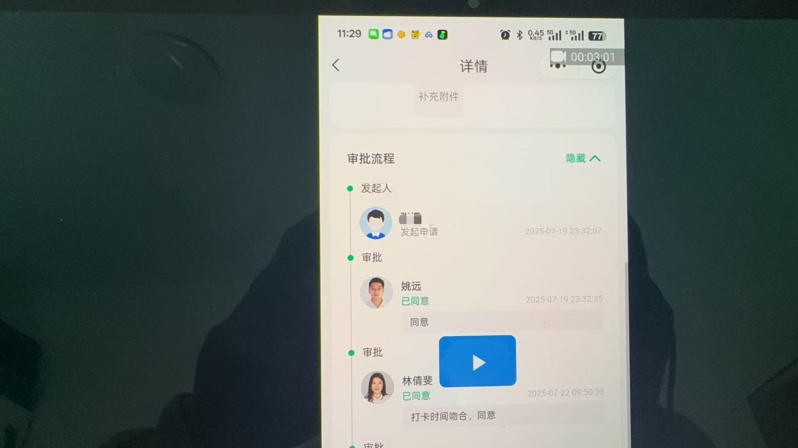

### basic concept
#### coordinates system of opengl
#### about texture
这个名称听起来没有主观人格，是一个傀儡附属品一样
因为这一对象是在渲染时，用于作用于物体表面的，类似皮肤，是被选取并采样后映射到对应图形坐标中

**pixel coordinate**
坐标来源?
定义zu:
像素定义:
应用场景:
相关坐标转化:
[wiki: pixel](https://zh.wikipedia.org/zh-hans/%E5%83%8F%E7%B4%A0)
[zhihu: 像素是什么](https://zhuanlan.zhihu.com/p/578202748)
[github: Overload 3d game engine](https://github.com/adriengivry/Overload/blob/develop/Sources/Overload/OvRendering/src/OvRendering/Resources/Texture.cpp)
[github maunal: texture coordinate and vertext coordinate](https://github.com/CodeWicky/Learning-OpenGL/blob/master/%E5%85%A5%E9%97%A8/6.%E7%BA%B9%E7%90%86.md)

**window coordinates**

**normalize device coordinates**
坐标系确定了，那么坐标来源?基于其它坐标系的坐标转化(gl中通过窗口系统坐标系的坐标转化(viewport))?
转化为标准化设备坐标的意义?相比其它坐标系参与什么运算时能够带来优势?
何为标准化? 无论实际显示空间的长宽比，以及大小，都被映射为相同的坐标范围(一个 横向向右为x正方向，纵向向右为正y正方向，值范围为-1到1)

变换矩阵和坐标系的关系？

**clip and eye coordinates**

**world coordinates**

**object coordinates**

##### texture mapping unit
> 纹理对象 是纹理的存储单元
> 纹理映射单元 似乎是一个对纹理对象处理的执行模块，与GPU硬件模块直接相关, 是一个由gpu硬件模块抽象发展而来的概念
> 在成功绑定纹理单元以后，那么纹理单元将会对绑定纹理执行后续的纹理处理
> GPU 是图形计算硬件的集合单元，而纹理映射单元则是集合中的模块，执行特定的图形计算任务
> 那么从这个概念上就引申出了一个问题: GPU 的软件抽象 与 硬件结构的对应关系是什么?
> 在理解 GPU / 图形计算相关的 抽象概念时，还是需要结合GPU硬件结构进行理解
##### shader and texture mapping unit and texture object
> a texture mapping unit is the operater of  texture object operation
> the mapping between texture object and texture unit by glBindTexture and glActiveTexture, 二者的组合指示了 着色器处理的纹理对象， 解释了为何glBindTexture中的类型枚举会称为target，因为完成了类型设置的这一步骤 + 默认指向的纹理单元，此时的状态就可以确定当前指向纹理单元中具体的对象
> shader access、 texture object by texture unit

##### 思考 void glBindTexture(GLenum target, GLuint texture), why is target not the texture type? what is texture target?
[OpenGL-Texture Targets and Types](https://zhuanlan.zhihu.com/p/81374766)
从target 实参的符号名称上看，就是一个类型枚举，似乎只是赋值给纹理对象一个纹理类型的属性，为何文档中解释为`目标target`?
理解关键: opengl 本身是一个状态机，单次的API调用，有可能仅仅是设置了一组完整属性的一部分，即 某个完整属性的`完全`配置 是需要一组调用的组合，再更换一个思路: 那么有时候仅仅需要进行一次调用设置，一个局部更新的操作，就相当于直接指定了 需要的全部属性(即其他属性为默认值，不进行更新设置).  **状态机架构程序的 交互 在 API call 层面的特色**

为什么存在纹理单元了，还需要每一个纹理单元拥有不同类型的纹理单元目标 这种结构?
> shader 中 设计的sampler是类型化的，不同类型的sampler 到当前活动的纹理单元 对应类型的target上进行采样，所以, 纹理单元通过内含不同类型的target，形成sampler与target 类型的mapping，实现 通过指定 具体采样类型 指示 shader 到具体target上采样对应纹理

多个纹理对象和纹理单元的绑定规则?
同一个纹理对象能否被多个纹理单元的不同类型target绑定？
同一个纹理对象能否被多个纹理党员的同类型target绑定?
多个纹理对象能否被同一个纹理单元的不同类型target绑定?
> 绑定操作不会报错，但并非合理规范，若该情况下，shader同时采样，会报错，为什么呢? 有可能是由于纹理单元是独立的，一个单元同时只能进行一个纹理操作，绑定两种纹理后同时操作属于未定义行为
多个纹理对象能否被不同纹理单元的不同类型target绑定? 即A1 => o1,  B2 => o2
> 可以，通过 A1 + B
多个纹理对象能否被不同纹理单元的同类型target绑定? 即 A1 => o1,  B1 => o2
多个纹理对象能否被同一个纹理单元的同一个类型target绑定? 即 A1 => o1 A1 => o2
> 表达不准确, 是同时绑定还是依次绑定，单个纹理单元每种类型的target只能映射一个纹理对象，连续映射同一个纹理单元类型的target，等于解绑后再绑的切换操作
绑定规范: 将每一个纹理单元理解为只能绑定映射一个纹理对象即可，若需要同时绑定两个不同类型的纹理对象，则切换纹理单元，每一个纹理单元对应一个纹理对象, 满足这个前提后 可以不用关注绑定的类型 

回到问题本身，对 glBindTexture 的误解关键在于 试图在单个API上理解某一个操作过程 以及参数含义，在这里 类型枚举的设定 隐含了 指定 纹理单元目标的 信息, 需要更多结合状态机背后操作的运作流程, 在这里 target 可以 补充为是type target/ 类型目标, 是归属于 纹理单元的 结构

##### 整理: 纹理对象，纹理单元，纹理单元目标，以及状态机背后这些概念的结构关系?
纹理对象 是纹理数据的存储单位 是data
纹理单元 是硬件层面 纹理数据的处理单位 是works，多个work是满足一个shader 同时处理多个纹理对象的前提条件
纹理单元目标 本质上只是纹理单元的与shader对接的类型接口 但实际上是一个历史产物

伪代码表示
```c++
struct gl_context{
    texture_unit unit_array[GPU_MAX];
    int current_unit_id;
} gl_singleton;
enum texture_type{
    GL_TEXTURE_2D,
    GL_TEXTURE_3D,
    ...
};
struct texture_unit {
  texture_type current_bind;  
};
//shader process => using input unit_id and texture id to reference unit entity to proccess texture by glsl
auto& cur_unit1 = unit_array[input_unit_id1];
auto& cur_unit2 = unit_array[input_unit_id2];
cur_unit1.process_texture(input_texture1);
cur_unit2.process_texture(input_texture2);
```

###### 加载纹理数据时，shader 会发生什么处理
1. shader 会读取数据，将每一个像素通道值从 [0,255] 的range 映射到 浮点 [0.0, 1.0]的范围

###### pixel 的pack unpack 内存对齐
1. pack unpack 具体是什么操作? 发生在什么流程? 为什么需要?
> 客户端和服务端进行纹理数据的传输 本质上只是 两端的字节流 的 send 和 read
> 表示同一批图像数据 两端存储和处理的格式不同，需要在传输前进行格式的封装转换，来获取端系统需要的目标格式以及优化传输效率，通过设置状态来指示 opengl 当前用户内存中数据情况，按规则进行读取处理
> 一个正常流程: cpu 端从文件中io并解码为存储在内存中的图像数据，再通过 opengl API，指示opengl 将目标数据从用户内存传到opengl内存，这个过程会对数据进行解包pack，相反同样通过opengl API 将opengl内存传输到用户内存中，解包
2. 什么数据单位进行内存对齐，并且是在哪一端？gpu 还是 cpu？
> 首先字节对齐 针对的是 一行的像素数据(one pixel row)
> `操作位置 unknow?`
3. 纹理数据与着色器
> 显而易见，纹理数据与着色器是分立管理的，着色器只是在运行时进行纹理数据访问
4. glPixelStorei
在进行 upload 时通常要预先设置 unpack 的对齐参数，全局有效 不针对纹理目标
在进行 read 时通常要预先设置 pack 的对齐参数，全局有效，不针对纹理目标
GL_UNSIGNED_BYTE 表示 每个像素pixel的一个通道值用 无类型的8bit变量存储
5. [How does GL_UNPACK_ALIGNMENT work?](https://forums.developer.nvidia.com/t/how-does-gl-unpack-alignment-work/39432/3)
6. [Pixel Transfer](https://www.khronos.org/opengl/wiki/Pixel_Transfer)
7. [OpenGL 数据处理(上)](https://www.jianshu.com/p/3c264f6bfbe1)
8. [OpenGL 数据处理(下)](https://www.jianshu.com/p/513afcb71c97)
#####　last part of load one texture is the glTexParameteri
1. set the minification and magnification filtering modes 
2. 接口名称差异
> glTexParameter<i/iv/f/fv>

###### 应用程序 与 shader交互
通过 预设的 shader uniform 变量名称来获取变量索引，通过变量索引进行值设定，传递给顶点着色器，
这也就意味着，
###### vertext shader 与 fragment shader交互

###### 纹理与shader的交互
纹理数据已经与纹理单元目标映射绑定
剩下将 顶点数据的处理 与 纹理形成映射
1. 纹理坐标/uv坐标

###### vertex attribute and vertex attribute point and vertex attribute array and vertex buff object
0. 硬件层面: 就是将cpu端的顶点相关数据发送到GPU端 抽象层面: 就是将数据发送到 shader中, 在c端设置发送，在shader端设置接收，绑定关联数据的过程
1. vertex -> vertex attribute data -> const vertex attribute -> vertex arrays -> disable/enable control -> shader attribute variable
2. vbo 如何绑定和解绑?
3. vbo 和 vbo target?
4. 一次性生成多个VBO如何使用?
5. VBO VAO EBO
6. 在c端可以获取到哪些 shader 端 attribute variable的信息? 
   1. 当shader attach to program后，通过glGetProgramiv获取到当前shader的attribute variable数量(0- <GL_ACTIVE_ATTRIBUTES – 1> )
   2. 同样在link出program之后，通过glGetActiveAttrib + attribute 索引的方式 获取对应attribute的具体信息(type:[GL_FLOAT/GL_FLAOT_VEC2/GL_FLAOT_VEC3/GL_FALOT_VEC4/GL_FLOAT_MAT2/GL_FLOAT_MAT3/GL_FLAOT_MAT4], )
   3. 通过 GL_MAX_VERTEX_ATTRIBS 宏定义获取 支持的attribute数量上限
7. shader端的vertex attribute 特点
   1. 是 read-only variable
   ```c++
    attribute vec4 a_pos;
    uniform vec4 u_v;
    void main()
    {
        //非法行为
    a_pos = u_v; <--- cannot assign to a_pos as it is read-only
    }
   ```
   2. 只能是 flaot, vec2 vec3 vec4, mat2 mat3 mat4类型， 不能声明为结构体或者数组
   3. 能否用uniform 替代?
8. attribute variable 良好的声明规范?
    1. attribute variable 存在数量上限，能够合并的数据最好合并
9.  当 shader 中声明的attribute 数量超过了上限GL_MAX_VERTEX_ATTRIB 会发生什么？
    1. shader 在link阶段失败报错
10. 传输方向总结
    1. cpu 到 gpu buff
    2. gpu buff 到 vertex shader
    3. cpu 到 vertex shader
    4. cpu 到 fragment shader
    5. vertex shader 到 fragment shader 
11. variable type and variable type modifier/qualifier
    1.  总而言之 后者是用于修饰 变量类型的，为定义的符号添加更具体的属性 如 storage or behavior
    2.  link: [Type Qualifier (GLSL)](https://www.khronos.org/opengl/wiki/Type_Qualifier_(GLSL)#Storage_qualifier)
    3. variable type:[]
    4. type modifier:[uniform, attribute, varying, const]

###### ref
[GPU软件抽象与硬件映射的理解](https://avoid.overfit.cn/post/b35a0f60f6244d83910da90d1275223c)
[zhihu:纹理映射](https://zhuanlan.zhihu.com/p/646544508?utm_id=0)
[wili:纹理映射单元](https://zh.wikipedia.org/wiki/%E7%B4%8B%E7%90%86%E6%98%A0%E5%B0%84%E5%96%AE%E5%85%83)
[Binding to texture units and texture targets](https://community.khronos.org/t/binding-to-texture-units-and-texture-targets/105810)

[openGL之API学习（一九九）纹理单元和纹理对象的关系](http://www.tudoupe.com/live/tdjc/202215377.html)
[术语：纹理目标、纹理单元、纹理图像单元等……帮助！](https://community.khronos.org/t/terminology-texture-target-vs-texture-unit-vs-texture-image-unit-etc-help/105441/4)
[Basic Texture Mapping](https://ogldev.org/www/tutorial16/tutorial16.html)
[OpenGL 纹理单元 纹理目标 理解 glActiveTexture glBindTexture](https://blog.csdn.net/qq_32095699/article/details/101678336)

##### gpu 与并发
**毫无疑问，gpu的并行计算基础一定是类似cpu软件端thread概念的执行实体，进行并行处理**

##### 什么是drawcall?
> 可以看作是从cpu端进行的图形接口调用到实际GPU端的实际指令执行的链路，涉及到用户态空间态转化
> 链路的长度 会影响绘制性能 
#### question
1. opengl 的实现原理
2. 理解opengl的状态机和上下文概念
    1. 为什么是状态机?
    2. 为什么强调上下文?
    > 采用C-S架构，将控制图形渲染的行为抽象/建模为状态机，核心就是封装资源，在满足目标性能的情况下让用户端进行最精简化的操作/交互
    而 每一个渲染执行流，或者是渲染目标 则将对应/对标/映射 着一份 gl 内部管理的资源单位，这个资源单位即 context (操作的归属单位)
3. opengl 的上下文 与线程 进场关系
4. opengl 不同上下文间的资源共享
5. opengl 的软硬件架构
6. opengl 上下文中的资源管理(shader, pragram等)
7. 如何将上一次的渲染结果作为下一次的渲染输入
8. 渲染结果是如何上屏的？
    > 通常来说屏幕的显示会有 gl 直接关联显示的缓冲区，那么 gl 渲染计算出来对应 buff 之后，要做的就是进行交换，即上屏，若不进行上屏，而是其他处理则是 离屏渲染

**GPU 存在的原因即 CPU 进行图形计算不行*

#### refe
[youtube: stanford 19. OpenGL ES](https://www.youtube.com/watch?v=_WcMe4Yj0NM&t=232s)
[超强总结！GPU 渲染管线和硬件架构](https://segmentfault.com/a/1190000042930791)
[very nice: 深入GPU硬件架构及运行机制, 结尾的文献链接也很多](https://www.cnblogs.com/timlly/p/11471507.html)
[Life of a triangle - NVIDIA's logical pipeline](https://developer.nvidia.com/content/life-triangle-nvidias-logical-pipeline)
[当我们谈优化时，我们谈些什么](https://zhuanlan.zhihu.com/p/68158277)
[GPU 帧缓冲内存：了解平铺](https://developer.samsung.com/galaxy-gamedev/resources/articles/gpu-framebuffer.html)
[GLSL版本的区别和对比](https://www.cnblogs.com/OctoptusLian/p/9909170.html)