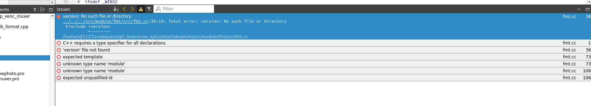
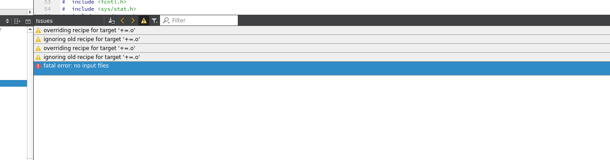
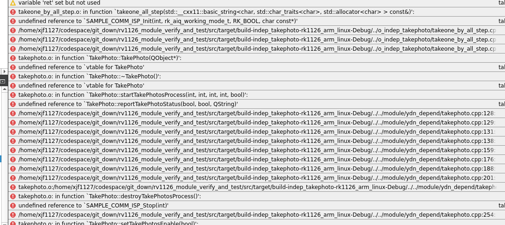

### 设置的c++标志无法生效

```bash
QMAKE_CXXFLAGS += -g
QMAKE_CXXFLAGS += -std=c++11

/home/xjf1127/codespace/toolchain/rk1126_sdk_vunknow/compiler2/gcc-arm-8.3-2019.03-x86_64-arm-linux-gnueabihf/arm-linux-gnueabihf/include/c++/8.3.0/bits/c++0x_warning.h:32: error: #error This file requires compiler and library support for the ISO C++ 2011 standard. This support must be enabled with the -std=c++11 or -std=gnu++11 compiler options.
In file included from /home/xjf1127/codespace/toolchain/rk1126_sdk_vunknow/compiler2/gcc-arm-8.3-2019.03-x86_64-arm-linux-gnueabihf/arm-linux-gnueabihf/include/c++/8.3.0/chrono:35,
                 from ../../../src/module/util/time_interval.inl:2,
                 from ../../../src/target/o_rkmedia_muxer_test/rkmedia_muxer_test.c:21:
/home/xjf1127/codespace/toolchain/rk1126_sdk_vunknow/compiler2/gcc-arm-8.3-2019.03-x86_64-arm-linux-gnueabihf/arm-linux-gnueabihf/include/c++/8.3.0/bits/c++0x_warning.h:32:2: error: #error This file requires compiler and library support for the ISO C++ 2011 standard. This support must be enabled with the -std=c++11 or -std=gnu++11 compiler options.
 #error This file requires compiler and library support \
  ^~~~~
```

**问题解决**
最终发现，源文件的文件后缀 `.c` or `.cpp`，会直接决定编译器是编译c还是c++，导致系统头文件搜索的差异，发生文件包含了，但很多宏和文件找不到，以及语法报错


### .pro 引入fmt的.cc文件报错

```bash
SOURCES += /home/xjf1127/codespace/git_down/new_aplus/test/takephoto/src/target/o_indep_venc_muxer/main.cpp \
         $$files(/home/xjf1127/codespace/git_down/new_aplus/test/takephoto/src/module/spdlog/src/*.cpp) \
         $$files(/home/xjf1127/codespace/git_down/new_aplus/test/takephoto/src/module/fmt/src/*.cc)

EXCLUDE += $$files(/home/xjf1127/codespace/git_down/new_aplus/test/takephoto/src/module/fmt/src/fmt.cc)
### 同样效果
SOURCES += /home/xjf1127/codespace/git_down/new_aplus/test/takephoto/src/target/o_indep_venc_muxer/main.cpp \
         $$files(/home/xjf1127/codespace/git_down/new_aplus/test/takephoto/src/module/spdlog/src/*.cpp) \
         $$files(/home/xjf1127/codespace/git_down/new_aplus/test/takephoto/src/module/fmt/src/*.cc)
```

正确的exclude方式? 使用 SOURCE -=
或者 https://doc.qt.io/qt-6/qmake-variable-reference.html#pwd 使用 TR_EXCLUDE

```bash
SOURCES += /home/xjf1127/codespace/git_down/new_aplus/test/takephoto/src/target/o_indep_venc_muxer/main.cpp \
         $$files(/home/xjf1127/codespace/git_down/new_aplus/test/takephoto/src/module/spdlog/src/*.cpp) \
         $$files(/home/xjf1127/codespace/git_down/new_aplus/test/takephoto/src/module/fmt/src/*.cc)
        # /home/xjf1127/codespace/git_down/new_aplus/test/takephoto/src/module/fmt/src/format.cc \
        # /home/xjf1127/codespace/git_down/new_aplus/test/takephoto/src/module/fmt/src/os.cc

SOURCES -= /home/xjf1127/codespace/git_down/new_aplus/test/takephoto/src/module/fmt/src/fmt.cc

# or 只能在source中明确指定了后，使用exlcude有效，使用files搜索的exluce去除无效
SOURCES += /home/xjf1127/codespace/git_down/new_aplus/test/takephoto/src/target/o_indep_venc_muxer/main.cpp \
         $$files(/home/xjf1127/codespace/git_down/new_aplus/test/takephoto/src/module/spdlog/src/*.cpp) \
        /home/xjf1127/codespace/git_down/new_aplus/test/takephoto/src/module/fmt/src/format.cc \
        /home/xjf1127/codespace/git_down/new_aplus/test/takephoto/src/module/fmt/src/os.cc
        #  $$files(/home/xjf1127/codespace/git_down/new_aplus/test/takephoto/src/module/fmt/src/*.cc)

TR_EXCLUDE += /home/xjf1127/codespace/git_down/new_aplus/test/takephoto/src/module/fmt/src/fmt.cc 

```




无问题

```bash
SOURCES += /home/xjf1127/codespace/git_down/new_aplus/test/takephoto/src/target/o_indep_venc_muxer/main.cpp \
         $$files(/home/xjf1127/codespace/git_down/new_aplus/test/takephoto/src/module/spdlog/src/*.cpp) \
        /home/xjf1127/codespace/git_down/new_aplus/test/takephoto/src/module/fmt/src/format.cc \
        /home/xjf1127/codespace/git_down/new_aplus/test/takephoto/src/module/fmt/src/os.cc
```

看起来是 SOURCE 后的 EXCLUDE 未生效

### 引入源文件出错，报异常的 += .o

```bash
SOURCES += /home/xjf1127/codespace/git_down/new_aplus/test/takephoto/src/target/o_indep_venc_muxer/main.cpp \
        += $$files(/home/xjf1127/codespace/git_down/new_aplus/test/takephoto/src/module/spdlog/src/*.cpp) \
        += /home/xjf1127/codespace/git_down/new_aplus/test/takephoto/src/module/fmt/src/format.cc \
        += /home/xjf1127/codespace/git_down/new_aplus/test/takephoto/src/module/fmt/src/os.cc
```


问题解决，一个变量不能使用 +=  连续相加，属于qmake语法错误
```bash
SOURCES += /home/xjf1127/codespace/git_down/new_aplus/test/takephoto/src/target/o_indep_venc_muxer/main.cpp \
         $$files(/home/xjf1127/codespace/git_down/new_aplus/test/takephoto/src/module/spdlog/src/*.cpp) \
        /home/xjf1127/codespace/git_down/new_aplus/test/takephoto/src/module/fmt/src/format.cc \
        /home/xjf1127/codespace/git_down/new_aplus/test/takephoto/src/module/fmt/src/os.cc
```
## ref

- [offical: qmake variable](https://doc.qt.io/qt-6/qmake-variable-reference.html#pwd)

### 已经在.pro中引入文件，但在链接时还是找不到



已确定，与自定义qobject相关的类的头文件，需要加入到qmake heads的变量中


### 明明已经在sources中加入了绝对路径的sample_common_spi.c，但链接时还是报错里面符号找不到，只有当把文件赋值到.pro当前路径，居然就能找到, 根据
qtcreator的编译信息中明明已经编译生成了sample_common_spi.o，为什么还会报错符号找不到

```bash

LIBS += $$MODULE_ROOT_PATH/rkmedia/src/rkmedia/src/rkaudio/libthird_media.so

HEADERS  += \
        $$TARGET_ROOT_PATH/run_case.h \
        $$TARGET_ROOT_PATH/cmd_entry.h \
        $$MODULE_ROOT_PATH/rkmedia/common/sample_common.h \
        $$MODULE_ROOT_PATH/ydn_depend/takephoto.h 

SOURCES += \
    $$MODULE_ROOT_PATH/rkmedia/common/sample_common_isp.c \
    $$TARGET_ROOT_PATH/main.cpp \
    $$TARGET_ROOT_PATH/takeone_by_all_step.cpp \
    $$MODULE_ROOT_PATH/ydn_depend/public.c \
    $$MODULE_ROOT_PATH/ydn_depend/takephoto.cpp \
    $$MODULE_ROOT_PATH/fmt/src/format.cc \
    $$MODULE_ROOT_PATH/fmt/src/os.cc 

INCLUDEPATH += $$TARGET_ROOT_PATH \
    $$MODULE_ROOT_PATH/rkmedia/common \
    $$MODULE_ROOT_PATH/cli11/inc \
    $$MODULE_ROOT_PATH/ydn_depend \
    $$MODULE_ROOT_PATH/jsonhpp \
    $$MODULE_ROOT_PATH/toml11 \
    $$MODULE_ROOT_PATH/fmt/inc \
    $$MODULE_ROOT_PATH/fmt/inc/fmt \
    $$MODULE_ROOT_PATH/util
    
```

```bash
15:57:38: Running steps for project indep_takephoto...
15:57:38: Starting: "/home/xjf1127/codespace/toolchain/rk1126_sdk_vunknow/qt5/qt5base-5.14.2/bin/qmake" /home/xjf1127/codespace/git_down/rv1126_module_verify_and_test/src/target/o_indep_takephoto/indep_takephoto.pro -spec devices/linux-buildroot-g++ CONFIG+=debug CONFIG+=qml_debug
Info: creating stash file /home/xjf1127/codespace/git_down/rv1126_module_verify_and_test/src/target/build-indep_takephoto-rk1126_arm_linux-Debug/.qmake.stash
15:57:39: The process "/home/xjf1127/codespace/toolchain/rk1126_sdk_vunknow/qt5/qt5base-5.14.2/bin/qmake" exited normally.
15:57:39: Starting: "/usr/bin/make" -f /home/xjf1127/codespace/git_down/rv1126_module_verify_and_test/src/target/build-indep_takephoto-rk1126_arm_linux-Debug/Makefile qmake_all
make: Nothing to be done for 'qmake_all'.
15:57:39: The process "/usr/bin/make" exited normally.
15:57:39: Starting: "/usr/bin/make" -j16
/home/xjf1127/codespace/toolchain/rk1126_sdk_vunknow/compiler2/gcc-arm-8.3-2019.03-x86_64-arm-linux-gnueabihf/bin/arm-linux-gnueabihf-gcc -c -pipe -D_LARGEFILE_SOURCE -D_LARGEFILE64_SOURCE -D_FILE_OFFSET_BITS=64 -Os -DUSE_UPDATEENGINE=ON -DSUCCESSFUL_BOOT=ON -mfpu=neon --sysroot=/home/xjf1127/codespace/toolchain/rk1126_sdk_vunknow/buildroot/host/arm-buildroot-linux-gnueabihf/sysroot -w -Wall -Wextra -D_REENTRANT -fPIC -DQT_DEPRECATED_WARNINGS -DRKAIQ -DSPDLOG_COMPILED_LIB -DQT_QML_DEBUG -DQT_GUI_LIB -DQT_NETWORK_LIB -DQT_CORE_LIB -I../o_indep_takephoto -I. -I/home/xjf1127/codespace/toolchain/rk1126_sdk_vunknow/compiler2/gcc-arm-8.3-2019.03-x86_64-arm-linux-gnueabihf/arm-linux-gnueabihf/libc/usr/include -I/home/xjf1127/codespace/toolchain/rk1126_sdk_vunknow/compiler2/gcc-arm-8.3-2019.03-x86_64-arm-linux-gnueabihf/arm-linux-gnueabihf/include/c++/8.3.0 -I/home/xjf1127/codespace/toolchain/rk1126_sdk_vunknow/compiler2/gcc-arm-8.3-2019.03-x86_64-arm-linux-gnueabihf/arm-linux-gnueabihf/include/c++/8.3.0/arm-linux-gnueabihf -I/home/xjf1127/codespace/toolchain/rk1126_sdk_vunknow/package/rockx/sdk/rockx-rk1806-Linux/include -I/home/xjf1127/codespace/toolchain/rk1126_sdk_vunknow/package/rkmedia/include/rkmedia -I/home/xjf1127/codespace/toolchain/rk1126_sdk_vunknow/package/rkmedia/examples/common -I/home/xjf1127/codespace/toolchain/rk1126_sdk_vunknow/package/camera_engine_rkaiq-1.0/include/uAPI -I/home/xjf1127/codespace/toolchain/rk1126_sdk_vunknow/package/camera_engine_rkaiq-1.0/include/xcore -I/home/xjf1127/codespace/toolchain/rk1126_sdk_vunknow/package/camera_engine_rkaiq-1.0/include/common -I/home/xjf1127/codespace/toolchain/rk1126_sdk_vunknow/package/camera_engine_rkaiq-1.0/include/algos -I/home/xjf1127/codespace/toolchain/rk1126_sdk_vunknow/package/camera_engine_rkaiq-1.0/include/ipc_server -I/home/xjf1127/codespace/toolchain/rk1126_sdk_vunknow/package/camera_engine_rkaiq-1.0/include/iq_parser -I../o_indep_takephoto -I../../module/rkmedia/common -I../../module/cli11/inc -I../../module/ydn_depend -I../../module/jsonhpp -I../../module/toml11 -I../../module/fmt/inc -I../../module/fmt/inc/fmt -I../../module/util -I/home/xjf1127/codespace/toolchain/rk1126_sdk_vunknow/qt5/qt5base-5.14.2/include/qt5 -I/home/xjf1127/codespace/toolchain/rk1126_sdk_vunknow/qt5/qt5base-5.14.2/include/qt5/QtGui -I/home/xjf1127/codespace/toolchain/rk1126_sdk_vunknow/qt5/qt5base-5.14.2/include/qt5/QtNetwork -I/home/xjf1127/codespace/toolchain/rk1126_sdk_vunknow/qt5/qt5base-5.14.2/include/qt5/QtCore -I. -I/home/xjf1127/codespace/toolchain/rk1126_sdk_vunknow/qt5/qt5base-5.14.2/mkspecs/devices/linux-buildroot-g++ -o sample_common_isp.o ../../module/rkmedia/common/sample_common_isp.c
/home/xjf1127/codespace/toolchain/rk1126_sdk_vunknow/compiler2/gcc-arm-8.3-2019.03-x86_64-arm-linux-gnueabihf/bin/arm-linux-gnueabihf-g++ -c -pipe -D_LARGEFILE_SOURCE -D_LARGEFILE64_SOURCE -D_FILE_OFFSET_BITS=64 -Os -DUSE_UPDATEENGINE=ON -DSUCCESSFUL_BOOT=ON --sysroot=/home/xjf1127/codespace/toolchain/rk1126_sdk_vunknow/buildroot/host/arm-buildroot-linux-gnueabihf/sysroot -g -std=c++14 -std=gnu++1y -Wall -Wextra -D_REENTRANT -fPIC -DQT_DEPRECATED_WARNINGS -DRKAIQ -DSPDLOG_COMPILED_LIB -DQT_QML_DEBUG -DQT_GUI_LIB -DQT_NETWORK_LIB -DQT_CORE_LIB -I../o_indep_takephoto -I. -I/home/xjf1127/codespace/toolchain/rk1126_sdk_vunknow/compiler2/gcc-arm-8.3-2019.03-x86_64-arm-linux-gnueabihf/arm-linux-gnueabihf/libc/usr/include -I/home/xjf1127/codespace/toolchain/rk1126_sdk_vunknow/compiler2/gcc-arm-8.3-2019.03-x86_64-arm-linux-gnueabihf/arm-linux-gnueabihf/include/c++/8.3.0 -I/home/xjf1127/codespace/toolchain/rk1126_sdk_vunknow/compiler2/gcc-arm-8.3-2019.03-x86_64-arm-linux-gnueabihf/arm-linux-gnueabihf/include/c++/8.3.0/arm-linux-gnueabihf -I/home/xjf1127/codespace/toolchain/rk1126_sdk_vunknow/package/rockx/sdk/rockx-rk1806-Linux/include -I/home/xjf1127/codespace/toolchain/rk1126_sdk_vunknow/package/rkmedia/include/rkmedia -I/home/xjf1127/codespace/toolchain/rk1126_sdk_vunknow/package/rkmedia/examples/common -I/home/xjf1127/codespace/toolchain/rk1126_sdk_vunknow/package/camera_engine_rkaiq-1.0/include/uAPI -I/home/xjf1127/codespace/toolchain/rk1126_sdk_vunknow/package/camera_engine_rkaiq-1.0/include/xcore -I/home/xjf1127/codespace/toolchain/rk1126_sdk_vunknow/package/camera_engine_rkaiq-1.0/include/common -I/home/xjf1127/codespace/toolchain/rk1126_sdk_vunknow/package/camera_engine_rkaiq-1.0/include/algos -I/home/xjf1127/codespace/toolchain/rk1126_sdk_vunknow/package/camera_engine_rkaiq-1.0/include/ipc_server -I/home/xjf1127/codespace/toolchain/rk1126_sdk_vunknow/package/camera_engine_rkaiq-1.0/include/iq_parser -I../o_indep_takephoto -I../../module/rkmedia/common -I../../module/cli11/inc -I../../module/ydn_depend -I../../module/jsonhpp -I../../module/toml11 -I../../module/fmt/inc -I../../module/fmt/inc/fmt -I../../module/util -I/home/xjf1127/codespace/toolchain/rk1126_sdk_vunknow/qt5/qt5base-5.14.2/include/qt5 -I/home/xjf1127/codespace/toolchain/rk1126_sdk_vunknow/qt5/qt5base-5.14.2/include/qt5/QtGui -I/home/xjf1127/codespace/toolchain/rk1126_sdk_vunknow/qt5/qt5base-5.14.2/include/qt5/QtNetwork -I/home/xjf1127/codespace/toolchain/rk1126_sdk_vunknow/qt5/qt5base-5.14.2/include/qt5/QtCore -I. -I/home/xjf1127/codespace/toolchain/rk1126_sdk_vunknow/qt5/qt5base-5.14.2/mkspecs/devices/linux-buildroot-g++ -o main.o ../o_indep_takephoto/main.cpp
/home/xjf1127/codespace/toolchain/rk1126_sdk_vunknow/compiler2/gcc-arm-8.3-2019.03-x86_64-arm-linux-gnueabihf/bin/arm-linux-gnueabihf-g++ -c -pipe -D_LARGEFILE_SOURCE -D_LARGEFILE64_SOURCE -D_FILE_OFFSET_BITS=64 -Os -DUSE_UPDATEENGINE=ON -DSUCCESSFUL_BOOT=ON --sysroot=/home/xjf1127/codespace/toolchain/rk1126_sdk_vunknow/buildroot/host/arm-buildroot-linux-gnueabihf/sysroot -g -std=c++14 -std=gnu++1y -Wall -Wextra -D_REENTRANT -fPIC -DQT_DEPRECATED_WARNINGS -DRKAIQ -DSPDLOG_COMPILED_LIB -DQT_QML_DEBUG -DQT_GUI_LIB -DQT_NETWORK_LIB -DQT_CORE_LIB -I../o_indep_takephoto -I. -I/home/xjf1127/codespace/toolchain/rk1126_sdk_vunknow/compiler2/gcc-arm-8.3-2019.03-x86_64-arm-linux-gnueabihf/arm-linux-gnueabihf/libc/usr/include -I/home/xjf1127/codespace/toolchain/rk1126_sdk_vunknow/compiler2/gcc-arm-8.3-2019.03-x86_64-arm-linux-gnueabihf/arm-linux-gnueabihf/include/c++/8.3.0 -I/home/xjf1127/codespace/toolchain/rk1126_sdk_vunknow/compiler2/gcc-arm-8.3-2019.03-x86_64-arm-linux-gnueabihf/arm-linux-gnueabihf/include/c++/8.3.0/arm-linux-gnueabihf -I/home/xjf1127/codespace/toolchain/rk1126_sdk_vunknow/package/rockx/sdk/rockx-rk1806-Linux/include -I/home/xjf1127/codespace/toolchain/rk1126_sdk_vunknow/package/rkmedia/include/rkmedia -I/home/xjf1127/codespace/toolchain/rk1126_sdk_vunknow/package/rkmedia/examples/common -I/home/xjf1127/codespace/toolchain/rk1126_sdk_vunknow/package/camera_engine_rkaiq-1.0/include/uAPI -I/home/xjf1127/codespace/toolchain/rk1126_sdk_vunknow/package/camera_engine_rkaiq-1.0/include/xcore -I/home/xjf1127/codespace/toolchain/rk1126_sdk_vunknow/package/camera_engine_rkaiq-1.0/include/common -I/home/xjf1127/codespace/toolchain/rk1126_sdk_vunknow/package/camera_engine_rkaiq-1.0/include/algos -I/home/xjf1127/codespace/toolchain/rk1126_sdk_vunknow/package/camera_engine_rkaiq-1.0/include/ipc_server -I/home/xjf1127/codespace/toolchain/rk1126_sdk_vunknow/package/camera_engine_rkaiq-1.0/include/iq_parser -I../o_indep_takephoto -I../../module/rkmedia/common -I../../module/cli11/inc -I../../module/ydn_depend -I../../module/jsonhpp -I../../module/toml11 -I../../module/fmt/inc -I../../module/fmt/inc/fmt -I../../module/util -I/home/xjf1127/codespace/toolchain/rk1126_sdk_vunknow/qt5/qt5base-5.14.2/include/qt5 -I/home/xjf1127/codespace/toolchain/rk1126_sdk_vunknow/qt5/qt5base-5.14.2/include/qt5/QtGui -I/home/xjf1127/codespace/toolchain/rk1126_sdk_vunknow/qt5/qt5base-5.14.2/include/qt5/QtNetwork -I/home/xjf1127/codespace/toolchain/rk1126_sdk_vunknow/qt5/qt5base-5.14.2/include/qt5/QtCore -I. -I/home/xjf1127/codespace/toolchain/rk1126_sdk_vunknow/qt5/qt5base-5.14.2/mkspecs/devices/linux-buildroot-g++ -o takeone_by_all_step.o ../o_indep_takephoto/takeone_by_all_step.cpp
/home/xjf1127/codespace/toolchain/rk1126_sdk_vunknow/compiler2/gcc-arm-8.3-2019.03-x86_64-arm-linux-gnueabihf/bin/arm-linux-gnueabihf-gcc -c -pipe -D_LARGEFILE_SOURCE -D_LARGEFILE64_SOURCE -D_FILE_OFFSET_BITS=64 -Os -DUSE_UPDATEENGINE=ON -DSUCCESSFUL_BOOT=ON -mfpu=neon --sysroot=/home/xjf1127/codespace/toolchain/rk1126_sdk_vunknow/buildroot/host/arm-buildroot-linux-gnueabihf/sysroot -w -Wall -Wextra -D_REENTRANT -fPIC -DQT_DEPRECATED_WARNINGS -DRKAIQ -DSPDLOG_COMPILED_LIB -DQT_QML_DEBUG -DQT_GUI_LIB -DQT_NETWORK_LIB -DQT_CORE_LIB -I../o_indep_takephoto -I. -I/home/xjf1127/codespace/toolchain/rk1126_sdk_vunknow/compiler2/gcc-arm-8.3-2019.03-x86_64-arm-linux-gnueabihf/arm-linux-gnueabihf/libc/usr/include -I/home/xjf1127/codespace/toolchain/rk1126_sdk_vunknow/compiler2/gcc-arm-8.3-2019.03-x86_64-arm-linux-gnueabihf/arm-linux-gnueabihf/include/c++/8.3.0 -I/home/xjf1127/codespace/toolchain/rk1126_sdk_vunknow/compiler2/gcc-arm-8.3-2019.03-x86_64-arm-linux-gnueabihf/arm-linux-gnueabihf/include/c++/8.3.0/arm-linux-gnueabihf -I/home/xjf1127/codespace/toolchain/rk1126_sdk_vunknow/package/rockx/sdk/rockx-rk1806-Linux/include -I/home/xjf1127/codespace/toolchain/rk1126_sdk_vunknow/package/rkmedia/include/rkmedia -I/home/xjf1127/codespace/toolchain/rk1126_sdk_vunknow/package/rkmedia/examples/common -I/home/xjf1127/codespace/toolchain/rk1126_sdk_vunknow/package/camera_engine_rkaiq-1.0/include/uAPI -I/home/xjf1127/codespace/toolchain/rk1126_sdk_vunknow/package/camera_engine_rkaiq-1.0/include/xcore -I/home/xjf1127/codespace/toolchain/rk1126_sdk_vunknow/package/camera_engine_rkaiq-1.0/include/common -I/home/xjf1127/codespace/toolchain/rk1126_sdk_vunknow/package/camera_engine_rkaiq-1.0/include/algos -I/home/xjf1127/codespace/toolchain/rk1126_sdk_vunknow/package/camera_engine_rkaiq-1.0/include/ipc_server -I/home/xjf1127/codespace/toolchain/rk1126_sdk_vunknow/package/camera_engine_rkaiq-1.0/include/iq_parser -I../o_indep_takephoto -I../../module/rkmedia/common -I../../module/cli11/inc -I../../module/ydn_depend -I../../module/jsonhpp -I../../module/toml11 -I../../module/fmt/inc -I../../module/fmt/inc/fmt -I../../module/util -I/home/xjf1127/codespace/toolchain/rk1126_sdk_vunknow/qt5/qt5base-5.14.2/include/qt5 -I/home/xjf1127/codespace/toolchain/rk1126_sdk_vunknow/qt5/qt5base-5.14.2/include/qt5/QtGui -I/home/xjf1127/codespace/toolchain/rk1126_sdk_vunknow/qt5/qt5base-5.14.2/include/qt5/QtNetwork -I/home/xjf1127/codespace/toolchain/rk1126_sdk_vunknow/qt5/qt5base-5.14.2/include/qt5/QtCore -I. -I/home/xjf1127/codespace/toolchain/rk1126_sdk_vunknow/qt5/qt5base-5.14.2/mkspecs/devices/linux-buildroot-g++ -o public.o ../../module/ydn_depend/public.c
/home/xjf1127/codespace/toolchain/rk1126_sdk_vunknow/compiler2/gcc-arm-8.3-2019.03-x86_64-arm-linux-gnueabihf/bin/arm-linux-gnueabihf-g++ -c -pipe -D_LARGEFILE_SOURCE -D_LARGEFILE64_SOURCE -D_FILE_OFFSET_BITS=64 -Os -DUSE_UPDATEENGINE=ON -DSUCCESSFUL_BOOT=ON --sysroot=/home/xjf1127/codespace/toolchain/rk1126_sdk_vunknow/buildroot/host/arm-buildroot-linux-gnueabihf/sysroot -g -std=c++14 -std=gnu++1y -Wall -Wextra -D_REENTRANT -fPIC -DQT_DEPRECATED_WARNINGS -DRKAIQ -DSPDLOG_COMPILED_LIB -DQT_QML_DEBUG -DQT_GUI_LIB -DQT_NETWORK_LIB -DQT_CORE_LIB -I../o_indep_takephoto -I. -I/home/xjf1127/codespace/toolchain/rk1126_sdk_vunknow/compiler2/gcc-arm-8.3-2019.03-x86_64-arm-linux-gnueabihf/arm-linux-gnueabihf/libc/usr/include -I/home/xjf1127/codespace/toolchain/rk1126_sdk_vunknow/compiler2/gcc-arm-8.3-2019.03-x86_64-arm-linux-gnueabihf/arm-linux-gnueabihf/include/c++/8.3.0 -I/home/xjf1127/codespace/toolchain/rk1126_sdk_vunknow/compiler2/gcc-arm-8.3-2019.03-x86_64-arm-linux-gnueabihf/arm-linux-gnueabihf/include/c++/8.3.0/arm-linux-gnueabihf -I/home/xjf1127/codespace/toolchain/rk1126_sdk_vunknow/package/rockx/sdk/rockx-rk1806-Linux/include -I/home/xjf1127/codespace/toolchain/rk1126_sdk_vunknow/package/rkmedia/include/rkmedia -I/home/xjf1127/codespace/toolchain/rk1126_sdk_vunknow/package/rkmedia/examples/common -I/home/xjf1127/codespace/toolchain/rk1126_sdk_vunknow/package/camera_engine_rkaiq-1.0/include/uAPI -I/home/xjf1127/codespace/toolchain/rk1126_sdk_vunknow/package/camera_engine_rkaiq-1.0/include/xcore -I/home/xjf1127/codespace/toolchain/rk1126_sdk_vunknow/package/camera_engine_rkaiq-1.0/include/common -I/home/xjf1127/codespace/toolchain/rk1126_sdk_vunknow/package/camera_engine_rkaiq-1.0/include/algos -I/home/xjf1127/codespace/toolchain/rk1126_sdk_vunknow/package/camera_engine_rkaiq-1.0/include/ipc_server -I/home/xjf1127/codespace/toolchain/rk1126_sdk_vunknow/package/camera_engine_rkaiq-1.0/include/iq_parser -I../o_indep_takephoto -I../../module/rkmedia/common -I../../module/cli11/inc -I../../module/ydn_depend -I../../module/jsonhpp -I../../module/toml11 -I../../module/fmt/inc -I../../module/fmt/inc/fmt -I../../module/util -I/home/xjf1127/codespace/toolchain/rk1126_sdk_vunknow/qt5/qt5base-5.14.2/include/qt5 -I/home/xjf1127/codespace/toolchain/rk1126_sdk_vunknow/qt5/qt5base-5.14.2/include/qt5/QtGui -I/home/xjf1127/codespace/toolchain/rk1126_sdk_vunknow/qt5/qt5base-5.14.2/include/qt5/QtNetwork -I/home/xjf1127/codespace/toolchain/rk1126_sdk_vunknow/qt5/qt5base-5.14.2/include/qt5/QtCore -I. -I/home/xjf1127/codespace/toolchain/rk1126_sdk_vunknow/qt5/qt5base-5.14.2/mkspecs/devices/linux-buildroot-g++ -o takephoto.o ../../module/ydn_depend/takephoto.cpp
/home/xjf1127/codespace/toolchain/rk1126_sdk_vunknow/compiler2/gcc-arm-8.3-2019.03-x86_64-arm-linux-gnueabihf/bin/arm-linux-gnueabihf-g++ -c -pipe -D_LARGEFILE_SOURCE -D_LARGEFILE64_SOURCE -D_FILE_OFFSET_BITS=64 -Os -DUSE_UPDATEENGINE=ON -DSUCCESSFUL_BOOT=ON --sysroot=/home/xjf1127/codespace/toolchain/rk1126_sdk_vunknow/buildroot/host/arm-buildroot-linux-gnueabihf/sysroot -g -std=c++14 -std=gnu++1y -Wall -Wextra -D_REENTRANT -fPIC -DQT_DEPRECATED_WARNINGS -DRKAIQ -DSPDLOG_COMPILED_LIB -DQT_QML_DEBUG -DQT_GUI_LIB -DQT_NETWORK_LIB -DQT_CORE_LIB -I../o_indep_takephoto -I. -I/home/xjf1127/codespace/toolchain/rk1126_sdk_vunknow/compiler2/gcc-arm-8.3-2019.03-x86_64-arm-linux-gnueabihf/arm-linux-gnueabihf/libc/usr/include -I/home/xjf1127/codespace/toolchain/rk1126_sdk_vunknow/compiler2/gcc-arm-8.3-2019.03-x86_64-arm-linux-gnueabihf/arm-linux-gnueabihf/include/c++/8.3.0 -I/home/xjf1127/codespace/toolchain/rk1126_sdk_vunknow/compiler2/gcc-arm-8.3-2019.03-x86_64-arm-linux-gnueabihf/arm-linux-gnueabihf/include/c++/8.3.0/arm-linux-gnueabihf -I/home/xjf1127/codespace/toolchain/rk1126_sdk_vunknow/package/rockx/sdk/rockx-rk1806-Linux/include -I/home/xjf1127/codespace/toolchain/rk1126_sdk_vunknow/package/rkmedia/include/rkmedia -I/home/xjf1127/codespace/toolchain/rk1126_sdk_vunknow/package/rkmedia/examples/common -I/home/xjf1127/codespace/toolchain/rk1126_sdk_vunknow/package/camera_engine_rkaiq-1.0/include/uAPI -I/home/xjf1127/codespace/toolchain/rk1126_sdk_vunknow/package/camera_engine_rkaiq-1.0/include/xcore -I/home/xjf1127/codespace/toolchain/rk1126_sdk_vunknow/package/camera_engine_rkaiq-1.0/include/common -I/home/xjf1127/codespace/toolchain/rk1126_sdk_vunknow/package/camera_engine_rkaiq-1.0/include/algos -I/home/xjf1127/codespace/toolchain/rk1126_sdk_vunknow/package/camera_engine_rkaiq-1.0/include/ipc_server -I/home/xjf1127/codespace/toolchain/rk1126_sdk_vunknow/package/camera_engine_rkaiq-1.0/include/iq_parser -I../o_indep_takephoto -I../../module/rkmedia/common -I../../module/cli11/inc -I../../module/ydn_depend -I../../module/jsonhpp -I../../module/toml11 -I../../module/fmt/inc -I../../module/fmt/inc/fmt -I../../module/util -I/home/xjf1127/codespace/toolchain/rk1126_sdk_vunknow/qt5/qt5base-5.14.2/include/qt5 -I/home/xjf1127/codespace/toolchain/rk1126_sdk_vunknow/qt5/qt5base-5.14.2/include/qt5/QtGui -I/home/xjf1127/codespace/toolchain/rk1126_sdk_vunknow/qt5/qt5base-5.14.2/include/qt5/QtNetwork -I/home/xjf1127/codespace/toolchain/rk1126_sdk_vunknow/qt5/qt5base-5.14.2/include/qt5/QtCore -I. -I/home/xjf1127/codespace/toolchain/rk1126_sdk_vunknow/qt5/qt5base-5.14.2/mkspecs/devices/linux-buildroot-g++ -o format.o ../../module/fmt/src/format.cc
/home/xjf1127/codespace/toolchain/rk1126_sdk_vunknow/compiler2/gcc-arm-8.3-2019.03-x86_64-arm-linux-gnueabihf/bin/arm-linux-gnueabihf-g++ -c -pipe -D_LARGEFILE_SOURCE -D_LARGEFILE64_SOURCE -D_FILE_OFFSET_BITS=64 -Os -DUSE_UPDATEENGINE=ON -DSUCCESSFUL_BOOT=ON --sysroot=/home/xjf1127/codespace/toolchain/rk1126_sdk_vunknow/buildroot/host/arm-buildroot-linux-gnueabihf/sysroot -g -std=c++14 -std=gnu++1y -Wall -Wextra -D_REENTRANT -fPIC -DQT_DEPRECATED_WARNINGS -DRKAIQ -DSPDLOG_COMPILED_LIB -DQT_QML_DEBUG -DQT_GUI_LIB -DQT_NETWORK_LIB -DQT_CORE_LIB -I../o_indep_takephoto -I. -I/home/xjf1127/codespace/toolchain/rk1126_sdk_vunknow/compiler2/gcc-arm-8.3-2019.03-x86_64-arm-linux-gnueabihf/arm-linux-gnueabihf/libc/usr/include -I/home/xjf1127/codespace/toolchain/rk1126_sdk_vunknow/compiler2/gcc-arm-8.3-2019.03-x86_64-arm-linux-gnueabihf/arm-linux-gnueabihf/include/c++/8.3.0 -I/home/xjf1127/codespace/toolchain/rk1126_sdk_vunknow/compiler2/gcc-arm-8.3-2019.03-x86_64-arm-linux-gnueabihf/arm-linux-gnueabihf/include/c++/8.3.0/arm-linux-gnueabihf -I/home/xjf1127/codespace/toolchain/rk1126_sdk_vunknow/package/rockx/sdk/rockx-rk1806-Linux/include -I/home/xjf1127/codespace/toolchain/rk1126_sdk_vunknow/package/rkmedia/include/rkmedia -I/home/xjf1127/codespace/toolchain/rk1126_sdk_vunknow/package/rkmedia/examples/common -I/home/xjf1127/codespace/toolchain/rk1126_sdk_vunknow/package/camera_engine_rkaiq-1.0/include/uAPI -I/home/xjf1127/codespace/toolchain/rk1126_sdk_vunknow/package/camera_engine_rkaiq-1.0/include/xcore -I/home/xjf1127/codespace/toolchain/rk1126_sdk_vunknow/package/camera_engine_rkaiq-1.0/include/common -I/home/xjf1127/codespace/toolchain/rk1126_sdk_vunknow/package/camera_engine_rkaiq-1.0/include/algos -I/home/xjf1127/codespace/toolchain/rk1126_sdk_vunknow/package/camera_engine_rkaiq-1.0/include/ipc_server -I/home/xjf1127/codespace/toolchain/rk1126_sdk_vunknow/package/camera_engine_rkaiq-1.0/include/iq_parser -I../o_indep_takephoto -I../../module/rkmedia/common -I../../module/cli11/inc -I../../module/ydn_depend -I../../module/jsonhpp -I../../module/toml11 -I../../module/fmt/inc -I../../module/fmt/inc/fmt -I../../module/util -I/home/xjf1127/codespace/toolchain/rk1126_sdk_vunknow/qt5/qt5base-5.14.2/include/qt5 -I/home/xjf1127/codespace/toolchain/rk1126_sdk_vunknow/qt5/qt5base-5.14.2/include/qt5/QtGui -I/home/xjf1127/codespace/toolchain/rk1126_sdk_vunknow/qt5/qt5base-5.14.2/include/qt5/QtNetwork -I/home/xjf1127/codespace/toolchain/rk1126_sdk_vunknow/qt5/qt5base-5.14.2/include/qt5/QtCore -I. -I/home/xjf1127/codespace/toolchain/rk1126_sdk_vunknow/qt5/qt5base-5.14.2/mkspecs/devices/linux-buildroot-g++ -o os.o ../../module/fmt/src/os.cc
/home/xjf1127/codespace/toolchain/rk1126_sdk_vunknow/compiler2/gcc-arm-8.3-2019.03-x86_64-arm-linux-gnueabihf/bin/arm-linux-gnueabihf-g++ -pipe -D_LARGEFILE_SOURCE -D_LARGEFILE64_SOURCE -D_FILE_OFFSET_BITS=64 -Os -DUSE_UPDATEENGINE=ON -DSUCCESSFUL_BOOT=ON --sysroot=/home/xjf1127/codespace/toolchain/rk1126_sdk_vunknow/buildroot/host/arm-buildroot-linux-gnueabihf/sysroot -g -std=c++14 -std=gnu++1y -Wall -Wextra -dM -E -o moc_predefs.h /home/xjf1127/codespace/toolchain/rk1126_sdk_vunknow/qt5/qt5base-5.14.2/mkspecs/features/data/dummy.cpp
/home/xjf1127/codespace/toolchain/rk1126_sdk_vunknow/qt5/qt5base-5.14.2/bin/moc -DQT_DEPRECATED_WARNINGS -DRKAIQ -DSPDLOG_COMPILED_LIB -DQT_QML_DEBUG -DQT_GUI_LIB -DQT_NETWORK_LIB -DQT_CORE_LIB --include /home/xjf1127/codespace/git_down/rv1126_module_verify_and_test/src/target/build-indep_takephoto-rk1126_arm_linux-Debug/moc_predefs.h -I/home/xjf1127/codespace/toolchain/rk1126_sdk_vunknow/qt5/qt5base-5.14.2/mkspecs/devices/linux-buildroot-g++ -I/home/xjf1127/codespace/git_down/rv1126_module_verify_and_test/src/target/o_indep_takephoto -I/home/xjf1127/codespace/toolchain/rk1126_sdk_vunknow/compiler2/gcc-arm-8.3-2019.03-x86_64-arm-linux-gnueabihf/arm-linux-gnueabihf/libc/usr/include -I/home/xjf1127/codespace/toolchain/rk1126_sdk_vunknow/compiler2/gcc-arm-8.3-2019.03-x86_64-arm-linux-gnueabihf/arm-linux-gnueabihf/include/c++/8.3.0 -I/home/xjf1127/codespace/toolchain/rk1126_sdk_vunknow/compiler2/gcc-arm-8.3-2019.03-x86_64-arm-linux-gnueabihf/arm-linux-gnueabihf/include/c++/8.3.0/arm-linux-gnueabihf -I/home/xjf1127/codespace/toolchain/rk1126_sdk_vunknow/package/rockx/sdk/rockx-rk1806-Linux/include -I/home/xjf1127/codespace/toolchain/rk1126_sdk_vunknow/package/rkmedia/include/rkmedia -I/home/xjf1127/codespace/toolchain/rk1126_sdk_vunknow/package/rkmedia/examples/common -I/home/xjf1127/codespace/toolchain/rk1126_sdk_vunknow/package/camera_engine_rkaiq-1.0/include/uAPI -I/home/xjf1127/codespace/toolchain/rk1126_sdk_vunknow/package/camera_engine_rkaiq-1.0/include/xcore -I/home/xjf1127/codespace/toolchain/rk1126_sdk_vunknow/package/camera_engine_rkaiq-1.0/include/common -I/home/xjf1127/codespace/toolchain/rk1126_sdk_vunknow/package/camera_engine_rkaiq-1.0/include/algos -I/home/xjf1127/codespace/toolchain/rk1126_sdk_vunknow/package/camera_engine_rkaiq-1.0/include/ipc_server -I/home/xjf1127/codespace/toolchain/rk1126_sdk_vunknow/package/camera_engine_rkaiq-1.0/include/iq_parser -I/home/xjf1127/codespace/git_down/rv1126_module_verify_and_test/src/target/o_indep_takephoto -I/home/xjf1127/codespace/git_down/rv1126_module_verify_and_test/src/module/rkmedia/common -I/home/xjf1127/codespace/git_down/rv1126_module_verify_and_test/src/module/cli11/inc -I/home/xjf1127/codespace/git_down/rv1126_module_verify_and_test/src/module/ydn_depend -I/home/xjf1127/codespace/git_down/rv1126_module_verify_and_test/src/module/jsonhpp -I/home/xjf1127/codespace/git_down/rv1126_module_verify_and_test/src/module/toml11 -I/home/xjf1127/codespace/git_down/rv1126_module_verify_and_test/src/module/fmt/inc -I/home/xjf1127/codespace/git_down/rv1126_module_verify_and_test/src/module/fmt/inc/fmt -I/home/xjf1127/codespace/git_down/rv1126_module_verify_and_test/src/module/util -I/home/xjf1127/codespace/toolchain/rk1126_sdk_vunknow/qt5/qt5base-5.14.2/include/qt5 -I/home/xjf1127/codespace/toolchain/rk1126_sdk_vunknow/qt5/qt5base-5.14.2/include/qt5/QtGui -I/home/xjf1127/codespace/toolchain/rk1126_sdk_vunknow/qt5/qt5base-5.14.2/include/qt5/QtNetwork -I/home/xjf1127/codespace/toolchain/rk1126_sdk_vunknow/qt5/qt5base-5.14.2/include/qt5/QtCore -I. -I/home/xjf1127/codespace/toolchain/rk1126_sdk_vunknow/compiler2/gcc-arm-8.3-2019.03-x86_64-arm-linux-gnueabihf/arm-linux-gnueabihf/include/c++/8.3.0 -I/home/xjf1127/codespace/toolchain/rk1126_sdk_vunknow/compiler2/gcc-arm-8.3-2019.03-x86_64-arm-linux-gnueabihf/arm-linux-gnueabihf/include/c++/8.3.0/arm-linux-gnueabihf -I/home/xjf1127/codespace/toolchain/rk1126_sdk_vunknow/compiler2/gcc-arm-8.3-2019.03-x86_64-arm-linux-gnueabihf/arm-linux-gnueabihf/include/c++/8.3.0/backward -I/home/xjf1127/codespace/toolchain/rk1126_sdk_vunknow/compiler2/gcc-arm-8.3-2019.03-x86_64-arm-linux-gnueabihf/lib/gcc/arm-linux-gnueabihf/8.3.0/include -I/home/xjf1127/codespace/toolchain/rk1126_sdk_vunknow/compiler2/gcc-arm-8.3-2019.03-x86_64-arm-linux-gnueabihf/lib/gcc/arm-linux-gnueabihf/8.3.0/include-fixed -I/home/xjf1127/codespace/toolchain/rk1126_sdk_vunknow/compiler2/gcc-arm-8.3-2019.03-x86_64-arm-linux-gnueabihf/arm-linux-gnueabihf/include -I/home/xjf1127/codespace/toolchain/rk1126_sdk_vunknow/buildroot/host/arm-buildroot-linux-gnueabihf/sysroot/usr/include ../../module/ydn_depend/takephoto.h -o moc_takephoto.cpp
/home/xjf1127/codespace/toolchain/rk1126_sdk_vunknow/compiler2/gcc-arm-8.3-2019.03-x86_64-arm-linux-gnueabihf/bin/arm-linux-gnueabihf-g++ -c -pipe -D_LARGEFILE_SOURCE -D_LARGEFILE64_SOURCE -D_FILE_OFFSET_BITS=64 -Os -DUSE_UPDATEENGINE=ON -DSUCCESSFUL_BOOT=ON --sysroot=/home/xjf1127/codespace/toolchain/rk1126_sdk_vunknow/buildroot/host/arm-buildroot-linux-gnueabihf/sysroot -g -std=c++14 -std=gnu++1y -Wall -Wextra -D_REENTRANT -fPIC -DQT_DEPRECATED_WARNINGS -DRKAIQ -DSPDLOG_COMPILED_LIB -DQT_QML_DEBUG -DQT_GUI_LIB -DQT_NETWORK_LIB -DQT_CORE_LIB -I../o_indep_takephoto -I. -I/home/xjf1127/codespace/toolchain/rk1126_sdk_vunknow/compiler2/gcc-arm-8.3-2019.03-x86_64-arm-linux-gnueabihf/arm-linux-gnueabihf/libc/usr/include -I/home/xjf1127/codespace/toolchain/rk1126_sdk_vunknow/compiler2/gcc-arm-8.3-2019.03-x86_64-arm-linux-gnueabihf/arm-linux-gnueabihf/include/c++/8.3.0 -I/home/xjf1127/codespace/toolchain/rk1126_sdk_vunknow/compiler2/gcc-arm-8.3-2019.03-x86_64-arm-linux-gnueabihf/arm-linux-gnueabihf/include/c++/8.3.0/arm-linux-gnueabihf -I/home/xjf1127/codespace/toolchain/rk1126_sdk_vunknow/package/rockx/sdk/rockx-rk1806-Linux/include -I/home/xjf1127/codespace/toolchain/rk1126_sdk_vunknow/package/rkmedia/include/rkmedia -I/home/xjf1127/codespace/toolchain/rk1126_sdk_vunknow/package/rkmedia/examples/common -I/home/xjf1127/codespace/toolchain/rk1126_sdk_vunknow/package/camera_engine_rkaiq-1.0/include/uAPI -I/home/xjf1127/codespace/toolchain/rk1126_sdk_vunknow/package/camera_engine_rkaiq-1.0/include/xcore -I/home/xjf1127/codespace/toolchain/rk1126_sdk_vunknow/package/camera_engine_rkaiq-1.0/include/common -I/home/xjf1127/codespace/toolchain/rk1126_sdk_vunknow/package/camera_engine_rkaiq-1.0/include/algos -I/home/xjf1127/codespace/toolchain/rk1126_sdk_vunknow/package/camera_engine_rkaiq-1.0/include/ipc_server -I/home/xjf1127/codespace/toolchain/rk1126_sdk_vunknow/package/camera_engine_rkaiq-1.0/include/iq_parser -I../o_indep_takephoto -I../../module/rkmedia/common -I../../module/cli11/inc -I../../module/ydn_depend -I../../module/jsonhpp -I../../module/toml11 -I../../module/fmt/inc -I../../module/fmt/inc/fmt -I../../module/util -I/home/xjf1127/codespace/toolchain/rk1126_sdk_vunknow/qt5/qt5base-5.14.2/include/qt5 -I/home/xjf1127/codespace/toolchain/rk1126_sdk_vunknow/qt5/qt5base-5.14.2/include/qt5/QtGui -I/home/xjf1127/codespace/toolchain/rk1126_sdk_vunknow/qt5/qt5base-5.14.2/include/qt5/QtNetwork -I/home/xjf1127/codespace/toolchain/rk1126_sdk_vunknow/qt5/qt5base-5.14.2/include/qt5/QtCore -I. -I/home/xjf1127/codespace/toolchain/rk1126_sdk_vunknow/qt5/qt5base-5.14.2/mkspecs/devices/linux-buildroot-g++ -o moc_takephoto.o moc_takephoto.cpp

/home/xjf1127/codespace/toolchain/rk1126_sdk_vunknow/compiler2/gcc-arm-8.3-2019.03-x86_64-arm-linux-gnueabihf/bin/arm-linux-gnueabihf-g++ --sysroot=/home/xjf1127/codespace/toolchain/rk1126_sdk_vunknow/buildroot/host/arm-buildroot-linux-gnueabihf/sysroot -o indep_takephoto3 sample_common_isp.o main.o takeone_by_all_step.o public.o takephoto.o format.o os.o moc_takephoto.o   -latomic -L/home/xjf1127/codespace/toolchain/rk1126_sdk_vunknow/buildroot/target/usr/lib -lssl -lcrypto -L/home/xjf1127/codespace/toolchain/rk1126_sdk_vunknow/buildroot/target/lib -lpaho-mqtt3a -lpaho-mqtt3as -lpaho-mqtt3c -lpaho-mqtt3cs -leasymedia -lrkaiq -lrockx -lrknn_api -L/home/xjf1127/codespace/toolchain/rk1126_sdk_vunknow/package/rkmedia/examples/librtsp -lrtsp ../../module/rkmedia/src/rkmedia/src/rkaudio/libthird_media.so /home/xjf1127/codespace/toolchain/rk1126_sdk_vunknow/qt5/qt5base-5.14.2/lib/libQt5Gui.so /home/xjf1127/codespace/toolchain/rk1126_sdk_vunknow/qt5/qt5base-5.14.2/lib/libQt5Network.so /home/xjf1127/codespace/toolchain/rk1126_sdk_vunknow/qt5/qt5base-5.14.2/lib/libQt5Core.so -lpthread  -lrt -lpthread -ldl 
/home/xjf1127/codespace/toolchain/rk1126_sdk_vunknow/compiler2/gcc-arm-8.3-2019.03-x86_64-arm-linux-gnueabihf/bin/../lib/gcc/arm-linux-gnueabihf/8.3.0/../../../../arm-linux-gnueabihf/bin/ld: takeone_by_all_step.o: in function `takeone_all_step(std::__cxx11::basic_string<char, std::char_traits<char>, std::allocator<char> > const&)':
/home/xjf1127/codespace/git_down/rv1126_module_verify_and_test/src/target/build-indep_takephoto-rk1126_arm_linux-Debug/../o_indep_takephoto/takeone_by_all_step.cpp:121: undefined reference to `SAMPLE_COMM_ISP_Init(int, rk_aiq_working_mode_t, RK_BOOL, char const*)'
/home/xjf1127/codespace/toolchain/rk1126_sdk_vunknow/compiler2/gcc-arm-8.3-2019.03-x86_64-arm-linux-gnueabihf/bin/../lib/gcc/arm-linux-gnueabihf/8.3.0/../../../../arm-linux-gnueabihf/bin/ld: /home/xjf1127/codespace/git_down/rv1126_module_verify_and_test/src/target/build-indep_takephoto-rk1126_arm_linux-Debug/../o_indep_takephoto/takeone_by_all_step.cpp:122: undefined reference to `SAMPLE_COMM_ISP_Run(int)'
/home/xjf1127/codespace/toolchain/rk1126_sdk_vunknow/compiler2/gcc-arm-8.3-2019.03-x86_64-arm-linux-gnueabihf/bin/../lib/gcc/arm-linux-gnueabihf/8.3.0/../../../../arm-linux-gnueabihf/bin/ld: /home/xjf1127/codespace/git_down/rv1126_module_verify_and_test/src/target/build-indep_takephoto-rk1126_arm_linux-Debug/../o_indep_takephoto/takeone_by_all_step.cpp:123: undefined reference to `SAMPLE_COMM_ISP_SetFrameRate(int, unsigned int)'
/home/xjf1127/codespace/toolchain/rk1126_sdk_vunknow/compiler2/gcc-arm-8.3-2019.03-x86_64-arm-linux-gnueabihf/bin/../lib/gcc/arm-linux-gnueabihf/8.3.0/../../../../arm-linux-gnueabihf/bin/ld: /home/xjf1127/codespace/git_down/rv1126_module_verify_and_test/src/target/build-indep_takephoto-rk1126_arm_linux-Debug/../o_indep_takephoto/takeone_by_all_step.cpp:223: undefined reference to `SAMPLE_COMM_ISP_Stop(int)'
/home/xjf1127/codespace/toolchain/rk1126_sdk_vunknow/compiler2/gcc-arm-8.3-2019.03-x86_64-arm-linux-gnueabihf/bin/../lib/gcc/arm-linux-gnueabihf/8.3.0/../../../../arm-linux-gnueabihf/bin/ld: takephoto.o: in function `TakePhoto::startTakePhotosProcess(int, int, int, int, bool)':
/home/xjf1127/codespace/git_down/rv1126_module_verify_and_test/src/target/build-indep_takephoto-rk1126_arm_linux-Debug/../../module/ydn_depend/takephoto.cpp:128: undefined reference to `SAMPLE_COMM_ISP_Init(int, rk_aiq_working_mode_t, RK_BOOL, char const*)'
/home/xjf1127/codespace/toolchain/rk1126_sdk_vunknow/compiler2/gcc-arm-8.3-2019.03-x86_64-arm-linux-gnueabihf/bin/../lib/gcc/arm-linux-gnueabihf/8.3.0/../../../../arm-linux-gnueabihf/bin/ld: /home/xjf1127/codespace/git_down/rv1126_module_verify_and_test/src/target/build-indep_takephoto-rk1126_arm_linux-Debug/../../module/ydn_depend/takephoto.cpp:129: undefined reference to `SAMPLE_COMM_ISP_Run(int)'
/home/xjf1127/codespace/toolchain/rk1126_sdk_vunknow/compiler2/gcc-arm-8.3-2019.03-x86_64-arm-linux-gnueabihf/bin/../lib/gcc/arm-linux-gnueabihf/8.3.0/../../../../arm-linux-gnueabihf/bin/ld: /home/xjf1127/codespace/git_down/rv1126_module_verify_and_test/src/target/build-indep_takephoto-rk1126_arm_linux-Debug/../../module/ydn_depend/takephoto.cpp:131: undefined reference to `SAMPLE_COMM_ISP_SetFrameRate(int, unsigned int)'
/home/xjf1127/codespace/toolchain/rk1126_sdk_vunknow/compiler2/gcc-arm-8.3-2019.03-x86_64-arm-linux-gnueabihf/bin/../lib/gcc/arm-linux-gnueabihf/8.3.0/../../../../arm-linux-gnueabihf/bin/ld: takephoto.o: in function `TakePhoto::destroyTakePhotosProcess()':
/home/xjf1127/codespace/git_down/rv1126_module_verify_and_test/src/target/build-indep_takephoto-rk1126_arm_linux-Debug/../../module/ydn_depend/takephoto.cpp:251: undefined reference to `SAMPLE_COMM_ISP_Stop(int)'
collect2: error: ld returned 1 exit status
make: *** [Makefile:209: indep_takephoto3] Error 1
15:57:48: The process "/usr/bin/make" exited with code 2.
Error while building/deploying project indep_takephoto (kit: Qt 5.14.2 (qt5base-5.14.2))
The kit Qt 5.14.2 (qt5base-5.14.2) has configuration issues which might be the root cause for this problem.
When executing step "Make"
15:57:48: Elapsed time: 00:10.
```

```bash
/home/xjf1127/codespace/git_down/rv1126_module_verify_and_test/src/target/build-indep_takephoto-rk1126_arm_linux-Debug
├── Makefile
├── format.o
├── main.o
├── moc_predefs.h
├── moc_takephoto.cpp
├── moc_takephoto.o
├── os.o
├── public.o
├── sample_common_isp.o
├── takeone_by_all_step.o
└── takephoto.o

0 directories, 11 files
##makefile
SOURCES       = ../../module/rkmedia/common/sample_common_isp.c \
        ../o_indep_takephoto/main.cpp \
        ../o_indep_takephoto/takeone_by_all_step.cpp \
        ../../module/ydn_depend/public.c \
        ../../module/ydn_depend/takephoto.cpp \
        ../../module/fmt/src/format.cc \
        ../../module/fmt/src/os.cc moc_takephoto.cpp
```
根据生成的makefile可以看出

```bash
### 检查生成的.o文件是否包含目标符号
nm -C sample_common_isp.o | grep "你缺失的符号"
### 对比makefile

### 对比.o内容
```

将sampel_common_isp.c放置到.pro目录成功时
```bash
## makefile

```


现象推测: 目前的编译信息看出.o文件是生成的，相对路径在编译.o阶段的确参与了并且生效有对应产出物.o，但在链接时就是找不到.o中的符号

从目前的现象来看，似乎 源文件需要和.pro在一个文件夹中
类似的论坛问题: https://forum.qt.io/topic/4632/moved-how-to-set-sources-directory-in-qmake/7
里面也在提及相近的问题，即QMAKE的SOURCES变量添加相对路径的源文件并不生效
官方变量解释: https://doc.qt.io/qt-6/qmake-variable-reference.html#includepath
从官方文档的解释中可以确定，qmake moc阶段的处理目标是在heads变量中指定，而SOURCES部分，官方的例子只是一个简单的name，没有任何相对路径