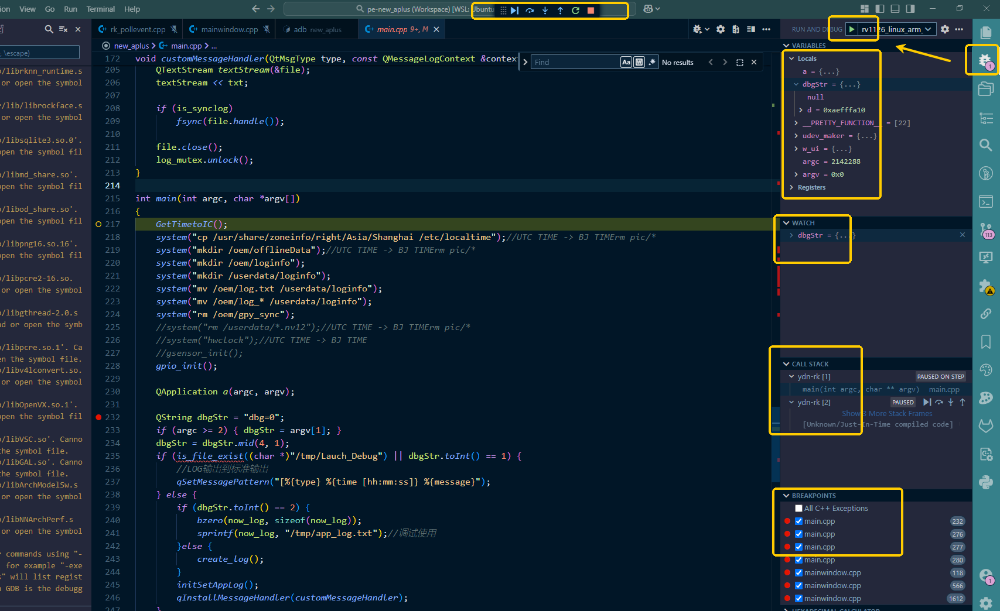

## RV1126 linux_arm gdbserver远程调试

### 前言

本文档用于记录 基于 adb端口转发功能 + gdbserver + vscode gdb可视化插件 在`windows WSL2 ubuntu`或者`vmware ubuntu`开发环境下 来实现嵌入式设备端远程调试
分两种环境: `windows wsl ubuntu` 和 `vmware ubuntu`
共分四个步骤:

1. 设备连接, 设置adb端口转发
2. 启动设备端gdbserver和目标程序
3. 配置vscode launch.json
4. 触发vscode `run and debug` 链接建立，进入调试状态

#### 设备连接, 设置adb端口转发

##### `windows WSL2 ubuntu` 虚拟机环境下

1. 确认 `windows` 和 `WSL2` 都安装了ADB，并且版本一致

2. 由于`WSL2`无法访问usb设备以致于无法连接设备ADB，所以相比`vmware ubuntu`需要在 `windows` 和 `WSL2`之间进行网络端口转发，使`WSL2` `adb client` 访问 `windows` `adb server`来间接访问ADB设备 ``

```bash
# windows 端，杀死默认的后台adb server，并拉起前台server，接受所有端口
adb kill-server
adb -a -P 5037 nodaemon server

# WSL2 端，查询wsl到windows端的映射ip，将其设置为adb连接远程server的ip:port
# wsl2端查询 返回windows端ip
ip route show | grep -i default | awk '{ print $3}'
# wsl2端设置adb连接地址
export ADB_SERVER_SOCKET=tcp:172.19.192.1:5037
```

3. 由于`WSL2`与`windows`之间存在防火墙，需要在windows端powershell进行设置,添加白名单, 将adb默认端口添加到白名单中5037

```batch
# windows端 白名单规则添加
New-NetFirewallRule -DisplayName "Allow WSL access2" -InterfaceAlias "vEthernet (WSL)" -Direction Inbound -Protocol TCP -LocalPort 5037 -Action Allow
# windows端 查询确认是否添加成功
Get-NetFirewallRule | Where-Object { $_.DisplayName -eq "Allow WSL access2" }
```

4. 设置转发服务，在windows端和wsl2均可操作，本质上都是windows端adb server执行

```bash
#说明: `adb forward` 用于在 PC（本地主机） 和 Android 设备 之间转发端口
#转发方向: tcp:<pc本地端口> -> tcp:<设备端口>
adb forward tcp:6001 tcp:6001
#查询是否转发成功, 后续如果需要取消则使用 `adb forward --remove-all`
adb forward --list
```

##### `vmware ubuntu` 虚拟机环境下

1. 连接设备，直接执行转发

```bash
#说明: `adb forward` 用于在 PC（本地主机） 和 Android 设备 之间转发端口
#转发方向: tcp:<pc本地端口> -> tcp:<设备端口>
adb forward tcp:6001 tcp:6001
#查询是否转发成功, 后续如果需要取消则使用 `adb forward --remove-all`
adb forward --list
```

#### 启动设备端gdbserver和目标程序

1. 登录设备shell，启动gdbserver，使用前一步配置的6001端口，并附加目标程序启动

    **确保gdbserver存在，该工具通常位于平台SDK编译工具链的`lic/usr/bin/`目录下**

    ```bash
    ## eg
    ./gdbserver :6001 ./myapp
    ```

#### 配置vscode launch.json

**vscode存在workspace的概念，相关配置文件位于工程当前目录下，固定名称`.vscode`**

1. `c_cpp_properties.json` 决定代码高亮和智能提示

2. `<your_project_name>.code-workspace` 决定工程在文件explorer中的虚拟目录结构，在vscode中通过`open workspace from file`打开该文件后相当于打开项目工作区

3. `launch.json` 决定项目运行时和debug的配置，也是gdb调试的配置文件

```bash
{
    "version": "0.2.0",
    "configurations": [
        {
            //自定义名称
            "name": "rv1126_linux_arm_remote_debug_ydn",
            "type": "cppdbg",
            "request": "launch",
            //目标程序在开发环境下的路径
            "program": "/home/xjf1127/codespace/git_down/build-yda_aplus-rk1126_arm_linux-Debug/ydn-rk",
            "cwd": "${workspaceFolder}",
            "stopAtEntry": true,
            "linux": {
                "MIMode": "gdb",
                //开发环境下，开发SDK包中与gdbserver对应的gdbclient路径
                "miDebuggerPath": "/home/xjf1127/codespace/toolchain/rk1126_sdk_vunknow/compiler2/gcc-arm-8.3-2019.03-x86_64-arm-linux-gnueabihf/bin/arm-linux-gnueabihf-gdb",
                "debugServerArgs": "",
                //目标设备的gdbserver的ip和调试端口，这里由于使用的是adb端口转发，所以填写本地主机ip
                "miDebuggerServerAddress": "172.19.192.1:6001"
            },
            //gdb运行时需要搜索的符号文件路径
            "additionalSOLibSearchPath": "/home/xjf1127/codespace/toolchain/rk1126_sdk_vunknow/qt5/qt5base-5.14.2/lib;home/xjf1127/codespace/toolchain/rk1126_sdk_vunknow/compiler/gcc-arm-8.3-2019.03-x86_64-arm-linux-gnueabihf/arm-linux-gnueabihf/**;/home/xjf1127/codespace/toolchain/rk1126_sdk_vunknow/buildroot/host/arm-buildroot-linux-gnueabihf/sysroot/**",
            "showDisplayString": true,
            "customLaunchSetupCommands": [
            ],
            "logging": {
                "engineLogging": false,
                "trace": false, 
                "traceResponse": false 
            },
            "targetArchitecture": "arm64"
        }
    ]
}
```

#### 触发vscode `run and debug` 链接建立，进入调试状态

**确保远程执行的目标程序，是debug版本，否则调试时会出现gdb跟踪崩溃，并且编译时的源码路径信息与当前debug工程一致**

进入侧边栏debug面板，点击`run and debug`:


#### 补充: 纯命令行gdb

**前置条件:在启动远程gdbserver后，以及adb端口转发成功后；不通过vscode启动本地gdb调试，纯命令行调试:**

与远程gdbserver建立连接

```bash
## 将gdb路径加载到环境变量
export PATH=$PATH:/home/xjf1127/codespace/toolchain/rk1126_sdk_vunknow/compiler2/gcc-arm-8.3-2019.03-x86_64-arm-linux-gnueabihf/bin
## 启动开发环境gdb以及本地目标程序
arm-linux-gnueabihf-gdb /home/xjf1127/codespace/git_down/build-yda_aplus-rk1126_arm_linux-Debug/ydn-rk
## 建立连接
target remote 17.19.192.1:6001
```

在gdb命令模式中加载符号文件

```bash
## 设置sdk sysroot路径
set sysroot /home/xjf1127/codespace/toolchain/rk1126_sdk_vunknow/buildroot/host/arm-buildroot-linux-gnueabihf/sysroot
## 加载qt相关的so符号
set solib-search-path /home/xjf1127/codespace/toolchain/rk1126_sdk_vunknow/qt5/qt5base-5.14.2/lib

```

#### reference

- [microsoft: wsl networking](https://learn.microsoft.com/zh-cn/windows/wsl/networking)
- [csdn: gdb调试解决找不到源代码的问题](https://blog.csdn.net/albertsh/article/details/107437084)

#### 待补充: 在qtcreator中进行远程gdb可视化调试
