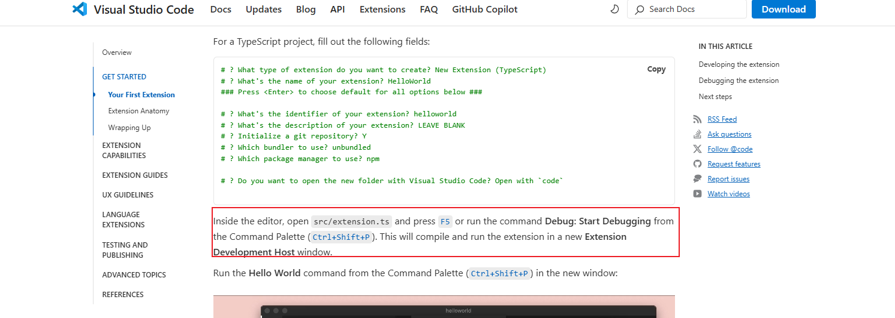

## nvm vpm安装

https://nodejs.org/zh-cn/download

## vscode offical

https://code.visualstudio.com/api/get-started/your-first-extension

## 无效

1. 根据官方步骤生成的代码模板，运行后打开的窗口搜索不到`hello`命令，并且没有任何相关的调试输出
   1. 尝试用第二个全局命令，同样现象，无效
   2. 尝试选择其他模板
   3. 继续从官方文档找答案
      1. 
      2. 
      3. 可以发现，在创建项目末尾，官方补充了package中版本号兼容问题，yo code创建项目，默认是中位版本号100大于当前vscode版本号