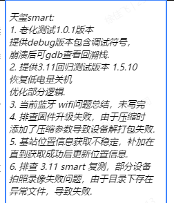

## history

1. 镜像更新功能待开发
2. 像素缩放硬件方案开发
3. 4g更新固件延长超时时间以及加入速率打印
4. 问题排查：【设备端】smart设备-1.5.9，流程未开启标记风险点，使用印控仪用印完成后存在【风险】视频（9.25号16：20 YDAS250701000014）
5. 问题排查：【smart-V1.9.5】smart设备1.5.9固件，流程视频全开启印控仪一代连接smart设备用印后视频未上传（9.25-14:52 飞书测试：mq连接开启常规9）
6. 蓝牙和wifi问题总结
7. 录制视频磁盘空间限制

## new

## fri

1. 协助排查设备在国庆期间进行老化测试死机问题，确认死机时间以及日志内容 4 5台
   1. 000012 设备，屏幕亮，无反应，adb shell无法连接
   2. YDAS250701000020 设备，屏幕黑屏，重新开机正常
   3. 000010 设备，版本号非测试1.00版本，1.5.2
   4. 000020
   5. 00009 设备，版本号非测试1.00版本，1.5.9
2. 手动push 日志
   1. tar -cvf /userdata/cur_log.tar /userdata/loginfo
   2. adb pull /userdata/cur_log.tar E:\work\问题日志\smart\国庆老化测试
   3. tar -cvf cur_pid.tar /oem/pidfile
   4. adb pull /oem/cur_pid.tar  E:\work\问题日志\smart\国庆老化测试
3. 协助生产排查设备未绑定问题
4. 排查私有化 新海科技设备升级失败问题

5. 老化测试固件功能添加
   1. 给所有的process命令，加入超时
   2. 加入系统资源的线程在后台记录，文件描述符，pid
   3. 编译 导出core-dump可解析符号 测试程序
   4. 增加pid记录的长度
   5. 屏蔽掉无效的AT指令操作
   6. 日志中加入老化测试打印
6. 熟悉老化测试

## the

1. smart老化测试
   1. 0024设备，4000次左右，日志截断
2. 老化测试1.0.1版本
   1. 提供纯debug版本以及
   2. relase + debug符号版本，用于在老化测试中崩溃生成的coredump
3. 提供3.11回归测试版本 1.5.10
   1. 恢复低电量关机辑
   2. 提供规范命名package
   3. ute环境上传包
4. 蓝牙 wifi问题总结
5. 排查固件升级失败
6. 基站信息，AT+CREG指令无法稳定获取，先通过AT+QENG="servingcell"在附着核心网注册前获取一次信息
7. 09设备 关机时异常，在quite network模块时崩溃，导致没有执行到关机命令

## mon

1. 排查自动待机关机失败，屏幕还是亮屏，在智能印章界面
2. 排查特权用印，基站信息缺失问题
3. 排查蓝牙连接用印，核减失败问题
4. 排查小程序指纹录入
5. 排查有概率，拍照录像画面偏黑问题
6. 排查sn烧写失败, 同步上位机sn烧写逻辑
7. 老化测试添加 cpu温度显示

## fri

1. 添加cpu温度，debug版本老化固件

## wed

1. 老化测试，去看门狗版本：增加系统信息记录,以及io信息记录
   1. 奔溃情况：到手后，系统adb还能进入，拉取部分
2. 蓝牙配网奔溃问题排查,目前看现象都是 [NETWK] Start Parse Wifi Scan Info! (linkSSID:Libawall以后发生**************** [crash signal number: 11] Quit!!!****************
   1. 未复现
3. 排查范围用印指纹解锁后可以直接用印
   1. user_info->sealAuthentication: [0], param data: [86038~7076~887~001~1~1~0~2~0~~1978363799515136000~1~2~2~2~30~2]
   2. [0]86038~[1]7076~[2]887~[3]001~[4]1~[5]1~[6]0~[7]2~[8]0~[9]~[10]1978366756587536384~[11]1~[12]2~[13]2~[14]2~[15]30~[16]2
4. 排查同时登录腿蹬
5. 协助排查v10 smart 拍照问题
6. 协助排查v10 smart 六轴无效
7. 我这边从港澳卓拿了一台smart v10，初步验证摄像头是可用的，能出

## thu

1. 售后问题，客户手机蓝牙无法连接章桶设备
   1. 远程电脑，排查日志，驱动正常，应用层蓝牙调用正常
   2. 印控仪可以成功连接
   3. 先由前端进行排查
2. smartv10上位机烧录卡死
   1. 协助测试烧录最新固件
   2. 