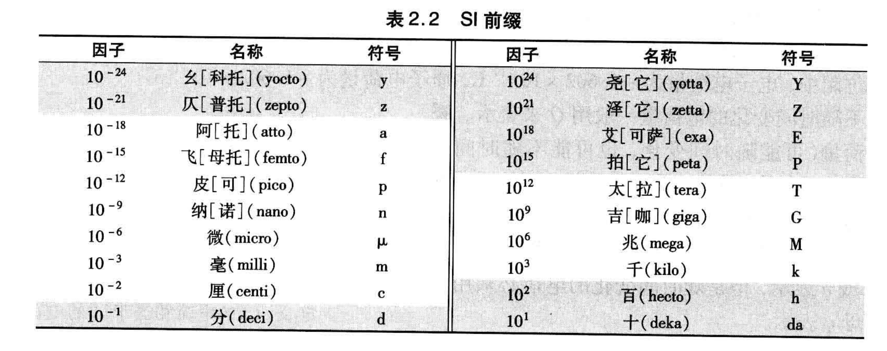

## 《工程电路分析》

### chapter 1

1. 线性电路和非线性电路
2. 分析和设计

### chapter 2

1. 单位和尺度
Q:
什么是单位？
A:
人为选定的某种物理属性的参考量，默认这个单位的数值为1，通过数值*单位，就可以完整的表示一个物理属性物理量的多少，即`物理量=数值 x 单位`
单位分为`私制`和`公制`，公制单位通常由标准协会和机构制定，为大多数国家作为公认标准使用

2. 美国国家标准局所采用的单位制作为国际单位制，简称 `SI`，包含的七种基本单位：
物理属性    单位名称    单位符号
长度        米          m
质量        千克        kg
时间        秒          s
电子电流    安培        A
热力学温度  开尔文       K
物质量      摩尔        mol
光强度      坎德拉      cd

3. 单位的表示方式
一般用人名命名的单位，如果书写时若是全程则用小写，若是缩写则用大写，eg: 瓦特-watt-W,焦耳-joule-J
Q:
功/能量的单位有哪些？
功率又是什么？
除了单位名称和符号外，还有什么常见的单位表示或者修饰方式？

A:
通常给基本单位加上通用的数量级前缀，来表示同种单位之间以及与基本单位的数量级关系，不同的前缀对应具体的`10的各次幂`
什么是幂：`重复乘法的简写形式，是一种简写语法，表达式，a的n次，其中，a为底数，n为指数(幂)，通过幂的描述，我们可以快速的表达一种增长关系`，10的各次幂即 10以不同的次数乘以自己，而除以自己则是对应幂为负数

常见的单位前缀，注意前缀不能组合，只能单独修饰
常见的工程表示法中，将一个量表示为介于到1-999的数字，以及选用能够被`幂次3`整除的公制单位。何为 幂次，幂次即指数，幂次3就是指数为3；如果是负数的指数呢，口语上怎么表达，可以叫做：`x的负幂次n，或者x的负n次幂`

总结下面单位前缀的具体幂次和符号：

```bash
分，厘，毫，微，纳，皮
十，百，千，兆，吉，太

-1, -2, -3, -6, -9, -12
1,  2,  3,  6,  9,  12

d,c,m,u,n,p
da,h,k,M,G,T
```

能量的单位：焦耳(J)、卡路里(cal)、英制热量单位(Btu)
功率是做工或者能量消耗的速率，瓦(w)=1 J/s

!!! 习题存在问题，2.2

4. 电荷charge particle positive and negative 电子electron 电流current 电压voltage 功率power

   1. 电荷和电子以及粒子：电子是一种粒子，是物理实体，而电荷则是粒子的属性，故不同的粒子有不同的电荷属性，如质子携带正电荷，电子携带负电荷，电磁力是电荷这种属性之间产生的作用力，是结果，而电荷这一属性是来源，没有电荷就没有电磁现象
   2. 电荷的测量和发现 ：电荷单位是被测量出来的物理量，所有的物理量都不能被直接观察，只能通过测量 `效应`即这个物理量的作用，最后通过关联计算，定义该规律（物理量），所以更根本的理解电荷是什么？是一个让某些电现象成立的量，这个量经过作用/效应测量进行量化；库伦实验-测量宏观电荷量、密立根油滴实验-测量最小电荷量
   3. 电子数量和电荷单位：电荷单位库伦是实验测量出来的宏观单位，而`e`则是在宏观单位基础上，再由实验测量出来的微观单位，即可测量的最小单位-基本电荷，与`C`存在固定数量关系`e = 1.602176634 × 10^-19 C`
   4. 通过实验先后可以获知，基本电荷是e，然后发现存在电子这种粒子，并且电子的电荷是负电荷，但如何推断出单个电子的电荷是e呢？电子束的实验测量出电荷总量，但电子数量是未知的？ 通过油滴实验，控制电荷量变化，可以确认电荷是量子化的（即数值是基本单位的整数倍），再通过现代实验可以得出结论：单个电子的电荷量就是`e`
   5. 电流和电荷以及电压定义的历史顺序？以及物理事实？
   电荷->电流(单位时间横截面电荷的大小)->电压(单位电荷具备的能量) 即电阻决定了单位时间通过导体的电荷的大小，即电流
   6. 电荷是否装载能量的容器?
   电荷的存在改变了周围电场结构，使得场具备能量，但不能说明电荷本身存在能量，类比质量和其造成的引力