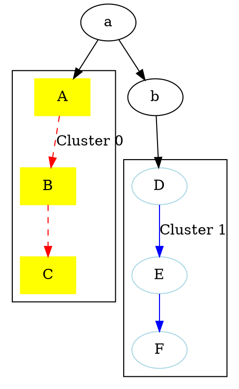

#### Graphviz
- [在线网站](https://dreampuf.github.io/GraphvizOnline)
- [offical](https://graphviz.org/doc/info/command.html)
- [blog](https://www.zywvvd.com/notes/tools/graphviz/graphviz/)
- [offical](https://graphviz.org/docs/attrs/labeljust/)
- [online eidtor](https://magjac.com/graphviz-visual-editor/)
- [github online editor](https://dreampuf.github.io/GraphvizOnline/)
- [edotor.net](https://edotor.net/)

#### vscode 插件
- Power FSM Viewer (java script 格式view)
- graphviz interactive preview
- graphviz preview


#### syntax
```
digraph T {
    // 设置布局为从上到下
    rankdir=TB;
    nodesep=1.0;
    ranksep=1.5;

```
digraph T: 定义一个有向图（digraph），名称为 T。
rankdir=TB: 设置图的布局方向，从上到下（Top to Bottom）。默认为从左到右（LR）。
nodesep=1.0: 设置节点之间的最小水平间距为 1.0。
ranksep=1.5: 设置不同层级之间的垂直间距为 1.5。

```
    // 全局默认节点样式：圆角矩形、无填充背景、白色字体、线条颜色默认白色
    node [shape=box, style=rounded, fillcolor=none, fontcolor=white, color=white];

```
node [shape=box]: 设置默认节点形状为矩形（box）。
style=rounded: 节点边角为圆角。
fillcolor=none: 节点背景填充色为无（透明）。
fontcolor=white: 节点字体颜色为白色。
color=white: 节点边框颜色为白色。

```
    // 全局默认边的样式：白色
    edge [color=white, fontcolor=white];
```
edge [color=white]: 设置边的颜色为白色。
fontcolor=white: 设置边标签的字体颜色为白色。

```
    // 设置背景为黑色
    bgcolor=black;

```
bgcolor=black: 设置图背景颜色为黑色
    
```
    // 节点定义
    start [label="Start", color="lightblue"];
    process_none [label="Process None\n(Waiting)", color="orange"];
    process_ready [label="Process Ready", color="green"];
    process_launch_fail [label="Launch Fail", color="red"];
    process_running [label="Running", color="yellow", fontcolor="#af9191"]; // 自定义字体颜色为黑色
    process_exit_by_request [label="Exit by Request", color="blue"];
    process_exit_unexcept [label="Unexpected Exit", color="purple"];
    process_exit_force [label="Force Exit", color="darkred"];
    auto_terminate [label="Auto Terminate", color="lightcoral"];
    end [label="End", color="lightgreen"];

```

start [label="Start", color="lightblue"]: 定义名为 start 的节点，标签为 "Start"，边框颜色为浅蓝色。
process_none [label="Process None\n(Waiting)", color="orange"]: 定义名为 process_none 的节点，标签为 "Process None (Waiting)"，边框颜色为橙色。
process_ready [label="Process Ready", color="green"]: 定义名为 process_ready 的节点，标签为 "Process Ready"，边框颜色为绿色。
process_launch_fail [label="Launch Fail", color="red"]: 定义名为 process_launch_fail 的节点，标签为 "Launch Fail"，边框颜色为红色。
process_running [label="Running", color="yellow", fontcolor="#af9191"]: 定义名为 process_running 的节点，标签为 "Running"，边框颜色为黄色，字体颜色为浅红色。
process_exit_by_request [label="Exit by Request", color="blue"]: 定义名为 process_exit_by_request 的节点，标签为 "Exit by Request"，边框颜色为蓝色。
process_exit_unexcept [label="Unexpected Exit", color="purple"]: 定义名为 process_exit_unexcept 的节点，标签为 "Unexpected Exit"，边框颜色为紫色。
process_exit_force [label="Force Exit", color="darkred"]: 定义名为 process_exit_force 的节点，标签为 "Force Exit"，边框颜色为深红色。
auto_terminate [label="Auto Terminate", color="lightcoral"]: 定义名为 auto_terminate 的节点，标签为 "Auto Terminate"，边框颜色为浅珊瑚色。
end [label="End", color="lightgreen"]: 定义名为 end 的节点，标签为 "End"，边框颜色为浅绿色。

```
    // 边和标签
    start -> process_none [label="Initialize"];
    process_none -> process_ready [label="Condition A / Action A"];
    process_ready -> process_launch_fail [label="Condition B / Action B"];
    process_ready -> process_running [label="Launch Success"];
    process_launch_fail -> process_none [label="Retry / Reset"];
    process_launch_fail -> auto_terminate [label="Fail / Terminate"];
    process_running -> process_exit_by_request [label="Graceful Exit"];
    process_running -> process_exit_unexcept [label="Error / Unhandled"];
    process_running -> process_exit_force [label="Force Kill"];
    process_exit_by_request -> auto_terminate [label="Cleanup"];
    process_exit_unexcept -> process_none [label="Recovery"];
    process_exit_unexcept -> auto_terminate [label="Fatal Error"];
    process_exit_force -> auto_terminate [label="Forced Termination"];
    process_exit_force -> process_none [label="Force Recovery"];
    auto_terminate -> end [label="Complete"];

```

start -> process_none [label="Initialize"]: 定义从 start 到 process_none 的边，标签为 "Initialize"。
process_none -> process_ready [label="Condition A / Action A"]: 定义从 process_none 到 process_ready 的边，标签为 "Condition A / Action A"。
process_ready -> process_launch_fail [label="Condition B / Action B"]: 定义从 process_ready 到 process_launch_fail 的边，标签为 "Condition B / Action B"。
process_ready -> process_running [label="Launch Success"]: 定义从 process_ready 到 process_running 的边，标签为 "Launch Success"。
process_launch_fail -> process_none [label="Retry / Reset"]: 定义从 process_launch_fail 到 process_none 的边，标签为 "Retry / Reset"。
process_launch_fail -> auto_terminate [label="Fail / Terminate"]: 定义从 process_launch_fail 到 auto_terminate 的边，标签为 "Fail / Terminate"。
process_running -> process_exit_by_request [label="Graceful Exit"]: 定义从 process_running 到 process_exit_by_request 的边，标签为 "Graceful Exit"。
process_running -> process_exit_unexcept [label="Error / Unhandled"]: 定义从 process_running 到 process_exit_unexcept 的边，标签为 "Error / Unhandled"。
process_running -> process_exit_force [label="Force Kill"]: 定义从 process_running 到 process_exit_force 的边，标签为 "Force Kill"。
process_exit_by_request -> auto_terminate [label="Cleanup"]: 定义从 process_exit_by_request 到 auto_terminate 的边，标签为 "Cleanup"。
process_exit_unexcept -> process_none [label="Recovery"]: 定义从 process_exit_unexcept 到 process_none 的边，标签为 "Recovery"。
process_exit_unexcept -> auto_terminate [label="Fatal Error"]: 定义从 process_exit_unexcept 到 auto_terminate 的边，标签为 "Fatal Error"。
process_exit_force -> auto_terminate [label="Forced Termination"]: 定义从 process_exit_force 到 auto_terminate 的边，标签为 "Forced Termination"。
process_exit_force -> process_none [label="Force Recovery"]: 定义从 process_exit_force 到 process_none 的边，标签为 "Force Recovery"。
auto_terminate -> end [label="Complete"]: 定义从 auto_terminate 到 end 的边，标签为 "Complete"。

```
    // 决策点
    decision [shape=diamond, label="Launch Success?", color="white"];
    process_none -> decision;
    decision -> process_ready [label="Yes"];
    decision -> process_launch_fail [label="No"];

```


子视图以及关联
