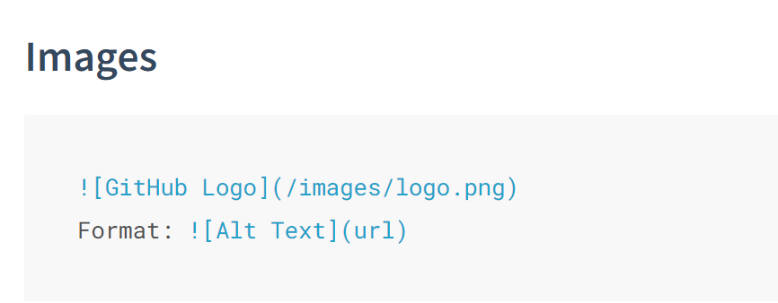

## Syntax
### [reference](https://shd101wyy.github.io/markdown-preview-enhanced/#/markdown-basics)
### basic

- blockquote (>  \<content\>)
>  here is one clockquote
>> dfjk
>>> dfkjdkf
> dfjkdf
> dfdf
> dfkdjf

- inline code (\`\<code>\`)
`here is one inline code`

- links (\[ \<name>> ]\( \<link> ))
[here is an link name](here is a link entity)

- emphasis (\**\<content>**, )
**here is a double emphasis**
__here is a double emphasis__
*here is a single emphasis*
_here is a single emphasis_

- image (\!\[\<name>](\<url>))



!!! note This is the admonition title
    This is the admonition body

- mark
==marked==

Content [^1]

[^1]: Hi! This is a footnote

*[HTML]: Hyper Text Markup Language
*[W3C]: World Wide Web Consortium
The HTML specification
is maintained by the W3C.

H~2~O
hezhong~ep37~
hezhong~ep40~
hezhong^ep40^

30^th^

:smile:
:fa-car:
  

First Header | Second Header
------------ | -------------
Content from cell 1 | Content from cell 2
Content in the first column | Content in the second column


- [x] @mentions, #refs, [links](), **formatting**, and <del>tags</del> supported
- [x] list syntax required (any unordered or ordered list supported)
- [x] this is a complete item
- [ ] this is an incomplete item


<!-- ```javascript {.line-numbers}
function add(x, y) {
  return x + y;
}
``````javascript {highlight=10}
```

```javascript {highlight=10-20}
```

```javascript {highlight=[1-10,15,20-22]}
```

```javascript {.class1 .class}
function add(x, y) {
  return x + y
}
```

```ruby
require 'redcarpet'
markdown = Redcarpet.new("Hello World!")
puts markdown.to_html
``` -->

```c++ 
#include <stdio.h>

int main(int argc, char** argv){
    return 0;
}
```


### 