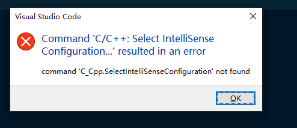
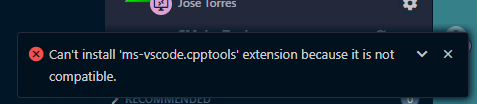
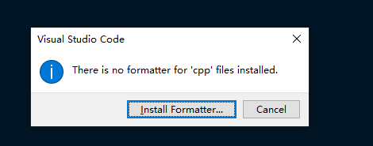
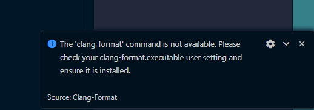

### 扩展突然失效

任何相关命令都会提示not found


重新安装cpp扩展得以解决

**重装已久无法解决，并且重装时报错无法安装到wsl中**

最终考重启电脑系统解决

### 新建空白页进行 shift + alt + f 无效



### 在已有源码文件 shift + alt + f 



user setting

```json
"[c]": {
    "editor.defaultFormatter": "ms-vscode.cpptools"
},
"[cpp]": {
    // "editor.defaultFormatter": "xaver.clang-format"
    "editor.defaultFormatter": "ms-vscode.cpptools"
},
"C_Cpp.clang_format_style": "{ BasedOnStyle: LLVM, UseTab: Never, IndentWidth: 4, TabWidth: 4, BreakBeforeBraces: Allman, AllowShortIfStatementsOnASingleLine: false, IndentCaseLabels: false, ColumnLimit: 0, AccessModifierOffset: -4, NamespaceIndentation: All, FixNamespaceComments: false }",
"C_Cpp.vcFormat.indent.lambdaBracesWhenParameter": false,
"C_Cpp.loggingLevel": "Warning",
"C_Cpp.intelliSenseEngine": "enable",
```

### 在wsl上频繁出现c++插件无效情况，插件已经安装，但并没有运行，任何相关命令也无法运行，调试面板上也没有

在调试 output 栏找不到c++插件的输出，说明根本没有运行

反复reload windows之后，出现output成功运行intellisence

成功reload记录: 多次reload无效之后，先把当前窗口的所有标签关闭，然后再reload，c++插件intellisence功能激活成功