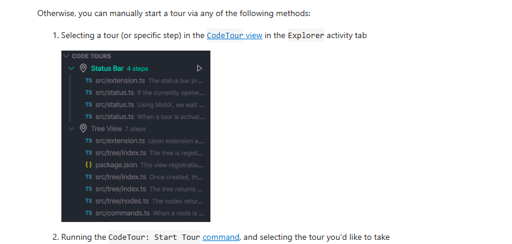

## note
- [dendron](https://www.dendron.so/) (PKM)
- dendron paste image
- dendron markdown shortcuts
- markdown all in one (提供智能编辑，自动补全部分提示符)

## markdown
### edite

### render

## coding

## theme
- 

## remote

## git

## user tracking
- [wakatime](https://wakatime.com/vs-code)

### 大模型对话

1. QuickSend Code2AI - Share Code with AI Assistants: 特么就是垃圾
2. promptcode: 垃圾不能用啊
3. code2AI: 可生成markdown文本，计算token数量，的确可以
4. CodeTour: 代码走读使用
5. bookmarks: 代码走读

### CodeTour

1. 如何设置能够达到官方手册动图里的tree view同时显示文件路径（主内容）和描述（灰白）

