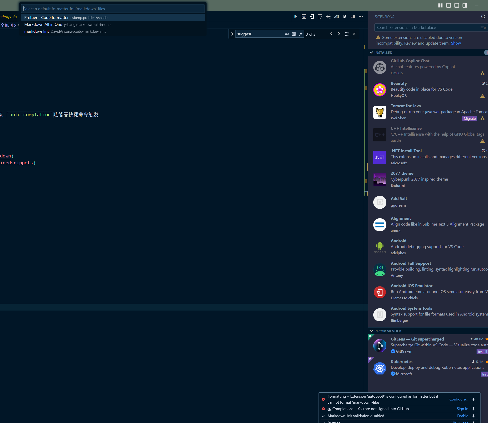
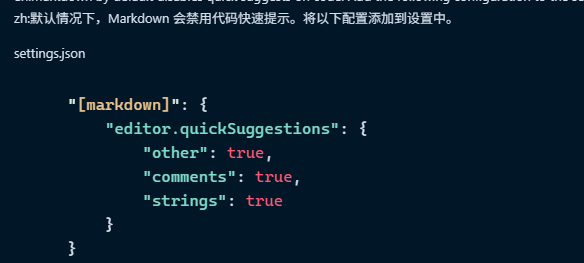
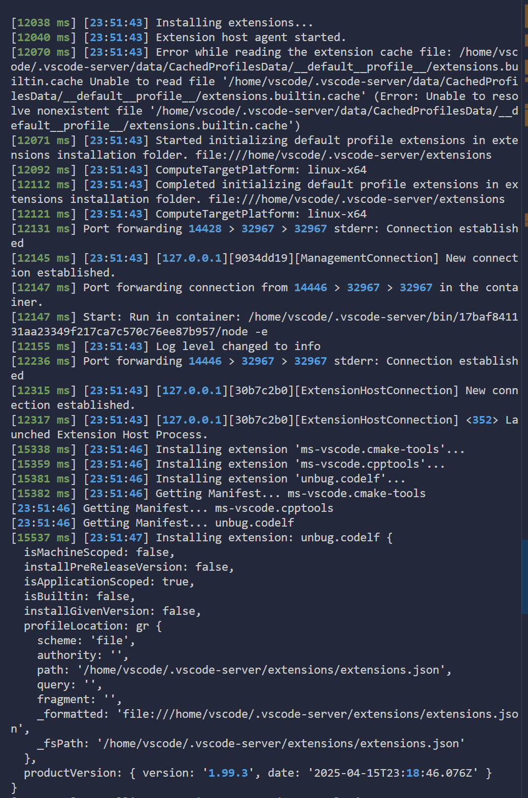

### 当前环境已经安装了所有相关插件，但似乎还是没有markdown语法的自动补全机制

1. 机制: snippet suggest 在编辑时，输入关键字会触发提示词，选定提示词后会进行文本补全
2. 插件功能
   1. markdown all in one: 主要提供`shortcut`快捷操作指令，以及`enter` `space` 后编号生成，符号补全等，`auto-complation`功能靠快捷命令触发
   2. markdownlint: 提供语法检查
3. 那么当前需要的自动补全，那就是需要设置vscode的`suggest`和`snippet`补全了

#### refe

- [microsoft: Markdown and Visual Studio Code](https://code.visualstudio.com/docs/languages/markdown)
- [microsoft: Snippets in Visual Studio Code](https://code.visualstudio.com/docs/editing/userdefinedsnippets)
- [VSCode设置Markdown自定义补全](https://juejin.cn/post/6844904089680085006)
- [microsoft: Intellisence](https://code.visualstudio.com/docs/editing/intellisense)

#### concept

1. outline
   outline 是vscod中侧边栏的一个面板，位于资源管理器`explorer`中的一个可折叠面板`collapsible panel`
2. snippet
   代码片段，通常指通过某些行为触发vscode自动生成对应代码并插入
   触发方式:
   1. `prefix`定义关键词触发 + `tab` 触发
   2. `key`定义快捷键触发
   3. 能否通过 `enter` 进行触发?
3. suggest
   1. suggest trigger?
      1. 使用 `ctrl` + `space` 并没有效果，不能触发建议列表
      2. 使用控制面板命令，直接输入`trigger suggest`可以在关键词边上触发建议列表
      3. 问题: 如何输入关键词后，出现建议列表?
4. auto-close
   1. 符号自动补全/闭合
   2. 如何触发，为什么现在没有了?
   3. 实现方式，插件 or builtin-setting

### need to resolve

1. 自定义的markdown自动补全，经常没有

#### 实验记录

1. 设置了markdown代码片段以后似乎再编辑，并不能触发suggest，使用`tab`可以进行补全，有时候有建议列表，有时候有没有
2. 问题之前使用时，是提供了自动补全的部分功能的，为什么现在没有了?



3. 尝试进入设置以后，设置auto closeing Brackets 从language defined改为always，以及auto closeing quote同样处理
   1. 括号能够生效，但引号 quote没有生效

在markdown code auto complete插件的描述下看到



从历史的17年issue中可以看到，vscode的markdown扩展的确不能自动触发代码建议来选定自定义的snippet，必须ctrl space
但目前的两个问题

- [x] ctrl space 并未触发 suggestion list : 已解决，由于window的输入法设置了ctrl space切换中英文快捷键，取消即可
- [x] 是否有方法使得vscode markdown自动触发代码建议: 已解决，设置对应的setting

在setting中插入 markdown设置片段，成功解决 suggestion 自动触发问题

```json
"[markdown]": {
   "editor.quickSuggestions": {
      "other": true,
      "comments": true,
      "strings": true
   }
}
```

- [ ] markdonw 语法的自动补全： 些markdonw语法可以自动补全，比如****,我按出两个后会自动补全，以及bash  我按到第三个`时会自动补全后面的```，以及，只需要按*,但现在这些功能全都消失