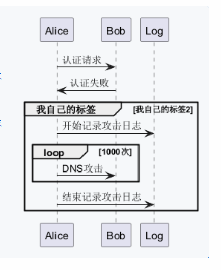

### install issume

安装`PlantUML`插件之后,进行preview，并不能工作

### ref

- [stackflow](https://stackoverflow.com/questions/70039939/how-to-use-the-plantuml-preview-in-vscode)
- [blog](https://hittheroad.dev/using-plantuml-inside-vscode-and-wsl2-2a4e3b2b0898)
- [using tutorial](https://plantuml.com/zh/sequence-diagram)
- [editor nice](https://plantuml-editor.kkeisuke.com/)

### resolve

```bash
### linux
sudo apt install openjdk-17-jdk -y
sudo apt install graphviz
### reload windows

### windows
https://adoptium.net/zh-CN/download/
https://graphviz.org/download/
```

### 时序图基本功能

1. 声明 默认矩形参与者 `participant`
2. 声明 其他形状参与者

   ```bash
      @startuml
      participant Participant as Foo
      actor       Actor       as Foo1
      boundary    Boundary    as Foo2
      control     Control     as Foo3
      entity      Entity      as Foo4
      database    Database    as Foo5
      collections Collections as Foo6
      queue       Queue       as Foo7
      Foo -> Foo1 : To actor 
      Foo -> Foo2 : To boundary
      Foo -> Foo3 : To control
      Foo -> Foo4 : To entity
      Foo -> Foo5 : To database
      Foo -> Foo6 : To collections
      Foo -> Foo7: To queue
      @enduml
   ```

3. 参与者之间的元素: 箭头序列表示参与者之间的消息
4. 自己给自己发消息，一个回转的箭头
5. 箭头方向可以改变
6. 定义消息的编号
```bash
autonumber <起始编号>
每次调用都会以该编号为起点进行重置
可以使用分隔符 1.1.1 <A.B.C>
所以要增加对应的位置数字 使用 `autonumber inc A/B/C`
```

7. 对消息进行框选分组 这些关键字后面没有冒号
```bash
alt <>
xxxxx
else <xxx>
xxxx
else <xxx>
end

gourp <xxxx>
xxxxx
end

loop <1000次>
end
```


8. 注释标签 跟随的对象是 消息, 关键字后面有冒号
单注释
```bash
a->b : <xxx>
note left: <xxxx>

a->c : <xxx>
note right: <xxxx>

```
多个参与者仪器注释, 使用 over <C>,<B>,<A>: <xxxxx> 
跨越所有 hnote across: <xxxx>

9. 给时序添加延迟 消息之间加 ... 或者  ... <message> ...

10. 生命线
   1. active <>
   2. deactivate <>
   3. destroy <> 
   4. 连续两个相同参与者的active就会嵌套，通常 A->A,后再来一个activate A 