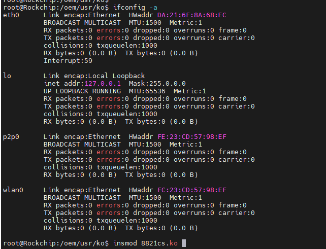
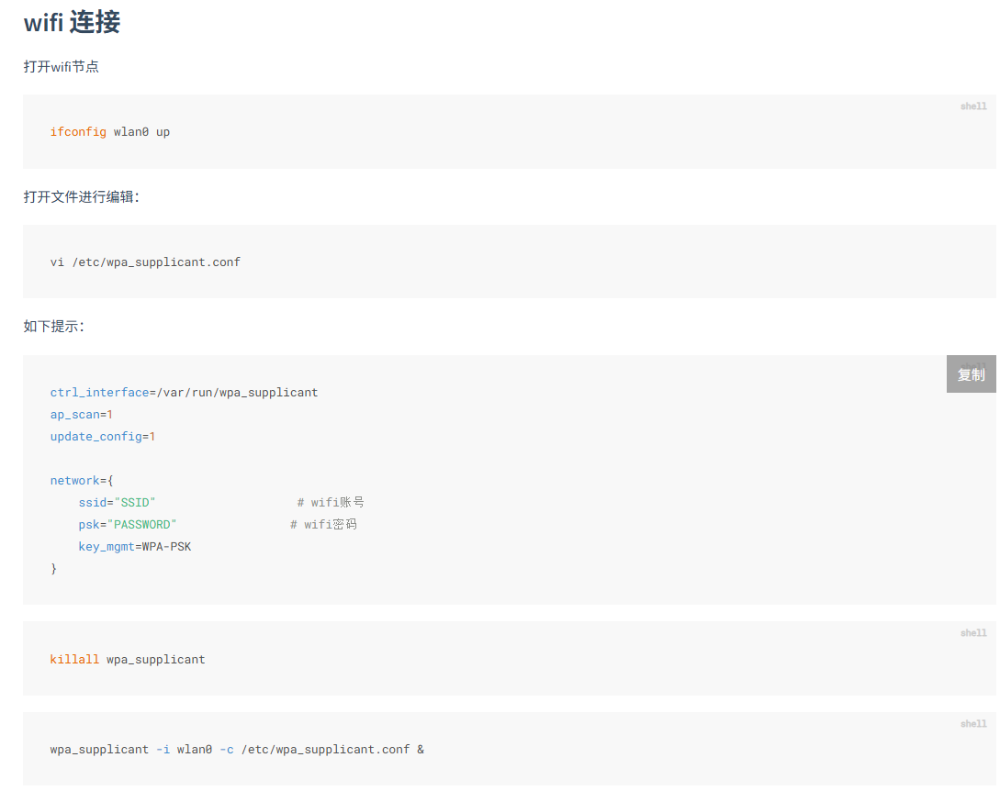
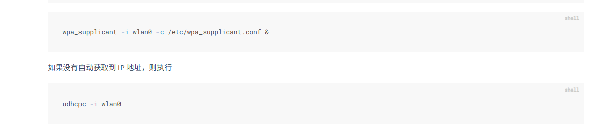
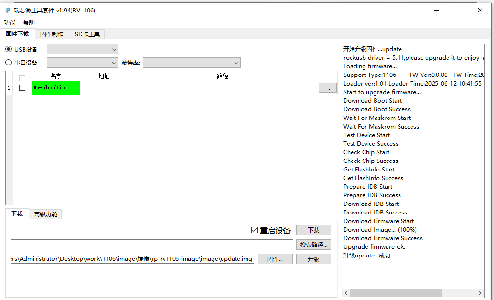
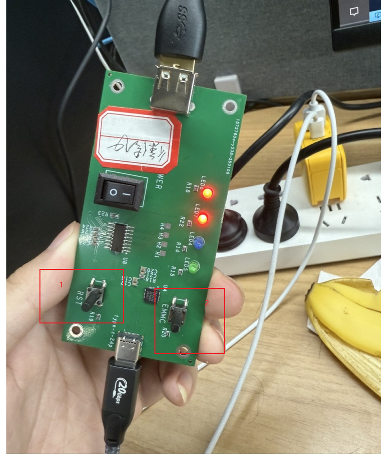
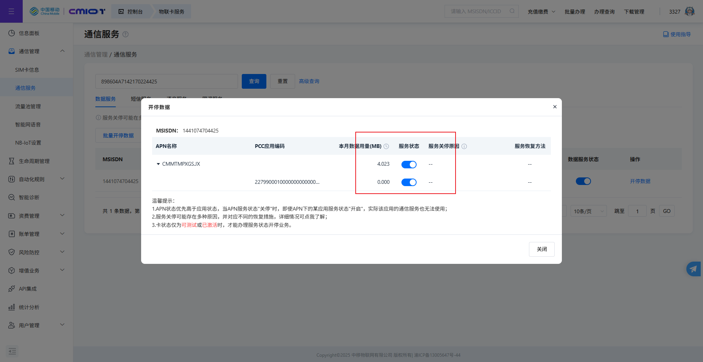
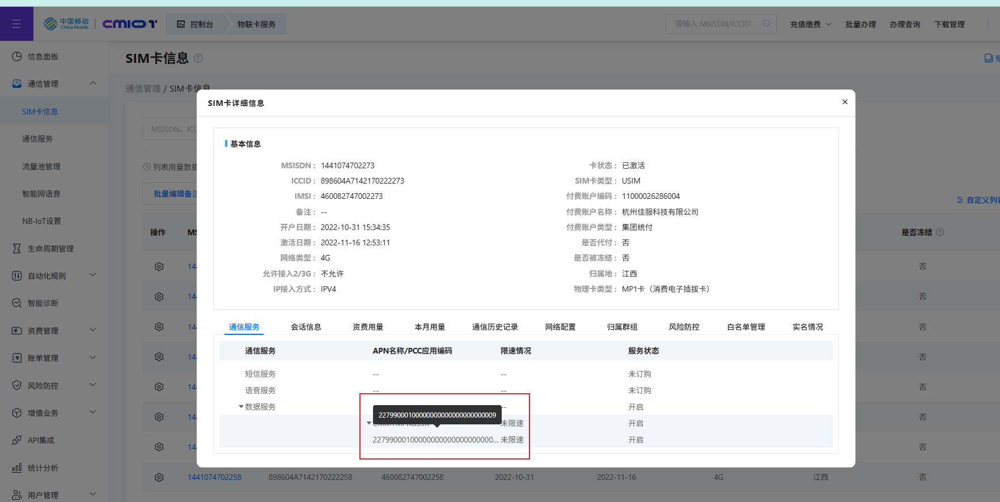
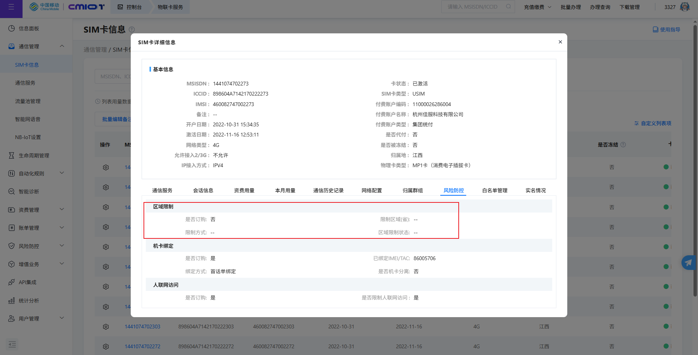

## 连接设备

1. 串口波特率: 11250
2. wifi驱动加载
   1. 
3. ssh登录
   1. 设备连接wifi
   2. 使用wpa_passphrase生成的config无法被正确读取
   3. 直接指定明文，能够成功连接wifi
   4. 
   5. 
   6. 暂停
4. buildroot
   1. 服务器地址
      1. https://192.168.52.222/
         用户名:luoqingtao
         密码:Tao123!@#
      2. 上面的只是web桌面的地址
      3. 真正的可ssh服务器地址：
         1. tnt@192.168.52.112 psswd:123456
   2. 虚拟服务器地址
      1. ssh u22rv1106@192.168.52.111
      2. 123456
      3. /home/u22rv1106/luckfox1106/luckfox-pico/sysdrv/source/buildroot/buildroot-2023.02.6/output/build
      4. /home/u22rv1106/luckfox1106/luckfox-pico/sysdrv/source/buildroot/buildroot-2023.02.6/output/host/arm-buildroot-linux-uclibcgnueabihf/sysroot/usr/lib/
      5. https://wiki.luckfox.com/zh/Luckfox-Pico-RV1106/
   3. 如何提取打包buildroot产物
      1. host下面包含了大量的软连接，指向多层父级目录的文件
      2. 压缩出来的文件存在问题，会包含严重的循环嵌套 /usr/usr/usr/usr/usr
      3. 压缩时如何正确处理链接问题
      4. 或者直接在当前环境下安装以及编译sdk

### 远程adb

```bash
adb kill-server
adb -a -P 5037 nodaemon server

# export ADB_SERVER_SOCKET=tcp:<ip>:<port>
# export ADB_SERVER_SOCKET=tcp:<ip>:<port>
export ADB_SERVER_SOCKET=tcp:192.168.52.29:5037
```

### 完整的ssh登录过程

1. wifi连接

   ```bash
      root@Rockchip:/$ ifconfig wlan0 up
      ifconfig: SIOCGIFFLAGS: No such device
      root@Rockchip:/$ cd /oem/usr/ko/
      root@Rockchip:/oem/usr/ko$ ls
      sc530ai.ko                    gf128mul.ko
      rve.ko                        mpp_vcodec.ko
      rga3.ko                       ipv6.ko
      8821cs.ko                     cfg80211.ko
      video_rkisp.ko                ccm.ko
      gc2053.ko                     insmod_wifi.sh
      insmod_ko.sh                  sc4336.ko
      rk_dvbm.ko                    phy-rockchip-csi2-dphy.ko
      rknpu.ko                      gspca_main.ko
      os04a10.ko                    ghash-generic.ko
      mac80211.ko                   aes_generic.ko
      hpmcu_wrap.bin                gcm.ko
      ctr.ko                        release_version.txt
      rockit.ko                     bcmdhd.ko
      video_rkcif.ko                sc3336.ko
      phy-rockchip-csi2-dphy-hw.ko
      root@Rockchip:/oem/usr/ko$ insmod 8821cs.ko
      root@Rockchip:/oem/usr/ko$ ifconfig wlan0 up

      root@Rockchip:/oem/usr/ko$ vi /etc/wpa_supplicant.conf
      root@Rockchip:/oem/usr/ko$ cat /etc/wpa_supplicant.conf
      ctrl_interface=/var/run/wpa_supplicant
      ap_scan=1
      update_config=1
      network={
            ssid="Libawall"
            psk="11223344"
            key_mgmt=WPA-PSK
      }

      root@Rockchip:/oem/usr/ko$ wpa_supplicant -i wlan0 -c /etc/wpa_supplicant.conf &

      root@Rockchip:/oem/usr/ko$ udhcpc -i wlan0
      udhcpc: started, v1.27.2
      udhcpc: sending discover
      udhcpc: sending select for 192.168.48.49
      udhcpc: lease of 192.168.48.49 obtained, lease time 43200
      deleting routers
      adding dns 223.5.5.5
      adding dns 223.6.6.6
      root@Rockchip:/oem/usr/ko$ ifconfig
      lo        Link encap:Local Loopback
               inet addr:127.0.0.1  Mask:255.0.0.0
               UP LOOPBACK RUNNING  MTU:65536  Metric:1
               RX packets:0 errors:0 dropped:0 overruns:0 frame:0
               TX packets:0 errors:0 dropped:0 overruns:0 carrier:0
               collisions:0 txqueuelen:1000
               RX bytes:0 (0.0 B)  TX bytes:0 (0.0 B)

      wlan0     Link encap:Ethernet  HWaddr FC:23:CD:57:98:EF
               inet addr:192.168.48.49  Bcast:192.168.51.255  Mask:255.255.252.0
               UP BROADCAST RUNNING MULTICAST  MTU:1500  Metric:1
               RX packets:291 errors:0 dropped:137 overruns:0 frame:0
               TX packets:5 errors:0 dropped:0 overruns:0 carrier:0
               collisions:0 txqueuelen:1000
               RX bytes:64244 (62.7 KiB)  TX bytes:1169 (1.1 KiB)
   ```

2. 设备sshd运行

   ```bash
      root@Rockchip:/oem/usr/ko$ sshd
      sshd re-exec requires execution with an absolute path
      root@Rockchip:/oem/usr/ko$ ^C
      root@Rockchip:/oem/usr/ko$ /usr/sbin/sshd
      /etc/ssh/sshd_config: No such file or directory

      root@Rockchip:/oem/xjf1127$ /usr/sbin/sshd
      Privilege separation user sshd does not exist

      补充/etc/ssh目录配置文件

      root@Rockchip:/oem/xjf1127$ /usr/sbin/sshd
      Privilege separation user sshd does not exist


      配置文件中添加：UsePrivilegeSeparation no

      root@Rockchip:/oem/xjf1127$ /usr/sbin/sshd
      /etc/ssh/sshd_config line 110: Deprecated option UsePrivilegeSeparation
      Privilege separation user sshd does not exist

      补充adduser命令以及libtirpc.so.3库

      执行adduser --system --no-create-home --shell /usr/sbin/nologin --group sshd失败

      root@Rockchip:/oem/xjf1127/qt_test/out$ adduser -S -H -s /bin/false sshd
      root@Rockchip:/oem/xjf1127/qt_test/out$ mkdir -p /var/empty
      root@Rockchip:/oem/xjf1127/qt_test/out$ vi /etc/ssh/ssh

      root@Rockchip:/oem/xjf1127/qt_test/out$ /usr/sbin/sshd
      sshd: no hostkeys available -- exiting.

      设备端生成会卡住，在电脑端生成后拷贝过去
      xjf1127@DESKTOP-E1M5RHH:~/codespace/git_down/rv1106_prj_template/qt_helloworld/host_tool/output/etc/ssh$ ssh-keygen -t rsa -b 2048 -f ssh_host_rsa_key -N ""

      root@Rockchip:/etc/ssh$ ls
      ssh_host_rsa_key      ssh_host_rsa_key.pub  sshd_config
      moduli                ssh_config


      root@Rockchip:/oem/xjf1127/qt_test$ /usr/sbin/sshd
      @@@@@@@@@@@@@@@@@@@@@@@@@@@@@@@@@@@@@@@@@@@@@@@@@@@@@@@@@@@
      @         WARNING: UNPROTECTED PRIVATE KEY FILE!          @
      @@@@@@@@@@@@@@@@@@@@@@@@@@@@@@@@@@@@@@@@@@@@@@@@@@@@@@@@@@@
      Permissions 0666 for '/etc/ssh/ssh_host_rsa_key' are too open.
      It is required that your private key files are NOT accessible by others.
      This private key will be ignored.
      sshd: no hostkeys available -- exiting.
            
      root@Rockchip:/etc/ssh$ chmod 755 /etc/ssh/
      root@Rockchip:/etc/ssh$ chmod 644 /etc/ssh/ssh_host_rsa_key.pub
      root@Rockchip:/etc/ssh$ chmod 600 /etc/ssh/ssh_host_rsa_key


      root@Rockchip:/oem/xjf1127/qt_test$ /usr/sbin/sshd -d
      debug1: sshd version OpenSSH_9.3, OpenSSL 1.1.1h  22 Sep 2020
      debug1: Unable to load host key "/etc/ssh/ssh_host_rsa_key": error in libcrypto
      debug1: Unable to load host key: /etc/ssh/ssh_host_rsa_key
      debug1: Unable to load host key: /etc/ssh/ssh_host_ecdsa_key
      debug1: Unable to load host key: /etc/ssh/ssh_host_ed25519_key
      sshd: no hostkeys available -- exiting.
      root@Rockchip:/oem/xjf1127/qt_test$ /usr/sbin/sshd -d
      debug1: sshd version OpenSSH_9.3, OpenSSL 1.1.1h  22 Sep 2020
      debug1: Unable to load host key "/etc/ssh/ssh_host_rsa_key": error in libcrypto
      debug1: Unable to load host key: /etc/ssh/ssh_host_rsa_key
      debug1: Unable to load host key: /etc/ssh/ssh_host_ecdsa_key
      debug1: Unable to load host key: /etc/ssh/ssh_host_ed25519_key
      sshd: no hostkeys available -- exiting.

      从xinhu sdk中拷贝覆盖过去
      root@Rockchip:/oem/xjf1127/qt_test$ md5sum /usr/lib/libcrypto.so.1.1
      884ec761516b8409e242a259df4d8cb0  /usr/lib/libcrypto.so.1.1
      root@Rockchip:/oem/xjf1127/qt_test$ md5sum /usr/lib/libcrypto.so.1.1
      a1d3282f293b6f1ee64224470e96cfa5  /usr/lib/libcrypto.so.1.1
      root@Rockchip:/oem/xjf1127/qt_test$ /usr/sbin/sshd -d
      debug1: sshd version OpenSSH_9.3, OpenSSL 1.1.1v  1 Aug 2023
      debug1: private host key #0: ssh-rsa SHA256:VYKw0zYEG8U2ERydWvX2N4GdSLhMsUQ/xSJeLak7R/M
      debug1: Unable to load host key: /etc/ssh/ssh_host_ecdsa_key
      debug1: Unable to load host key: /etc/ssh/ssh_host_ed25519_key
      debug1: rexec_argv[0]='/usr/sbin/sshd'
      debug1: rexec_argv[1]='-d'
      debug1: Set /proc/self/oom_score_adj from 0 to -1000
      socket: Address family not supported by protocol
      debug1: Bind to port 22 on 0.0.0.0.
      Server listening on 0.0.0.0 port 22.


      root@Rockchip:~$ grep -E 'PermitRootLogin|PasswordAuthentication' /etc/ssh/sshd_
      config
      #PermitRootLogin prohibit-password
      #PasswordAuthentication yes
      # PasswordAuthentication.  Depending on your PAM configuration,
      # the setting of "PermitRootLogin prohibit-password".
      # PAM authentication, then enable this but set PasswordAuthenticatio

      添加选项：
      PermitRootLogin yes
      PasswordAuthentication yes


      debug1: attempt 2 failures 1 [preauth]
      User root password has expired (root forced)
      debug1: auth_restrict_session: restricting session
      debug1: auth_activate_options: setting new authentication options
      Failed password for root from 192.168.52.29 port 43759 ssh2
      debug1: Unable to open the btmp file /var/log/btmp: No such file or directory
      #密码还是处于过期状态

      root@Rockchip:~$ date -s "2025-06-14 10:00:00"
      Sat Jun 14 10:00:00 UTC 2025
      root@Rockchip:~$ echo $(( $(date +%s) / 86400 ))
      20253
      root@Rockchip:~$ sed -i "s/^\(root:[^:]*:\)[0-9]\+/\1$(($(date +%s)/86400))/" /e
      tc/shadow
      root@Rockchip:~$ grep '^root:' /etc/shadow
      root:$5$/q./L7ZJn8wKazxC$gRbC6oTsPMvACvI0elhI1yW6zaH2UrszeYdTUIRz3k7:20253:0:99999:7:::
      root@Rockchip:~$
      #修改系统时间以及配置文件


      root@Rockchip:~$ /usr/sbin/sshd -d
      debug1: sshd version OpenSSH_9.3, OpenSSL 1.1.1v  1 Aug 2023
      debug1: private host key #0: ssh-rsa SHA256:VYKw0zYEG8U2ERydWvX2N4GdSLhMsUQ/xSJeLak7R/M
      debug1: Unable to load host key: /etc/ssh/ssh_host_ecdsa_key
      debug1: Unable to load host key: /etc/ssh/ssh_host_ed25519_key
      debug1: rexec_argv[0]='/usr/sbin/sshd'
      debug1: rexec_argv[1]='-d'
      debug1: Set /proc/self/oom_score_adj from 0 to -1000
      socket: Address family not supported by protocol
      debug1: Bind to port 22 on 0.0.0.0.
      Server listening on 0.0.0.0 port 22.
      debug1: Server will not fork when running in debugging mode.
      debug1: rexec start in 4 out 4 newsock 4 pipe -1 sock 7
      debug1: sshd version OpenSSH_9.3, OpenSSL 1.1.1v  1 Aug 2023
      debug1: private host key #0: ssh-rsa SHA256:VYKw0zYEG8U2ERydWvX2N4GdSLhMsUQ/xSJeLak7R/M
      debug1: Unable to load host key: /etc/ssh/ssh_host_ecdsa_key
      debug1: Unable to load host key: /etc/ssh/ssh_host_ed25519_key
      debug1: inetd sockets after dupping: 3, 3
      Connection from 192.168.52.29 port 44374 on 192.168.48.49 port 22 rdomain ""
      debug1: Local version string SSH-2.0-OpenSSH_9.3
      debug1: Remote protocol version 2.0, remote software version MoTTY_Release_0.82
      debug1: compat_banner: no match: MoTTY_Release_0.82
      debug1: permanently_set_uid: 100/65534 [preauth]
      debug1: list_hostkey_types: rsa-sha2-512,rsa-sha2-256 [preauth]
      debug1: SSH2_MSG_KEXINIT sent [preauth]
      debug1: SSH2_MSG_KEXINIT received [preauth]
      debug1: kex: algorithm: sntrup761x25519-sha512@openssh.com [preauth]
      debug1: kex: host key algorithm: rsa-sha2-512 [preauth]
      debug1: kex: client->server cipher: aes256-ctr MAC: hmac-sha2-256 compression: zlib@openssh.com [preauth]
      debug1: kex: server->client cipher: aes256-ctr MAC: hmac-sha2-256 compression: zlib@openssh.com [preauth]
      debug1: expecting SSH2_MSG_KEX_ECDH_INIT [preauth]
      debug1: SSH2_MSG_KEX_ECDH_INIT received [preauth]
      debug1: rekey out after 4294967296 blocks [preauth]
      debug1: SSH2_MSG_NEWKEYS sent [preauth]
      debug1: Sending SSH2_MSG_EXT_INFO [preauth]
      debug1: expecting SSH2_MSG_NEWKEYS [preauth]
      debug1: SSH2_MSG_NEWKEYS received [preauth]
      debug1: rekey in after 4294967296 blocks [preauth]
      debug1: KEX done [preauth]
      debug1: userauth-request for user root service ssh-connection method none [preauth]
      debug1: attempt 0 failures 0 [preauth]
      debug1: userauth-request for user root service ssh-connection method keyboard-interactive [preauth]
      debug1: attempt 1 failures 0 [preauth]
      debug1: keyboard-interactive devs  [preauth]
      debug1: auth2_challenge: user=root devs= [preauth]
      debug1: kbdint_alloc: devices '' [preauth]
      debug1: userauth-request for user root service ssh-connection method password [preauth]
      debug1: attempt 2 failures 1 [preauth]
      Failed password for root from 192.168.52.29 port 44374 ssh2
      debug1: Unable to open the btmp file /var/log/btmp: No such file or directory
      #还是不行


      使用参数-ddd开启更详细的日志
   ```

   使用adb端口转发进行登录

   ```bash
      C:\Users\Administrator\AppData\Roaming\MobaXterm\home>adb forward tcp:8022 tcp:22
   8022
   
      C:\Users\Administrator\AppData\Roaming\MobaXterm\home>ssh -p 8022 xjf1127@localhost
   The authenticity of host '[localhost]:8022 ([127.0.0.1]:8022)' can't be established.
   RSA key fingerprint is SHA256:VYKw0zYEG8U2ERydWvX2N4GdSLhMsUQ/xSJeLak7R/M.
   This key is not known by any other names.
   Are you sure you want to continue connecting (yes/no/[fingerprint])? yes
   Warning: Permanently added '[localhost]:8022' (RSA) to the list of known hosts.
   xjf1127@localhost's password:
   Permission denied, please try again.
   xjf1127@localhost's password:
   Permission denied, please try again.
   xjf1127@localhost's password:
   xjf1127@localhost: Permission denied (publickey,password,keyboard-interactive).


   由系统启动
   root@Rockchip:/$ sh /etc/init.d/S50sshd restart
   Stopping sshd: OK
   Starting sshd: OK
   ```

3. ssh客户端登录

### 镜像烧录

1. 
2. 
3. 调试软件连接设备后，在界面处选择1106
4. 然后按住截图框选按钮1，同时点击截图中框选的按钮2，随后即可松开两个按钮
5. 然后选择固件 `update.img` 进行升级
6. 软件和固件路径
   1. ftp: \\192.168.52.243\篱笆墙集团\研发中心\硬件研发部\嵌入式软件G\98_固件&Kernel\天玺steam
   2. local: C:\Users\Administrator\Desktop\work\镜像

### 4G 卡组信息查询

1. 私有化产品都是划分好卡组的，有对应的编号，如果私有化设备的sim编码没有和目标编号匹配，则可能拨号失败
2. 在连接管理页面查看通信功能判断是否sim卡被禁用
   1. 
3. 在连接管理页面查看sim卡信息，查看是否有风险管控功能(例如电子围栏)，查看sim卡组编号判断是否是该企业卡组
   1. 
   2. 
4. 篱笆墙移动网络账号密码
   1. BE7919473327
   2. Libawall123.
5. https://ct.cmonelink.com/#/communication/communicationService

### wsl 登录 编译服务器

1. sudo apt install filezilla
2. filezilla
3. 192.168.52.112 tnt 123456
4. sudo apt install language-pack-zh-hans
5. sudo locale-gen zh_CN.UTF-8
6. sudo update-locale LANG=zh_CN.UTF-8

### media

0. refe
1. 层次结构


    a. 售后部门测试设备无法连接蓝牙
排查后发现镜像版本烧录错误，导致蓝牙无法驱动