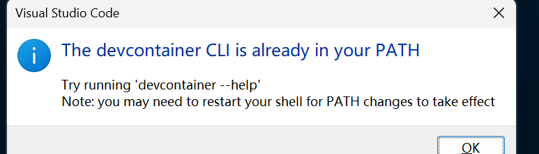
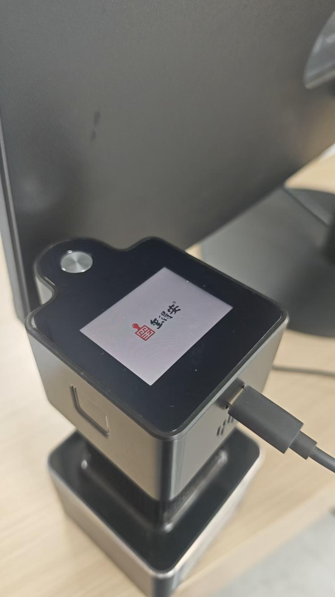
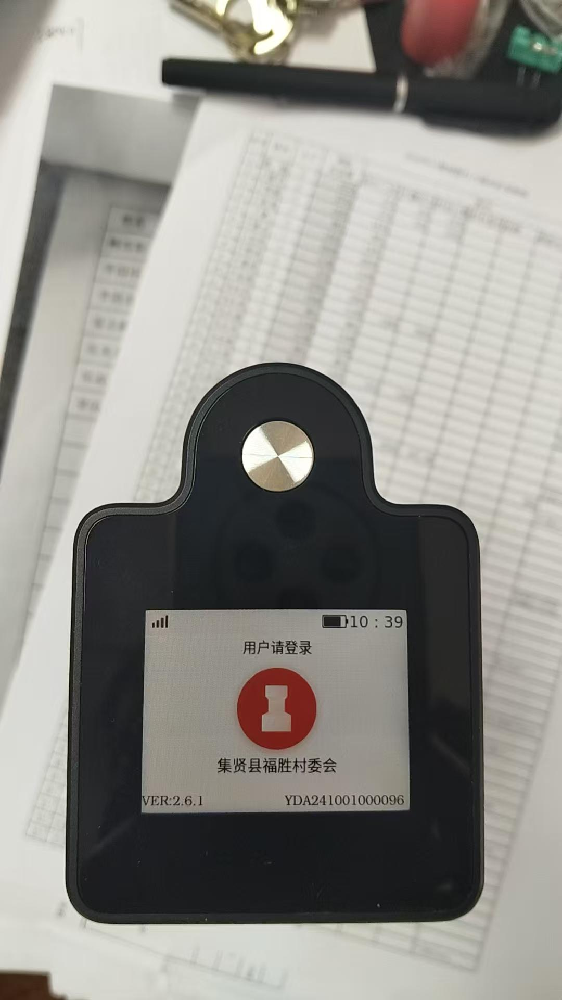
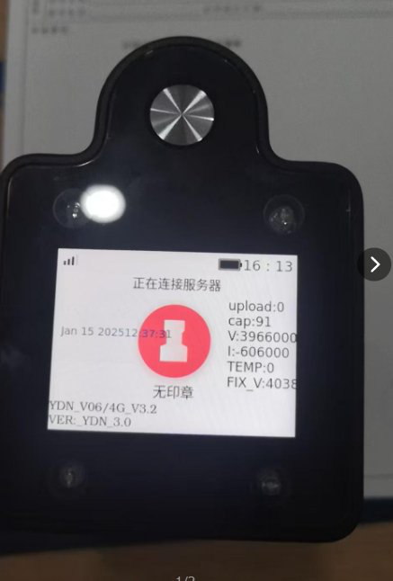

### message bak

1. 已经拉你进售后群了，可以找几个问题然后带着代码一起看一看。测试平台能找到设备日志，登录密码和账号上面发给你了，测试运营平台是能看到各个环境的设备日志的。私有化部署是设备环境的配置和运营后台地址。尽量不要去调整各平台的设备绑定和固件包就好。
2. 私有化部署链接: https://alidocs.dingtalk.com/i/nodes/4lgGw3P8vPkvbXoBSPlDn5a5V5daZ90D?cid=1053694951:1219131438&corpId=dingb052090d850ff2a535c2f4657eb6378f&doc_type=wiki_doc&iframeQuery=utm_medium=im_card&utm_source=im&utm_medium=main_vertical&utm_scene=team_space&utm_source=search

### 20250403 建德-固件升级后网络问题 2.5.0 版本 

1. 推送ppp拨号配置文件

```bash
adb push ./quecteludev-ppp /etc/ppp/peers/
### 
chmod 755 /etc/ppp/peers/quecteludev-ppp
```

2. 推送curl到设备/bin

由于服务器访问改为了https，所以需要用到curl

```bash
adb push ./curl /bin
###
chmod 755 /bin/curl
```

3. 验证

```bash
killall daemon_service ydn-rk

./daemon_service 

tail -f log_*

```

### 20250417 建德-之前没有进行升级的设备现在都无法进行网络连接

旧网址失效了

### 20250417 电池电量

#### 福建省谋成水泥（SaaS）：4.10号充满电后，今天开机发现没有电了，中途一直是关机的，没有使用过，麻烦排查一下耗电情况

docid:2025041701


1. VER: 2.6.2
2. YDA231001000263
3. seal_name: 福建省大田县新岩水泥公章
4. 反馈人: 王雪
5. 后续: 0418反馈: 昨天充满电盖印了几次今天又没有电了，你再排查看看怎么处理

#### 奥克斯集团常州中吴明州康复医院   YDA250301000169  客户8点上班 开始充电 然后设备一拔掉就低电量 和昨天设备特权死机是一台设备@周青媛

docid:2025041702

1. 反馈人: 于红娟
2. YDA250301000169


**排查过程**

```bash
rk_pollevent.cpp: 264: void rk_pollevent::getDeviceStatus()->
qDebug("correct %f %f c=%d \n ", getDevCap, getDecur, device_sta->isCharge);
qDebug("samp 100 times get capcity [%d]  ", device_sta->capcity);

eg:
2025/04/09 15:09:46 [299] correct 3927360.000000 -953000.000000 c=0 
2025/04/09 15:09:55 [299] correct 3915760.000000 -1148000.000000 c=0 

2025/04/09 15:10:16 [339] samp 100 times get capcity [80]  

log文件名称格式:
log_202504091509.txt
log_201708061123.txt
log_take_202504101418.txt

脚本生成:
现在你是一个很牛逼的脚本程序员，请帮我生成一个python脚本，用于日志信息过滤和重整，以及绘图
我先说明一下，日志的格式
1. 首先日志文件名称格式是这样的
log_202504091509.txt
log_201708061123.txt
log_take_202504101418.txt
其中log_202504091509.txt是正常日志，log_201708061123.txt是设备出异常，导致名称上的时间戳异常，log_take_202504101418.txt带log_take_前缀的是拍照时日志
2. 其次，每局日志的时间戳格式 2025/04/15 17:26:25 

我需要的脚本，进行流水线式处理，即每一个步骤对上一个步骤的文件处理，生成新的子文件夹，作为下一个步骤的输入，每一个文件夹名称格式 : <log_src_dir_name>_<seiral>

首先输入是一个文件夹目录，该目录下会放置n个上诉格式的日志文件，你需要对其进行处理，先在当前路径创建一个root目录，用于所有输出以及中间文件存储，名称格式 <log_src_dir_name>_output
第一步，预处理修复文件异常，这是一个可选项，用标志位控制，如果为true，则会对日志文件名称，进行校对，逻辑为，判断文件的第一句日志，提取时间戳，来重命名文件名称，所有输出到<log_src_dir_name>_1中，如果选项是false，则只是把原日志内容拷贝到这里

第二步，根据配置的lambda表达式，按序提取整句日志，lambda表达式可能有多个，对应不同种类的日志，要求给出一个开关，表示是否每种日志分文件输出，还是一个文件中匹配上的都按序输出到对应的一个日志文件中，如果是分文件输出，则一个原日志文件，建立对应的子文件夹，然后人类整理输出的日志都存储在里面，仅加一点后缀需要_<seiral>

这里给出两句日志示例:
2025/04/09 15:09:46 [299] correct 3927360.000000 -953000.000000 c=0 
2025/04/09 15:10:16 [339] samp 100 times get capcity [80] 
要求提取这种日志，输出到文件夹<log_src_dir_name>_2中，
请先完成这两部分

xxxxxxxxxxxxxxxxxxxxxxxxx
很好，我发现能跑起来了，你真厉害，现在我需要修改一个小需求，即输出根文件夹名称冲突处理，比如第一次输入2025041701，输出2025041701_output,然后我重新运行以后，程序需要判断是否2025041701_output存在，存在则新增一个后缀2025041701_output_<serial>, 如2025041701_output_2来递增

xxxxxxxxxxxxxxxxxxxxxxxx
我需要你进行改造，按刚才说的toml配置方式，但是配置文件的序列化反序列化部分需要优化一下，请用一个完整的class数据结构，来表示配置内容，然后代码模块使用，而不是零散的变量
xxxxxxxxxxxxxxxxxxxxxxxx
昨天提到的日志提取工具，今天要优化一下第一个功能: 日志文件名修复
目前会遇到的问题是，由于设备亏点，导致rtc重置，所以开机后一开始时间是2017年的，只有联网了一段时间后，时间戳才会正常到2024年
而日志的文件名是根据最开始的日志时间戳命名的，导致了日志名称异常

所以现在这个功能: 
开出配置项:
1.  是否修复日志名称
2. 异常时间段，要求能够，比如小于2024年的全是异常的，或者大于2026年这种的，反正可以配置多个时间段，并且区间的另一边可以无穷小或者大
处理:
进入日志文件后，判断日志时间戳是否在异常区间，在异常区间内则忽略，直到有正常时间戳，使用这个来命名日志文件，但是修复的需要在文件名加上后缀_fix
```


```bash
C:\Users\Administrator\Desktop\tmp\Minimal ADB and Fastboot>adb push C:\Users\Administrator\Desktop\tmp\0417\UPGRADE_PACKAGE_2503271600\rkmedia_catch    \bin
5405 KB/s (44268 bytes in 0.007s)

C:\Users\Administrator\Desktop\tmp\Minimal ADB and Fastboot>adb push C:\Users\Administrator\Desktop\tmp\0417\UPGRADE_PACKAGE_2503271600\rkmedia_recordvideo \bin
6472 KB/s (79320 bytes in 0.011s)

adb push C:\Users\Administrator\Desktop\tmp\0417\UPGRADE_PACKAGE_2503271600\rkmedia_recordvideo \bin

C:\Users\Administrator\Desktop\tmp\Minimal ADB and Fastboot>adb push C:\Users\Administrator\Desktop\tmp\0417\UPGRADE_PACKAGE_2503271600\rkmedia_takephoto \bin
5878 KB/s (84040 bytes in 0.013s)


```

```bash
killall daemon_service ydn-rk

cd /oem/Backup && sh ./install.sh


```

### 20250418 售后-升级固件

#### 账号

1. 向日葵远程: 1842955336 今日验证码: x4r24f
2. 设备vin: YDAA2311030000102
3. 固件version: 2.4.7
4. 界面状况: 提示"无法联网，请使用蓝牙连接设备.."
5. 待升级数量: 2台
6. 地点: 建德市梅城镇姜山村

结果: 还剩一台设备连接后adb无法识别，待处理

#### 账号

1. 建德市乾潭镇罗村村
2. 958963285 572d5u

```bash
## 传输文件

## kill 进程

## 执行sh脚本

## 修改 cfg

## 执行damon

## 查看日志
adb push ..\..\UPGRADE_PACKAGE_2503271600 /oem/Backup
adb pull /oem/sys.cfg .
adb push ./sys.cfg /oem
```


### 20250421 售后-升级固件

1. 建德市大洋镇里黄村
2. 设备: 两台
3. 向日葵: 1801859604 x2m56x
4. 完成: 一台，另一台不需要


1. @梁丙政@徐佳飞@建德市杨村桥镇龙源村：（政务网安装不了向日葵）--QQ远程404770670两台需要升级固件

### 20250422 售后-建德手动升级固件

1. 建德市三都镇三江口村
2. 161937411 576yx2


1. 建德市梅城镇千鹤村 有三台设备需要升级
2. 1525378314 f2nt16
3. 三台完成
   
1. 1477449619 9192n3
2. 建德市梅城镇龙泉村

### 20250423 售后-建德手动升级固件

1. @徐佳飞@梁丙政建德市梅城镇顾家村：政务网，只能QQ远程：376048755，需升级固件--3台；
2. 建德市乾潭镇胥江村  设备固件不是最新 无法使用  需要远程升级 客户QQ：1005083198@徐佳飞@梁丙政谁有空呀

### 20250424 售后

**documentid: 20240424_01**


1. 烟台正海磁材公司（私有化+内网）YDA231201001031连续盖印时舱门开启与关闭时，有明显异响，麻烦排查处理一下；

日志观察:

1. 使用蓝牙连接
2. sealpattern==1 常规盖印

问题:
分析视频，得出结论
客户的盖印是沾墨章+普通用印，控制印章的电机会上下来回两次（声音是嘤嘤嘤的），第一次沾墨，第二次盖印，声音是在第一次印章下落接触舱门进行沾墨，以及第二次印章下落接触桌面文件时按压发出的声响，不是舱门开关的异响

### 20250425 售后

1. 建德市乾潭镇施家村：需升级设备固件--3台，--客户政务网，只能QQ远程：361497628

1. 电机一项问题

2. 奥克斯集团常州中吴明州康复医院  新发的新设备    YDA240901000090 盖了五次印，就电机异响了

需确认信息:
视频现象: 舱门是处于关闭状态，屏幕显示用户欢迎使用，剩余盖印次数: 15，电机一直异响，并且重复播报"用印完成"，时间点: 12:05,状态栏只有4g信号和上传图标，未充电

需日志确认参数以及对应的匹配模式:

1. 印章类型

2. 盖印模式

3. 当前处于盖印流程的哪一届阶段
4. identity 是什么，0和2的区别是什么???

```bash
2025/04/25 12:00:48 [MQTT] FINISH MQTTClient Connected Successed!
2025/04/25 12:00:49 [DISPLAY]STATUS UPDATE! cap[96] [0] sig[15] isBlueTooth[0] [mqttsta:3] -1[isloging:0][isOperation:0][diskSize:5784443 KB]

2025/04/25 12:00:49 [MQTT] analyst topic: /sys/yda/YDA240901000090/service/reset/invoke 
2025/04/25 12:00:49 [MQTT] message: {"id":"120120339","time":1745553680339,"params":{"voice":true,"wifiPriority":1,"sealId":1490,"sealPattern":1,"reconnection":false,"sealType":1,"bell":false,"sealName":"公章-常州中吴明州康复医院有限公司-1488","gyroParameter":1,"remoteWake":-1,"reset":false,"sleepTime":3,"offTime":5,"remoteLock":false}} 
2025/04/25 12:00:49 get MSG id [120120339]


#播放声音
#SealAudioSealUse = 10008,//用印完成
#DeviceLocked = 10025,//设备已锁定
#DeviceuNLocked = 10026,//设备已解锁
#SealConnected = 10012,//印章已连接
#SealUnlocked = 10002,//印章已解锁，请点击按钮开始用印

2025/04/25 12:00:49 enter this func PlaySound
2025/04/25 12:00:49 cmd error ...
2025/04/25 12:00:49 [mplayer -af volume=-10 /oem/audio/10001.wav &]
2025/04/25 12:00:49 quit this func PlaySound

10001->10012->10002->10025->10026->10025->10026->10008->10025->10026
->10008(12:04:59)->10025->10026->10025->10026->10008->10025->10026->10025
->10026->10008->10008


2025/04/25 12:04:30 [MQTT] message: {"id":"2425260468","time":1745553898627,"params":{"staffName":"徐丽娜","model":2,"sessionId":"453851ca-31e6-4022-8942-22f328396930","gps":{"lon":119.867217,"lat":31.807718},"deviceNumber":"YDA240901000090","staffId":86}} 

2025/04/25 12:04:33 [MQTT] analyst topic: /sys/yda/YDA240901000090/service/begin_seal/invoke 
2025/04/25 12:04:33 [MQTT] message: {"id":"2467432101","time":1745553901874,"params":{"sealId":1490,"coverId":0,"documentId":4082,"positions":[2,1],"leftTimes":20,"remote":1,"pictureType":0,"staffId":86,"authentication":2}} 
2025/04/25 12:04:33 get MSG id [2467432101]


# 显示欢迎使用
2025/04/25 12:04:38 [DISPAY]:update type :6
# 检测到用户点击按钮
2025/04/25 12:04:38 user push down [leftTimes:20 position:2 staffId=86]
# identity = 0 会显示 剩余多少盖印次数
2025/04/25 12:04:38 [DISPAY]:update type :10
# 剩余次数核减1，根据按钮 
2025/04/25 12:04:38 p_poll->userInfo.identity[0] lefttimes [19] opt[28]

```

完整的解锁->盖印->收到上锁

```bash
2025/04/25 12:04:38 [MQTT] analyst topic: /sys/yda/YDA240901000090/service/remoteLock/invoke 
2025/04/25 12:04:38 [MQTT] message: {"id":"2095589859","time":1745553906146,"params":{"lock":false,"documentId":4082}} 
2025/04/25 12:04:38 get MSG id [2095589859]

2025/04/25 12:04:38 get lock id [4082}}]4082 <==>4082
2025/04/25 12:04:38 enter this func PlaySound

2025/04/25 12:04:38 >>>>>>>>>>>>>>>>>>>>>>>>>>>>>>>>>>>>>>>>>>>>>>>>>>>>KEY_COUNTING: -1
2025/04/25 12:04:38 cmd error ...

2025/04/25 12:04:38 [mplayer -af volume=-10 /oem/audio/10026.wav &]

2025/04/25 12:04:38 quit this func PlaySound

2025/04/25 12:04:38 [DISPAY]:update type :6
2025/04/25 12:04:38 "[SYS] Set STAMPINSTALL=1"
2025/04/25 12:04:38 "[SYS] Set API=http://yqs-device.auxgroup.com:18806/yindean"
2025/04/25 12:04:38 "[SYS] Set AXISOFFSET=0"
2025/04/25 12:04:38 "[SYS] Set CLIENTID=88bf60d9-0c13-4ef2-927f-830b164b132a|time=1727425348940"
2025/04/25 12:04:38 "[SYS] Set DEVICEINFO=YDA240901000090"
2025/04/25 12:04:38 "[SYS] Set ENVIRONMENT=3"
2025/04/25 12:04:38 "[SYS] Set IP_PORT=yqs-device.auxgroup.com:18808"
2025/04/25 12:04:38 "[SYS] Set ISUPGRADE=0"
2025/04/25 12:04:38 "[SYS] Set KEY=1YWWTRJ4RABRUUPQE4"
2025/04/25 12:04:38 "[SYS] Set LOCK=0"
2025/04/25 12:04:38 "[SYS] Set MQTTPASSWD=uO6FXNGnyXawvRNFWhEwDg=="
2025/04/25 12:04:38 "[SYS] Set MQTTUSERNAME=YDA240901000090&yda"
2025/04/25 12:04:38 "[SYS] Set PUBLISH=1"
2025/04/25 12:04:38 "[SYS] Set SEALDISTANCE=0"
2025/04/25 12:04:38 "[SYS] Set SEALID=1490"
2025/04/25 12:04:38 "[SYS] Set SEALPATTERN=1"
2025/04/25 12:04:38 "[SYS] Set SEALTYPE=1"
2025/04/25 12:04:38 "[SYS] Set STAFFNAME="
2025/04/25 12:04:38 "[SYS] Set STAMPINSTALL=1"
2025/04/25 12:04:38 "[SYS] Set STAMPNAME=公章-常州中吴明州康复医院有限公司-1488"
2025/04/25 12:04:38 "[SYS] Set SUPERUSER=1-2-"
2025/04/25 12:04:38 "[SYS] Set UPGRADETYPE=0"
2025/04/25 12:04:38 "[SYS] Set VERSION=2.6.3"
2025/04/25 12:04:38 "[SYS] Set VOICE=1"
2025/04/25 12:04:38 "[MQTT] Send (/sys/yda/YDA240901000090/service/remoteLock/invoke_reply)(ret:0): {\n\t\"id\":\"2095589859\",\n\t\"time\":1745553905,\n\t\"success\":true,\n\t\"code\":0,\n\t\"data\":{\n}\n}"
2025/04/25 12:04:38 isLoging[1]|isOperation[9]|noPower[0]|islocked[0]
2025/04/25 12:04:38 >>>>>>>>>>>>>>>>>>>>>>>>>>>>>>>>>>>>>>>>>>>>>>>>>>>>FUNCTION_KEY: 233
2025/04/25 12:04:38 [MEDIA] Current Disk Size =5784
2025/04/25 12:04:38 user push down [leftTimes:20 position:2 staffId=86]
2025/04/25 12:04:38 [DISPAY]:update type :10
2025/04/25 12:04:38 p_poll->userInfo.identity[0] lefttimes [19] opt[28]
2025/04/25 12:04:38 "[MQTT] Publist (pubEnvir:1) : /sys/yda/YDA240901000090/event/click/post"
2025/04/25 12:04:38 "[MQTT] Publist Msg: {\n\t\"id\":\"2095589859\",\n\t\"time\":1745553905,\n\t\"success\":true,\n\t\"code\":0,\n\t\"params\":{\n}\n}"
2025/04/25 12:04:38 [MQTT] Publist Compeletet ret:[0]
2025/04/25 12:04:38 p_poll->userInfo.identity[0] lefttimes [19]
2025/04/25 12:04:38 [MOTOR] motor status [3]
2025/04/25 12:04:38 [MOTOR] Check Limit Triggers Status Changed : GateOff:(0->0) GateOn:(2->2) Motor:(0->4) Press:(8->8) 总(0x0e)(motorSport:3)()!
2025/04/25 12:04:38 [MOTOR] All Limit Triggers Status Changing: 0x0a -> 0x0e(0x0e) [stupid_motor:0 motorSport:3]!
2025/04/25 12:04:38 [STAMPED] [motor]motor status change 0a -> 0e [3]
2025/04/25 12:04:38 [MOTOR] 准备出章计时... [motorSport: MOTORB_OUT(3) -> MOTOR_IDLE(1)]!
2025/04/25 12:04:38 [MOTOR] Sending Limit Switch Changed <Signal> : (motorSport:3) 0x0e 
2025/04/25 12:04:38 limit Switch [sta:0e][identity:0][isOperation:28][isLoging:1][motor_sta:0]
2025/04/25 12:04:38 quit function[UpdateLimitSwitch]
2025/04/25 12:04:39 [MOTOR] Check Limit Triggers Status Changed : GateOff:(0->0) GateOn:(2->2) Motor:(4->4) Press:(8->0) 总(0x06)(motorSport:3)()!
2025/04/25 12:04:39 "[MQTT] Message arrived [recvcnt:0][len:81] topicName: [/sys/yda/YDA240901000090/service/remoteLock/invoke]"
2025/04/25 12:04:39 [MOTOR] All Limit Triggers Status Changing: 0x0e -> 0x06(0x06) [stupid_motor:0 motorSport:3]!
2025/04/25 12:04:39 [STAMPED] [motor]motor status change 0e -> 06 [3]
2025/04/25 12:04:39 [MOTOR] 出章到位 [motorSport: MOTORB_OUT(3) -> MOTOR_IDLE(1)]!
2025/04/25 12:04:39 [MOTOR] Sending Limit Switch Changed <Signal> : (motorSport:1) 0x06 
2025/04/25 12:04:39 limit Switch [sta:06][identity:0][isOperation:28][isLoging:1][motor_sta:0]
2025/04/25 12:04:39 STEP OUT LIMIT FROM LIMIT SW
2025/04/25 12:04:39 [MQTT] End Send One Handle msg [recvcnt:0][mainNums:1][otherNums:0]
2025/04/25 12:04:39 "[MQTT] Message arrived [recvcnt:0][len:82] topicName: [/sys/yda/YDA240901000090/service/remoteLock/invoke]"
2025/04/25 12:04:39 [MOTOR] 获取盖印状态：收章记时...!
2025/04/25 12:04:39 [MOTOR] motor status [2]
2025/04/25 12:04:39 quit function[UpdateLimitSwitch]
2025/04/25 12:04:39 Incoming !!!!......................[active:0]
2025/04/25 12:04:39 [MQTT] sysInfo (userInfo.identity:0 islocked:0 isLoging:1 isOperation:28 isBlueTooth:0 fignerWait:0)
2025/04/25 12:04:39 [MQTT] analyst topic: /sys/yda/YDA240901000090/service/remoteLock/invoke 
2025/04/25 12:04:39 [MQTT] message: {"id":"1132766134","time":1745553907541,"params":{"lock":true,"documentId":4082}} 
2025/04/25 12:04:39 get MSG id [1132766134]

2025/04/25 12:04:39 enter this func PlaySound

2025/04/25 12:04:39 [mplayer -af volume=-10 /oem/audio/10025.wav &]

2025/04/25 12:04:39 quit this func PlaySound

2025/04/25 12:04:39 [DISPAY]:update type :3
```

### 20250427

1. 1260604704 304j09 建德市莲花镇齐平村  印章机固件版本低，需升级到最新@徐佳飞

### 20250428

1. 建德市三都镇春江源村 1987959805

### 20250429

1. documentid: 20250429_01
2. 长兴县林城镇周吴岕村，SAAS，YDA231201000343。昨天充电，今天就没电了，需要排查一下
3. 核实只有下午3点21分盖印了一次。盖印结束后没有关机，设备没有设置永不关机，也没有关机
4.  卡死在红外打开之后
5. 如何判断是否有定时关机 查关键字 offtime
6. 如何判断是否有远程唤醒 关键字 remotewake
7. 2025/04/28 15:27:44 [SYS] WARNNING DEVICE WILL TURN OFF![login:0][remotewake:0][fakeOff:0][isLowPower:0][countDown:1] 
8. 远程唤醒值为0是个什么嘚


### 20250507

1. 广西桂科院铝业有限公司  SaaS 环境  设备卡在开机动画页面 长按关机在开启还是卡在这页面 需要远程处理一下
2. 现象，文件缺失，并且守护进程也是不存在的
3. 解决方案: 下载2.6.2 saas最新固件，进行手动推送



双鸭山市集贤县福胜农工贸有限公司（私有化）：YDA241001000096印章机有电的情况下，自动关机问题，并且在用印过程中自动断开连接4次；麻烦排查一下原因；
1. YDA241001000096
2. documentid: 20250507_02
3. 关机时间点?
   1. 判断是否是自动待机关机
   2. 暂时不排查了，客户说正在使用的时候自动关机了，时间她提供不了，太麻烦没有时间配合我们排查处理，印章她已经卸载使用了；
4. 自动断开连接 具体是指?
   1. 播报用户已退出?SealUserLogOut  关键词 mplayer logout
   2. debug !! logout!
   3. updateLabel(UI_LOGOUT) 的触发条件 和 图像拍摄关系
      1. 
   4. 什么情况触发 USER LOGOUT AS ResetAndLogout
   5. 怎么确认盖印次数


- [x] 奥克斯集团瑞安明州康复医院   设备退测试环境了
1. 
2. 客户升级了固件后正常? 升级固件会恢复配置文件的环境的配置吗
3. 配置文件与固件以及环境关系
4. 查看sys.cfg new_sys.cfg 环境都是3
5. 只能推测当时用户开机的时候，有可能配置文件被破坏了，导致读取环境值异常

### 20250508

1. 建德市乾潭镇仇村村：升级固件，政务网只能QQ升级：214607722

#### 奥德集团华东大区沂水分公司 文件名称：杰百世低压工程量确认单等盖章 YDAT231001000861  YDA231201000897 印章机异响的时候  文件刚比对过需要盖章了 仓门不开嗡嗡响  强制关机后恢复了，麻烦查一下异响的原因

1. docutmentid: 20250508_01 对应设备YDA231201000897
3. 问题视频时间点: 10:52
4. 解释：设备死机导致了工作中电机失控异响，从日志来看，某个时间点，电机工作时，设备瞬间电流过大造成了设备死机
5. 临时解决方案：这个问题单靠日志没法断定，需要详细的测试用例以及测试数据才能下结论

#### 丰茂集团  SaaS 沈阳物业，章桶编号：YD230301000054 可以使用连续盖印方式 时间上午 11:04 左右  设备按一次盖印键设备伸出的距离很短 设备盖印出来效果不清晰，麻烦查询下设备的电机是否有问题@赵万超

1. 历史相关问题:
   1. 奥德华北大区沽源奥德燃气有限公司  客户反馈这台设备凸出的高度没有之前培训时的凸出的高度长了，这种情况可以直接拿回来调电机吗？
   2. 盖印不清晰，盖章的时候高度不够，章就浅了
   3. 一般不会是因为推动丝杆导致的盖印不清晰，大部分原因是印章安装不平整或者印油不足。
   4. 印油加过很多次了   是橡胶章
   5. 有没有伸出来的图片拍一张看看，最后使用更换印章功能，然后设备反转过来看下印章伸出多少
   6. 单看伸出长度来说肯定是足够了
   7. 如果每次都是同一个位置不清晰，也有可能是章面不平整或者安装问题导致的。
   8. 看印章章面平整度没问题的，橡胶章安装应该是没问题的，还有其它的可能吗
   9. @梁丙政奥德华北大区沽源奥德燃气有限公司  看视频中客户拍的章面伸出都是平整没问题的呢
   10. @于红娟伸出长度肯定是够的，平整这个你们自己观察吧，或者蘸墨不清晰都有可能


#### 湖北水都消防工程有限公司   YDA241101000149 5月8日  17点18   盖印时设备麻烦看一下@赵万超

1. documentid: 20250508_04
2. 看日志，设备发生死机了，也是死机前的几秒钟，电流较大

#### 20250509

- [x] 建德市洋溪街道洋溪社区  建德客户的设备是2.4.7，YDA231103000168  不是最新版本的，使用了离线特权，如果远程升级了印章机  这个数据还会上传上来吗？现在客户远程向日葵也发过来了，印章机也需要升级一下@梁丙政@徐佳飞@谢秀丽
2. 已经进行了固件处理

- [x] 建德市洋溪街道洋溪社区（私有化）   村委会章4月15的时候，用的特权，一秒钟又显示离线了，有视频，经合社的章昨天一天特权用印都是离线，麻烦查一下
4. YDA231001000381 YDA231103000424
5. documentid: 20250509_01 YDA231103000424
6. documentid: 20250509_02 YDA231001000381
7. 
8. 分析：说明特权用印验证指纹后，判断到网络状态不行，但看mqtt日志，似乎是有网络的
   1. 并且进入 `[FINGER] Check Web is OK ? URL`
   2. httpsCheckUsedNetworkIsOK_1 监测失败
   3. isWebOff = true;
   4. p_node->isCheckWebLink = false;
9. @王刘素在指纹验证成功后，会尝试访问https://jdsjwzhyzyda.jiande.gov.cn:2443/yindean//equipment/link 这个地址来验证服务状态，昨天的日志里，访问失败，所以标记了网络不可用，指纹验证成功后进入了离线特权用印，需要后端同事看看 web端是否有异常， 时间点 2025/05/08 14:33:00 左右
10. 这个问题下周我这边写个case专门验证一下，这个地址只要设备网络通 就可以访问了吧

- [x] 烟台正海磁材公司。编号：YDAT231001000442    YDA231201001057。使用印控仪连接印章机盖印，连续用印。设备不开仓门。时间：16.25左右 之前。麻烦查下原因
1. documentid: 20250508_02
2. 无法dump日志
3. 设备编号搞错，应该是YDA231201001031  YDAT231001000442
4. 根据日志来看，设备是蓝牙连接，16:25之前，客户指纹验证通过后，接着收到终止用印的指令，退出登录，电机归位，所以看起来没有开仓门，需要确认一下印控仪端是否有触发相关的退出操作

- [ ] YDA241101000333，双鸭山私有化，9.45分设备仓门无法关仓，电机异响，麻烦看一下@谢秀丽
1. documentid: 20250509_04

- [x] 中煤浙江
设备型号:YDA-APlus
设备编号:YDA231201000376
固件版本:2.6.2
用户反馈：电池不耐用，5月8日上午充电3小时，盖印量不大，反馈没开远程唤醒，8日下午4点半开机显示电量低的闪电，无法用印。
麻烦排查电池是否异常[抱拳]
1. documentid: 20250509_03
2. 除了判断电量外，还需要判断设备后台工作的区间，即设备登出到设备真正关闭的区间 
3. 需要判断盖印量小时，后台上传文件的工作量是否大
4. 根据日志，客户8号10点是低电量，然后充电1小时在11点开始使用，这期间设备实际工作时间在40分钟左右，其中有半数时间在后台处理用印影像以及上传，这段时间耗电较多，有30%左右，然后在下午3点40左右继续使用了10分钟左右，所以到了4点半，是会出现低电量情况，因为目前我们的低电量报警在40%就开始了，从这个现象来看，用印耗电不低，但电池问题不是很大
5. 息屏 假关机时间点确定

- [ ] @谢秀丽 SaaS 环境红外天玺配合红外印控仪连续盖印时，有盖印不核减的现象，需要排查一下原因，天玺编号为：YDA241101000366 印控仪编码：YDAT240901000016

- [x] 奥德黑龙江大区青冈奥德燃气有限公司  YDA231201000775  环境不对  麻烦远程看一下
张证处理了

- [x] 浙江建宏建筑工程检测有限公司，SAAS，设备编号：YDA230901000290。现在显示是要冲电状态，从拿到开始用到现在，用后及时关机用了46个印章，刚才申请盖章过程中提示要充电就印章就未缩回一直在抖动。强制关机后，设备黑屏，印章没有伸回去。麻烦排查下
问题时间：今天15：20左右
问题已处理，暂时不需要排查