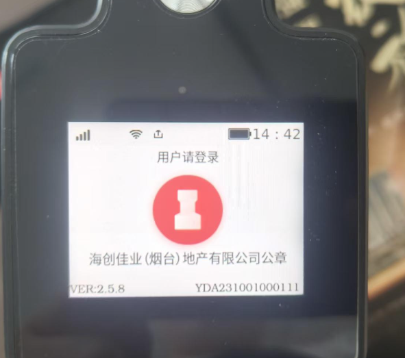
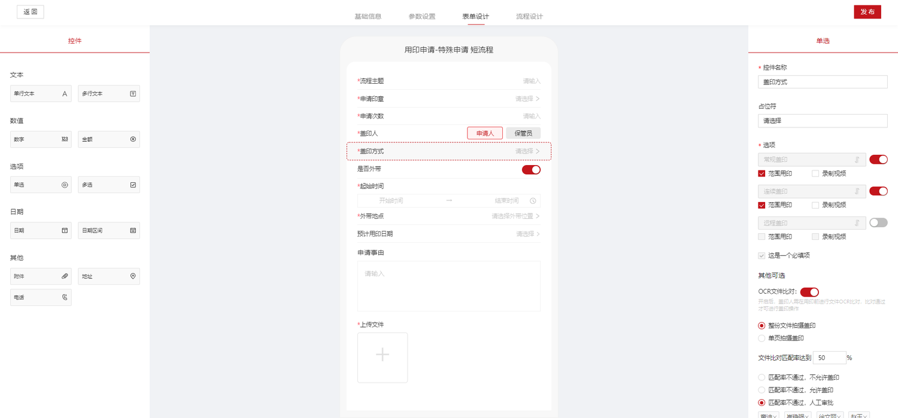
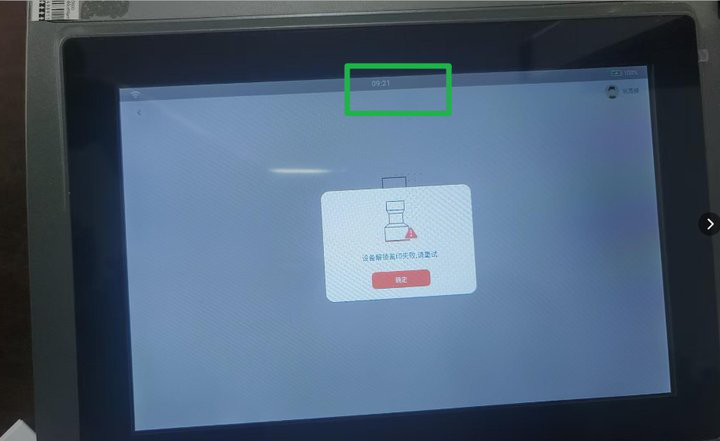

## week log

## 20250707

-----------------

- [ ] 2025-07-07 15:12

0. 反馈时间: 2025-07
1. documentid: 20250707_0
2. 设备id:
3. 问题描述:
   1. 

4. 过程记录:

5. 问题归类:

## 20250708

-----------------

- [ ] 2025-07-08 10:33

0. 反馈时间: 2025-07
1. documentid: 20250708_01
2. 设备id: 设备编码：YDA231201000354
3. 问题描述:
   1. 长兴县人力资源和社会保障局 saas 文件名称：卫生定向培养协议 设备编码：YDA231201000354 盖印人：费艳萍 13666502759 用印时间：7月8日9：27，申请盖印次数60个，只盖了52个，有8次印章没有出来盖到文件上，但是次数核减了，印章机已重启上传日志@宦娟娟
   2. @宦娟娟文件名称：李波调干通知  设备编码：YDA231201000354   盖印人：李苹    也有这个情况
   3. @宦娟娟  常规用印   有60次用印照片
   4. @宦娟娟用户说是盖空章的时候点击没有升降，直接跳到完成了

4. 过程记录:

5. 问题归类:

-----------------

- [ ] 2025-07-08 14:18

0. 反馈时间: 2025-07-03
1. documentid: 20250708_02
2. 设备id:
3. 问题描述:
   1. 金胜粮油集团  私有化 内网  客户申请使用的常规盖印 又开启范围用印
   2. 
   3. 
   4. 客户申请了10次盖印 实际盖印6-7次 实际核减3次 YDA231201000410 YDAT231201000174；同时还有断联的情况，客户调整了印控仪的iP为静态 也是断开；第二个视频还出现常规+范围，识别都设备印章就自动申出盖印了，同样的流程名字用印申请-特殊申请 短流程@谢秀丽
   5. 
   6. @李泽泽是的  15:26发来操作的视频

4. 过程记录:

5. 问题归类:

## 20250709

-----------------

- [ ] 2025-07-09 14:29

0. 反馈时间: 2025-07
1. documentid: 20250709_01
2. 设备id:
3. 问题描述:
   1. 双鸭山市智慧印章项目，设备编号YDA250401000636，客户在使用印章的时候，常规或是连续，印章都没有办法完全出仓
   2. 视频文件

4. 过程记录:
   1. 判断印章运动状态的限位开关异常，寄回检修吧

5. 问题归类:

-----------------

- [ ] 2025-07-11 16:06

0. 反馈时间: 2025-07-09
1. documentid: 20250709_02
2. 设备id:YDAT250302000039
3. 问题描述:
   1. 内蒙古路桥集团 私有化 YDAT250302000039 YDA241101000062印控仪+印章机使用 客户7月8日11:34有出现设备解锁盖印失败,请重试；客户操作重启后可以使用了7月9日15248122995 巩燕峰 登录印控仪 使用09:18 9点21 也出现设备解锁盖印失败,请重试 需要看下什么原因哦@董梦彩
   2. 
   3. 
   4. 玉慧娟：@徐佳飞印控仪提示解锁盖印失败  重启后可以使用了 有图片的
   5. 玉慧娟：@徐佳飞刚和客户核实了 印章机和印控仪 都有重启的
   6. 钱晨浩：@徐佳飞 begin_seal没有回复

4. 过程记录:
   1. 发生了死机，导致没有响应

5. 问题归类:

## 20250710

## 20250711
