## 20250714

-----------------

- [x] 2025-07-14 09:51

0. 反馈时间: 2025-07
1. documentid: 20250714_01
2. 设备id:
3. 问题描述:
   1. @赵万超钱塘区临江街道临江佳苑社区（私有化）：YDA230901000098安装印章后，电机异响严重，盖印过程中，印章卡死，也未伸出，已重新安装过，还是异响严重；麻烦看看什么原因；
   2. 
   3. 
   4. .mp4

4. 过程记录:
   1. Used Network[4G] Api (https://jdsjwzhyzyda.jiande.gov.cn:2443/yindean//equipment/link) Server Timeout/Error!!!
   2. CB BT STATUS : RK_BLE_STATE_IDLE [name: addr:]
   3. 已经寄回检修

5. 问题归类:

-----------------

- [x] 2025-07-14 10:18

0. 反馈时间: 2025-07
1. documentid: 20250714_02
2. 设备id:
3. 问题描述:
   1. 建德市梅城镇洋程村  YDA231001000234  印章机屏幕显示2.5.0   app显示2.3.5，麻烦给客户重新刷一下环境看一下  设备一直连接不上
   2. 建德客户，蓝牙无法配网，登录客户设备，发现4g 私有化服务器访问失败
   3. 设备开机有欢迎语了 但是还是无法连接上设备  网络设置和装卸印章都连接不上设备  已经让客户去拍摄视频了
   4. .mp4
   5. 升级固件后能正常访问了，有可能是缺少了一些文件
4. 过程记录:
   1. 看现象和日志，设备这边网路是正常的，发布状态消息 云端是正常接收到的，但app上点击对应操作,设备并没有收到云端的登录消息@黄体龙 设备只收到 service/reset/invoke 和event/fingerprint_import/post_reply 两个主题消息
   2. app从手机上刷掉  重新打开了一下就好了
   3. 然后我手机就可以连接 就客户手机还不行 我让他看看是不是权限没有给够
   4. 发现还真是权限没有给够

5. 问题归类:

-----------------

- [x] 2025-07-14 15:19

0. 反馈时间: 2025-07
1. documentid: 20250714_03
2. 设备id:
3. 问题描述:
   1. 宁波市鄞州区云龙镇荷花桥村 saas YDA250502000010 没有开远程唤醒，7月11日下午3点半充满以后没有盖印，7月14日 开机就显示没有电了，麻烦查一下设备电池是否有问题
   2. 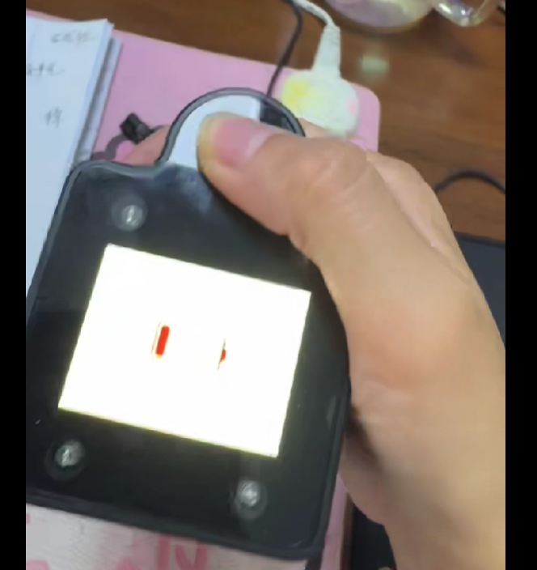

4. 过程记录:
   1. 看11号当天设备工作时长有2个半小时，再加上待机了两三天，这个耗电是正常的s

5. 问题归类:

-----------------

- [ ] 2025-07-14 16:26

0. 反馈时间: 2025-07
1. documentid: 20250714_04
2. 设备id:
3. 问题描述:
   1. 建德市梅城镇龙泉村（私有化）：YDA231001000222印章机，远程升级固件版本至最新版，手机端、运营后台还是显示2.4.7，所有功能都连接不上，陪孩子WiFi蓝牙也连接不上；
   2. 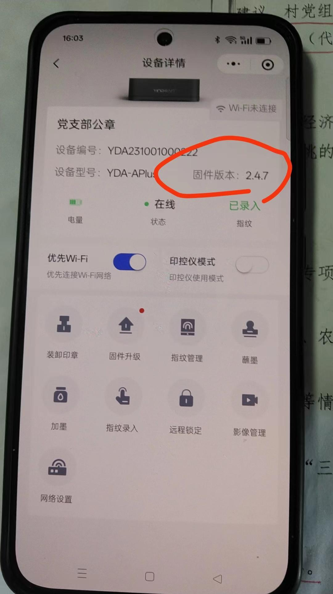
   3. 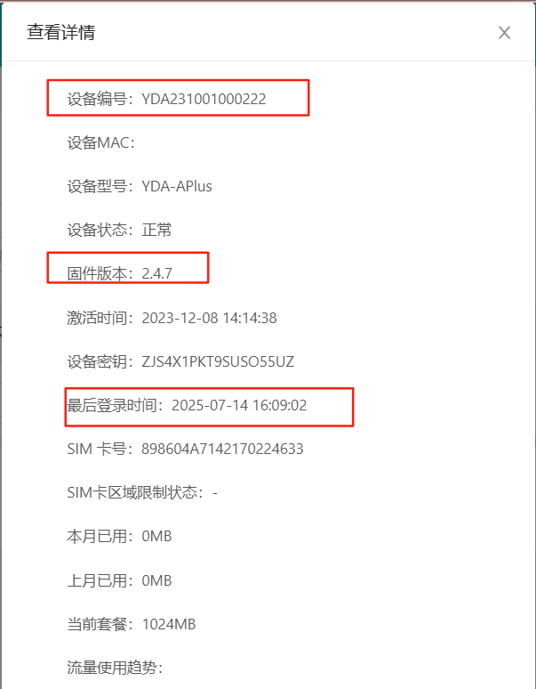

4. 过程记录:
   1. login登录以后
   2. 立马收到登出消息，还来不及上报设备属性

5. 问题归类:

## 20250715

-----------------

- [ ] 2025-07-15 16:45

0. 反馈时间: 2025-07
1. documentid: 20250715_01
2. 设备id:
3. 问题描述:
   1. 客户反应在连续盖章时不统计盖印次数，要求我们排查后给他一个答复，辛苦技术的同事帮帮忙看一下[抱拳]@王凯
   2. 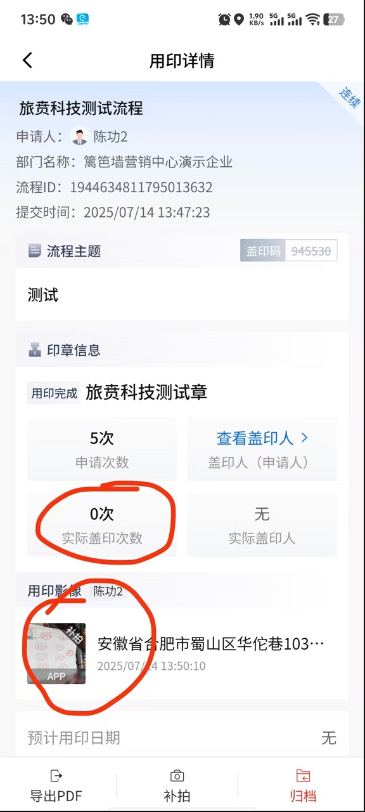
   3. 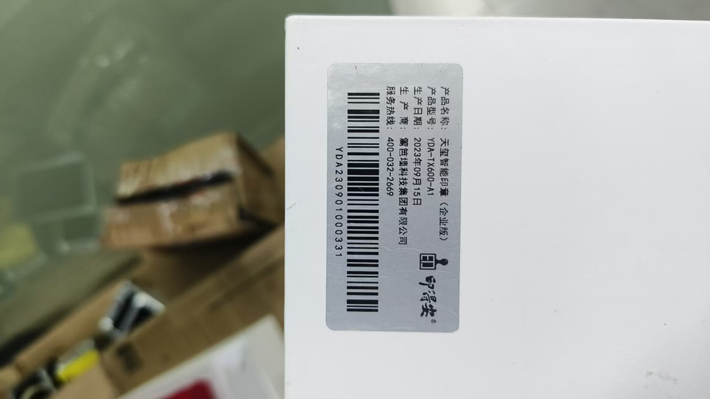
   4. 应该是客户实际没盖印 直接点了完成用印 然后拍摄了补拍

4. 过程记录:

5. 问题归类:

-----------------

- [x] 2025-07-15 17:19

0. 反馈时间: 2025-07
1. documentid: 20250715_02
2. 设备id: YDA250301000219
3. 问题描述:
   1. 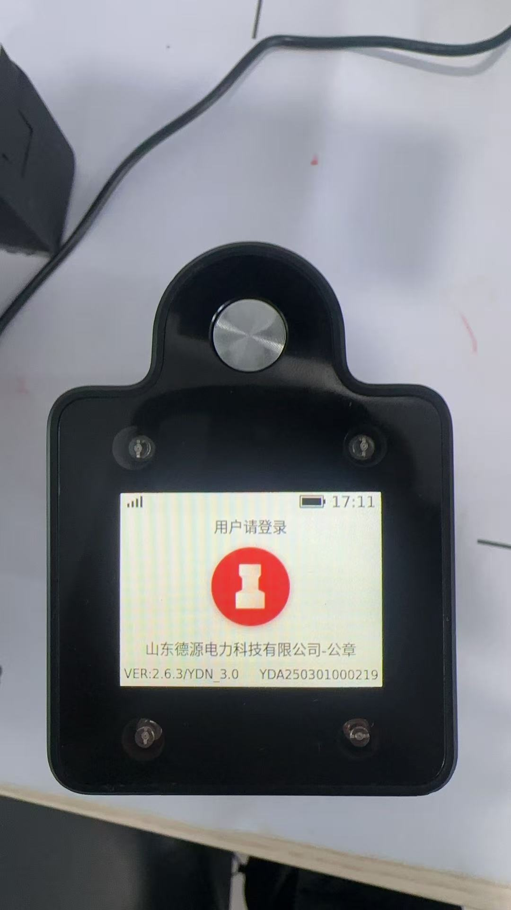
   2. 山东德源电力客户反馈今天下午15点15分左右时出现设备卡死情况，强制关机重启后可以盖章，麻烦帮忙排查一下原因。  操作人：孙朔

4. 过程记录:
   1. 初步判断是在多模块并发工作时，出现了电源干扰，造成系统的不稳定 死机。这个较新固件发生的第一例，让客户先观察一下吧。

5. 问题归类:

-----------------

- [x] 2025-07-15 18:22

0. 反馈时间: 2025-07-14
1. documentid: 20250715_03
2. 设备id:
3. 问题描述:
   1. 内蒙古路桥集团 私有化 YDA241101000062 YDAT250302000039
   2. 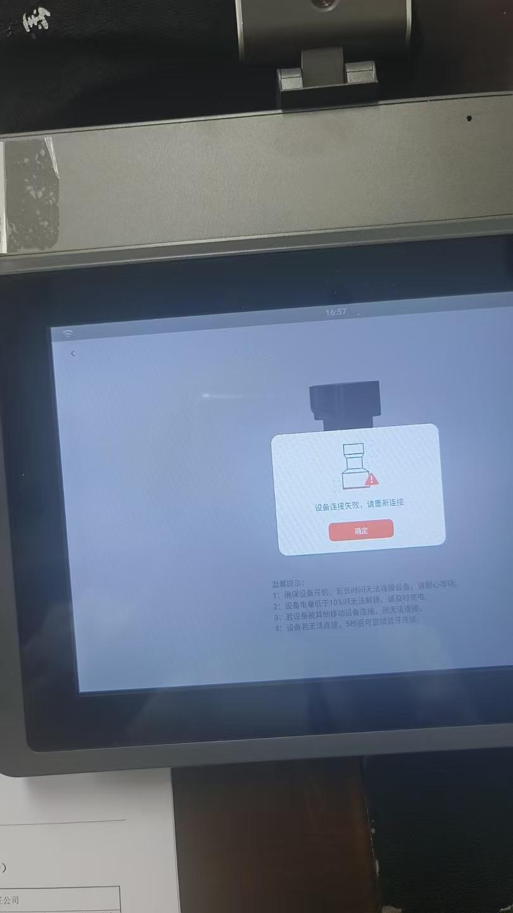
   3. 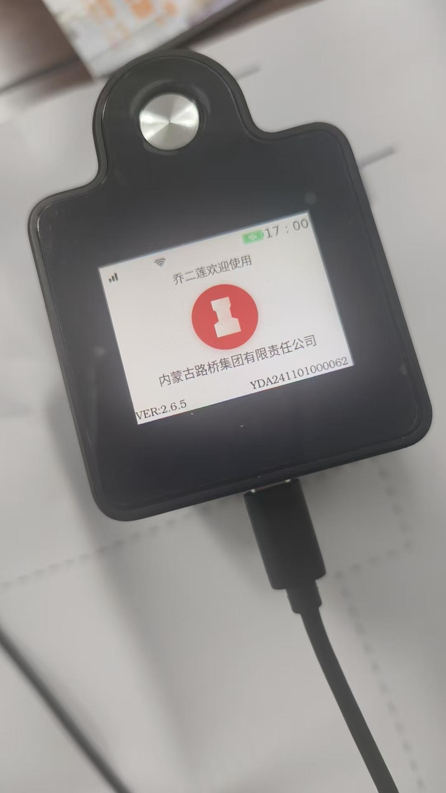
   4. 今天15:42 印控仪+印章机验证指纹的时候 印控仪提示中断了 16:57 印控仪+印章机使用 印控仪提示设备连接失败请重新连接 需要看下什么原因导致印控仪+印章机断开
   5. 从图片来看是有人在用这台设备
   6. 意思就是有人在占用连接这台设备  所以印控仪就是连接不上的状态对吧
   7. 是设备响应超时导致的问题
   8. 还有昨天15:42 印控仪+印章机验证指纹的时候 印控仪提示中断了 这个能看出来是什么情况导致的嘛
   9. 查看日志是 移动端 与云端 心跳超时中断的
   10. 日志显示是，移动端断开mqtt了，导致心跳没发超时，应该这段时间是网络不好
   11. YDA241101000062 设备设置成蓝牙连接策略 +印控仪连接 出现设备连接失败 请重试的 
   12. 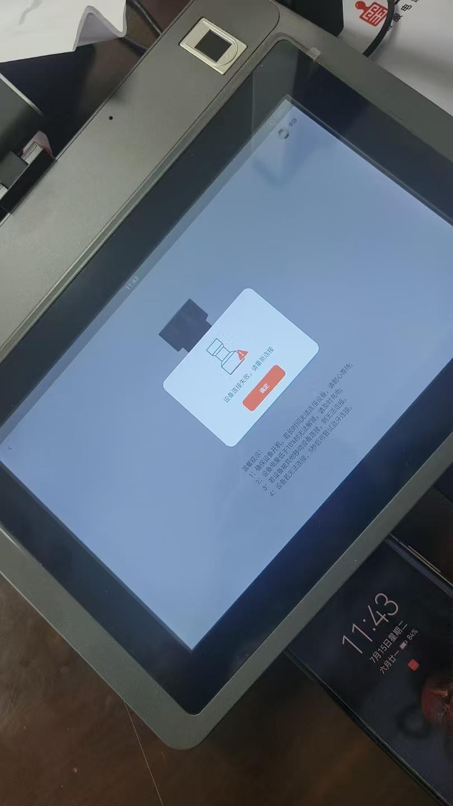
   13. 
   14. 内蒙古路桥集团 1.13848714573  狄青 识别指纹的时候不灵敏 需要识别好久 发生时间5点02了设备编号：YDA241101000062
   2.17:27设备YDA241101000062 操作关机进入倒计时了 按一次设备又开机了 没有关上机
   3.17点31客户再次发生 设备连接中断，请重试
   15. 17:31:45收到了mqtt的user_logout断开消息，所以我这边会弹设备连接中断的提示
   16. 2025-07-15 17:35:34.565   DeviceSysService.offline,{"device":true,"deviceId":"YDA241101000062","messageType":{"code":"OFFLINE","desc":"OFFLINE"},"time":1752572134564,"type":0}  这个时间，设备断开mqtt了，导致云端发出user_logout

4. 过程记录:
   1. 这段时间，设备死机了多次，导致断开
   2. 拿回来处理了

5. 问题归类:

## 20250716

-----------------

- [x] 2025-07-16 11:39

0. 反馈时间: 2025-07
1. documentid: 20250716_01
2. 设备id: YDA230301000083
3. 问题描述:
   1. 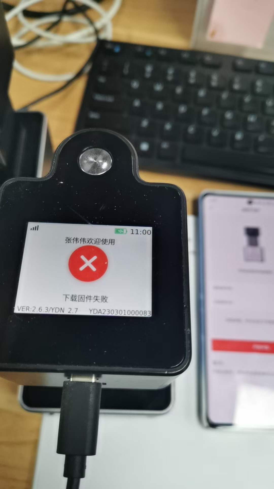

4. 过程记录:
   1. 看日志是下载固件超时了，目前2.6.3是设置的60s超时，配网wifi再试试
   2. 配置WiFi就好了 连接策略是自动 为啥4g不能升级
   3. 有可能是网速过慢，2.6.3是直接默认60秒下载超时，网速慢的情况下没有下载完整就触发超时。当前的超时逻辑还不够灵活，后面版本考虑配合网络带宽设置超时判断

5. 问题归类:

-----------------

- [x] 2025-07-17 14:19

0. 反馈时间: 2025-07
1. documentid: 20250716_02
2. 设备id: YDA241101000075
3. 问题描述:
   1. @董梦彩长兴县雉城街道高家墩村（SaaS）：
   2. 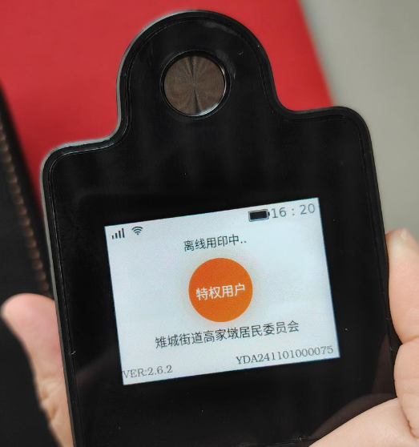
   3. 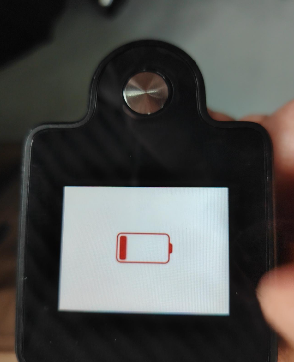
   4. 距离上次充电一周时间，今天上午开机后显示还有2格，上午就盖印10次以内，剩余电量很快就没有了，印章机自动关机了，下午开机时，印章机长按无法开机，客户需排查电池的电量消耗是否正常；
   5. @王雪先升级最新V2.6.4固件吧，2.6.4有优化设备电量相关的问题
   6. @徐佳飞看下YDA241101000075设备电量消耗，日志已上传

4. 过程记录:
   1. 从待机时长，和工作时间看是正常的

5. 问题归类:

## 20250717

-----------------

- [x] 2025-07-17 14:17

0. 反馈时间: 2025-07
1. documentid: 20250717_01
2. 设备id:YDA241101000325
3. 问题描述:
   1. 双鸭山市宝清县朝阳镇曙光村 YDA241101000325常规用印 客户反馈盖了10次，但是盖印次数只核销了8次，还有两次没有核销，但是实际盖在纸上是有10次的 @董梦彩
   2. 

4. 过程记录:
   1. 客户操作有误，不用排查

5. 问题归类:

-----------------

- [x] 2025-07-18 14:44

0. 反馈时间: 2025-07
1. documentid: 20250717_02
2. 设备id: YDA250301000349
3. 问题描述:
   1. 

4. 过程记录:
   1. 设备本身的确是低电量了，一直没有充电，至于app端低电量提醒逻辑和后端确认一下

5. 问题归类:

## 20250718

-----------------

- [ ] 2025-07-18 14:43

0. 反馈时间: 2025-07
1. documentid: 20250718_01
2. 设备id: YDA241101000325
3. 问题描述:
   1. 双鸭山市宝清县朝阳镇曙光村 私有化 YDA241101000325 文件名称：房屋租赁合同，7月18日9点多 app设备实际盖2次，是盖到纸上的，但是只核销了1次，
   2. 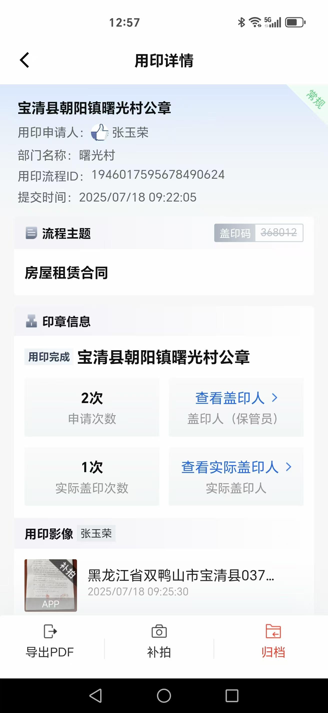
   3. 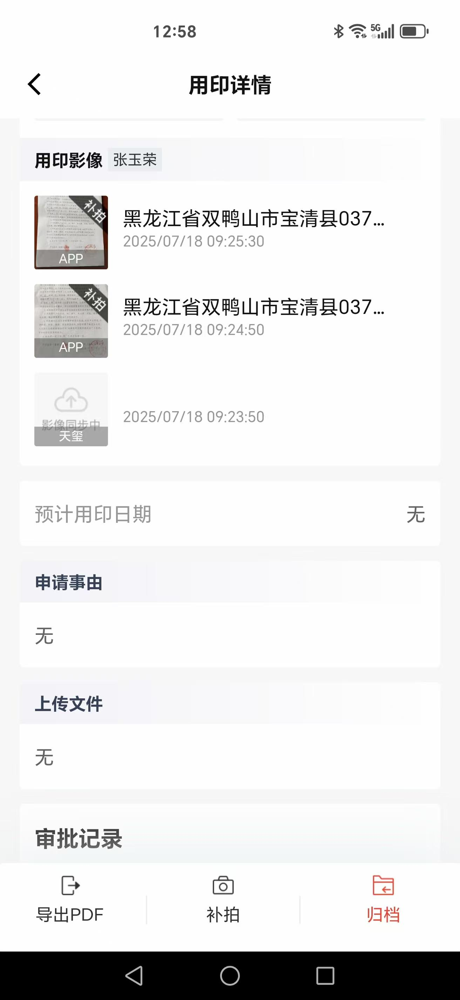
   4. 开机了 看一下有没有日志了  客户反馈是盖了一次以后  语音播报用印完成，然后设备退出连接了，然后当时重新又连接了一次 又盖了一次

4. 过程记录:

5. 问题归类:
