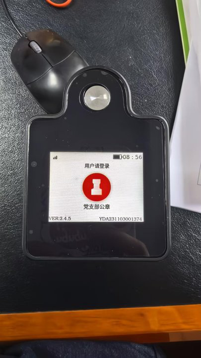
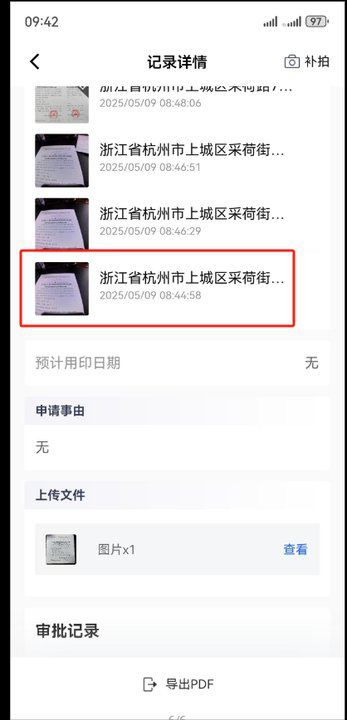
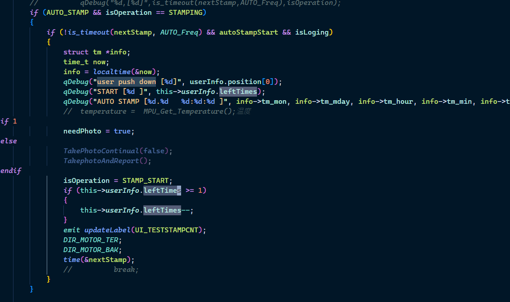
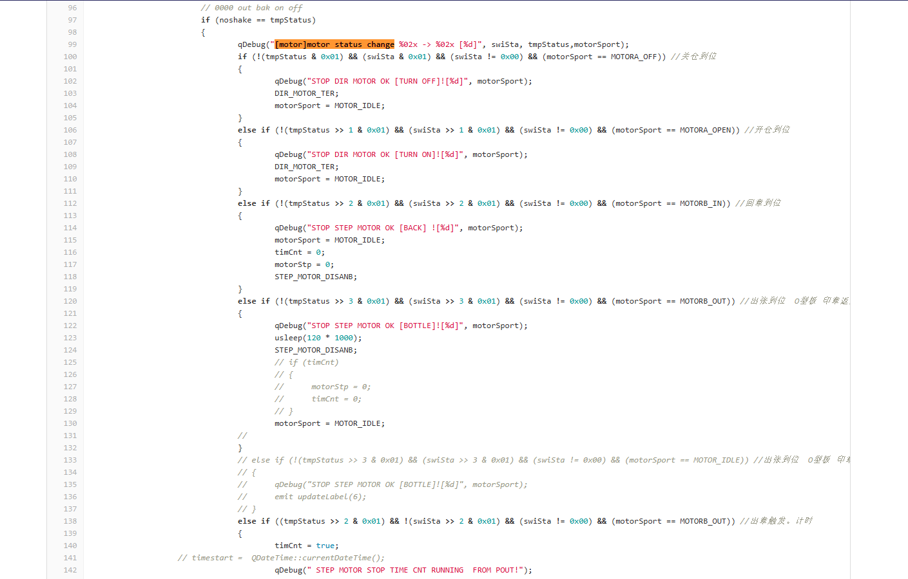
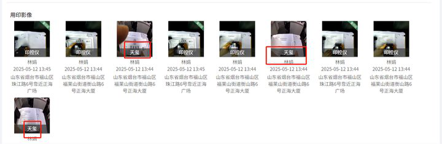
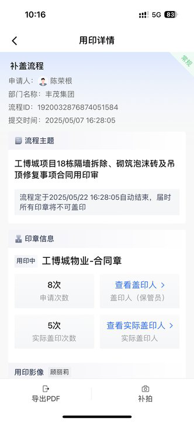
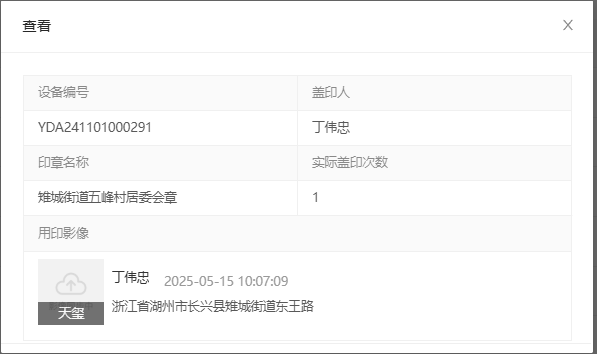

问题：
1. 什么问题会走工单
2. sys.cfg 为空怎么处理？ 私有化环境对应的API 地址是？可以为空？
3. 日志怎么判断是否开启了范围用印？
4. 范围用印的流程？范围用印偏出范围后，app端会如何处理以及印控仪红外端
5. 核减流程？
6. 4G网络有问题如何判断？卡组问题？如何切换网路
7. 天眼是什么
8. get_photo.sh干什么的
9. 当app链接设备的印章不是待用印的印章，会触发app持续录像，这是什么原理？
10. 认证模式下：一印一盖和常规盖印什么区别？
11. 蓝牙用印下 发送盖印次数的部分？
12. 盖印过程中是否会有拍摄素材是和流程一起同步上传的？
13. 如何确定当前用的是4g还是wifi的
14. 电机运动过程的偷盖检测

### 20250509

- [ ] 反馈时间：5月9日 09:51
1. YDA241101000333，双鸭山私有化，9.45分设备仓门无法关仓，电机异响，麻烦看一下@谢秀丽
2. documentid: 20250509_05

- [ ] 5月9日 10:03
1. 赣州市南康区麻双乡松江村，私有化。编号YDA231201001452.无法连接设备，时间：今天9：30-10：00。麻烦查下原因
2. 是什么端无法连接，信息提供详细点哦 APP连接天玺
3. 看着是蓝牙连接失败，确认下蓝牙有没有开启
2. documentid: 20250509_06

- [x] 0509
1. 交付中心-客户交付部
2. documentid: 20250509_07
问题所在阶段
版本体验阶段
问题描述
SaaS 环境红外天玺配合红外印控仪连续盖印时，有盖印不核减的现象，需要排查一下原因，天玺编号为：YDA241101000366 印控仪编码：YDAT240901000016 印控仪连接网线使用，天玺连接WiFi
14:44
o型板存在问题，需检修

### 20250512

- [x] 328308672 客户已经准备好了，有三台要升级
- [ ] 正海集团

1. VER:2.6.2
YDA231201000358
账号：13256992225
@赵万超@谢秀丽用户反馈出现过好几次这种情况：点了用印按钮，用印次数减一，但是仓门未打开。麻烦排查一下！
普通盖印，9点20左右
烟台正海集团科技公司 私有化 内网
2. documentId: 20250512_01
3. analysis:
2025/05/12 09:13:58 [5384] [BT] msgrecv[/>|19|STOPSTAMPV2|#]
2025/05/12 09:12:16 [5384] [BT] msgrecv[/>|45|STARTSTAMPV2|1202~6~4~002~4~1~0~2~0~0|#]
2025/05/12 09:15:09 [1985] [DISPLAY]STATUS UPDATE! cap[60] [0] sig[31] isBlueTooth[1] [mqttsta:3] -1[isloging:1][isOperation:0][diskSize:5772349 KB] 

1. flow
   1. 2025/05/12 09:14:43 [5384] [BT] msgrecv[/>|45|STARTSTAMPV2|1209~6~1~002~4~1~0~2~0~0|#]
   2. 2025/05/12 09:14:46 [194] [Debug] FInger mode wake up ! 194
   3. 2025/05/12 09:14:47 [276] MATCH SUCCESS![2][2]
2. code
   1. void rk_pollevent::anlasyBTmsg(char *msg) 处理蓝牙消息
   2. void rk_pollevent::Ble_STOPSTAMP_Dispose_V1(char* msg, char* replymsg) 处理停止盖印消息


- [x] 广西桂科院铝业有限公司 SaaS 客户设备开机又开卡在开机动画页面了 客户着急使用 需要远程
1. 更新固件
2. documentid: 20250512_02
3. @徐佳飞给客户推ydn-rk程序之后在用chmod 111 命令改一下程序的权限。
```bash
[root@RV1126_RV1109:/oem]# ls -l
ls -l
total 2695
-rwxrwxrwx 1 root     root          57 Jan 11  2023 AppStart.sh
drwxrwxrwx 2 root     root        1024 Aug 11  2017 Backup
-rwxrwxrwx 1 root     root       17284 May  7 19:19 RemoteTurnOn
-rwxr-xr-x 1 root     root         497 Nov 11  2022 RkLunch-stop.sh
drwxrwxr-x 2 root     root        1024 May  7 19:19 audio
-rwxrwxrwx 1 root     root       12932 May  7 19:19 daemon_service
-rwxrwxrwx 1 root     root         214 May  7 19:19 get_photo.sh
-rw-r----- 1 root     root      333903 May  7 11:44 log_202505071120.txt
-rw-r----- 1 root     root         670 May  7 11:25 log_record_202505071120.txt
-rw-r----- 1 root     root         899 May  7 11:25 log_take_202505071120.txt
drwxr-x--- 2 root     root        1024 Aug 29  2024 loginfo
drwx------ 2 root     root       12288 Mar 30  2024 lost+found
-rw-rw-rw- 1 root     root         401 May  7 11:44 new_sys.cfg
drwxr-x--- 2 root     root        1024 May  7 11:02 offlineData
drwxrwxr-x 2 root     root        1024 Aug 24  2024 pic
-rw-r----- 1 root     root         377 May  7 11:44 sys.cfg
-rw-rw-rw- 1 root     root         391 Apr 29 17:36 sys_tmp.cfg
-rw-r--r-- 1 root     root      319488 Nov 11  2022 sysconfig-2K.db
-rw-r--r-- 1 root     root      315392 Nov 11  2022 sysconfig-4K.db
-rw-r--r-- 1 root     root      319488 Nov 11  2022 sysconfig-5M.db
lrwxrwxrwx 1 root     root          20 Aug  6  2024 sysconfig.db -> /oem/sysconfig-4K.db
drwxr-xr-x 6 root     root        1024 Dec  7  2022 usr
-rw-r----- 1 root     root           2 Aug  6  2024 wifi_priority
drwxr-xr-x 4 www-data www-data    4096 Aug  6  2024 www
-rwxrwxrwx 1 root     root     1838628 May  7 19:19 ydn-rk
```
看文件都在的，也能运行
长按重启的原理？
我已经改权限了，让用户关注一下问题会不会复现。备用机客户已经在用了吗，有没有出现类似问题

广西桂科院铝业有限公司YDA231103001074@梁丙政
那这台拿回来先给你们看下还是直接让维修人员更换CPU呢，客户这一台出现频率有点高
有芯片专门负责关机
@徐佳飞@姚远@罗庆桃去年八月一日有一台情况类似的设备，同样卡在玺的安logo，重启有概率正常开机。与广西铝业这个设备情况类似。当时的维修情况是设备开机进入maskrom，取回更换了cpu。
最终处理：寄回设备


- [x] @谢秀丽@董梦彩上城区四季青街道杭州常青股份经济合作社（私有化）：用印时，按压盖印键后舱门卡舱，只开启了一半，导致次数已核减，未实际发生盖印，麻烦看看印章机是否正常；
1. 
2. 
3. 
4. documentid: 20250512_03
5. @王雪 仓门只开启一半后，后面是自动归位了吗，还是处于死机状态 客户重启了
6. @徐佳飞客户重启了
7. 5月9号 8：40左右是吧
8. YDA231103001374
9. log
   1. 2025-05-09 08:44:46 [Debug] [1049] [MQTT] APP LOGIN!
   2. 2025-05-09 08:44:46 [Debug] [2477] [MQTT] analyst->public topic: /sys/yda/YDA231103001374/service/user_login/invoke_reply
   3. 2025-05-09 08:44:49 [Debug] [847] [MQTT] analyst topic: /sys/yda/YDA231103001374/service/begin_seal/invoke 
   4. 印章已连接，请验证指纹 : 
   5. 2025-05-09 08:44:52 [Debug] [274] MATCH SUCCESS![3][3]
   6. 2025-05-09 08:44:52 [Debug] [2832] [mplayer -af volume=-10 /oem/audio/10002.wav &] 印章已解锁，请点击按钮开始用印
   7. 2025-05-09 08:44:57 [Debug] [4276] FUNCTION_KEY: 111
   8. 2025-05-09 08:44:57 [Debug] [4337] user push down [4]
   9. 2025-05-09 08:44:57 [Debug] [4338] START [3 ] 对应
   10. 盖印模式sealPattern和印章类型 sealType：2025-05-09 08:43:56 [Debug] [848] [MQTT] message: {"id":"084507486","time":1746751507486,"params":{"voice":true,"wifiPriority":1,"sealName":"党支部公章","sealId":176,"sealPattern":1,"reset":false,"reconnection":false,"sealType":2,"offTime":5,"remoteLock":false,"bell":false}} 
   11.  在这里
   12. 2025-05-09 08:44:57 [Debug] [283] [MOTOR] motor status [4] 对应MOTORA_OPEN  按理说应该有开仓到位
10. log2
    1. 2025-05-09 08:45:08 [Debug] [1078] MQTT sent (pubEnvir:1) : /sys/yda/YDA231103001374/event/property/post 设备上传属性
    2. 2025-05-09 08:43:57 [Debug] [2832] [mplayer -af volume=-10 /oem/audio/10001.wav &]
    3. 2025-05-09 08:43:56 [Debug] [847] [MQTT] analyst topic: /sys/yda/YDA231103001374/service/reset/invoke 
    4. 2025-05-09 08:43:57 [Debug] [847] [MQTT] analyst topic: /sys/yda/YDA231103001374/event/fingerprint_import/post_reply 
    5. 2025-05-09 08:44:46 [Debug] [847] [MQTT] analyst topic: /sys/yda/YDA231103001374/service/user_login/invoke 
    6. 2025-05-09 08:44:46 [Debug] [2832] [mplayer -af volume=-10 /oem/audio/10012.wav &]
    7. 2025-05-09 08:44:49 [Debug] [847] [MQTT] analyst topic: /sys/yda/YDA231103001374/service/begin_seal/invoke
    8. 2025-05-09 08:44:49 [Debug] [2832] [mplayer -af volume=-10 /oem/audio/10006.wav &]
    9. 2025-05-09 08:44:52 [Debug] [2832] [mplayer -af volume=-10 /oem/audio/10002.wav &]
    10. 2025-05-09 08:44:57 [Debug] [4334] FUNCTION_KEY: 111
    11. 2025-05-09 08:44:57 [Debug] [4337] user push down [4]
    12. 2025-05-09 08:44:57 [Debug] [1078] MQTT sent (pubEnvir:1) : /sys/yda/YDA231103001374/event/click/post
    13. 2025-05-09 08:44:57 [Debug] [2962] p_poll->userInfo.identity[0] lefttimes [2] opt[10]
    14. 2025-05-09 08:44:57 [Debug] [283] [MOTOR] motor status [4]
    15. 2025-05-09 08:44:58 [Debug] [4405] [STAMPING]: taking photo
    16. 2025-05-09 08:44:58 [Debug] [1078] MQTT sent (pubEnvir:1) : /sys/yda/YDA231103001374/event/document_state_uploading_event/post
    17. 电机2025-05-09 08:44:58 [Debug] [99] [motor]motor status chang  e 0a -> 0b [4]   对应代码 qDebug("[motor]motor status change %02x -> %02x [%d]", swiSta, tmpStatus,motorSport);  0a表示复位状态 0b表示舱门打开或关闭  4表示MOTORA_OPEN
2025-05-09 08:44:58 [Debug] [5574] limit Switch [0b][10][1][0] 对应 qDebug("limit Switch [%02x][%d][%d][%d]", sta, isOperation, isLoging, motor_sta);
2025-05-09 08:44:58 [Debug] [5575] limit Switch  UpdateLimitSwitch [5575]
2025-05-09 08:44:58 [Debug] [5989] quit function[UpdateLimitSwitch]

    18. 2025-05-09 08:44:58 [Debug] [847] [MQTT] analyst topic: /sys/yda/YDA231103001374/event/document_state_uploading_event/post_reply
    19. 2025-05-09 08:45:18 [Debug] [3954] [DEVICE MOTOR ERR]:run 3954
    20. 2025-05-09 08:45:18 [Debug] [1078] MQTT sent (pubEnvir:1) : /sys/yda/YDA231103001374/event/abnormal_warning_event/post
客户再次反馈印章直接卡死，操作待用印连接、装卸印章连接均卡舱无法正常打开，印章与舱门卡死，拨动舱门叶片、向下按压印章将印章向舱内回推都没有反应
由于客户印章无法取出，申请上门工单饿

@王雪 常规盖印是点击按钮后就触发核减的，第一次按下后，先核减，然后设备开舱中，客户反馈只开了一半，日志中限位开关也处于开舱状态，最后是触发了20s的动作超时，发出异常警报。后面退出用印后再进，电机复位就正常了。第一次有可能是机械结构卡住了

@王雪 这台设备如果经常发生卡舱的话就寄回来检修吧

### 20250513

0. 5月13日 15:24
1.  4g图标看不见
2. 设备环境不对，奥德私有化的，需要远程处理一下
[root@RV1126_RV1109:/oem]# cat sys.cfg
cat sys.cfg
STAMPINSTALL:0
STAMPNAME:
SEALID:-1
DEVICEINFO:YDA231201000775
MQTTPASSWD:4z0Scvbkh2DH0ZiDCD6tKA==
MQTTUSERNAME:YDA231201000775&yda
CLIENTID:7292046b-9bb8-451d-bc11-b47318eaa90b|time=1742952464990
ISUPGRADE:0
VERSION:2.3.7
STAFFNAME:
ENVIRONMENT:1
VOICE:2
LOCK:0
SEALTYPE:1
PUBLISH:1
KEY:YBJOK4KHQWFF23B6PY
IP&PORT:
API:
SUPERUSER:
SEALDISTANCE:0
AXISOFFSET:0
SEALPATTERN:0

[root@RV1126_RV1109:/oem]# ls -l
ls -l
total 2309
-rwxrwxrwx 1 root     root          57 Jan 11  2023 AppStart.sh
drwxrwxr-x 2 root     root        1024 Jan 11  2023 Backup
-rwxr--r-- 1 root     root       13728 Jun 26  2024 RemoteTurnOn
-rwxr-xr-x 1 root     root         497 Nov 11  2022 RkLunch-stop.sh
-rwxr-xr-x 1 root     root        3641 Mar 21  2024 RkLunch.sh
drwxrwxr-x 2 root     root        1024 Jun 26  2024 audio
-rw-r--r-- 1 root     root         374 May 13 15:41 bak_sys.cfg
-rwxrwxrwx 1 root     root        5516 Jun 26  2024 daemon_service
-rwxr-xr-x 1 root     root         193 Mar 11  2024 get_photo.sh
-rw-r----- 1 root     root      232975 May 13 15:41 log_202505131533.txt
drwxr-x--- 2 root     root        1024 May 13 15:33 loginfo
drwx------ 2 root     root       12288 Jun 26  2024 lost+found
drwxr-x--- 2 root     root        1024 Mar 26 17:23 offlineData
drwxrwxr-x 2 root     root        1024 Mar 26 09:24 pic
-rw-r--r-- 1 root     root         374 May 13 15:26 sys.cfg
-rw-r----- 1 root     root         374 May 13 15:26 sys_tmp.cfg
-rw-r--r-- 1 root     root      315392 Nov 11  2022 sysconfig-1080P.db
-rw-r--r-- 1 root     root      319488 Nov 11  2022 sysconfig-2K.db
-rw-r--r-- 1 root     root      315392 Nov 11  2022 sysconfig-4K.db
-rw-r--r-- 1 root     root      319488 Nov 11  2022 sysconfig-5M.db
lrwxrwxrwx 1 root     root          20 Mar 26 17:23 sysconfig.db -> /oem/sysconfig-4K.db
drwxr-xr-x 6 root     root        1024 Dec  7  2022 usr
drwxr-xr-x 4 www-data www-data    4096 Mar 26 17:23 www
-rwxr-xr-x 1 root     root     1383064 Jun 26  2024 ydn-rk

没有发现new_sys.cfg

2. documentid: 20250513_01
3. 拨号无法成功


- [ ] 设备4G满格，天眼连接不上设备，会和设备正在上传文件有关系吗？需要查一下

YDA240901000008    看一下这个
16:43
我重启后就可以盖印了，重启前试了7次，重新输入盖印码
documentid: 20250513_02


- [x] 烟台正海集团科技公司（私有化，内网）
反馈是指纹登录的印控仪，确定点的待用印是 流程ID：1920713653830361088这个待用印

，但是查用印记录的时候发现是用的这个待用印，流程ID：1920755280322043904，

，客户说他确认他点的是id尾号1088这个待用印，不知道为什么把流程ID：3904的用掉了，麻烦查一下

@梁丙政根据客户描述是 次数自己恢复的 导致后面素素接到的问题

@于红娟一共申请了4次用印，设备实际盖了3次，没看到有自己恢复啊

是一共申请4次盖印3次，设备盖印时盖印次数核减了，但是章没伸出来，设备提示次数用尽，然后客户就反馈给我们了，然后客户发现后台还显示剩余一次（就是上面素素的问题）@梁丙政

@于红娟后台的剩余找前后端问下，设备这边没有自动恢复。少一次的原因主要是使用的用印模式有些问题。尽量不要用范围，或者拍摄的时候稳一些，因为核减在按钮按下就核减掉了。

**不是我干的**

- [x] 正海集团（集团公司），内网私有化客户。设备编号：YDA231201000732，账号：13505352987。
时间5-12 13:40左右。申请了7次，只盖了三次，但是显示已盖印四次


1. documentid: 20250514_01
2. @郭铸瑭 这个蓝牙连接，认证模式下沾墨章盖印，第一次盖印点击按钮后，盖印次数核减，由于事件标志异常没有被设置为期望值，导致印章伸出到达沾墨状态后，没有进入下一步的电机动作，而设备盖印次数的反馈是在后续舱门打开这个动作执行的时候发送的， 所以剩余次数从7->6，app端没有收到盖印回复。直到用户第二次点击后，事件标志被设置正常，完成完整的盖印动作，才第一次将5次剩余次数反馈到app端。这是当前软件bug，要等重构版本修复了
3. 总结和remotelock无关

@王刘素

设备上传上来的次数有问题  直接是从剩余5次开始给的

@王刘素让嵌入式查查为什么第一次给的是5而不是6 

- [x] @谢秀丽@董梦彩丰茂集团（SaaS）：APP连接YDA231103001403印章机盖印，APP与印章机频繁出现自动断开连接的情况，盖一份合同自动断连了3次；客户使用了多个待用印了均会自动断连，麻烦排查原因；
问题反馈时间：5.14 9:26 10:43 左右



@董梦彩APP连接的，印章机语音提示已退出登录，没有其他提示，APP提示设备中断

@王雪设备信号没满格，推测是网络状态影响。如果用户急着用印的话可以先蓝牙，或者给设备先配上WiFi
documentId: 20250514_02
@王雪 从设备端5月14日10：05到10：11盖印过程对应的日志上看，设备没有主动登出断开的操作，但在每次盖印后会频繁收到云端发出的登出消息，需要 web端和app前端的同学看一下，触发登出消息以及app显示断开的原因


- [x] 平阳县万全镇下桥村 saas 客户 YDA231201000549 客户反馈设备大约昨天下午开始充电，充到今天早上，大约九点-10点开机就显示低电量 没充进入，下午还在充还是没充进入电，麻烦排查看下是不是设备电池有问题，设备使用的是原装充电器的，现在就一直插着充电器（因为客户是有一段时间没使用了）@董梦彩
1. 状态： 不需要排查了


// ==============================================================================

- [x] 2025-05-15 15:55

0. 反馈时间: 2025-05 5月13日 15:30

1. documentid: 20250513_05

2. 设备id: YDA231201001485

3. 问题描述:
   1. 
   2. 奥德集团这个问题麻烦再看一下
   3. 我们有临时解决办法吗
   4. 人工执行重新解析接口
   5. 黄体龙:
      @雷晓龙我们来操作  让用户提供一下文件的编码
   6. 会提醒用户已退出，失去连接
   7. 你在看下呢 客户是奥德私有化最新的版本app
   8. 刚才app打开的用户名字账号 是韩晓13370667173
   9. 问题不是说 ocr比对的时候 设备退登吗？
   10. @于红娟   表现是  设备播报中断，app 弹出了设备中断的弹窗吗？
      看日志是在大概17：04的时候 设备退登录
   11. {"device":true,"deviceId":"YDA231201001485","event":"user_logout","id":"340","messageType":"EVENT","time":1747127081,"type":0}
   12. 这个时间点设备发出一条退出指令，应该是用户长按设备导致的，嵌入式需要明确一下。云端收到之后，向前端转发了一条退出指令。
   13. 目前固件就是存在, 长按关机, 进入假关机或者按到退出登录的情况, 设备不会发出event/user_logout的情况
   14. 但是这个日志显示，设备是发出退出指令了

4. 反馈人员: yuhuijuan

5. 问题状态:

6. 过程记录: 设备在登录状态下，没有进行其他盖印相关的操作以及没有被锁定的情况下，如果mqtt连接断开或者没有视频待上传的话，会触发待机关机的逻辑，关机前会发出退出指令

7. 问题归类: 用户退出，自动关机

```bash

```

// ==============================================================================

### 20250515

// ==============================================================================

- [x] 2025-05-16 09:23

1. 反馈时间: 2025-05-15

2. documentid: 20250514_03

3. 设备id: YDA241101000291

4. 问题描述:
   1. saas 长兴县雉城街道五峰村  YDA241101000291用印人：丁伟忠 13967258377 印章名称 雉城街道五峰村居委会章 客户使用特权 从2025-05-14 10:06:46 影像到2025-05-15  天玺的用印影像都是影像同步中
   2. 截止到5月16日 特权用印都没有影像  也是不同步影像
   3. 
   4. 
   5. 
   6. @谢秀丽 对 客户目只是使用特权 昨天刚更换上的设备  这个村社另一台设备 影像没问题

5. 反馈人员:

6. 问题状态:解决

7. 过程记录:重推拍照录像相关的bin文件，并且重启程序了

8. 问题归类:
   1. 影像素材上传

```bash

```

// ==============================================================================

// ==============================================================================

- [x] 2025-05-16 16:01

0. 反馈时间: 2025-05

1. documentid: 20250516_01

2. 设备id:

3. 问题描述:
   1. 丰茂集团  SaaS 设备编号为：YDA230301000170 客户反馈设备盖印盖一次，就用户已退出了，让客户设置蓝牙连接策略下，客户14:45操作盖印盖两次，也是用户已退出，14:55也是，需要查下为什么会频繁用户已退出
   2. 看视频就是盖印完一次后，就退出登录

4. 反馈人员:

5. 问题状态:

6. 过程记录:
   1. @于红娟这台设备日志乱码，排查不了，但从现象上看有点像丰茂集团 前面那个mqtt用印退出的问题
   2. 先让后端和前端同学排查刚才那个问题

7. 问题归类:

```bash

```

// ==============================================================================

1. 确定内网是否有问题，确定是使用4g还是wifi?