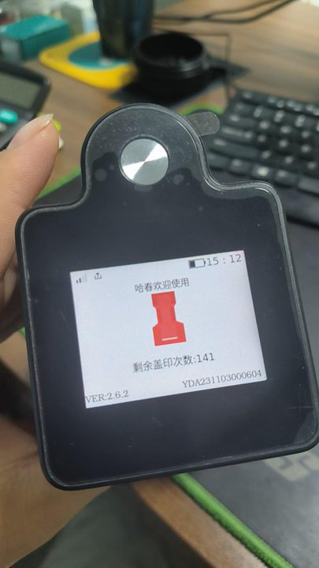
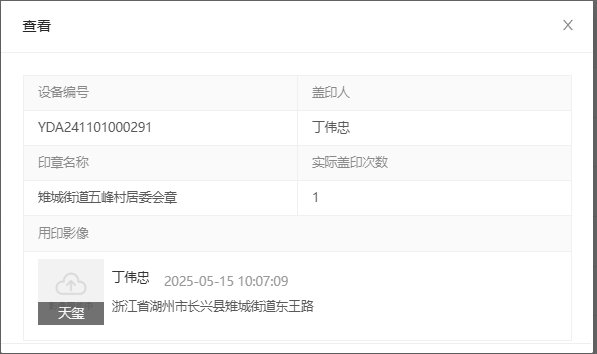

### 问题


2. 烧录镜像，设备编号是否会变？还是固件？
3. 电量估算方式:电压映射型电量估算
4. 系统工作截止电压
5. 电池放电截止电压
6. 电池可用电量区间 4.2v-3.0v，但设备电路工作要求的电量区间在 4.2v-3.6v，所以在40%左右，设备就应该关机了

### 20250519

// ==============================================================================

- [x] 2025-05-19 15:45

0. 反馈时间: 2025-05 15:25

1. documentid: 20250519_01

2. 设备id:

3. 问题描述:
   1. YDA241001000482  山东天鹅设备出现异响问题  麻烦排查一下问题原因

4. 反馈人员:

5. 问题状态: 解决
   1. 4g模块和电机同时工作，瞬时电流过大，导致主板系统死机了

6. 过程记录:这台看起来也是死机了，让客户长按关机
   1. 需要远程看一下日志

7. 问题归类:

```bash

```

// ==============================================================================


// ==============================================================================

- [x] 2025-05-19 15:47

0. 反馈时间: 2025-05

1. documentid: 20250519_02

2. 设备id:

3. 问题描述:
   1. 宁夏鑫利达建筑工程有限公司（SaaS）： YDA231103000604印章机连接状态，APP已断连，印章机无法退出，长按盖印键12秒以上也无法强制关机；
   2. 
   3. 
   4. 这台看起来也是死机了，让客户长按关机

4. 反馈人员:

5. 问题状态:

6. 过程记录:

7. 问题归类:

```bash

```

// ==============================================================================


// ==============================================================================

- [x] 2025-05-19 15:48

0. 反馈时间: 2025-05

1. documentid:

2. 设备id:

3. 问题描述:
   1. saas 长兴县雉城街道五峰村 YDA241101000291用印人：丁伟忠 13967258377 印章名称 雉城街道五峰村居委会章 客户使用特权 从2025-05-14 10:06:46 影像到2025-05-15 天玺的用印影像都是影像同步中
   2. 
   3. 
   4. 设备网络良好，
   5. 
   6. 刚电话还让客户配置WiFi重启设备 影像也没上传@周青媛@谢秀丽

4. 反馈人员:

5. 问题状态:

6. 过程记录:
   1. 已经重新推录像拍照相关bin文件了，重试后可以
   2. 可以远程客户，登录一下设备吗，从日志上看，拍照录像的ipc进程通信失败，有可能是相关的程序文件损坏了，导致没有视频生成，上传失败

7. 问题归类:

```bash

```

// ==============================================================================

### 20250520

// ==============================================================================

- [x] 2025-05-20 11:32

0. 反馈时间: 2025-05 10:59

1. documentid: 20250520_01

2. 设备id:

3. 问题描述:
   1. 青岛康普顿（私有化）设备跳环境了 需要排查一下原因 和恢复一下环境
   2. 
   3. 

4. 反馈人员:

5. 问题状态:

6. 过程记录:
   1. 
   2. 配置文件被清空了，最近有没有长时间未使用印章或者强制关机的操作。
   3. @于红娟没有，好了我会说的。设备是不是很长时间没有联网了
   4. @梁丙政对 客户是禁用4g的
   5. @于红娟设备里堆积的日志已经超出该分区上限了，导致配置文件丢失。要恢复需要清空或者备份日志文件
   6. @梁丙政要恢复需要清空或者备份日志文件  设备内的影像会不会有影响呀
   7. @于红娟不会，日志备份也没什么意义了，现在日志也有被清空的清空
   8. @于红娟日志已经清空了，设备开机了。更换下印章看看
   9. @于红娟长时间不联网日志没有传输，246的固件可能没有对存储做限制导致分区写满了。
   10. @梁丙政我看客户之前天玺的用印记录 影像没有上传 给设备配置WiFi后 之前的数据也能正常上传吧

7. 问题归类:
   1. 文件系统异常，导致原因，长时间没有联网，日志堆积，导致超出文件系统上限，存储异常，影响到其他文件
8. 排查人员: 梁秉政

```bash

```

// ==============================================================================


// ==============================================================================

- [x] 2025-05-20 16:31

0. 反馈时间: 2025-05 16:31

1. documentid: 20250520_02

2. 设备id:

3. 问题描述:
   1. YDAT231001000103，东海药业，私有化，客户说又出现了一次设备异响的问题，是发声在盖章之后自动拍照的时候嗡嗡的响然后也不自动提醒用印造成，一直死机后来重启好的，麻烦给看下情况

4. 反馈人员:

5. 问题状态: 结束

6. 过程记录:
   1. 查不到日志
   2. 这个现象就是死机了，客户是用的4g吗，让他暂时连wifi用印

7. 问题归类:

8. 排查人员:

```bash

```

// ==============================================================================

### 20250521

// ==============================================================================

- [ ] 2025-05-21 09:17

0. 反馈时间: 2025-05-21 09:12

1. documentid: 20250521_01

2. 设备id: YDA231201000064

3. 问题描述:
   1. 千秋镇    YDA2312011000064  待用印、加墨、装卸印章都开不了仓门  麻烦查一下@董梦彩
   2. @王刘素YDA231201000064你上面多扣了个1，让用户重启下上传最新日志@徐佳飞看下这台设备
   3. 刚刚让用户去点击一下装卸印章 现在报印章异常了@徐佳飞客户着急用印，麻烦尽快查一下
   4. 有视频

4. 反馈人员:

5. 问题状态:

6. 过程记录:
   1. 让客户重启以后再尝试一下卸章，卸章时用手拨转一下舱门，如果还不能自动打开就只能安排上门协助客户卸章了

7. 问题归类:
   1. 电机问题

8. 排查人员:

```bash

```

// ==============================================================================


// ==============================================================================

- [ ] 2025-05-21 09:30

0. 反馈时间: 2025-0514 15:48

1. documentid:

2. 设备id:

3. 问题描述:
   1. 问题1：查电显示红格，开机进去后显示的是满格，3分钟左右会迅速掉到1格

4. 反馈人员:

5. 问题状态:

6. 过程记录:

7. 问题归类:
   1. 电池电量统计

8. 排查人员:

```bash

```

// ==============================================================================

// ==============================================================================

- [x] 2025-05-21 14:36

0. 反馈时间: 2025-05-21 14:14

1. documentid: 20250521_02

2. 设备id: YDA231103000406

3. 问题描述:
   1. @董梦彩建德市乾潭镇下梓村（私有化）：连接用印时，YDA231103000406印章机在验证指纹阶段卡死，验证指纹无反应，强制重启已可以使用，但客户要我们排查异常原因：已经是WiFi网路使用，麻烦排查一下原因；--排查时间根据视频中异常时间排查；

4. 反馈人员:

5. 问题状态:

6. 过程记录:

7. 问题归类:
   1. 指纹问题
   2. 看日志是在指纹服务器验证部分出了问题，但这个固件版本有些老，这部分日志什么和现在的对不上，我先看看远程仓库里能不能找到对应的代码然后再具体分析
   3. 指纹匹配成功后，在访问指纹服务器阶段阻塞，导致ui线程卡住，相关逻辑阻塞，这个定义为软件bug，要等重构版本解决了

8. 排查人员:

```bash

```

// ==============================================================================


// ==============================================================================

- [x] 2025-05-21 17:27

0. 反馈时间: 2025-05-21

1. documentid: 20250521_03

2. 设备id:

3. 问题描述:
   1. 湖北兴土中隧桥波形成套技术有限公司 YDA231103000991 客户反馈电池不耐用，今天还出现电量还有差不多60%，然后就突然关机，客户觉得还有60%的电是看的app上的显示，上次充电5月10日左右，充完后盖过10多分钟的章，麻烦查一下@董梦彩
   2. 
   3. 
   4. @董梦彩SaaS用户

4. 反馈人员:

5. 问题状态:

6. 过程记录:
   1. 看日志电池电压已经3.7v了，这个时候放电能力已经比较弱了，快接近关机了
   2. 数值上是50左右，40低电量报警，35自动关机
   3. 看日志，21号设备是空闲自动关机的，这个时候电量在50左右偏低，但没发现客户描述的突然关机，也还没到低电量报警。开机用印时和闲置时的功耗正常，关机后24h耗电稍微高了点，但也算正常；让客户先观察一下。

7. 问题归类:

8. 排查人员:

```bash

```

// ==============================================================================


// ==============================================================================

- [x] 2025-05-21 17:32

0. 反馈时间: 2025-05-21 16:04

1. documentid: 20250521_04

2. 设备id:YDA231103000637

3. 问题描述:
   1. 青岛康普顿 私有化 对接泛微OA 申请人 朱振勇 文件名称:山东胜动-订购单 操作时间 今天10点56 操作盖印 但是只有印控仪的环境影像 没有天玺用印盖印完毕后的影像 设备编号：YDA231103000637，用印申请是可以看到记录 ，
   2. 
   3. 客户通过这个OA传到印章系统成功后，接口返回的链接，客户通过这个方式才能看到
   4. 
   5. ，正常登录管理后台看不到 ，我在登录客户的账号有需要可以看@董梦彩
   6. @于红娟用户操作时天玺实际有盖印吗？上面显示实际盖印0次啊
   7. @黄体龙看下
   8. @董梦彩问了 客户还没回复
   但是申请人朱振勇 前一条用印申请和用印记录有的 
   虽然盖印是0次 在用印记录 要不就是是点击完成用印 没盖印上@黄体龙看下是不是把
   9. 产生盖印次数了的
   10. @于红娟@徐佳飞看下这台设备实际有盖印吗

4. 反馈人员:

5. 问题状态:

6. 过程记录:
   1. 有盖印记录的，看56分的时候盖印了4次，剩余次数从8->4
   2. 看蓝牙断开的时间点是一致的，现在对照双方的日志，蓝牙断开前存在消息丢失，设备没有收到 MAINTAIN, 前端没有收到设备的盖印结果 REPLYSTAMP，导致实际盖印了，但结果没有同步出去。
看日志印控仪发的是旧版的蓝牙指令，之前有类似现象吗
   3. 那客户在OA返回的接口是可以看到用印记录的 咱们管理后台没有 这个也很疑惑呀[疑问]
   4. 这个得先问一下后端前端，这两种记录来源是否一致？
   5. 我们pc和客户的oa显示是一致的  ，上述聊天记录不是很明确是蓝牙消息丢失导致没有上传成功次数的吗 ，让后台查什么？
   6. 现在就是没有盖印结果上传，客户实际盖印了，有记录，只是次数为0
   7. 和前端核对的，就是消息丢失导致她没收到盖印核减消息，针对这个问题，暂时没解决方案，不能确定具体原因，是设备问题，还是印控仪，还是什么
   8. @于红娟以前的用印记录都是有用印次数或者有补拍才会显示在用印记录中，通过链接进入的是直接进入到详情页，没有经过我们的列表页过滤，所以才能看到吧
   9. 颐荣是旧版的用印管理了，现在saas的都改版了
   10. @于红娟列表页那些记录我们是过滤掉没有用印次数或者补拍的，所以你才搜索不到
   11. 但是用户拿的链接我不知道从哪拿的
   12. @谢秀丽后台给的固定的直接到详情里面的连接
   13. 反正是详请页的链接，跳过了我们的列表
   14. 业务上我们是在用印记录列表中不展示这条记录，但是他拿到了详情链接，那就是能进入的

1. 问题归类:
   1. 蓝牙通信
   2. 蓝牙version
   3. 心跳，蓝牙连接状态
   4. 消息丢失
   5. bTHeartbeatTime CheckBlueTooth
   6. !is_v2_6pcb
   7. 蓝牙状态检测

2. 排查人员:

```bash

```

// ==============================================================================


### 20250522

// ==============================================================================

- [x] 2025-05-22 15:19

0. 反馈时间: 2025-05-22 15:17

1. documentid: 20250522_01

2. 设备id:

3. 问题描述:
   1. SaaS 国方建设 18053952519郭宝靖反馈设备连续盖印，少出一次用印并自动退出，文件名称：山东德街临沂律师事务所类托代理协议签订，时间是10点46
   2. 
   3. @谢秀丽设备编号YDA231203000041，YDAT231001000191，根据天玺抓拍的影像是11个 但是客户 实际文件上只盖了10个章，没有开启范围用印功能，麻烦查询下，已经让客户操作两台设备开机

4. 反馈人员:

5. 问题状态:

6. 过程记录:

7. 问题归类:
   1. 蓝牙连接下，盖印次数和核减
   2. @于红娟连续盖印，总盖印次数11次，设备判断触发了11次盖印动作，对应11个用印影像，次数用尽后自动退出了。连续盖印的核减判断靠o型板，印章安装不平整，盖印动作不规范有可能导致核减异常
   3. 偶现的话可能是盖印动作不规范，如果经常发生就有可能机械结构有问题

8. 排查人员:

```bash

```

// ==============================================================================

### 20250534

// ==============================================================================

- [x] 2025-05-23 13:47

0. 反馈时间: 2025-05-23 13:40

1. documentid: 20250523_01

2. 设备id:

3. 问题描述:
   1. 中海济南公司 YDA231201001152  私有化 设备从11:36左右设备开始显示上传影像
   2. 
   3. 
   4. 
   5. 麻烦看下设备还有多少影像没上传完毕 为什么卡在99%这么久呀
   6. 客户操作重启了 但是设备舱门又不能正常关闭了 @徐佳飞[流泪]
   7. 让客户重启  和按压回退都不行

4. 反馈人员:

5. 问题状态:

6. 过程记录:
   1. @于红娟有一张yuv原图转jpeg一直失败，导致进度卡在了99%，现在的解决方案就是远程上去，删除这张素材

7. 问题归类:
   1. 上传和空间问题
   2. yyyyMMddhhmmss
   3. 3563-10@112734835
   4. 
   5. 已删除，刚才远程登录客户设备，发现这张拍摄生成的yuv原图大小异常与原尺寸大小有差异，这是导致转换格式失败的原因

8. 排查人员:

```bash

```

// ==============================================================================


// ==============================================================================

- [x] 2025-05-23 14:47

0. 反馈时间: 2025-05-23 14:40

1. documentid: 20250523_02

2. 设备id: YDA230901000262

3. 问题描述:
   1. @胡贵英@谢秀丽上城区采荷街道江汀社区（SaaS）：客户反馈印章机耗电较快，充满电，放置一周，偶尔盖印几次，就会低电量，麻烦排查一下此台印章机电量消耗是否正常；
   2. 
   3. ---目前满电是昨天刚充满的

4. 反馈人员:

5. 问题状态:

6. 过程记录:
   1. 从日志上看，关机后24h，电量从90多降到30多，原因有可能是电池老化或者关机功耗异常，客户要是经常出现这种问题，寄回检修

7. 问题归类:
   1. 耗电异常
   2. 如何从日志确认当前开发板是否支持远程唤醒

8. 排查人员:

```bash

```

// ==============================================================================


