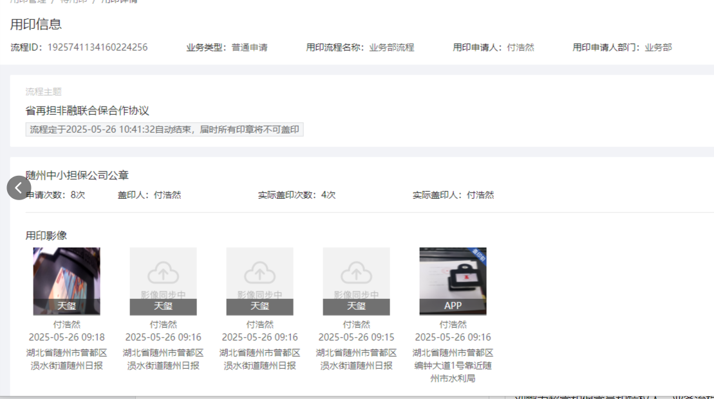
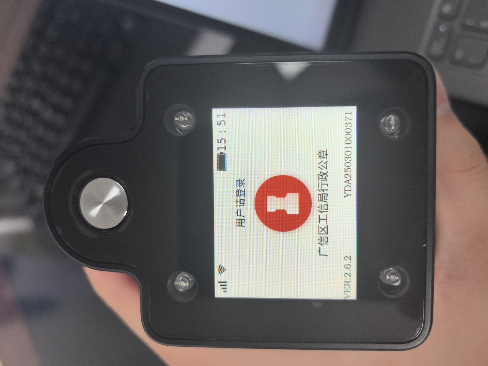
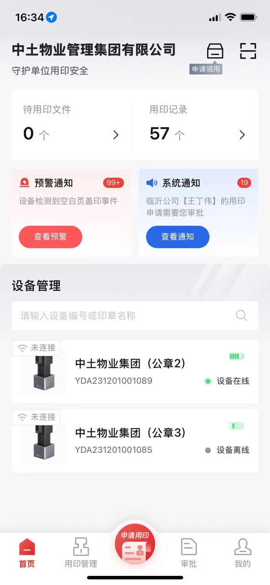
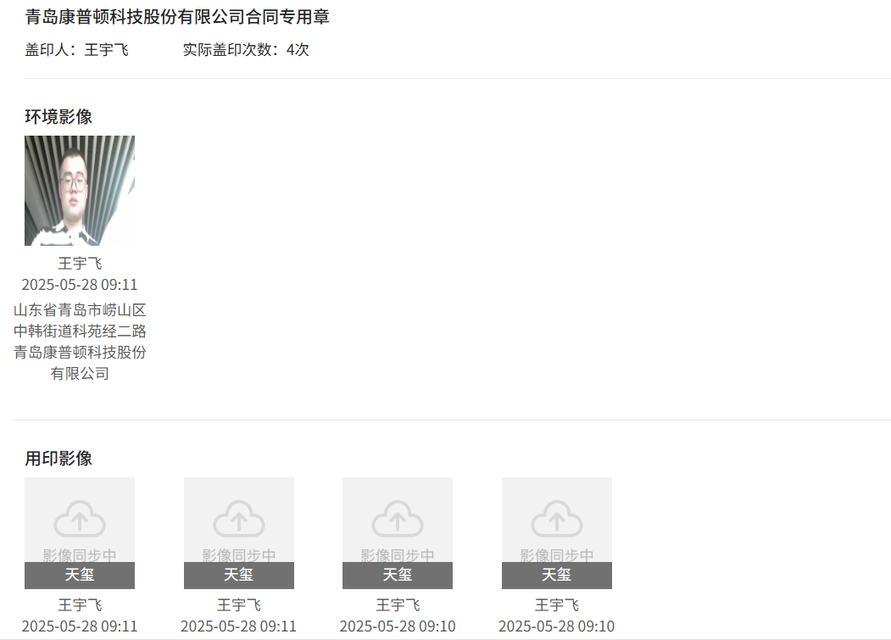
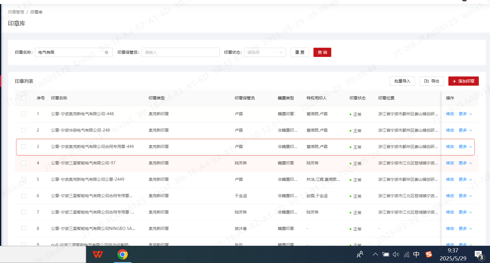
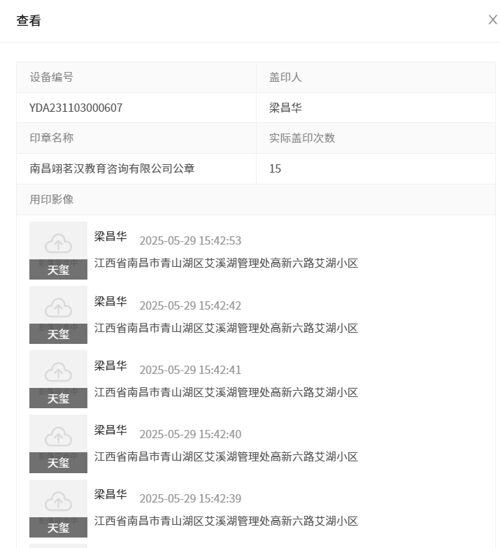
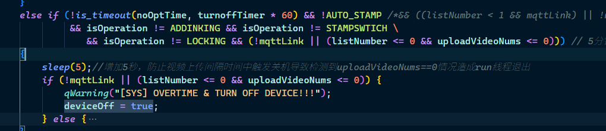

### 问题总结

1. 什么是pre环境?前端? pre环境不能是https？
   1. 解决了，好像给我切了别的环境，然后我自己再切到PRE环境把地址里的https里的s去掉再切就好了

### 20250527

// ==============================================================================

- [x] 2025-05-27 09:22

0. 反馈时间: 2025-05-26 09:29

1. documentid: 20250526_01

2. 设备id:YDA231201000798

3. 问题描述:
   1. 随州市中小企业融资担保有限公司 YDA231201000798 待用印申请8次，实际盖了10次，但是盖印次数显示还有4次，麻烦查一下
   2. 
   3. @王刘素他的这个10次哪里看的，自己记的吗
   4. @赵万超铜章  蘸墨印章
   5. @赵万超合同盖了4份合同，还有两个资料
   6. @王刘素他没有在同一份文件里面盖印啊，看下另外的文件里面显示几次
   7. @赵万超什么意思  你查到客户这10次盖印不是用的同一个待用印吗？

4. 反馈人员:

5. 问题状态:

6. 过程记录:
   1. 先查看开机后印章类型和盖印模式 都是1，常规盖印，蘸墨章蘸墨
   2. 查看通讯方式：mqtt
   3. 直接看语音播报 关键词：/oem/audio/
   4. 查看开始盖印的日志: /sys/yda/YDA231201000798/service/begin_seal/invoke 中remote字段，4为ocr认证模式
   5. 10006 是印章已连接，请验证指纹
   6. 查看指纹是否验证成功
   7. MATCH SUCCESS 确认指纹验证成功
   8. 查看mqtt发消息：[MQTT] Send Msg:
   9. 查看mqtt收消息：[MQTT] message:
   10. TODO: 2025/05/26 09:15:22 [1726] wait lock realse!!!!!!![msgid:10 this_msgid:10] 这是什么意思
   11. 以下为素材上传过程， 不仅要上传图片还要对应mqtt的消息
   12. 如何判断按钮是否按下，似乎当前连续盖印模式没有之前的 pushdown 关键字
       1. 关键字 push down 是对应的常规盖印流程
       2. 要直接判断是否有按键操作，就要直接搜索：>>>>>>>>>>>>>>>>>>>>>>>>>>>>>>>>>>>>>>>>>>>>>>>>>>>>
   13. STAMP_CONSECUTIVE 到 STAMP_CONSECUTIVE_RESET的状态转变就是按键后触发的，并紧跟着电机动作Refresh_Motor_Status,最终触发标志位refresh_status为true,来驱动motorswitch进行一次状态检查
   14. 突然想起，连续盖印中按钮电机的作用，蘸墨！！！电机按钮后，STAMP_CONSECUTIVE变STAMP_CONSECUTIVE_RESET意味着，完成蘸墨操作后变回STAMP_CONSECUTIVE
   15. 问题有可能出现在
   16. @王刘素客户的流程是 ocr远程盖印+蘸墨章+连续盖印，短按电源键会触发蘸墨一次，日志上看客户共点击了按钮10次，10次蘸墨，但只判断到4次连续盖印的核减，每次蘸墨完毕后，会重新开仓伸出印章，伸出后1.4s左右触发超时，此时状态才从蘸墨状态转变连续盖印状态，连续盖印状态是判断连续盖印核减的条件。
第一种可能，客户如果在蘸墨结束，印章刚伸出时立刻盖印，有可能导致不能触发核减，提醒客户每次点击按钮蘸墨完毕后，等电机完全伸出再盖印
第二种可能，客户连续盖印动作规范的前提下，还是经常发生连续盖印核减问题，就寄回来检修o型板限位开关
   17. @王刘素他这个是蘸墨章，点击按钮可以蘸墨的

7. 问题归类:
   1. ocr认证模式
   2. 连续盖印判断方式
   3. 连续盖印实际用户多盖，设备少核减
   4. 连续盖印和按钮电机的关系
   5. 错别字

8. 排查人员:

```bash

```

// ==============================================================================


// ==============================================================================

- [x] 2025-05-23 17:11

0. 反馈时间: 2025-05 17:11

1. documentid: 20250523_03

2. 设备id:

3. 问题描述:
   1. 内蒙古路桥集团有限责任公司   YDA241101000062  5月22日充电了一晚上，5月23日盖了118个章就没电，麻烦查一下电池是否有问题@徐佳飞

4. 反馈人员:

5. 问题状态:

6. 过程记录:
   1. 盖印次数100多次
   2. 开关机次数 8 9次
   3. 平均每次使用时长10分钟左右
   4. 总使用时长在 90分钟
   5. 时间跨度: 2025/05/23 10:15:44 - 2025/05/23 16:50:20
   6. 电量变化: 90 - 35
   7. 工作时功耗: 正常
   8. 行为: 每次都是退出后待机5分钟关机
   9. TODO: 需要补增: 时间跨度在10小时左右，开关机8 9次，上传用印影响的测试用例
   10. 回复: 这台设备盖印次数110多次，时间跨度: 10:00-16:50 电量变化：90-35，总使用时长在80-90分钟左右，次数不多，但这天客户开关机比较频繁，有8 9次，每次用完退出登录后待机5分钟才真正关机，这期间上报状态以及后台上传影像都会有耗电
   11. 看工作时功耗是正常的，但这天用户开关机比较频繁，有8 9次，每次登出后都要5分钟待机才关机，这部分消耗了一部分电量，电量变化上来看，90-35，前半段正常，后半段待机掉电较快，电池有衰减，客户觉得续航下降太多的话，给换电池
   12. 电池特性就是这样，不要随便让换电池，@徐佳飞
   13. 盖印次数110次，但总的工作时长在90分钟左右，从上午10点到下午5点，总体来看电池还算正常的

7. 问题归类:
   1. 电池衰减
   2. 盖印功耗
   3. 对比历史功耗
   4. 待机耗电有曲线图，比如以5格电量作为单位，每降一个单位的耗时

8. 排查人员:

```bash

```

// ==============================================================================


// ==============================================================================

- [x] 2025-05-27 09:54

0. 反馈时间: 2025-05-26 17:00

1. documentid: 20250526_02

2. 设备id:

3. 问题描述:
   1. 上城区采荷街道夕照社区 私有化 YDA230901000360 客户大约周四 周五充电的(23) 但是设备今天开机后设备提示电量不足(26)4月7日也有反馈过@赵万超
   2. 设备 17:26左右使用过，如果没有日志在@我联系客户 @张证

4. 反馈人员:

5. 问题状态:

6. 过程记录:
   1. 近期有关机时耗电异常，降低到3.2v，且rtc清空，计时被清空现象
   2. 关机后2 3天内电量不足
   3. 之前有过现象
   4. 电路板硬件异常是否会导致关机后放电耗电的情况
   5. 工作耗电是否异常
   6. 从日志上，这台设备频繁出现，关机后耗电异常问题以及rtc计时重置，硬件可能存在问题，寄回检修吧。

7. 问题归类:
   1. 关机后的待机功耗问题
   2. 两三天就低电量
   3. 关机后远程唤醒

8. 排查人员:

```bash

```

// ==============================================================================


// ==============================================================================

- [ ] 2025-05-27 15:58

0. 反馈时间: 2025-05-27 15:58

1. documentid: 20250527_01

2. 设备id: YDA250301000371

3. 问题描述:
   1. 
   2. 
   3. SaaS特权用印照片一直显示同步中

4. 反馈人员:

5. 问题状态:

6. 过程记录:
   1. 搜索关键字，take
   2. WiFi断掉走物联网卡就可以上传图片了
   3. 断掉WiFi后的特权有图片
   4. 我看日志41分以后的都是拍照失败，看看客户什么时候有时间，远程上去看看他的设备@牛壮

7. 问题归类:
   1. 上传问题

8. 排查人员:

```bash

```

// ==============================================================================

// ==============================================================================

- [x] 2025-05-27 16:47

0. 反馈时间: 2025-05-27

1. documentid:
   1. 20250527_02
   2. 20250527_03

2. 设备id:
   1. 公章2 YDA231201001089
   2. 公章3 YDA231201001085
3. 问题描述:
   1. 
   2. 
   3. 麻烦看一下山东中土物业反馈的问题吧，公章2使用过程中经常断开  公章3 设备指纹无反应  公章2使用时间为今天上午10点到12点  持续两个小时

4. 反馈人员:

5. 问题状态:

6. 过程记录:
   1. 公章2： 从日志上看，用印记录主要在 10：44到10:59，期间设备没有主动登出，第一次连续盖印印章伸出，还没来得及核减，就收到云端登出消息，时间在10:44,需要后端同学查看一下原因
   2. 指纹有时不灵的，建议客户重新录制指纹，有时候录制不清晰就有可能识别概率降低
   3. @马超公章3指纹识别率低，建议客户重新录制一下@黄体龙 公章2的自动退出问题，你那边看一下为什么云端发出登出消息

7. 问题归类:
   1. 公章2
      1. 断开连接问题

8. 排查人员:

```bash

```

// ==============================================================================


### 20250528
// ==============================================================================

- [ ] 2025-05-28 15:04

0. 反馈时间: 2025-05-28 13:23

1. documentid:20250528_01

2. 设备id:

3. 问题描述:
   1. 青岛康普顿（私有化）：（5.21号出现了这个情况）今天上午再次出现YDAT231201000072印控仪连接YDA231103000637印章机盖印，用印记录中没有印控仪的影像，麻烦排查一下原因哈；
   2. 

4. 反馈人员:

5. 问题状态:

6. 过程记录:
   1. 这个问题与21号不同，21号是蓝牙消息丢失，导致同步的用印次数为0
   2. 这次是网络问题，用印影像无法上传
   3. 从日志排查，使用wifi作为mqtt网络接口，并且网络验证通过
   4. 蓝牙用印过程中的用印影像上传
   5. 老版本的拍照方式
      1. 猜测1，拍照失败，上传失败
      2. 猜测2，网络问题，上传失败
      3. 猜测3，当次使用，还没来得及上传
      4. 文件一开始存在，但后续开机再遍历时文件消失
      5. 拍照时，日志显示成功，.jpg文件存在，但一直失败
      6. @王雪 这个问题与21号不同，21号是蓝牙消息丢失，导致同步的用印次数为0，这次看日志当次拍照后一直上传不成功，重启后又会把上传节点删除，这个固件版本暂时没找到对应的代码提交，无法确认原因，这个固件拍照方式较老，建议升级固件
7. 问题归类:
   1. 网络问题
      1. 当前网络的连接方式
      2. 网络错误的相关日志
      3. 4g拨号是否成功?
      4. 使用4g还是wifi?

8. 排查人员:

```bash

```

// ==============================================================================


// ==============================================================================

- [x] 2025-05-28 15:05

0. 反馈时间: 2025-05-28 13:39

1. documentid:20250528_02

2. 设备id: YDA231001000111

3. 问题描述:
   1. 广东通宇通讯  私有化 客户使用备用机配置WiFi后设备按开关机按钮没反应 客户发送视频问题时间是11点50，设备屏幕显示11点46 不确定是否死机的 情况，11点53成功重启设备可以使用了，麻烦看下是否有死机的情况@董梦彩
   2. 广东通宇备用机.mp4

4. 反馈人员:

5. 问题状态:

6. 过程记录:

7. 问题归类:
   1. 设备死机

8. 排查人员:

```bash

```

// ==============================================================================

### 20250529

// ==============================================================================

- [x] 2025-05-29 09:44

0. 反馈时间: 2025-05 09:44
   1. 视频时间 9:34

1. documentid: 20250529_01

2. 设备id: YDA240901000019

3. 问题描述:
   1. 这个优先看下为啥不识别特权人指纹，换一个特权人就可以了
   2. 
   3. 有视频

4. 反馈人员:

5. 问题状态:

6. 过程记录:
   1. 梁丙政在看

7. 问题归类:

8. 排查人员:

```bash

```

// ==============================================================================

// ==============================================================================

- [x] 2025-05-29 11:21

0. 反馈时间: 2025-05-29 11：20

1. documentid: 20250529_02

2. 设备id:

3. 问题描述:
   1. 宁海国投，私有化，YDA231103000689，2025/5/28上午7.52分左右，客户反馈有卡章的问题，用印人汤蓓珍

4. 反馈人员:

5. 问题状态:

6. 过程记录:
   1. 版本2.4.4
   2. 找不到对应的代码
   3. 很多状态值的打印缺失
   4. 客户点击后触发盖印， 盖印后没有正常触发后续印章收回的动作，看限位开关状态是到位的，这份日志状态标志和事件值的打印较少，目前只能推测是软件逻辑bug，状态标志位异常导致，没有触发印章收回的动作。
   5. 如果客户发现盖印后印章没自动收回，直接长按退出登录，会触发电机重置归位。

7. 问题归类:
   1. 卡章问题
   2. 旧版本固件
   3. 常规盖印在盖印状态达到0x05以及电机运动到达1以后，
   4. 发出[DEVICE MOTOR ERR]:run 3954，有可能电机复位异常

8. 排查人员:

```bash

```

// ==============================================================================

// ==============================================================================

- [x] 2025-05-29 11:23

0. 反馈时间: 2025-05-29 11:22

1. documentid:20250529_03

2. 设备id:

3. 问题描述:
   1. 国方建设（SaaS）：YDA231203000045充满电后又出现自动重启的问题了，多次关机重启后，印章机出现系统死机，强制关机重启才好的，麻烦 排查一下什么原因导致的；--26号排查过客户充满电又出现了使用时印章自动重启的情况；

4. 反馈人员:

5. 问题状态:

6. 过程记录:
   1. 这类问题之前没出现过，客户再出现类似情况的话，进行寄回检修或者更换设备
   2. 满电也会触发系统重启，暂时不能确定原因，客户再出现类似异常情况的话，进行寄回检修或者更换设备

7. 问题归类:

8. 排查人员:

```bash

```

// ==============================================================================

- [x] 2025-05-29 15:20

0. 反馈时间: 2025-05

1. documentid:20250529_04

2. 设备id:

3. 问题描述:
   1. YDA231103000607 设备拍照无法上传照片，SaaS固件包已经刷了两次，还是不上传，现在客户在等着配合，需要远程看一下原因，@徐佳飞
   2. 操作完以后客户测试还是没有影像
   3. 

4. 反馈人员:

5. 问题状态:

6. 过程记录:
   1. 登录客户设备，发现拍照相关的程序丢失
   2. create VI error
   3. 之前是缺少拍摄录像bin文件导致拍摄失败，bin文件刚才已经手动推进去了，现在看日志是视频通道初始化失败，导致拍照失败，等一下让客户重启一下设备，看看功能能不能正常
   4. 
   5. 寄回维修吧，拍摄进程视频通道一直初始化失败，没法拍照，可能摄像头或硬件有问题
   6. 售后详情: 发现镜像版本较老，从2.4升级到2.7以后，拍照正常，有可能是固件功能和镜像版本不匹配
   7. 

7. 问题归类:

8. 排查人员:

```bash

```

// ==============================================================================

// ==============================================================================

### 20250530

// ==============================================================================

- [x] 2025-05-30 16:12

0. 反馈时间: 2025-05-30 

1. documentid: 20250530_01

2. 设备id:

3. 问题描述:
   1. @胡贵英萧山公安宁围派出所：（SaaS）YDA241101000370--特权盖印37次：印章机盖印中，印章机死机已关机，有发烫情况，印章伸出外露；强制关机重启，印章已收回；但需排查此次异常原因；（待机30分钟，休眠5分钟，发生时间：15:00左右反馈的，）
   2. 
   3. 
   4. 

4. 反馈人员:

5. 问题状态: 结束
   1. 由于前一天用印的时候有一张jpeg图片编码异常，导致了上传云端时判断内容错误，进而上传失败，恰巧这个时候设备在自动关机，导致了处理用印逻辑以及登出关机的线程退出），但其他模块资源没有正常释放，所以设备一直处于异常的运行状态，恰好第二天用户用的特权用印+连续用印避开了这个退出的线程逻辑，能够正常控制电机出章，但是无法正常关机，登出。这也就导致了所有盖印都属于一个盖印记录，由于前一天运行了24小时，所以容易出现发热和死机。这个问题是一个小概率偶现问题，目前只能等后续重构版本修复。

6. 过程记录:
   1. 一直充电使用
   2. 29号到30号没有关机
   3. 30号9点多登录后一直没有退出登录
   4. 特权盖印的用印记录是根据单次登录登出生成用印记录的
   5. TODO: 为什么假关机之后一直没有关机： 因为一直处于充电状态
   6. TODO: 为什么用印结束后一直没有触发登出
      1. 登出条件  isNeedLogout isLoging
         1. 按键长按3秒
         2. 关机: deviceOff
         3. 低电量并且没有盖印操作: noPower
         4. 用印完成STAMP_COMPELETE并且低电量
         5. 用印完成的最后else, isLoging = true
         6. 网络和蓝牙断链
         7. 在用印时，收到加锁指令，需要登出
         8. 接收到logout的消息
   7. 
   8. 休眠和挂机的区别？
   9. 思路: 看最后一次的活动日志，然后对比正常日志
   10. 还是需要摘取功能对应正常的日志段，用于问题日志对比
7. 问题归类:
   1. 休眠和关机的区别
   2. 自动关机条件
   3. 自动退出登录条件
      1. 退出登录 都是需要 noOptTime 计时的
      2. 在每次显示盖印状态后都会首先更新一下 noOptTime，除非有地方一直更新，导致无法一直超时
      3. 如果有地方滥用 noOptTime的刷新，那么就会导致超时判断异常
   4. 上传失败，上传条件
   5. media 和 net一直打印日志
   6. 程序的退出和进程释放
      1. 只有退出rkpoll event的循环后最终执行 ExecUpgrade
      2. 只有deviceOff为true时，会触发break
      3. 所以只要没关机，就不会触发每个模块的析构，那么checkwork会一直检查
   7. 媒体部分生命周期
   8. 特权用印 + 连续用印 流程: 什么情况下退出
   9. 图片+doucment上传:
      1. 先传图片
      2. 然后是读取document传msg
   10. 特权连续盖印时，会一直isTaked:1?
   11. 连续盖印核减后的状态变化
   12. 最后一句活动日志
       1.  2025/05/30 09:40:15 [228] [MOTOR] All Limit Triggers Status Changing: 0x0d -> 0x05(0x0d) [stupid_motor:0 motorSport:1]!

8. 排查人员:

```bash

```

// ==============================================================================
