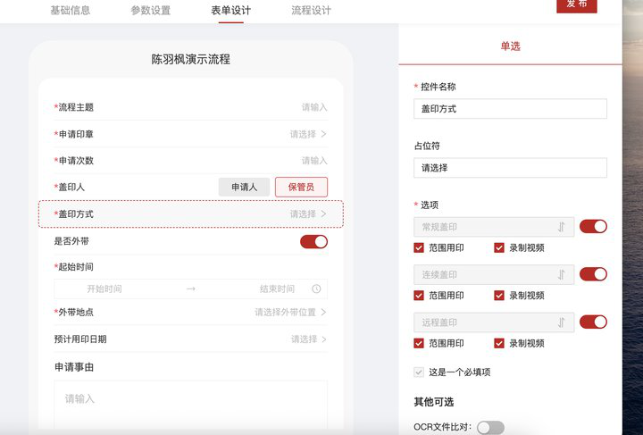
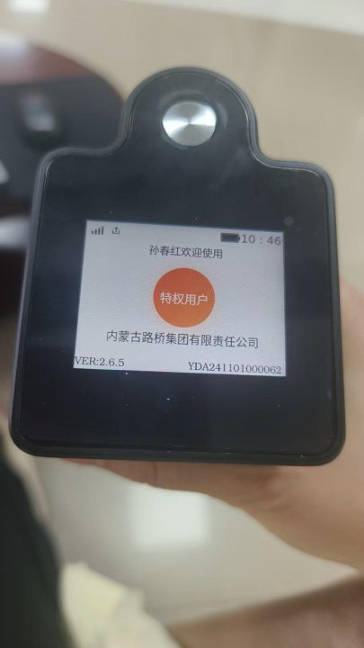
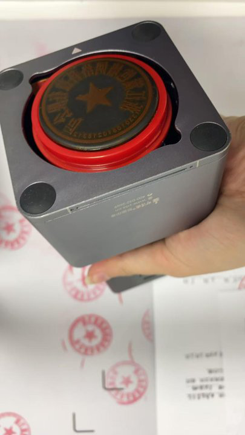

### 20250603

// ==============================================================================

- [x] 2025-06-03 09:19

0. 反馈时间: 2025-06-03 09:17

1. documentid: 20250603_01

2. 设备id: YDA231103000901

3. 问题描述:
   1. 江苏领跑梦毛勒智造科技集团有限公司（SaaS）：客户反映： YDA231103000901续航较差，充满电，盖印次数不多的情况下半天印章机就会低电量，麻烦排查一下电池使用情况是否正常哈；

4. 反馈人员:王雪

5. 问题状态:

6. 过程记录:
   1. 看5.29到5.30两天内，统计到设备总使用时长在80多分钟左右，从90电量降到45左右，算正常范围的

7. 问题归类:

8. 排查人员:

```bash

```

// ==============================================================================

// ==============================================================================

- [x] 2025-06-03 15:44

0. 反馈时间: 2025-06-03 15：20

1. documentid: 20250603_02

2. 设备id: YDA250301000380

3. 问题描述:
   1. 王刘素
   2. 联友出行（私有化）连续用印次数未核减  YDA250301000380 麻烦查一下@赵万超
   3. 有视频

4. 问题状态:
   1. 15分时设备印章伸出的时候恰好死机了，目前推测和当时工作电流偏高有关

5. 过程记录:

6. 问题归类:
   1. 死机
   2. 连续盖印核减

```bash

```

// ==============================================================================


// ==============================================================================

- [x] 2025-06-03 16:23

0. 反馈时间: 2025-06

1. documentid: 20250603_03

2. 设备id:

3. 问题描述:
   1. 上城区九堡街道丽江社区 私有化 ，客户王丽芳 13758229460  YDA231103001408 客户申请三次 实际盖印3次，但是推送app过来是2次，客户也能实际盖印3次 ，麻烦看下原因
   2. 
   3. 
   4. 客户已操作重启设备了

4. 问题状态:

5. 过程记录:
   1. @于红娟看日志，15:38:48收到开始用印的消息，剩余次数共3次，盖印了一次，15:39:14返回用印结果，随后客户退出登录；紧接着15:40:10再一次收到盖印消息，剩余次数3次，盖印了两次，和截图里的记录是对应的
   2. @于红娟@周达 两次开始盖印的消息documentid和sealid是一致的，看现象第一次盖印核减的结果发出以后，前端没收到
   3. @于红娟客户第一次盖印后，蓝牙连接不稳定，导致消息丢失，连接断开，退出登录。这次盖印没有同步记录。

6. 问题归类:
   1. 盖印后蓝牙断开，消息丢失，导致没有同步真实的盖印次数
   2. 机制不够完善，既然有documentid和sealid，为什么不本地存储盖印信息，用来恢复丢失消息
   3. 按理说设备本地一旦判断到核减，就应该持久化这个记录的，防止意外情况，比如消息丢失这些，持久化后用来修正同步到云端的记录

```bash

```

// ==============================================================================

// ==============================================================================

- [ ] 2025-06-04 15:05

0. 反馈时间: 2025-06-03 17:41

1. documentid: 20250603_04

2. 设备id:

3. 问题描述:
   1. SaaS 营销中心演示企业 销售陈羽枫 红外设备YDA241101000381 二代印控仪：YDAT241101000039 开启范围用印录制视频 天玺灵敏度2
   2. 
   3. 
   4. 印控仪一直无法识别到设备 无法解锁盖印，重启过还是不行@宦娟娟
   5. @李泽泽6月3日 16点55  17点24  17点31  这几个时间点销售都有操作 都是无法识别

4. 问题状态:

5. 过程记录:
   1. 观察日志，除了mqtt消息中的infrared字段以外，没有发现任何相关关键字
   2. version:2.6.2
   3. 奇怪为什么没有打印属性的一系列日志
   4. 这台设备日志看起来不太对，重新升级一下固件，或者先换台红外设备测试

6. 问题归类:
   1. 红外功能打开
   2. 硬件版本 镜像版本 固件版本 和功能支持对应关系

```bash

```

// ==============================================================================

### 20250604

// ==============================================================================

- [x] 2025-06-04 09:47

0. 反馈时间: 2025-06

1. documentid: 20250604_01

2. 设备id:

3. 问题描述:
   1. 于红娟
   2. 营销中心演示企业 销售反馈印章机首次连接WiFi，搜不到WiFi名称，手机型号nova12，苹果15Pro也是@宦娟娟
   3. 

4. 问题状态:

5. 过程记录:
   1. 试验下来，小米手机热点可被扫描
   2. iphone时灵时不灵
   3. 当前无法确定原因，无法扫描到的只能，主动添加wifi 账户和密码

6. 问题归类:
   1. wifi扫描

```bash

```

// ==============================================================================

### 20250605

// ==============================================================================

- [x] 2025-06-05 09:22

0. 反馈时间: 2025-06

1. documentid: 20250605_01

2. 设备id:

3. 问题描述:
   1. 宁夏第五建筑有限公司SAAS
      YDA231201000731
      客户反馈设备电池不耐用  很费电  需要查一下@董梦彩

4. 问题状态:

5. 过程记录:
   1. 看这两天日志，设备工作总时长在70分钟左右，电量从94到82，这个功耗表现算正常的；

6. 问题归类:

```bash

```

// ==============================================================================

// ==============================================================================

- [x] 2025-06-05 11:40

0. 反馈时间: 2025-06

1. documentid: 20250605_02

2. 设备id: YDA240901000089

3. 问题描述:
   1. 
   2. 
   3. 还是有问题的，WiFi配置后显示用户请登录，但是一但APP待用印连接设备或者特权指纹识别，就会提示容量不足，无法盖印，客户现在在银行着急盖印，需要尽快定位问题解决
   4. 用印影像太大了，一个3G，一个2G，没有多余空间用于h264转mp4，只能远程删除掉
   5. 可以先把h264格式的文件dump到电脑本地
   6. 这边先远程把设备里的h264文件导出到电脑本地，后面我这边手动转mp4，单独上传到云端

4. 问题状态:
   1. 备份视频，视频过大，adb卡死
   2. 直接删除视频
   3. 解决

5. 过程记录:

6. 问题归类:
   1. 视频文件处理不合理
      1. 不应该在设备端转mp4，空间不够
      2. 没有假设极端录制情况，以及视频分段处理
         1. 如果进行自动滚动，则可以避免部分问题

```bash

```

// ==============================================================================

// ==============================================================================

- [x] 2025-06-05 11:45

0. 反馈时间: 2025-06

1. documentid:20250605_03

2. 设备id:

3. 问题描述:
   1. 内蒙古路桥集团有限责任公司（私有化）YDA241101000062 普通特权用印 印章不回缩，麻烦查一下，长按3秒无法退出特权，长按盖印键12秒也无法关机
   2. 
   3. 开机了还是没有日志，和他在盖印有关吗

4. 问题状态:

5. 过程记录:
   1. 10：46分是发生死机了，但看日志限位开关状态 关仓和收章是到位的，这和客户描述的有些差异，客户改用wifi后，再观察后续有没有类似现象发生

6. 问题归类:
   1. 日志滚动逻辑
   2. 日志上传逻辑
   3. 私有化的日志同步
   4. 日志难上传
   5. 印章不缩回

```bash

```

// ==============================================================================

// ==============================================================================

- [x] 2025-06-05 11:46

0. 反馈时间: 2025-06

1. documentid:20250605_04

2. 设备id:

3. 问题描述:
   1. 浙江篱笆墙网络科技有限公司 SaaS vip 客户 设备编号：YDA230301000120 使用的是app和设备连接，常规盖印了一次 设备就无法正常回到舱门内，长按关机后舱门没有关闭，开机后设备可以正常回到舱内了 时间是：上午11:14左右，
   2. 
   3. 11:27设备已经重启过了

4. 问题状态:
   1. 看日志，盖印时判断盖印状态有问题，随后设备死机了，如果经常发生卡章问题，给售后这边检修o型板。

5. 过程记录:
   1. o型板判断

6. 问题归类:

```bash

```

// ==============================================================================


### 20250606

// ==============================================================================

- [x] 2025-06-06 21:29

0. 反馈时间: 2025-06

1. documentid: 20250606_02

2. 设备id: YDA241001000411

3. 问题描述:
   1. 合肥政务 看一下这台机器 无4G网络 设备已重启

4. 问题状态:

5. 过程记录:
   1. 从日志来看，相关节点存在，4g模块初始化成功，但查询到的4g信号较弱，建议在有信号的位置使用

6. 问题归类:

```bash

```

// ==============================================================================

// ==============================================================================

- [x] 2025-06-06 17:33

0. 反馈时间: 2025-06

1. documentid:
   1. 20250606_03
   2. 20250606_04

2. 设备id:

3. 问题描述:
   1. 宁波盛威投资   VIP  SaaS 客户  客户反馈两台设备两个印章大概都是在3号下午充满电，在今天下午四点左右就没电了，设备编号：YDA231201001501 YDA231201000950 ，设备17:16已开机，两台设备都是待机时长5 休眠时长3，盖印量大约一百次以内，设备使用的是原装充电器，麻烦安排排查下设备电池是否有异常@胡贵英

4. 问题状态:

5. 过程记录:
   0. YDA231201001501设备工作总时长在90分钟左右，除了盖印意外，还会在息屏的时候后台上传盖印影像，从3号到6号，这个是正常的
   2. 从3号到6号这几天，这两台设备工作时长在80 90 多分钟左右，除了盖印以外，设备还会在息屏的时候在后台上传影像,这个耗电情况算正常的

6. 问题归类:

```bash

```

// ==============================================================================