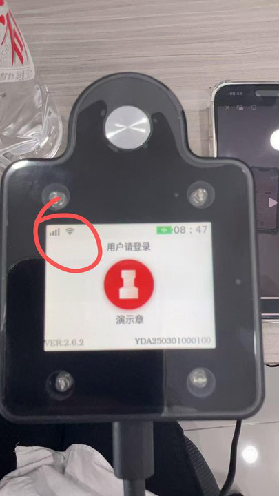
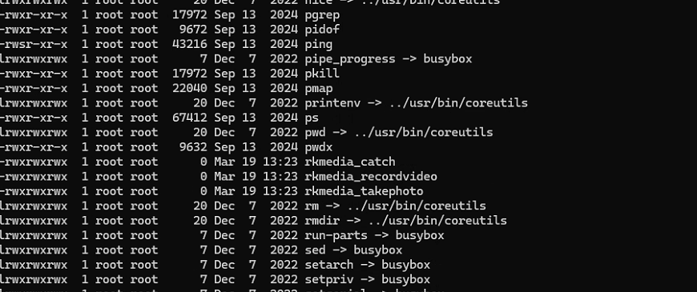
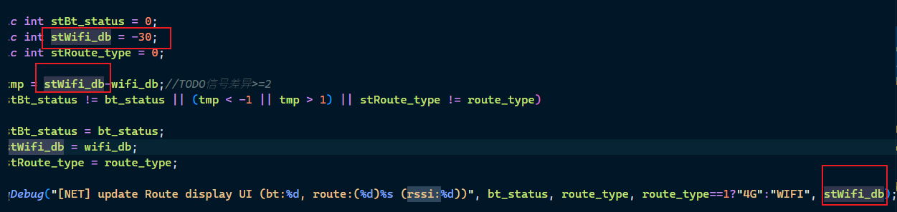
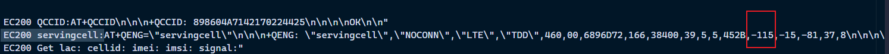

### 20250609

// ==============================================================================

- [x] 2025-06-09 14:03

0. 反馈时间: 2025-06

1. documentid: 20250609_01

2. 设备id:

3. 问题描述:
   1. 双鸭山市宝清县 YDA250301000100 客户反馈这台设备影像未上传，5月27日和今天盖印的都没有上传 麻烦查一下@赵万超
   2. 
   3. 
   4. 

4. 问题状态:

5. 过程记录:
   1. Error!(err=QLocalSocket::connectToServer: Invalid name)
   2. 拍照失败
   3. YDN_V06/4G_V3.2
   4. YDN_3.0
   5. VERSION=2.6.2

6. 问题归类:

```bash

```

// ==============================================================================

// ==============================================================================

- [x] 2025-06-09 16:53

0. 反馈时间: 2025-06

1. documentid: 20250609_02

2. 设备id: YDA231201001089

3. 问题描述:
   1. 
   2. 中土物业客户反馈连续盖章中设备卡死 断开连接 印章无法回收，问题发生时间点图片记录时间， 麻烦排查一下问题
   3. 

4. 问题状态:

5. 过程记录:
   1. 日志上看，没有发生死机，17：44分进行最后一次盖印后，就没有判断到限位开关状态的变化了，但是蓝牙一直保持通信的，直到后面触发了5分钟自动关机，才登出，以及电机复位。这和客户描述的现象有点出入，需要确认44分以后，设备卡死和断开连接的时间点
   2. 结合前端日志，可以确定，客户在17：44分前连续盖印了400多次后，设备处于空闲状态，并没有主动登出，5分钟后触发了自动关机，接着重新开机用印，印章伸出后，设备在51分左右发生了死机

6. 问题归类:

```bash

```

// ==============================================================================

### 20250610

// ==============================================================================

- [ ] 2025-06-10 11:08

0. 反馈时间: 2025-06

1. documentid: 20250610_01

2. 设备id:YDA230301000195

3. 问题描述:
   1. max版本，蓝牙能连接用印，但是app上一直显示设备离线

4. 问题状态:

5. 过程记录:

6. 问题归类:

```bash

```

// ==============================================================================

// ==============================================================================

- [x] 2025-06-10 14:15

0. 反馈时间: 2025-06

1. documentid: 20250610_02

2. 设备id:

3. 问题描述:
   1. 中国电建集团的设备
   2. 私有化
   3. 但6月份日志显示环境为1
   4. 5月份又出现有奥克斯的私有化

4. 问题状态:

5. 过程记录:
   1. 烧录固件后没有复现

6. 问题归类:
   1. 日志排查
   2. 业务逻辑
   3. 下载日志前需要确认 问题发生时间点，售后时间点，有可能在回收设备后被售后人员用来切换环境进行测试

```bash

```

// ==============================================================================


// ==============================================================================

- [ ] 2025-06-10 16:38

0. 反馈时间: 2025-06-10

1. documentid:20250610_03

2. 设备id:

3. 问题描述:
   1. 私有化 合肥政务-长河镇东光社区 设备编号：YDA241001000433 操作装卸印章功能，舱门打开瞬间就关闭设备，并发出异响 @宦娟娟

4. 问题状态:

5. 过程记录:

6. 问题归类:

```bash

```

// ==============================================================================

### 20250611

// ==============================================================================

- [ ] 2025-06-11 13:51

0. 反馈时间: 2025-06-11

1. documentid: 20250611_01

2. 设备id: YDA231103000400

3. 问题描述:
   1. 印章机屏幕显示2.5.0，运营后台显示2.4.8，客户APP设备管理中显示2.4.8
   2. 

4. 问题状态:

5. 过程记录:

6. 问题归类:

```bash

```

// ==============================================================================

// ==============================================================================

- [x] 2025-06-11 14:22

0. 反馈时间: 2025-06

1. documentid:
   1. 20250611_02
   2. 20250611_03

2. 设备id:

3. 问题描述:
   1. 河北诚帆人力资源服务有限公司  SaaS  
   问题一：YDA250301000449  设置了永不关机、10分钟休眠，客户反馈这个设备的电池有问题，麻烦查一下
   [图片]
   
   问题二：YDA250301000449、YDAT250506000023流程ID：1932621489978884096 文件名称:交投物流枢纽投标文件   6月11日  10点40-11点 有出现这个文件盖印的时候  用着用着就自动退出了  在连接就连不上了，然后印控仪在输入盖印码进去就显示设备正在被占用，6月10日也有这个问题出现。麻烦查一下@董梦彩

4. 问题状态:
   1. 2025/06/11 10:45:09 [Warning] [442] [MQTT] ****************Client Connection Lost {cause: ()}****************
   2. 2025/06/11 10:45:09 [Warning] [195] [MEDIA] Uploading Photos(m_uploadingNums=0) & Disconnect Network!!!
   3. 2025/06/11 10:46:24 [174] USER LOGOUT AS ResetAndLogout

5. 过程记录:
   1. 看日志，45分的时候，4g信号弱，断网了，mqtt断开，所以设备主动登出了，然后在10：47重新登录后，发生死机

6. 问题归类:

```bash

```

// ==============================================================================


// ==============================================================================

- [x] 2025-06-11 16:04

0. 反馈时间: 2025-06

1. documentid:20250611_04

2. 设备id

3. 问题描述:
   1. 丰茂集团SaaS 无WiFi YDA230301000029 客户反馈这台设备最近老出现没有信号无法连接的情况 麻烦看一下@董梦彩
   2. 

4. 问题状态:

5. 过程记录:
   1. rssi:-100
   2. 2025/05/26 10:42:07 [Warning] [76] [NET] Get CREG Failure!!!
   3. AT+CREG
   4. Cannot Get 4G IP & Restart PPPD
   5. 
   6. 4g处理顺序，初始化ATS，然后是检查注册网络，然后是ppp拨号
   7. 
   8.  第一个复数是关键，
   9. @王刘素信号太弱了，搜索不到网络，换个移动信号强点的地方，重启试试

6. 问题归类:
   1. 4G连接
   2. 信号问题

```bash

```

// ==============================================================================

// ==============================================================================

- [x] 2025-06-11 17:24

0. 反馈时间: 2025-06

1. documentid:20250611_05

2. 设备id: YDA231103000723

3. 问题描述:
   1. 长兴县夹浦镇月明村（SaaS）印章机开机后，一直显示用户请登录，无信号格，开机一直停留在开机动画，麻烦排查一下异常原因；客户已配置WiFi后在使用；
   2. 
   3. 

4. 问题状态:

5. 过程记录:
   1. @王雪这个也是搜索不到网络，推测位置信号不太行，换个信号强的地方，再重启试试
   2. 卡开机log
   3. 开机概率黑屏和概率死机卡log问题，暂时不解决，等下版本系统优化解决
   4. 系统进入maskrom模式，硬件recovery悬空，待系统优化解决

6. 问题归类:

```bash

```

// ==============================================================================


### 20250612

// ==============================================================================

- [x] 2025-06-12 14:07

0. 反馈时间: 2025-06

1. documentid:20250612_01

2. 设备id:

3. 问题描述:
   1. SaaS 江苏领跑梦毛勒智造科技集团有限公司 YDA231103000901
      1. 客户反馈设备经常有死机的情况，按盖印键无法打开舱门，只能强制重启，重启有时也无反应，6月11日的死机大概中午11点左右
      2. 电量不耐用经常一天都需要插着充电
   设备在8点36分开机了 麻烦排查下@谢秀丽

4. 问题状态:

5. 过程记录:
   1. 看日志是在12点左右发生了死机，死机前电流较大；看最近使用记录，总工作时长在90多分钟左右，这个耗电情况来看，电池还算正常的。

6. 问题归类:

```bash

```

// ==============================================================================