### 20250616

// ==============================================================================

- [x] 2025-06-16 15:36

0. 反馈时间: 2025-06

1. documentid: 20250616_01

2. 设备id: YDA231103000929

3. 问题描述:
   1. 漱玉平民大药房连锁股份有限公司 YDA231103000929 设备异响 麻烦查一下
   2. 私有化

4. 问题状态:

5. 过程记录:
   1. 15:12:16 瞬时电流较大，设备发生死机了

6. 问题归类:
   1. 设备异响
   2. 系统死机

```bash

```

// ==============================================================================

// ==============================================================================

- [x] 2025-06-16 17:47

0. 反馈时间: 2025-06

1. documentid:20250616_02

2. 设备id:

3. 问题描述:
   1. 山东天鹅客户反馈盖章是设备有异响，客户是蘸墨章 ，异响应该是在蘸墨时发生的
YDA241001000482
   2. 有视频

4. 问题状态:

5. 过程记录:
   1. @杜星池从日志上看，对比之前的盖印，限位开关从出章到判断到蘸墨到位，比以往多了几百毫秒，现象上就是印章持续顶住舱门的时间长了一些，发出了异响。推测有可能是线程判断延迟，或者o型板限位开关异常。
目前还不影响使用，建议客户先观察一下，如果后续一直有这个情况就检修o型板限位开关。

6. 问题归类:
   1. 蘸墨章盖印
   2. 电机异响

```bash

```

// ==============================================================================

// ==============================================================================

- [ ] 2025-06-16 17:53

0. 反馈时间: 2025-0613

1. documentid:20260613_01

2. 设备id:

3. 问题描述:
   1. 合肥联通项目客户反馈，因设备所在办公室物联网卡信号很差，办公室内无线网提示连接成功但无网络，所以ios端在使用期间用蓝牙连接 但是经常出现蓝牙断开连接情况，断开后再次重练又提示连接失败。麻烦排查一下问题原因
    设备编号：YDA241001000040
    连接用户：高锁云
    问题出现时间点：6月13号15点至15点37分左右

    临时解决方案：让客户连接自己手机热点
    

4. 问题状态:

5. 过程记录:

6. 问题归类:
   1. 4G网络信号差
   2. 蓝牙经常断开

```bash

```

// ==============================================================================

### 20250617

// ==============================================================================

- [x] 2025-06-17 15:18

0. 反馈时间: 2025-06

1. documentid: 20250617_01

2. 设备id:YDA250301000309

3. 问题描述:
   1. 内蒙古路桥，私有化环境，设备环境已切换，但是一直显示请绑定设备，需要查一下原因
   2. 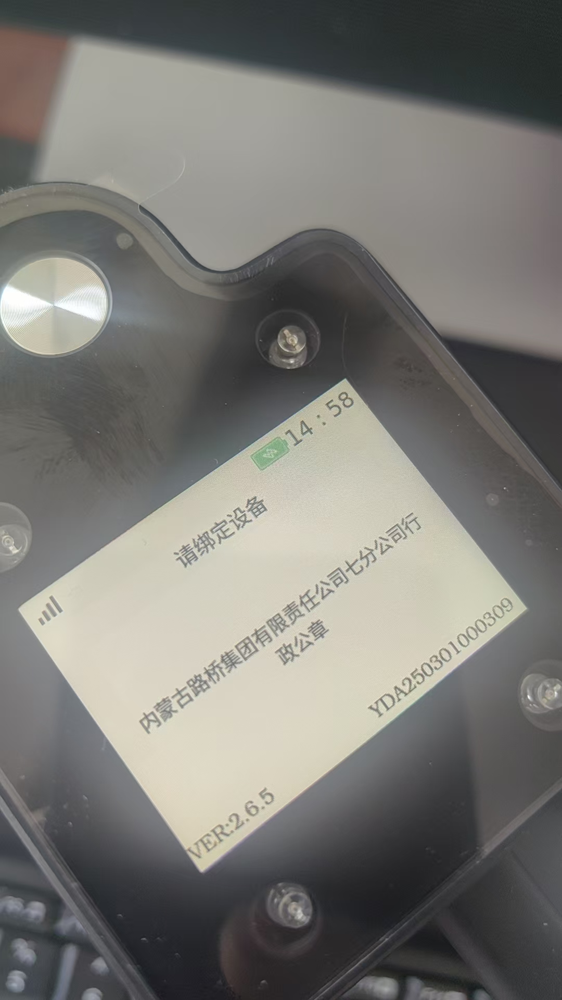
   3. YDA250301000309
   4. 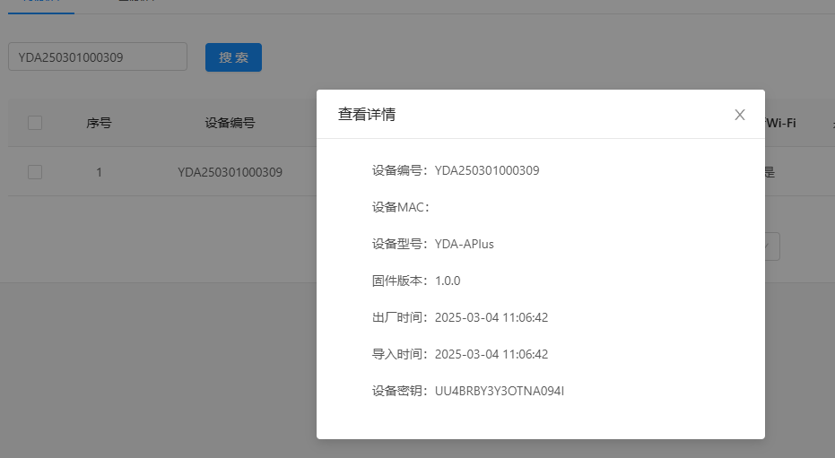
   5. 150.223.194.69:18808
   6. 网络状况
      1. ppp成功，获取到ip地址
      2. DNS正常
      3. ping 150.223.194.69 正常

      4. ```bash
      [root@RV1126_RV1109:/]# ifconfig
      lo        Link encap:Local Loopback
               inet addr:127.0.0.1  Mask:255.0.0.0
               UP LOOPBACK RUNNING  MTU:65536  Metric:1
               RX packets:0 errors:0 dropped:0 overruns:0 frame:0
               TX packets:0 errors:0 dropped:0 overruns:0 carrier:0
               collisions:0 txqueuelen:1000
               RX bytes:0 (0.0 B)  TX bytes:0 (0.0 B)

      ppp0      Link encap:Point-to-Point Protocol
               inet addr:100.79.133.193  P-t-P:192.168.0.1  Mask:255.255.255.255
               UP POINTOPOINT RUNNING NOARP MULTICAST  MTU:1500  Metric:1
               RX packets:385 errors:0 dropped:0 overruns:0 frame:0
               TX packets:493 errors:0 dropped:0 overruns:0 carrier:0
               collisions:0 txqueuelen:3
               RX bytes:17970 (17.5 KiB)  TX bytes:32872 (32.1 KiB)

      wlan0     Link encap:Ethernet  HWaddr 14:5D:34:08:59:46
               UP BROADCAST MULTICAST  MTU:1500  Metric:1
               RX packets:0 errors:0 dropped:0 overruns:0 frame:0
               TX packets:0 errors:0 dropped:0 overruns:0 carrier:0
               collisions:0 txqueuelen:1000
               RX bytes:0 (0.0 B)  TX bytes:0 (0.0 B)

      [root@RV1126_RV1109:/]# ip route show
      default via 192.168.48.1 dev wlan0
      default dev ppp0 scope link  metric 99
      192.168.0.1 dev ppp0 scope link  src 100.86.161.162
      192.168.48.0/22 dev wlan0 scope link  src 192.168.49.59
      [root@RV1126_RV1109:/]# route -n
      Kernel IP routing table
      Destination     Gateway         Genmask         Flags Metric Ref    Use Iface
      0.0.0.0         192.168.48.1    0.0.0.0         UG    0      0        0 wlan0
      0.0.0.0         0.0.0.0         0.0.0.0         U     99     0        0 ppp0
      192.168.0.1     0.0.0.0         255.255.255.255 UH    0      0        0 ppp0
      192.168.48.0    0.0.0.0         255.255.252.0   U     0      0        0 wlan0

      [root@RV1126_RV1109:/oem]# ip route get 150.223.194.69
      150.223.194.69 via 192.168.48.1 dev wlan0  src 192.168.49.59


      ```

   7. 可能性推测
      1. 运营商端口封禁: 如何验证？使用wifi
         1. ifconfig ppp0 down
         2. telnet 150.223.194.69 18808  立刻返回close了
         3. ping 150.223.194.69
      2. 设备本地18808端
      3. key有问题
         1. ```bash
         [root@RV1126_RV1109:/oem]# cat sys.cfg
         STAMPINSTALL:0
         API:http://esign.nmglq.com:18806/yindean
         AXISOFFSET:0
         CLIENTID:1749c03b-60c6-4422-9f2e-4643a375d8da|time=1741939215572
         DEVICEINFO:YDA250301000309
         ENVIRONMENT:3
         IP&PORT:150.223.194.69:18808
         ISUPGRADE:0
         KEY:UU4BRBY3Y3OTNA094I
         LOCK:0
         MQTTPASSWD:89eNbppzMBoofapxlmaRtQ==
         MQTTUSERNAME:YDA250301000309&yda
         PUBLISH:1
         SEALDISTANCE:0
         SEALID:-1
         SEALPATTERN:0
         SEALTYPE:1
         STAFFNAME:
         STAMPNAME:
         SUPERUSER:
         UPGRADETYPE:0
         VERSION:2.6.5
         VOICE:2

         {
            "code": 0,
            "success": true,
            "data": {
               "password": "uwbS0EmpsJQiIN0FiDR7LA==",
               "clientId": "19d3e6ee-af8a-4d19-bb27-9758a6e867a6|time=1750400531683",
               "username": "YDA250301000309&yda"
            }
         }

         ```

         重新生成mqtt账户密码，在pc端连接也无效，转由后端排查


4. 问题状态:

5. 过程记录:
   1. 拨号成功
   2. [MQTT] MQTTClient_connect (150.223.194.69:18808) Error! (ret: 4)!
   3. [MQTT] i am connected???
   4. 设备寄回

6. 问题归类:
   1. mqtt信息无法同步
   2. mqtt连接失败

```bash

```

// ==============================================================================

// ==============================================================================

- [x] 2025-06-18 10:03

0. 反馈时间: 2025-06

1. documentid:20250617_02

2. 设备id:

3. 问题描述:
   1. 金胜粮油集团 （私有化，内网） 设备退测试环境了 需安排技术远程看一下@宦娟娟
   2. 
   3. sys.cfg已经被清空了
   4. 日志存放在/oem/loginfo目录，由于不能上传日志，一直堆积，导致文件异常

4. 问题状态:

5. 过程记录:
   1. 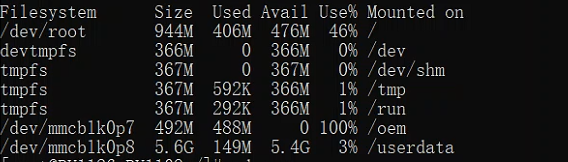
   2. 
   3. 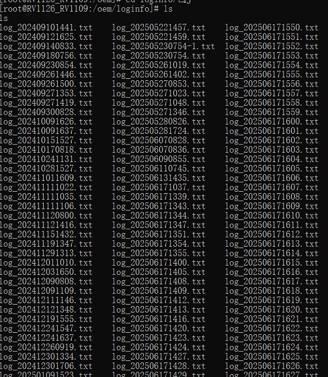
   4. 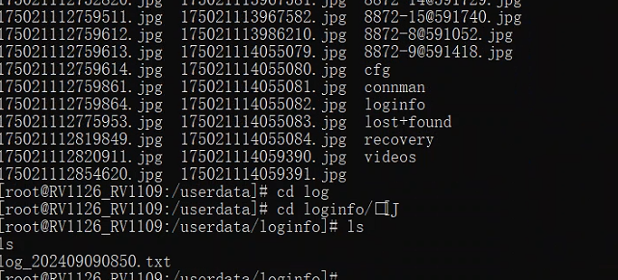

6. 问题归类:

```bash

```

// ==============================================================================

每天早晨的9到11点集中安排一下处理当天的和前一天的售后问题，@徐佳飞@王雪@刘旖菲
11点之后的问题当天都不处理了？  第二天再处理吗


// ==============================================================================

- [x] 2025-06-18 16:18

0. 反馈时间: 2025-06-17

1. documentid:20250617_03

2. 设备id:

3. 问题描述:
   1. 丰茂集团 SaaS 客户吴斐13861852097 反馈app打开后连接设备app提示磁盘溢出，app提示闪过去很 快，客户没有截图
app和印章机连接还有闪退的情况YDA231001000279 今天15:21
时间大约昨天16:31，今天已经让客户 15:31:操作点击上传日志，麻烦查下@宦娟娟
   2. 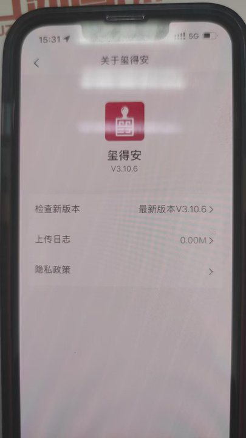
   3. @徐佳飞 看一下设备磁盘有没有满？
   4. 
   5. ，这个是设备满了@宦娟娟@董梦彩因为这个问题客户会频繁退出 耽误用印
   6. @于红娟用户设备2.7镜像，没有磁盘防溢出功能@钱晨浩看下移动端怎么给了这个提示
   7. @董梦彩客户重启后没看到有上传的文件图标
   8. 

4. 问题状态:

5. 过程记录:
   1. @于红娟看设备日志，17号15:21左右和16号16:31 磁盘空间都是正常的，没有主动退出，都是收到mqtt的登出消息，@钱晨浩前端收到设备空间不足的消息给一下

6. 问题归类:
   1. 磁盘空间不足
   2. 连接断开，手机app闪退

```bash

```

// ==============================================================================


### 20250618

// ==============================================================================

- [x] 2025-06-18 18:36

0. 反馈时间: 2025-06

1. documentid: 无

2. 设备id:

3. 问题描述:
   1. 广西桂科院铝业有限公司  saas  卡在开机动画  急急急

4. 问题状态:

5. 过程记录:
   1. adb 能登录
   2. RkLunch.sh文件缺失

6. 问题归类:

```bash

```

// ==============================================================================

// ==============================================================================

- [x] 2025-06-19 10:58

0. 反馈时间: 2025-06

1. documentid:
   1. 20250617_04
   2. 20250617_05
   3. 20250617_06

2. 设备id:
   1. YDA231103000761
   2. YDA231103000453
   3. YDA231103001265

3. 问题描述:
   1. @董梦彩广西桂科院铝业有限公司（SaaS）昨天充满电手动关机的
   2. 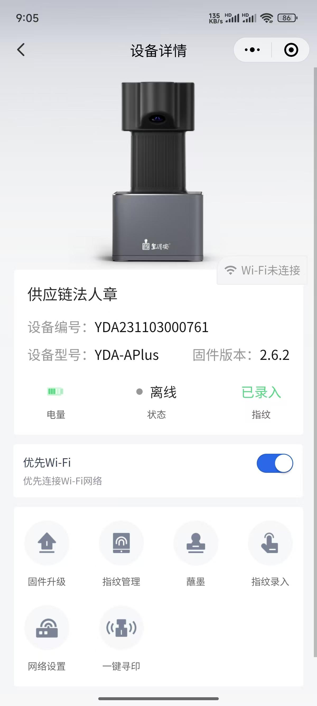
   3. 今天开机使用时印章机卡死在开机动画页面，强制关机后，印章机低电量，麻烦排查一下印章机耗电情况；这两台也是耗电量异常，
   4. 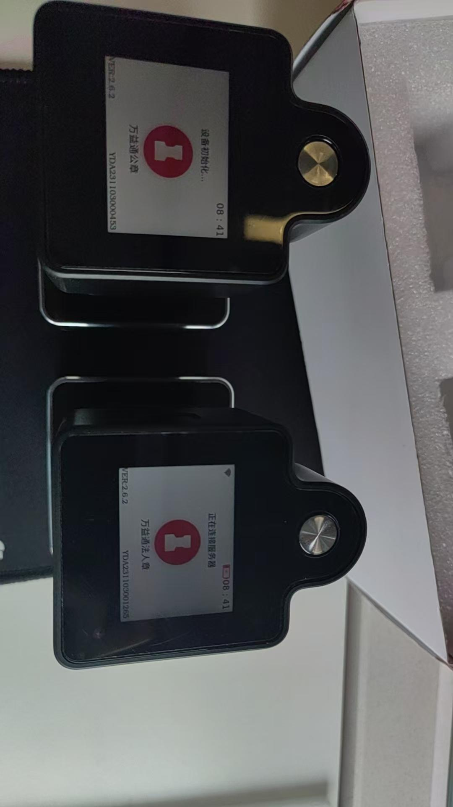
   5. 麻烦排查电池消耗情况；
   6. 这3台排查电量消耗情况；


4. 问题状态:

5. 过程记录:
   1. 761的设备，18号开机是满电的，没有出现低电量的情况 453 265的设备17号最后一次关机前就是低电量，并且没有插充电器，如果客户在设备关机后，没有进行充电，或者充电时间很短，那18号开机了还是低电量。

6. 问题归类:

```bash

```

// ==============================================================================


### 20250619

// ==============================================================================

- [x] 2025-06-19 10:20

0. 反馈时间: 2025-06

1. documentid: 20250619_01

2. 设备id: YDA250301000111

3. 问题描述:
   1. 瑞安市云周街道高园村 saas 一直卡指纹导入中 麻烦看一下
   2. 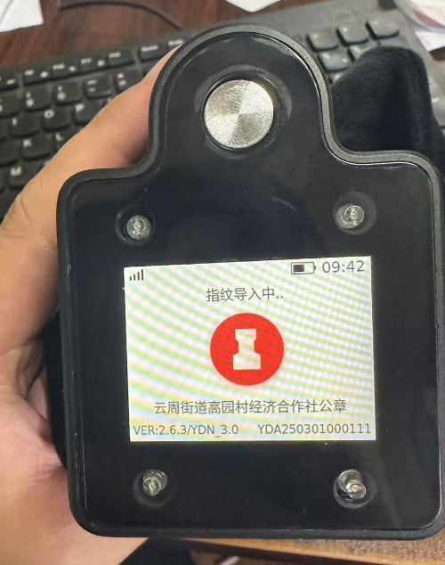
   3. @赵万超@徐佳飞不行了   就设置了3个特权人  设备多次重启 还是一下显示导入中
   4. 瑞安市 瑞安市南滨街道阁三村印章 saas 一直显示 指纹导入中
   5. 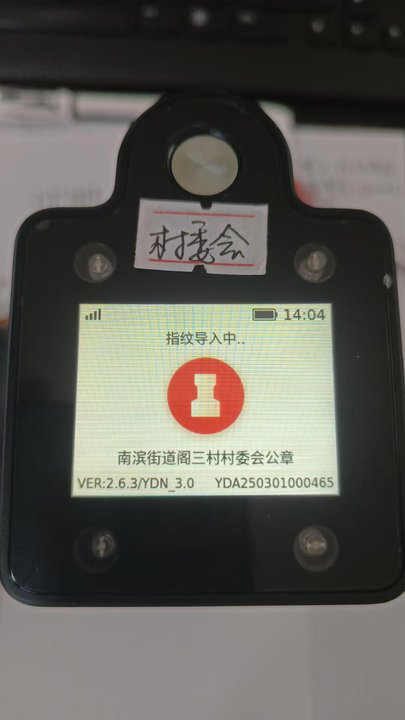

4. 问题状态:

5. 过程记录:
   1. 刚才客户反馈又一直显示指纹导入是因为设备一直再同步指纹， 从日志上看同步了60个指纹， 从来14:29~14:34分一直再导入指纹， 在他 2025/06/19 14:34关机重启前刚好导入完成， 已经正常可用了
   2. 标哥已解决

6. 问题归类:

```bash

```

// ==============================================================================


// ==============================================================================

- [ ] 2025-06-19 11:31

0. 反馈时间: 2025-06

1. documentid:20250619_02

2. 设备id:

3. 问题描述:
   1. 丰茂集团 saas YDA231103001341印章机屏幕显示是最新版本，但是运营后台查还是2.6.2 客户去点击确认或者去设备详情点击固件版本升级都无法连接上设备
   2. 
   3. 
   4. 
   5. 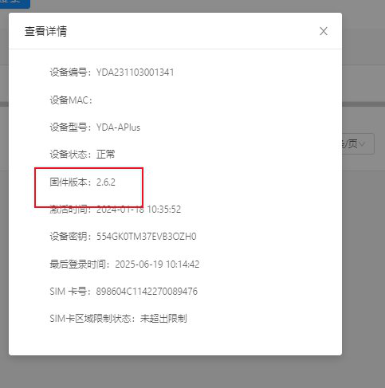
   6. @王刘素 先别急，测试这边在尝试复现
   7. @王刘素 让用户先上传一下日志@李泽泽 看一下
   8. @李泽泽试了几次都没问题复现不出来看日志吧
   9. @王刘素 用户的操作是 先进行了 固件升级后 然后再去运营后台看查看了固件版本， 后续 又进行 固件升级无法连接设备吗？
   10. @李泽泽YDA231001000046  这台设备也是这个情况 运营后台还是显示2.6.2   印章机是显示2.6.3 
   11. 
   12. @李泽泽运营后台只能售后看 客户是看不到的
   13. @王刘素 我想了解一下 用户 是不是进行了固件升级操作 后 设备升级成功后 APP 的表现是什么？
   14. @李泽泽待用印 连接时 提示让升级  客户点了确认  连接不上设备  去设备详情点击固件版本升级 也是连接不上设备
   15. @王刘素 那问题就是 无法连接设备  不是 之前进行了固件升级是吧？
   16. @李泽泽还是不行 还是连接不上设备
   17. @王刘素升级固件的问题让用户关闭app重新打开再试试
   18. @徐佳飞 目前看是设备升级后 没有回复云端 升级成功

4. 问题状态:

5. 过程记录:
   1. 标哥在排查，未有结论

6. 问题归类:
   1. 设备固件升级
   2. 设备连接手机app

```bash

```

// ==============================================================================


// ==============================================================================

- [x] 2025-06-19 11:47

0. 反馈时间: 2025-06

1. documentid:20250619_03

2. 设备id:

3. 问题描述:
   1. YDA241101000363 台州华数传媒有限公司 配置WiFi显示此设备无法使用蓝牙 麻烦看一下@谢秀丽
   2. 设备都没在线，重启下
   3. 多次重启了  一直连接不上服务器


4. 问题状态:

5. 过程记录:
   1. 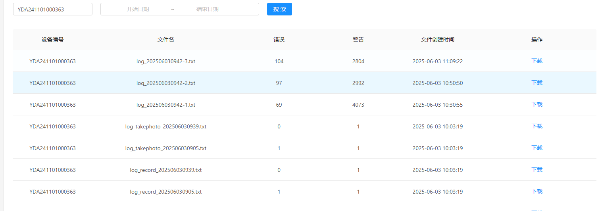
   2. 没有日志，网路有问题
   3. 环境不对，是3，切换环境后正常

6. 问题归类:

```bash

```

// ==============================================================================


// ==============================================================================

- [x] 2025-06-20 15:05

0. 反馈时间: 2025-06

1. documentid:20250619_04

2. 设备id:

3. 问题描述:
   1. 杭州恒八快捷酒店管理连锁有限公司 YDA241001000201 客户反馈6月19日 下午3点电量满的，盖了4个章，现在没电了,没有设置耗电的参数@谢秀丽 麻烦查一下
   2. 

4. 问题状态:

5. 过程记录:
   1. 日志上看，设备在前台工作了半个小时左右，然后在后台工作了半个小时上传影像，但在关机时发生异常未能正常关机，核心线程退出，其他模块没有退出，导致一直在耗电直到死机，这是小概率的异常，等后面升级，新固件这类问题应该有所改善的。
   
6. 问题归类:
   1. 息屏日志
   2. 2025/06/19 14:31:30 [6325] [SYS] OVERTIME extinguish lcd[3]

```bash

```

// ==============================================================================


### 20250620

// ==============================================================================

- [x] 2025-06-20 15:08

0. 反馈时间: 2025-06

1. documentid: 20250620_01

2. 设备id: YDA231103000102

3. 问题描述:
   1. 建德市梅城镇姜山村，YDA231103000102，客户反馈设备充不进去电，6月14日设备充电15日开机设备还是电量低，更换3根数据线后操作开机，设备正常蓄电了，客户06-20 09:30左右有开机使用过 麻烦看下最近设备的电池蓄电是否有问题呢@胡贵英

4. 问题状态:

5. 过程记录:
   1. 15号电压过低到3.2v，所以需要充一段时间系统才能正常工作，日志上看工作功耗以及待机是正常的

6. 问题归类:

```bash

```

// ==============================================================================


// ==============================================================================

- [x] 2025-06-23 10:16

0. 反馈时间: 2025-06-20

1. documentid: 20250620_02

2. 设备id: YDA250301000297

3. 问题描述:
   1. SaaS 瑞安市湖岭镇湖源村 YDA250301000297 3点12分客户反馈连接上设备但是印章不伸出，设备没有配置WiFi的情况，是死机了嘛
   2. 

4. 问题状态:

5. 过程记录:
   1. 没有死机
   2. 日志上看设备没有死机，判断出章的限位开关状态到位，这与客户现象不符，推测限位开关有问题，如果这种异常频发，建议寄回检修

6. 问题归类:

```bash

```

// ==============================================================================

-----------------

- [x] 2025-06-24 09:23

0. 反馈时间: 2025-06-20
1. documentid: 20250620_03
2. 设备id: YDA240901000056
3. 问题描述:
   1. @胡贵英奥克斯集团浙江明州康复医院：（私有化）特权盖印过程中，印章异响严重，强制关机后印章外露未收回，麻烦排查异响严重的原因以及强制关机后印章舱门未关闭的异常情况；--重新开机后，印章已收回，但此情况已发生多次，需排查彻底解决；
   2. 
   3. 
   4. 有视频

4. 过程记录:
   1. 设备发生死机了，这个问题等相关专项后，升级固件来优化。

5. 问题归类:
