### 死机解释

目前的固件耗电普遍偏高，尤其4g模块联网时耗电发热比较大，所以引发死机的概率高，如果用wifi，概率应该会降低一些，当前团队在做死机以及耗电相关的专向优化了，后期会推送新固件优化相关问题

### 20250623

-----------------

- [x] 2025-06-23 10:28

0. 反馈时间: 2025-06
1. documentid: 20250623_01
2. 设备id:YDA231001000430
3. 问题描述:
   1. 建德市乾潭镇大畈村（私有化） YDA231001000430 用的原装充电器，客户反馈这台设备上周充满电，用完都关机后放的，关机时也关注过电量，是满的，不用也会没电，客户忘记是上周几充电的了，今天开机发现设备显示红色的电量 麻烦查一下这台设备的电池是否有问题@赵万超
   2. 今天又来反馈周一充满电的，就昨天盖了个章，今天又没电了  确认电池没有问题吗 (25号)

4. 过程记录:
   1. 看日志是正常的，上周一左右有80多的电，待机一周电量是有可能低电量的
   2. 

5. 问题归类:

-----------------

- [x] 2025-06-23 15:31

0. 反馈时间: 2025-06
1. documentid: 20250623_02
2. 设备id:YDA231201000696
3. 问题描述:
   1. 深泽农商行（私有化+内网）
   2. YDA231201000696--18203115777王栋梁；内网环境--特权本地盖印可以使用吗，非常着急；@宦娟娟
   3. @宦娟娟内网，外带使用特权，连接不上服务器；
   4. @王雪 那就是离线特权吧，等下次设备能连上服务器的时候数据会自动上传
   5. @宦娟娟验证指纹失败呀
   6. @王雪 那就是另外的问题了吧，这个特权人的指纹同步成功了吗？设备上怎么提示的？

4. 过程记录:
   1. 远程客户设备
   2. dump近期日志
   3. 并未发现王栋梁使用记录
   4. 现在日志里同步过来的几个指纹，就3号没有登录过,有可能这个是姓王的，但他离线用印一直解锁不了，但他描述之前又用过，我的怀疑，他之前录制指纹时，用的名字是其他人的名字，然后一开始是可以正常用印的，后面这个名字被移除特权用印的列表了，然后他自己的名字对应的其他人的指纹，一直存在，但实际用印的时候一直匹配不上
   5. 我怀疑这家公司他们录制指纹时，没有将录制的指纹和人名对应，导致特权人变动的时候，人名对，但实际指纹被删除了
   6. 但凡错乱几个，然后再删除几个，这指纹不就识别不了了
   7. 因为我看日志，他们的指纹变动还是比较频繁的
   8. 根据日志近两个星期的登录用户和指纹占位变化，以及当前设备近期登录的用户里没有王栋梁，推测他录制指纹的时候使用的其他人名，外带前关联该人名的指纹移除，导致外带后无法识别成功，这家公司的特权用印人员删改变化比较频繁，如果指纹和人名对应错乱，就有可能调整特权人员后指纹无法被识别的。建议客户重新录制，并且每次外带前 断网验证一下离线特权来确保不出现以外。

   ```bash
    崔旭亮 16
    戴立众 35
    王鹏  11
    高亚南  1
    李晓玲  2
    焦景 29 17号
    王占立 13  17号
    崔佳林 15
    王探 7
    刘梦荧 26
    赵玉娜 20
    韩晓宇 10

    17号指纹位变化:
    1-2-3-13-29-
    1-2-3-29-
    1-2-3-29-37-
   ```

5. 问题归类:

-----------------

- [x] 2025-06-23 15:52

0. 反馈时间: 2025-06
1. documentid: 20250623_03
2. 设备id:
3. 问题描述:
   1. 奥德东北大区台安奥德燃气有限公司 私有化 YDA231201000725 常规用印，印章盖一次，第二个去按盖印键，印章不下落，麻烦查一下@赵万超
   2. 客户怎么长按关机都无效
   3. 奥德今天复现的时间是16:38
   4. 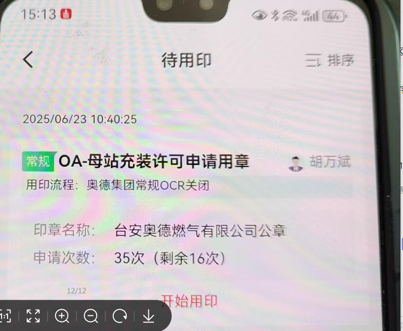
   5. 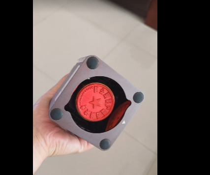

4. 过程记录:
   1. 印章不伸出，对比日志状态，限位开关异常，建议寄回检修

5. 问题归类:

-----------------

- [x] 2025-06-23 17:14

0. 反馈时间: 2025-06
1. documentid: 20250623_04
2. 设备id:
3. 问题描述:
   1. @赵万超瑞安市云周街道高园村（SaaS）：申请用印10次，实际盖印5次，盖印第3次时按压盖印键无反应，并未实际发生盖印，但盖印次数被核减，用印记录显示盖印为6次；麻烦排查异常原因；
   2. 
   3. 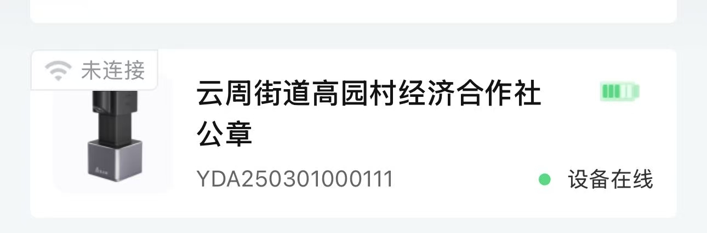
   4. YDA250301000111（盖印时间2025年6.20晚上20:00左右）

4. 过程记录:
   1. 重构版本
   2. 标哥在排查

5. 问题归类:

### 20250624

-----------------

- [x] 2025-06-24 11:05

0. 反馈时间: 2025-06-24
1. documentid: 20250624_01
2. 设备id:
3. 问题描述:
   1. 缸鸭狗食品  YDA231103000435  昨天上午原装充电器电冲了2-3个小时，今天开机显示电量不足，客户反馈电池不耐用 麻烦安排技术看一下@宦娟娟

4. 过程记录:
   1. 看日志，前一天没有正常关机成功，导致电量耗尽

5. 问题归类:

-----------------

- [x] 2025-06-24 11:11

0. 反馈时间: 2025-06
1. documentid: 20250624_02
2. 设备id:
3. 问题描述:
   1. 奥克斯云商商贸有限公司  YDA240901000097  印章外带，过程中发出异响，需技术排查一下@宦娟娟

4. 过程记录:
   1. 在 10:07:34 10:12:13 设备发生了死机，造成了异响

5. 问题归类:


-----------------

- [x] 2025-06-24 13:43

0. 反馈时间: 2025-06
1. documentid: 20250624_03
2. 设备id:YDA231103001330
3. 问题描述:
   1. @宦娟娟金沂蒙集团（SaaS）印章机屏幕黑屏，无法亮起显示，但可以开机，连接操作装卸，使用原装充电器已充电一上午，早晨也可以正常显示盖印的，麻烦排查一下，此问题加急；
   2. 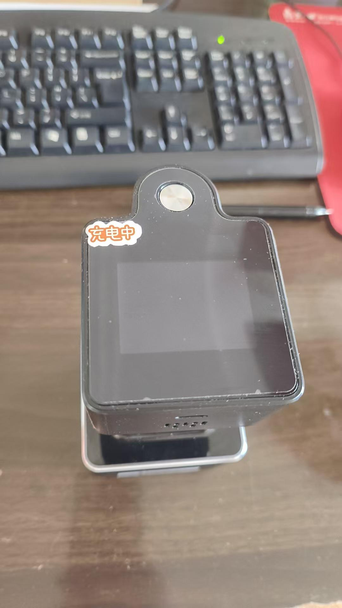
   3. 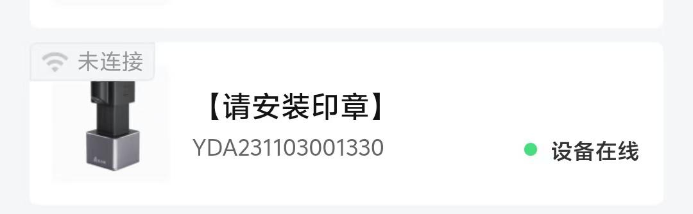

4. 过程记录:
   1. 屏幕背光没有被拉起，得重启一下设备

5. 问题归类:

-----------------

- [x] 2025-06-24 14:47

0. 反馈时间: 2025-06
1. documentid: 20250624_04
2. 设备id:
3. 问题描述:
   1. 东海药业 私有化 设备编号：YDA231201000588 设备是开机状态的，后台看着也是在线的，但是屏幕不亮也没办法识别指纹盖章，一直没有反应，问题是大概14:19的时候出现的，客户操作强制按15秒重启，今天设备上午总共只盖了11次左右，需要看下设备是什么原因，客户要知道原因@宦娟娟


4. 过程记录:
   1. 看日志，设备没有死机，在工作，屏幕黑屏推测是背光相关io没有设置生效，这种情况只能先重启。
   2. 看日志，设备没有死机，在工作，屏幕黑屏推测是息屏后唤醒背光相关io没有设置生效，这种情况目前只能先重启来解决。

5. 问题归类:


-----------------

- [x] 2025-06-24 15:05

0. 反馈时间: 2025-06-23
1. documentid: 20250624_05
2. 设备id:
3. 问题描述:
   1. 中海胶东-烟台公司 私有化 刚才连接上，环境影像已经拍好了  然后又断开了，连续两次，一直这样，拍完人像照片后又断开连接 印控仪：YDAT231201000158  天玺：YDA231201001220麻烦查一下是什么原因
   2. 6月23日  故障视频里面是有时间的  19:58@宦娟娟@徐静敏

   ```bash
        @王刘素 视频表现  排查结果如下
        第一条发送登录：/cell/yda/YDA231201001220/service/user_login/invoke, 负载为{"id":"4204406801","version":"1.0","params":{"model":2,"staffId":440,"sessionId":"38ad951d-ddfd-4f27-9f48-0c4d38d25759","deviceType":2,"deviceNumber":"YDA231201001220","gps":{"lon":null,"lat":null}},"time":1750679877127}
        超时没回复 重新发送第二条：主题发布了，主题为/cell/yda/YDA231201001220/service/user_login/invoke, 负载为{"id":"4071891246","version":"1.0","params":{"model":2,"staffId":440,"sessionId":"38ad951d-ddfd-4f27-9f48-0c4d38d25759","deviceType":2,"deviceNumber":"YDA231201001220","gps":{"lon":null,"lat":null}},"time":1750679888947}

        ======

        连续收到两条恢复 此时设备登录成功
        第1条发送的回复 true====订阅的主题来消息了， 主题为/sys/yda/YDA231201001220/service/user_login/invoke_reply, 内容为{id: 4204406801, time: 1750679887, success: true, code: 0, data: {}}====
        [
        第2条发送的回复 false │ ====订阅的主题来消息了， 主题为/sys/yda/YDA231201001220/service/user_login/invoke_reply, 内容为{id: 4071891246, time: 1750679888, success: false, code: 100004, data: {}}

        同一条消息状态会以最新的回复为结果，导致前端还是登陆失败的状态，@宦娟娟 @一下对应嵌入式需要看一下 同一个用户登陆为什么报错误问题
   ```

4. 过程记录:
   1. @王刘素@徐静敏从日志上看，57到59收到很多次重复的mqtt登录请求，并且有两次mqtt登出请求，设备本身没有主动退出
   2. 网络问题导致的消息延迟，导致多次重复登录和登出

5. 问题归类:

### 20250625

-----------------

### 20250626

-----------------

- [x] 2025-06-26 10:15

0. 反馈时间: 2025-06
1. documentid: 20250626_01
2. 设备id: YDA250401000150
3. 问题描述:
   1. @董梦彩温州康宁SaaS：印章机充电时长2小时以上，印章机屏幕显示电量满格，APP显示缺一格，麻烦核实电量是否已充满；
   2. 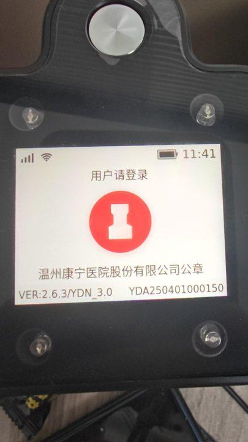
   3. 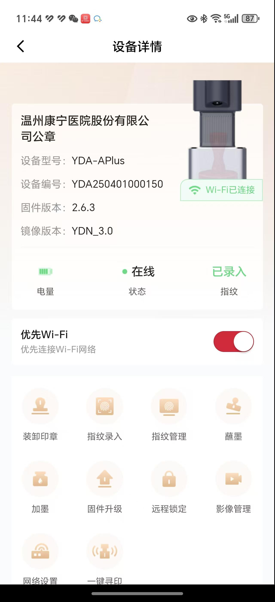

4. 过程记录:
   1. 新固件同步的电量-25

5. 问题归类:

-----------------

- [ ] 2025-06-26 14:33

0. 反馈时间: 2025-06
1. documentid: 20250626_02
2. 设备id:
3. 问题描述:
   1. @谢秀丽丰茂集团SaaS：APP连接印章机盖印，自动断开连接3次，手机使用的数据流量，麻烦排查断连原因；（城运章盖10次，退了3次；物业章盖4次，退1次
   2. 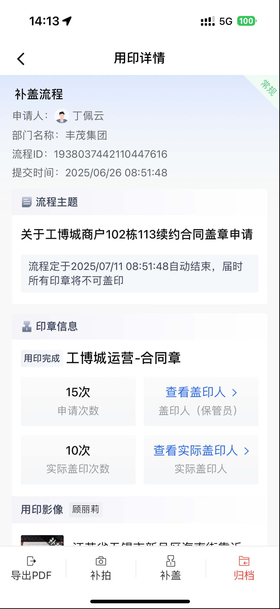
   3. 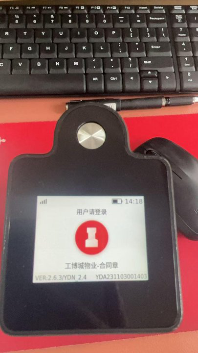
   4. 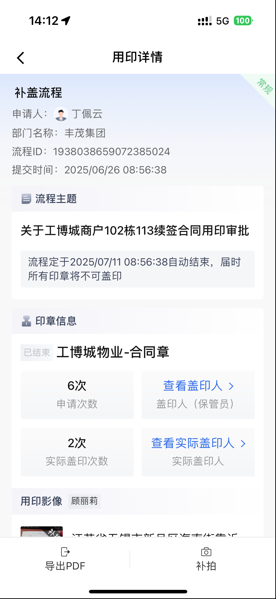
   5. 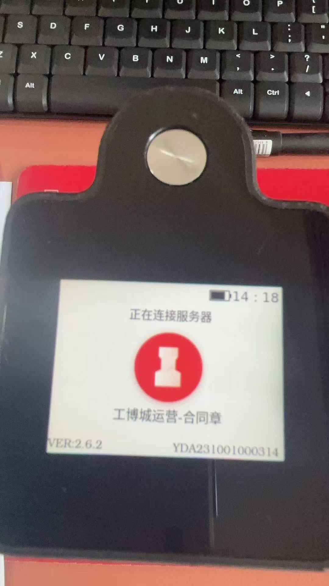
   6. 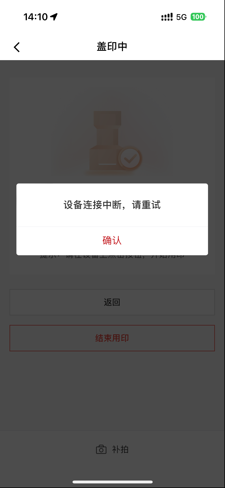

4. 过程记录:

5. 问题归类:

-----------------

- [ ] 2025-06-27 11:27

0. 反馈时间: 2025-06
1. documentid: 20250626_03
2. 设备id:
3. 问题描述:
   1. 奥德黑龙江大区伊春鸿奥燃气有限公司（私有化）：YDA231201000083近期盖印量不多，一直在上传影像，已经长达4小时上传不关机了，只能强制关机，麻烦排查印章机，什么原因导致长时间在上传影像，无法自动关机；
   2. 

4. 过程记录:

5. 问题归类:

-----------------

- [ ] 2025-06-27 11:27

0. 反馈时间: 2025-06
1. documentid: 20250626_04
2. 设备id:
3. 问题描述:
   1. @谢秀丽丰茂集团（SaaS）：YDA231103001399客户反映印章机电池续航差，比其他印章机电量消耗都快的多，麻烦排查电池消耗情况
   2. 

4. 过程记录:

5. 问题归类:

### 20250627

-----------------

- [ ] 2025-06-27 11:06

0. 反馈时间: 2025-06
1. documentid: 20250627_01
2. 设备id:
3. 问题描述:
    1. 合肥联通项目还是同样的问题，又出现了

    客户反馈，因设备所在办公室物联网卡信号很差，办公室内无线网提示连接成功但无网络，所以ios端在使用期间用蓝牙连接 但是经常出现蓝牙断开连接情况或者蓝牙连接不上，断开后再次重练又提示连接失败。麻烦排查一下问题原因

    设备编号：YDA241001000040
    连接用户：丁京淼
    问题出现时间点：6月27号9点30分左右

    麻烦帮忙排查一下此问题，都已经已经反馈好几次
    2. 

4. 过程记录:

5. 问题归类:

-----------------

- [ ] 2025-06-27 11:07

0. 反馈时间: 2025-06
1. documentid: 20250627_02
2. 设备id:
3. 问题描述:
   1. 广西桂科院铝业有限公司 SaaS 云南桂铝的公章YDA231103000376，昨天下班前满电关机放起来，早上取出来用就没电了 ，下班前好几次关机黑屏后再点一下按键又会亮起来。最后一次操作关机后按按键确认已经没有亮起了就放起来了，客户刚才给设备充电十几分钟 设备电量直接冲到一半了 需要看下设备的电池续航是否有问题哈 10:13  客户开机在用印了 @胡贵英

4. 过程记录:

5. 问题归类:

-----------------

- [ ] 2025-06-27 11:08

0. 反馈时间: 2025-06
1. documentid: 20250627_03
2. 设备id:
3. 问题描述:
   1. 丰茂集团  SAAS   YDA231103001469   印章伸不出  设备发出嗡嗡电流声
4. 过程记录:
   1. 升级固件了，变2.6.3

5. 问题归类:
