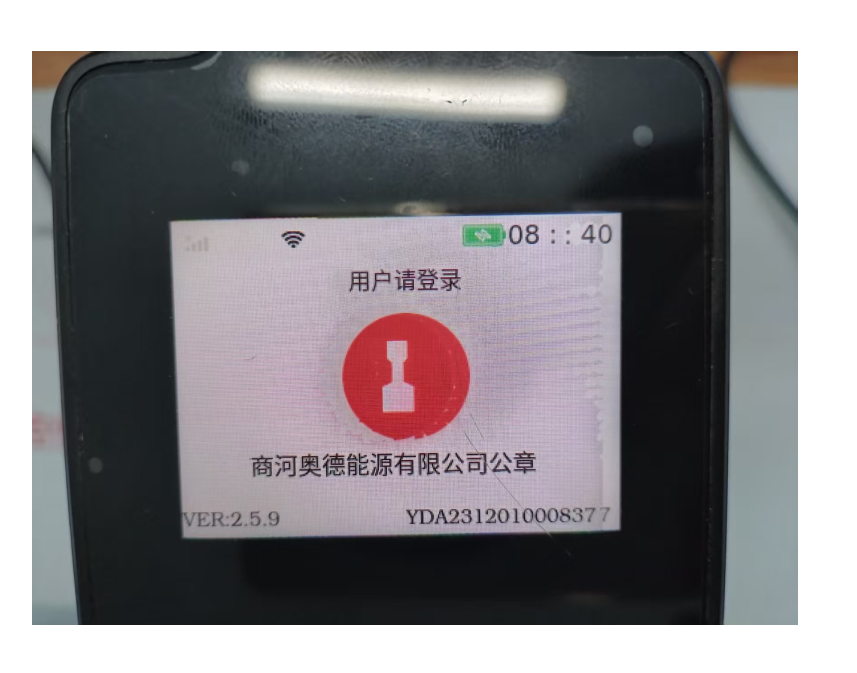
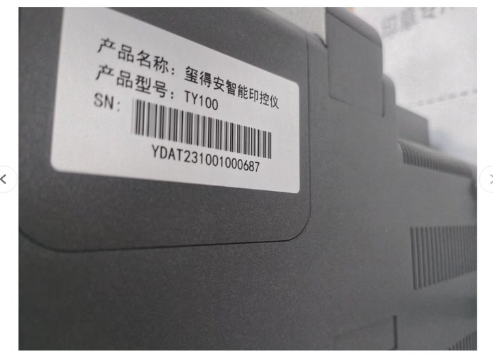
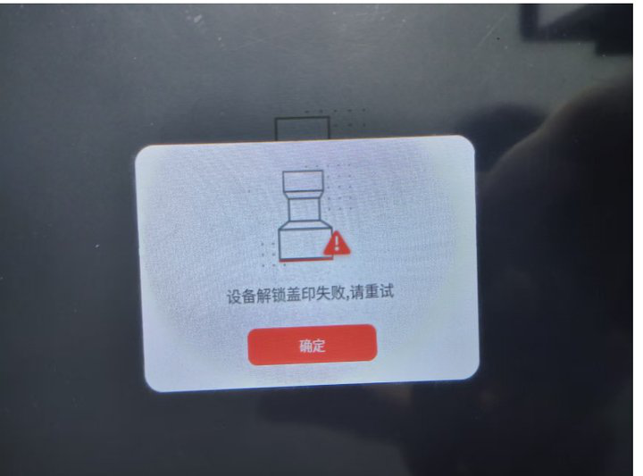
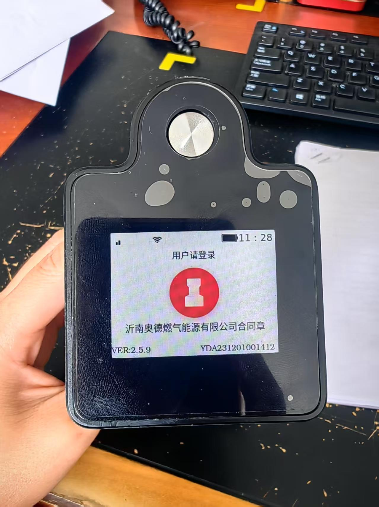
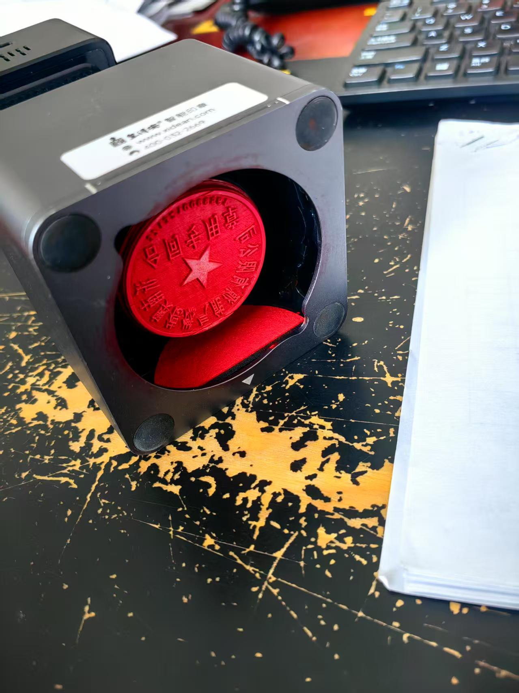
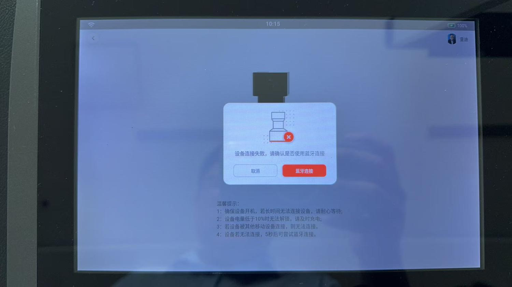
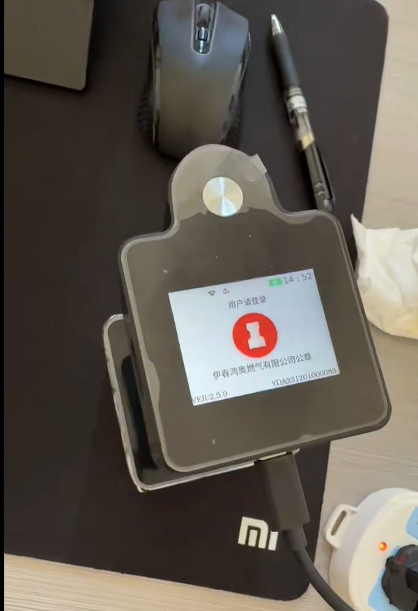
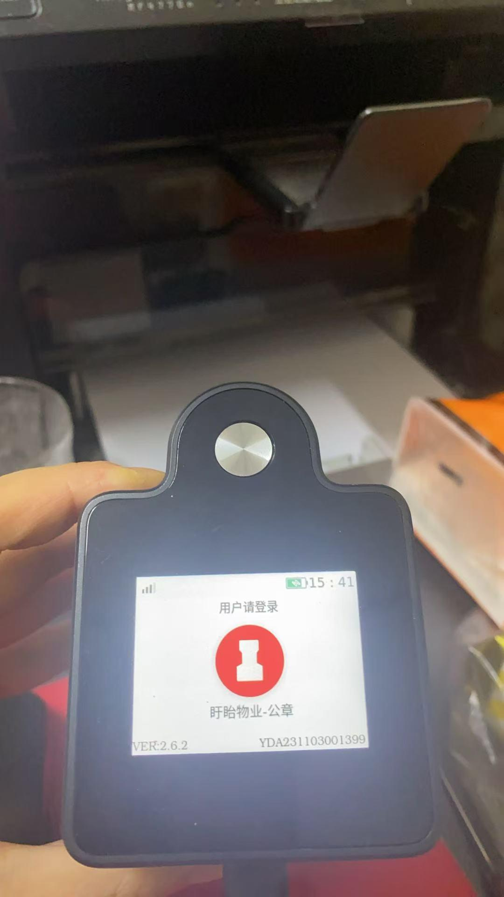
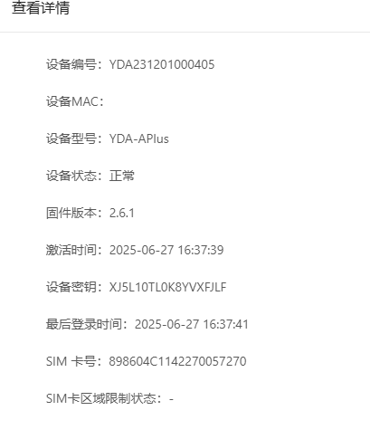
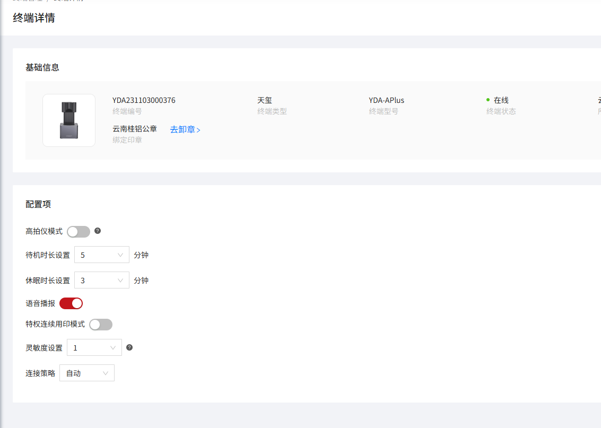

### work log

售后问题排查:
1. 

### 20250630

-----------------

- [x] 2025-06-30 13:55

0. 反馈时间: 2025-06
1. documentid: 20250630_01
2. 设备id: YDA2312010008377
3. 问题描述:
   1. 奥德鲁北大区商河奥德能源 反馈设备和印控仪连接，印控仪提示设备解锁盖印失败 请重试 印章机和印控仪都重启 还是这样的提示 需要看下这个问题@赵万超
   2. 
   3. 
   4. 
   5. 私有化 奥德企业的固件是最新的
   6. @于红娟 @徐佳飞 帮忙看看mqtt发起盖印收到错误Not Good
   7. @徐佳飞 帮忙看看/sys/yda/YDA231201000837/service/begin_seal/invoke这个没回复超时了

4. 过程记录:
   1. 2.5.9版本，没有空间不足提示
   2. 收到开始盖印消息后，判断到磁盘空间不足，就退出用印登录了
   3. [VIDEO] /userdata/videos/181e11bc94a84493b6ac8908878ff44c.h264 [297181Kb] > DiskLess[199448Kb] & Return!
   4. 现在就是几个.h264的视频待转mp4然后才上传，剩余空间不足以支撑最小视频转格式，就卡住了
   5. 可以的，我先试试大文件能不能正常pull出来，等空间空余出来，重新push进去再触发上传
   6. 已手动推送

5. 问题归类:

-----------------

- [x] 2025-06-30 14:39

0. 反馈时间: 2025-06
1. documentid: 20250630_02
2. 设备id:
3. 问题描述:
   1. 奥德华东大区沂南燃气 YDA231201001412 印章机仓门不关，麻烦查一下是什么原因，这个问题之前出现过，设备寄回检修过的@赵万超
   2. 
   3. 
   4. 

4. 过程记录:
   1. 寄回检修吧，无法正常关舱门

5. 问题归类:

-----------------

- [x] 2025-06-30 14:53

0. 反馈时间: 2025-06-27
1. documentid: 20250630_03
2. 设备id:YDA231103000376
3. 问题描述:
   1. 广西桂科院铝业有限公司 SaaS 云南桂铝的公章YDA231103000376，昨天下班前满电关机放起来，早上取出来用就没电了 ，下班前好几次关机黑屏后再点一下按键又会亮起来。最后一次操作关机后按按键确认已经没有亮起了就放起来了，客户刚才给设备充电十几分钟 设备电量直接冲到一半了 需要看下设备的电池续航是否有问题哈 10:13 客户开机在用印了 @胡贵英

4. 过程记录:
   1. 看设备工作时间是正常的，目前设备有假关机的逻辑，就只是息屏，后台还在处理上传视频

5. 问题归类:

-----------------

- [ ] 2025-06-30 15:48

0. 反馈时间: 2025-06
1. documentid: 20250630_04
2. 设备id:YDA231201001290
3. 问题描述:
   1. 金胜粮油集团私有化 内网 YDAT231201000174 YDA231201001290
   2. 设备从早上8点57分 客户反馈印章机和印控仪连接 印控仪就提示 设备连接失败，WiFi连接后 盖印一次断一次 客户已经更换 换了两个内网的WiFi还是提示连接失败 10:20已经将设备重启 需要看下为什么频繁断联@赵万超
   3. 
   4. 

4. 过程记录:
   1. 消息丢失，并没有收到云端的mqtt登录请求，中间都是蓝牙登录和指纹登录

5. 问题归类:

### 20250701

-----------------

- [x] 2025-06-27 11:27

0. 反馈时间: 2025-06
1. documentid: 20250701_01
2. 设备id: YDA231201000083
3. 问题描述:
   1. 奥德黑龙江大区伊春鸿奥燃气有限公司（私有化）：YDA231201000083近期盖印量不多，一直在上传影像，已经长达4小时上传不关机了，只能强制关机，麻烦排查印章机，什么原因导致长时间在上传影像，无法自动关机；
   2. 

4. 过程记录:
   1. 26号下午的，死机了

5. 问题归类:

-----------------

- [x] 2025-06-27 11:27

0. 反馈时间: 2025-06
1. documentid: 20250701_02
2. 设备id: YDA231103001399
3. 问题描述:
   1. @谢秀丽丰茂集团（SaaS）：YDA231103001399客户反映印章机电池续航差，比其他印章机电量消耗都快的多，麻烦排查电池消耗情况
   2. 

4. 过程记录:
   1. 看日志最近总的工作时长在70分钟左右，偏低了一些，但也算正常范围

5. 问题归类:

-----------------

- [ ] 2025-07-01 09:43

0. 反馈时间: 2025-07
1. documentid: 20250701_03
2. 设备id:YDA231201000405
3. 问题描述:
   1. 双鸭山市宝清县夹信子镇宏泉村 私有化 YDA231201000405 （备用机）客户今早7点37到7点53分 操作连接装卸设备app提示设备网络连接中 点击网络设置页面一直提示设备蓝牙连接中
   2. 
   3. 设备开机也会显示用户请登录 但是开机后也没有声音 app也不会显示设备在线 查看后台的最后登录时间还是在上周我们开机的时间
   4. 
   5. 操作过强制按12秒 在三秒 还不显示设备在线 无法连接上设备 需要看下什么原因@宦娟娟
   6. 点击配置网络设置  app就提示设备蓝牙连接中  设备环境切换对的了

4. 过程记录:

5. 问题归类:

-----------------

- [ ] 2025-07-03 09:26

0. 反馈时间: 2025-07
1. documentid: 20250701_04
2. 设备id:
3. 问题描述:
   1. 广西桂科院铝业有限公司 YDA231103000376 设备开机后没有语音播报 后台的语音播报功能是打开的
   2. 
   3. 客户很在意这个事情 设备现在连接的是WiFi app会显示在线 屏幕也显示用户请登录@宦娟娟
   4. 2个视频 1个是客户昨天设备4g情况，一个是今天设备连接WiFi后开机的情况 设备有维修过，具体时间可观看设备屏幕@徐佳飞

4. 过程记录:
   1. [AUDIO] NO
   2. 文件丢失了，需要远程手动推送

5. 问题归类:

### 20250702

-----------------

- [x] 2025-06-27 11:06

0. 反馈时间: 2025-06-27
1. documentid: 2025060702_01
2. 设备id:
3. 问题描述:
    1. 合肥联通项目还是同样的问题，又出现了

    客户反馈，因设备所在办公室物联网卡信号很差，办公室内无线网提示连接成功但无网络，所以ios端在使用期间用蓝牙连接 但是经常出现蓝牙断开连接情况或者蓝牙连接不上，断开后再次重练又提示连接失败。麻烦排查一下问题原因

    设备编号：YDA241001000040
    连接用户：丁京淼
    问题出现时间点：6月27号9点30分左右

    麻烦帮忙排查一下此问题，都已经已经反馈好几次
    2. 

4. 过程记录:
   1. 看日志，连续多次死机
   2. ppp成功，wifi也正常获取到地址
   3. 死机，导致连接失败，蓝牙无法连接
   4. 但从日志里检测到的电流大小都比较正常

5. 问题归类:

### 20250703

### 20250704

