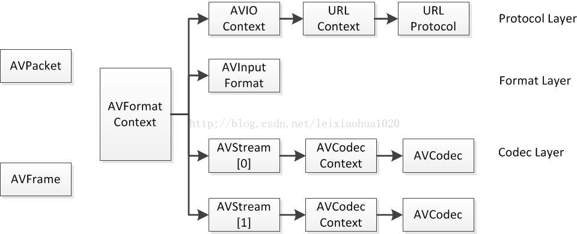
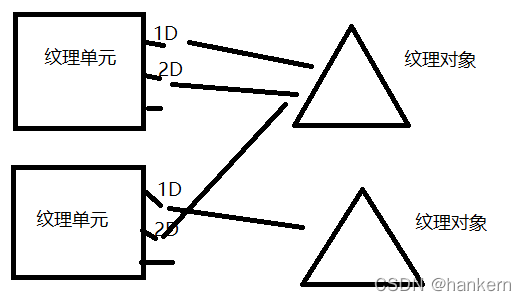

## libawall Arbitration

### 准备材料

1. 身份证复印件
2. 劳动合同复印件/新旧
3. 解除劳动通知复印件/原件
4. 考勤记录，加班，剩余年假，剩余调休，做好分类计算
5. 纳税明细（个人所得税app下载）
6. 近12个月社保缴纳明细（含养老，医疗，失业）（支付宝下载）
7. 近12个月公积金缴纳明细（支付宝-市民中心-公积金-存缴明细查询-存缴证明打印下载）
8. 相关证据录屏

### money

1. 请求裁决被申请人支付违法解除劳动合同赔偿金 1.6x2
2. 请求裁决被申请人支付工作日加班费用 1.5倍
3. 请求裁决被申请人支付周末调休费用 2倍 78小时
4. 请求裁决被申请人支付年假

### step

### action

### 考勤证据

1. 视频1-考勤
   1. 公司信息：看到认证信息，主体，类型，备案号
   2. 个人信息
   3. 考勤详情：月统计那里，每一项详细展开
   4. 假期信息：还剩多少年假，调休假

2. 视频2-加班
   1. 公司信息:同视频1先过一遍
   2. 个人信息:同视频1先过一遍
   3. 申请概览：在全部页面由上至下滚动一遍
   4. 申请详细：回过头，每一个申请的详情，包括隐藏页打开，由上至下滚动一遍

### other

