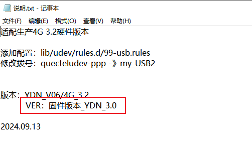
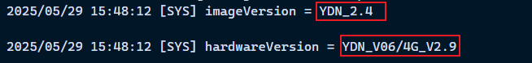
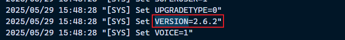
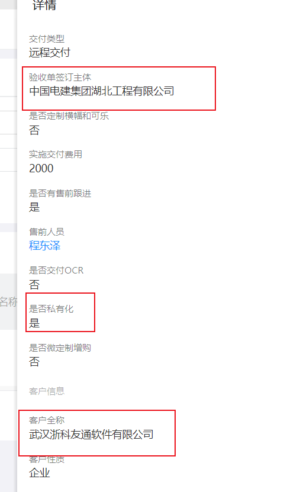
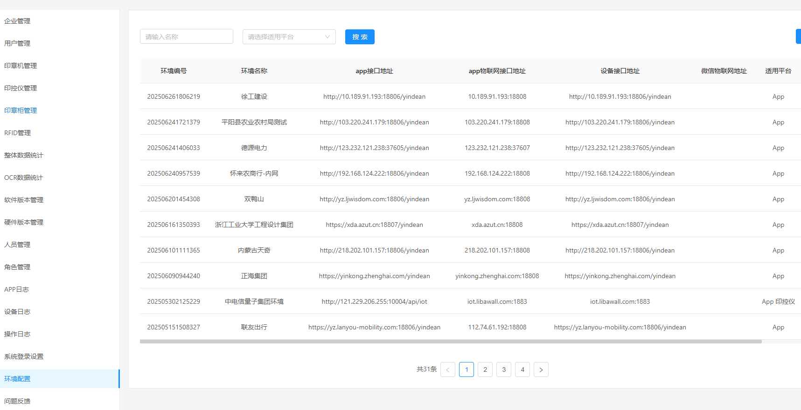

### 印得安运营后台-企业管理

1. 客户类型
   1. 正装客户
   2. 押金客户
2. 企业类型
   1. 企业
   2. 政府机构
3. 企业属性
   1. 集团

### 镜像 固件的版本确定

1. 首先镜像的选用是受pcb版本以及部分模块版本限制的
   1. pcb存在版本号，如: `YDN_V06/4G_V2.9`
   2. 设备在pcb版本号相同的情况下，还存在部分硬件模块的差异，比如wifi蓝牙模块，红外等，所以单靠pcb版本并不能表示具体的硬件情况，也就无法确定具体可用镜像
   3. 所以，还需要通过上位机读取4G板版本或者设备外观组合判断，选用具体镜像版本
   4. ftp，镜像存储路径: \\192.168.52.243\篱笆墙集团\研发中心\硬件研发部\嵌入式软件G\98_固件&Kernel\印得安 APLUS\生产文件\印得安A Plus生产镜像
      1. 说明: 目前主推的镜像非红外使用:2024.06.25（单频wifi+噪点问题），有红外使用：2024.09.13（sass基本线_双频+红外）
      2. 镜像目录下的说明文件中的固件即为镜像意思
      3. 
   5. 设备应用日志中的相关部分:
      1. 
      2. 

### 指纹

1. 指纹录入：为什么在手机app上，A可以通过设备录入B的指纹？意思是指纹录入是限制账号的，只要同一个企业的账号，就可以用来录入其他人的指纹
2. 指纹管理：为什么手机app上只显示了每个人第一次录制的指纹时间节点，并且可以删除其他人的指纹

### 客户领用单

1. 

### 私有化和saas 正式环境和测试环境

1. 私有化客户不一定在私有化链接文档里面
2. 需要与交付以及售后人员确认
3. 正式环境和测试环境的切换，只要修改配置文件的env相关字段
4. 私有化和saas的切换需要具体工具，涉及到修改的地方比较多

### mqtt账号密码

1. 由后端生成，再由生产导入
2. 除了账号密码问题，还有一个后端缓存问题，也会导致无法连接服务器

## 蓝牙无法连接

1. 蓝牙驱动

## 额外功能
限位开关异常报警，比如在超出预期时间内状态变化了