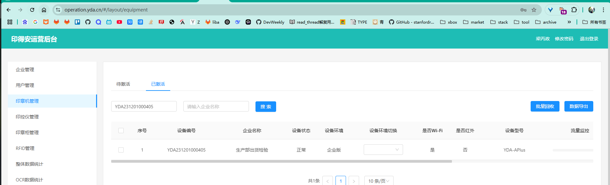
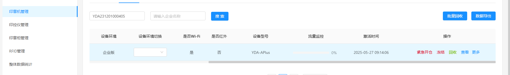
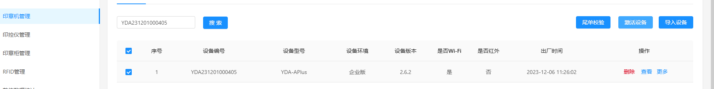

### 管理系统

#### 印章机和企业和环境关系

1. 一台印章机只能绑定一个企业？准确说是只能绑定一个环境下的一个环境，如果绑定了多个环境下的企业，是否就可以通过切换环境，来切换这几个关联企业?

### 模块管理

#### 印章机管理

管理位置: 运营后台管理系统中的印章机管理模块

1. 

如何绑定一台印章机

1. 如果已经绑定企业了，则定义为已激活，需要进行回收
2. 
3. 印章回收后，则处于未激活状态，选择勾选设备，进行设备激活，绑定目标企业
4. 
5. 此时重启设备后，打开手机操作app，使用绑定企业的员工账号登录，就能看到设备在线

#### 印章管理

1. 首先印章是客户自定制的，没有

