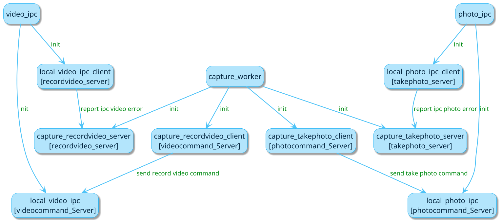

```plantuml
@startuml

' hide empty description 隐藏状态的空描述
hide empty description

' ==== 状态图样式：天蓝可爱风 ====
skinparam state {
    ' 状态背景色：浅天蓝
    BackgroundColor #B3E5FC

    ' 状态边框色：亮天蓝
    BorderColor #03A9F4

    ' 状态字体颜色：深蓝
    ' FontColor #01579B
    FontColor #03253f

    ' 字体大小
    FontSize 14

    ' 开启立体阴影
    ' Shadowing true
}

skinparam shadowing true

' 箭头颜色：亮蓝
skinparam ArrowColor #4FC3F7

' 箭头字体颜色：中蓝
' skinparam ArrowFontColor #0288D1
skinparam ArrowFontColor #028b14

skinparam ArrowFontSize 12
skinparam ArrowThickness 1.5

' 背景白色，简洁
skinparam backgroundColor #FFFFFF
skinparam dpi 150

' 定义排列方向
top to bottom direction

' 使用双引号和as，来命名别名，下面两个变量，alias1 和 alias2 的别名都是long name
' state "long name" as alias1
' state alias2 as "long name"
state "capture_worker" as cp_worker
state "video_ipc" as video_ipc
state "photo_ipc" as photo_ipc

state "local_video_ipc\n[videocommand_Server]" as video_ipc_server
state "local_video_ipc_client\n[recordvideo_server]" as video_ipc_client
state "local_photo_ipc\n[photocommand_Server]" as photo_ipc_server
state "local_photo_ipc_client\n[takephoto_server]" as photo_ipc_client

state "capture_recordvideo_server\n[recordvideo_server]" as cp_video_server
state "capture_takephoto_server\n[takephoto_server]" as cp_photo_server
state "capture_recordvideo_client\n[videocommand_Server]" as cp_video_client
state "capture_takephoto_client\n[photocommand_Server]" as cp_photo_client

' cpwk -right-> midser: init 定义箭头方向
cp_worker-->cp_video_server: init
cp_worker-->cp_photo_server: init
cp_worker-->cp_video_client: init
cp_worker-->cp_photo_client: init

video_ipc-->video_ipc_server: init
video_ipc-->video_ipc_client: init
photo_ipc-->photo_ipc_server: init
photo_ipc-->photo_ipc_client: init

video_ipc_client-->cp_video_server: report ipc video error
photo_ipc_client-->cp_photo_server: report ipc photo error

cp_video_client-->video_ipc_server: send record video command
cp_photo_client-->photo_ipc_server: send take photo command

@enduml
```

