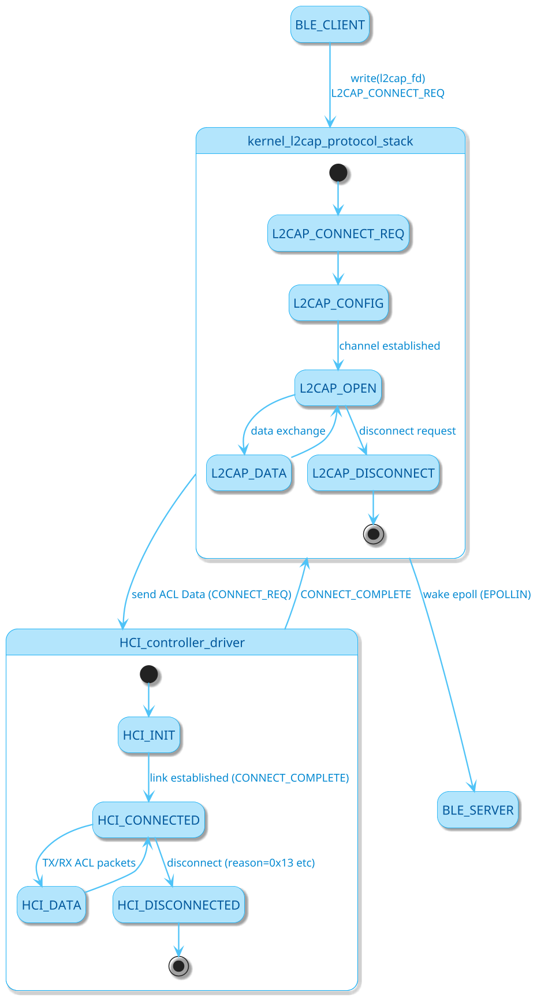
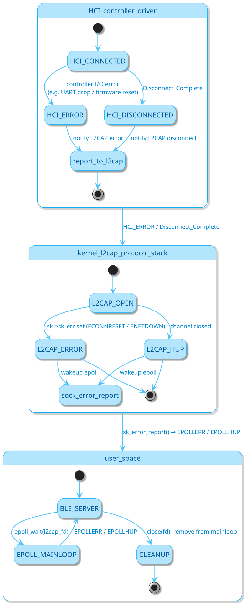
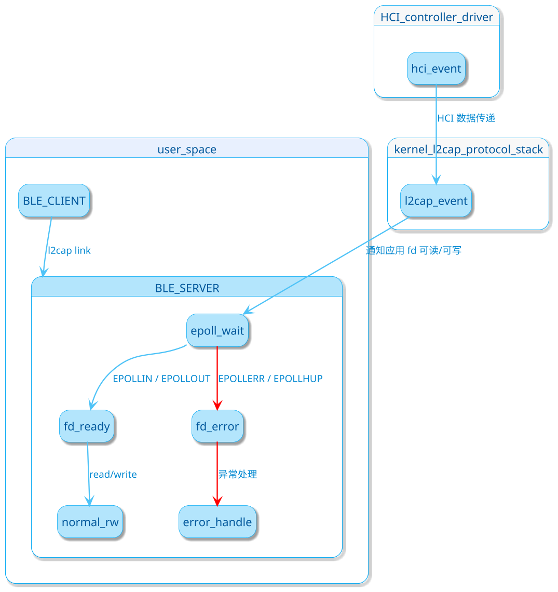

搭配原理图
当前模块关系

### bluetooth

1. 有概率，非必现，蓝牙连接建立成功后，天玺设备端作为 低功耗蓝牙的服务端，在正常通讯过程中，对应的fd会接收到EPOLLERR和EPOLLHUP事件(当前应用层蓝牙底层代码是从bluez源码中裁剪的低功耗蓝牙相关部分，bluez底层通过epoll机制监听蓝牙fd事件，事件来源系统内核的l2cap协议栈或者蓝牙hci驱动)，引发的具体原因暂未排查到，此时服务端无法进行fd的write(对应业务操作即消息发送)，但还能进行read(若是客户端此时发送消息)
2. 蓝牙驱动 系统内核 用户态的蓝牙代码

```plantuml

' hide empty description 隐藏状态的空描述
hide empty description

' ==== 状态图样式：天蓝可爱风 ====
skinparam state {
    ' 状态背景色：浅天蓝
    BackgroundColor #B3E5FC

    ' 状态边框色：亮天蓝
    BorderColor #03A9F4

    ' 状态字体颜色：深蓝
    ' FontColor #01579B
    FontColor #03253f

    ' 字体大小
    FontSize 14

    ' 开启立体阴影
    ' Shadowing true
}

skinparam shadowing true

' 箭头颜色：亮蓝
skinparam ArrowColor #4FC3F7

' 箭头字体颜色：中蓝
' skinparam ArrowFontColor #0288D1
skinparam ArrowFontColor #028b14

skinparam ArrowFontSize 12
skinparam ArrowThickness 1.5

' 背景白色，简洁
skinparam backgroundColor #FFFFFF
skinparam dpi 150

' 定义排列方向
top to bottom direction


state user_space {
  BLE_CLIENT --> BLE_SERVER: l2cap link
  BLE_SERVER --> BLE_SERVER: epoll_wait: l2cap fd
}
state kernel_l2cap_protocol_stack {

}

state HCI_controller_driver{

}

初始化完成 --> 工作中 : 用户操作
工作中 --> 异常状态 : 错误发生
工作中 --> 结束状态 : 正常退出
异常状态 --> 结束状态 : 修复或退出

@enduml

```








### wifi

1. 遇到较低概率，在wpa_supplicant后台服务运行存活时，应用通过wpa_cli命令发送指令失效，如正常发送connect等操作指令，没有任何结果返回，最终在业务层表现为操作超时

### 4G

1. 仅一个物理串口，该设备节点在拨号成功后，会被pppd进程持有上锁，其他进程无法访问，会在打开设备时阻塞，除非pppd进程结束(意味着终止4g通信)