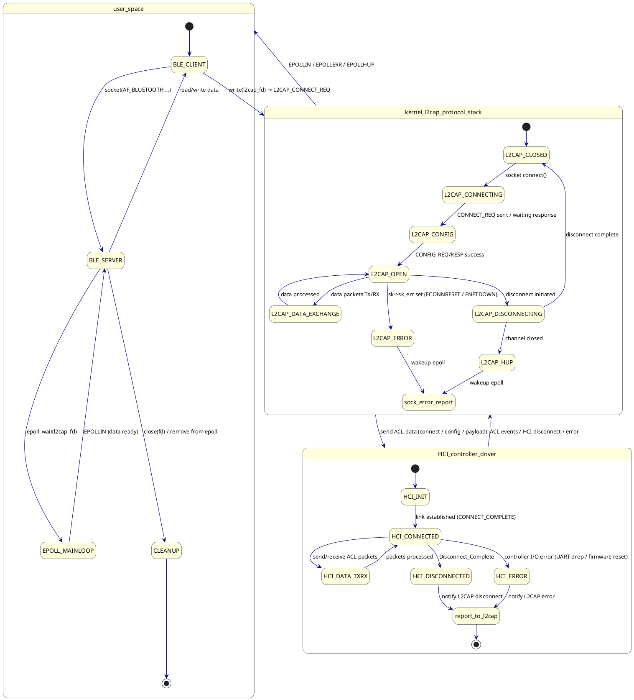
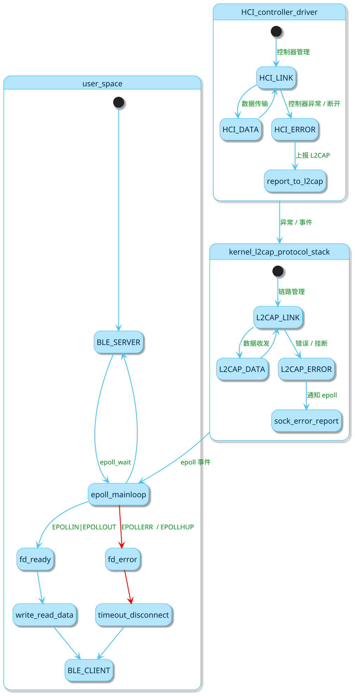
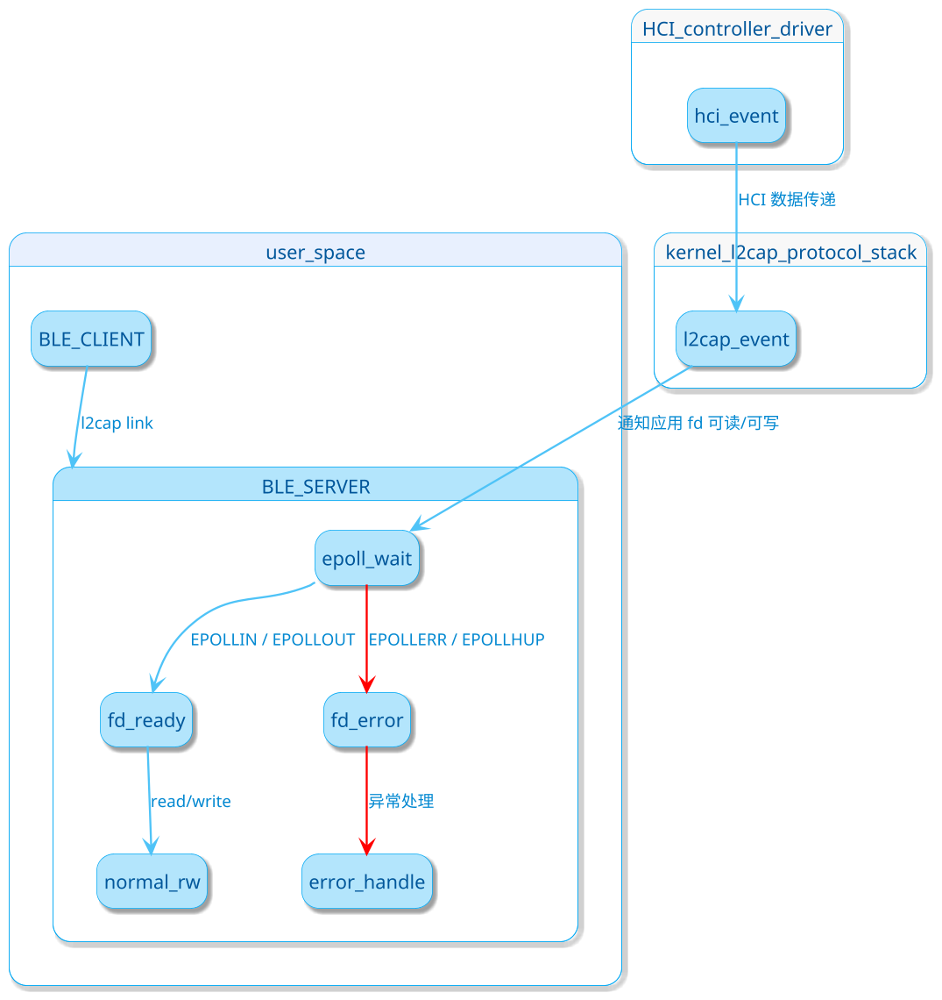

## uml

```plantuml

@startuml
hide empty description

skinparam state {
  BackgroundColor LightYellow
  BorderColor Black
  ArrowColor DarkBlue
}

' ---------------- 用户态 ----------------
state user_space {
    [*] --> BLE_CLIENT
    BLE_CLIENT --> BLE_SERVER: socket(AF_BLUETOOTH,...)
    BLE_SERVER --> EPOLL_MAINLOOP: epoll_wait(l2cap_fd)
    EPOLL_MAINLOOP --> BLE_SERVER: EPOLLIN (data ready)
    BLE_SERVER --> BLE_CLIENT: read/write data
    BLE_SERVER --> CLEANUP: close(fd) / remove from epoll
    CLEANUP --> [*]
}

' ---------------- 内核 L2CAP ----------------
state kernel_l2cap_protocol_stack {
    [*] --> L2CAP_CLOSED

    L2CAP_CLOSED --> L2CAP_CONNECTING: socket connect()
    L2CAP_CONNECTING --> L2CAP_CONFIG: CONNECT_REQ sent / waiting response
    L2CAP_CONFIG --> L2CAP_OPEN: CONFIG_REQ/RESP success
    L2CAP_OPEN --> L2CAP_DATA_EXCHANGE: data packets TX/RX
    L2CAP_DATA_EXCHANGE --> L2CAP_OPEN: data processed
    L2CAP_OPEN --> L2CAP_DISCONNECTING: disconnect initiated
    L2CAP_DISCONNECTING --> L2CAP_CLOSED: disconnect complete

    ' 异常状态
    L2CAP_OPEN --> L2CAP_ERROR: sk->sk_err set (ECONNRESET / ENETDOWN)
    L2CAP_ERROR --> sock_error_report: wakeup epoll
    L2CAP_DISCONNECTING --> L2CAP_HUP: channel closed
    L2CAP_HUP --> sock_error_report: wakeup epoll
}

' ---------------- HCI 驱动 & 控制器 ----------------
state HCI_controller_driver {
    [*] --> HCI_INIT
    HCI_INIT --> HCI_CONNECTED: link established (CONNECT_COMPLETE)
    HCI_CONNECTED --> HCI_DATA_TXRX: send/receive ACL packets
    HCI_DATA_TXRX --> HCI_CONNECTED: packets processed
    HCI_CONNECTED --> HCI_DISCONNECTED: Disconnect_Complete
    HCI_CONNECTED --> HCI_ERROR: controller I/O error (UART drop / firmware reset)
    HCI_ERROR --> report_to_l2cap: notify L2CAP error
    HCI_DISCONNECTED --> report_to_l2cap: notify L2CAP disconnect
    report_to_l2cap --> [*]
}

' ---------------- 层间交互 ----------------
BLE_CLIENT --> kernel_l2cap_protocol_stack: write(l2cap_fd) → L2CAP_CONNECT_REQ
kernel_l2cap_protocol_stack --> HCI_controller_driver: send ACL data (connect / config / payload)
HCI_controller_driver --> kernel_l2cap_protocol_stack: ACL events / HCI disconnect / error
kernel_l2cap_protocol_stack --> user_space: EPOLLIN / EPOLLERR / EPOLLHUP

@enduml


```

```plantuml

@startuml

hide empty description
skinparam state {
    BackgroundColor #B3E5FC
    BorderColor #03A9F4
    FontColor #03253f
    FontSize 14
}

skinparam shadowing true
skinparam ArrowColor #4FC3F7
skinparam ArrowFontColor #028b14
skinparam ArrowFontSize 12
skinparam ArrowThickness 1.5
skinparam backgroundColor #FFFFFF
skinparam dpi 150
top to bottom direction

' ---------------- 用户态 ----------------
state user_space {
    ' [*] --> BLE_CLIENT
    [*] --> BLE_SERVER
    ' BLE_CLIENT --> BLE_SERVER: 链接管理 / 数据收发
    BLE_SERVER --> epoll_mainloop: epoll_wait
    epoll_mainloop --> BLE_SERVER
    epoll_mainloop --> fd_ready: EPOLLIN|EPOLLOUT
    epoll_mainloop -[#red]-> fd_error: EPOLLERR  / EPOLLHUP 
    fd_error -[#red]-> timeout_disconnect
    fd_ready --> write_read_data
    timeout_disconnect --> BLE_CLIENT
    write_read_data --> BLE_CLIENT
}

' ---------------- 内核 L2CAP ----------------
state kernel_l2cap_protocol_stack {
    [*] --> L2CAP_LINK: 链路管理
    L2CAP_LINK --> L2CAP_DATA: 数据收发
    L2CAP_LINK --> L2CAP_ERROR: 错误 / 挂断
    L2CAP_DATA --> L2CAP_LINK
    L2CAP_ERROR --> sock_error_report: 通知 epoll
}

' ---------------- HCI 驱动 & 控制器 ----------------
state HCI_controller_driver {
    [*] --> HCI_LINK: 控制器管理
    HCI_LINK --> HCI_DATA: 数据传输
    HCI_LINK --> HCI_ERROR: 控制器异常 / 断开
    HCI_DATA --> HCI_LINK
    HCI_ERROR --> report_to_l2cap: 上报 L2CAP
}

' ---------------- 层间交互 ----------------
HCI_controller_driver --> kernel_l2cap_protocol_stack: 异常 / 事件
' kernel_l2cap_protocol_stack --> user_space: epoll 事件
kernel_l2cap_protocol_stack --> epoll_mainloop: epoll 事件

@enduml

```

```plantuml
@startuml
hide empty description

skinparam state {
    BackgroundColor #B3E5FC
    BorderColor #03A9F4
    FontColor #01579B
    FontSize 14
}
skinparam shadowing true
skinparam ArrowColor #4FC3F7
skinparam ArrowFontColor #0288D1
skinparam ArrowFontSize 12
skinparam ArrowThickness 1.5
skinparam backgroundColor #FFFFFF
skinparam dpi 150

skinparam state {
    BackgroundColor<<user>> #E8F0FE
    BackgroundColor<<kernel>> #F8F8F8
    BackgroundColor<<hci>> #F8F8F8
}

' ------------------ User Space ------------------
state user_space <<user>> {
    state BLE_CLIENT
    state BLE_SERVER {
        state epoll_wait
        state fd_ready
        state normal_rw
        state fd_error
        state error_handle

        ' 正常读写流程
        epoll_wait --> fd_ready : EPOLLIN / EPOLLOUT
        fd_ready --> normal_rw : read/write

        ' 异常流程
        epoll_wait -[#red]-> fd_error : EPOLLERR / EPOLLHUP
        fd_error -[#red]-> error_handle : 异常处理
    }

    BLE_CLIENT --> BLE_SERVER : l2cap link
}

' ------------------ Kernel / HCI ------------------
state kernel_l2cap_protocol_stack <<kernel>> {
    state l2cap_event
    l2cap_event --> epoll_wait : 通知应用 fd 可读/可写
}

state HCI_controller_driver <<hci>> {
    state hci_event
    hci_event --> l2cap_event : HCI 数据传递
}

@enduml


```