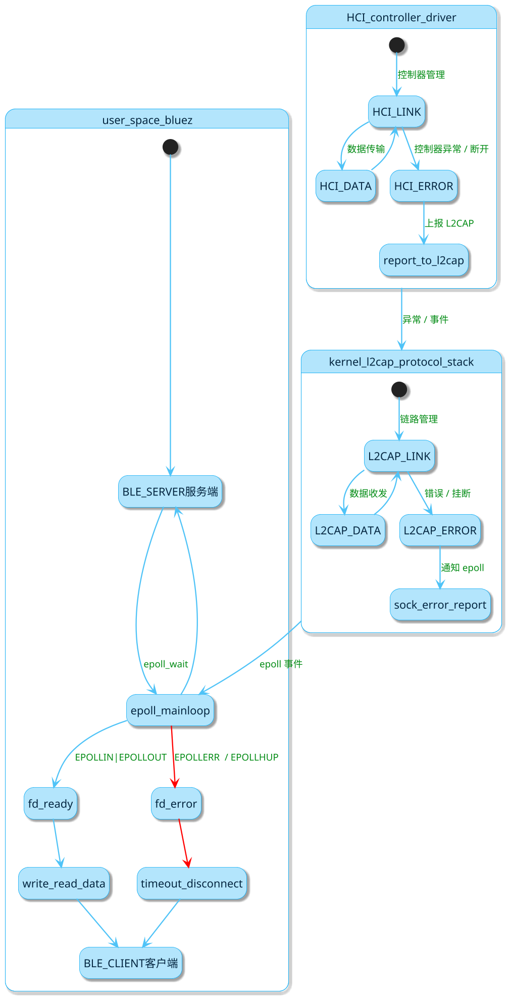
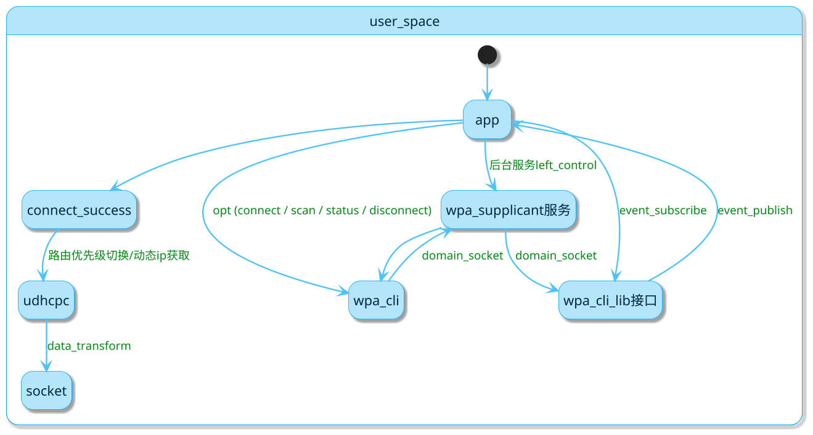

### smart_v05 蓝牙 wifi当前问题总结

### bluetooth

1. 有概率，非必现，蓝牙连接建立成功后，天玺设备端作为 低功耗蓝牙的服务端，在正常通讯过程中，对应的fd会接收到EPOLLERR和EPOLLHUP事件(当前应用层蓝牙底层代码是从bluez源码中裁剪的低功耗蓝牙相关部分，bluez底层通过epoll机制监听蓝牙fd事件，事件来源系统内核的l2cap协议栈或者蓝牙hci驱动)，引发的具体原因暂未排查到，此时服务端无法进行fd的write(对应业务操作即消息发送)，但还能进行read(若是客户端此时发送消息).

### wifi

1. 遇到较低概率，在wpa_supplicant后台服务运行存活时，应用通过wpa_cli命令发送指令失效，如正常发送connect等操作指令，没有任何结果返回，最终在业务层表现为操作超时.

