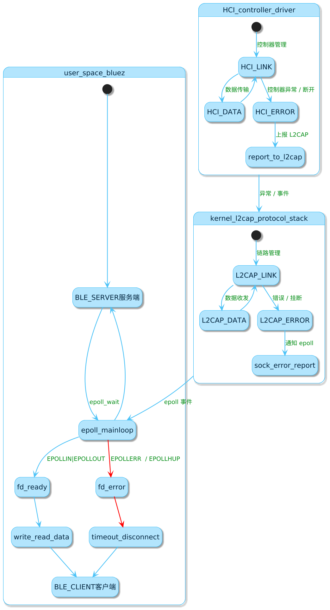
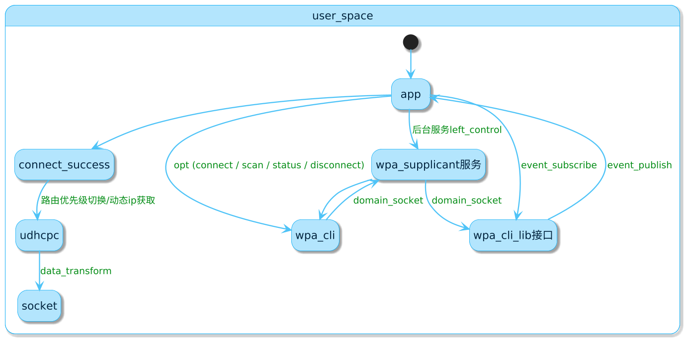

### smart_v05 蓝牙 wifi当前问题总结

### bluetooth

1. 有概率，非必现，蓝牙连接建立成功后，天玺设备端作为 低功耗蓝牙的服务端，在正常通讯过程中，对应的fd会接收到EPOLLERR和EPOLLHUP事件(当前应用层蓝牙底层代码是从bluez源码中裁剪的低功耗蓝牙相关部分，bluez底层通过epoll机制监听蓝牙fd事件，事件来源系统内核的l2cap协议栈或者蓝牙hci驱动)，引发的具体原因暂未排查到，此时服务端无法进行fd的write(对应业务操作即消息发送)，但还能进行read(若是客户端此时发送消息).

#### 日志情况

bluez接口没有错误返回，说明数据是成功添加到底层缓存队列中等待被发送，但就是没有被write出去，starce跟踪可用看到fd有error的事件

```bash
[25-09-17 15:47:06.720][rk_bt_c_ad][Mock_RK_BleWr 288][thread 596][D] [==>] Mock_RK_BleWriteData, uuid: [dfd4416e-1810-47f7-8248-eb8be3dc47f9], data: [/>|40|WIFILISTV2|OK~0|-45~1~ChinaNet-TNT~0~0|#]
[25-09-17 15:47:06.721][my_btgatt_][ble_server_no 429][thread 605][D] enter ble_server_notify
[25-09-17 15:47:06.721][my_btgatt_][ble_server_no 460][thread 605][D] send gatt notification, uuid: [dfd4416e-1810-47f7-8248-eb8be3dc47f9], handle: [15], payload len: [46]
[25-09-17 15:47:06.721][bt_ble_rpc][notify_sync   175][thread 596][W] [BtBleRpcClient] [notify_sync] timeout for cmd: [ble_client_notify], ret code: [0], cost time ms: [1], uuid: [dfd4416e-1810-47f7-8248-eb8be3dc47f9], messa
ge: [/>|40|WIFILISTV2|OK~0|-45~1~ChinaNet-TNT~0~0|#]
[25-09-17 15:47:06.722][rk_bt_c_ad][Mock_RK_BleWr 291][thread 596][D] [end] Mock_RK_BleWriteData, uuid: [dfd4416e-1810-47f7-8248-eb8be3dc47f9], data: [/>|40|WIFILISTV2|OK~0|-45~1~ChinaNet-TNT~0~0|#], ret: [0]
[NETWK] BT Write Data(ret=0): [/>|40|WIFILISTV2|OK~0|-45~1~ChinaNet-TNT~0~0|#][size:0 ver:2]
[25-09-17 15:47:06.920][rk_bt_c_ad][Mock_RK_BleWr 288][thread 596][D] [==>] Mock_RK_BleWriteData, uuid: [dfd4416e-1810-47f7-8248-eb8be3dc47f9], data: [/>|40|WIFILISTV2|OK~0|-45~1~TP-LINK_F41B~0~0|#]
[25-09-17 15:47:06.921][my_btgatt_][ble_server_no 429][thread 605][D] enter ble_server_notify
[25-09-17 15:47:06.921][my_btgatt_][ble_server_no 460][thread 605][D] send gatt notification, uuid: [dfd4416e-1810-47f7-8248-eb8be3dc47f9], handle: [15], payload len: [46]
[25-09-17 15:47:06.922][bt_ble_rpc][notify_sync   175][thread 596][W] [BtBleRpcClient] [notify_sync] timeout for cmd: [ble_client_notify], ret code: [0], cost time ms: [1], uuid: [dfd4416e-1810-47f7-8248-eb8be3dc47f9], messa
ge: [/>|40|WIFILISTV2|OK~0|-45~1~TP-LINK_F41B~0~0|#]
[25-09-17 15:47:06.922][rk_bt_c_ad][Mock_RK_BleWr 291][thread 596][D] [end] Mock_RK_BleWriteData, uuid: [dfd4416e-1810-47f7-8248-eb8be3dc47f9], data: [/>|40|WIFILISTV2|OK~0|-45~1~TP-LINK_F41B~0~0|#], ret: [0]
[NETWK] BT Write Data(ret=0): [/>|40|WIFILISTV2|OK~0|-45~1~TP-LINK_F41B~0~0|#][size:0 ver:2]
[25-09-17 15:47:07.120][rk_bt_c_ad][Mock_RK_BleWr 288][thread 596][D] [==>] Mock_RK_BleWriteData, uuid: [dfd4416e-1810-47f7-8248-eb8be3dc47f9], data: [/>|39|WIFILISTV2|OK~0|-47~1~Libawall-5G~1~1|#]
[25-09-17 15:47:07.121][my_btgatt_][ble_server_no 429][thread 605][D] enter ble_server_notify
[25-09-17 15:47:07.121][my_btgatt_][ble_server_no 460][thread 605][D] send gatt notification, uuid: [dfd4416e-1810-47f7-8248-eb8be3dc47f9], handle: [15], payload len: [45]
[25-09-17 15:47:07.122][bt_ble_rpc][notify_sync   175][thread 596][W] [BtBleRpcClient] [notify_sync] timeout for cmd: [ble_client_notify], ret code: [0], cost time ms: [1], uuid: [dfd4416e-1810-47f7-8248-eb8be3dc47f9], messa
ge: [/>|39|WIFILISTV2|OK~0|-47~1~Libawall-5G~1~1|#]
[25-09-17 15:47:07.122][rk_bt_c_ad][Mock_RK_BleWr 291][thread 596][D] [end] Mock_RK_BleWriteData, uuid: [dfd4416e-1810-47f7-8248-eb8be3dc47f9], data: [/>|39|WIFILISTV2|OK~0|-47~1~Libawall-5G~1~1|#], ret: [0]
[NETWK] BT Write Data(ret=0): [/>|39|WIFILISTV2|OK~0|-47~1~Libawall-5G~1~1|#][size:0 ver:2]
[25-09-17 15:47:07.320][rk_bt_c_ad][Mock_RK_BleWr 288][thread 596][D] [==>] Mock_RK_BleWriteData, uuid: [dfd4416e-1810-47f7-8248-eb8be3dc47f9], data: [/>|34|WIFILISTV2|OK~0|-49~1~device~0~0|#]
[25-09-17 15:47:07.320][my_btgatt_][ble_server_no 429][thread 605][D] enter ble_server_notify
[25-09-17 15:47:07.321][my_btgatt_][ble_server_no 460][thread 605][D] send gatt notification, uuid: [dfd4416e-1810-47f7-8248-eb8be3dc47f9], handle: [15], payload len: [40]
[25-09-17 15:47:07.321][bt_ble_rpc][notify_sync   175][thread 596][W] [BtBleRpcClient] [notify_sync] timeout for cmd: [ble_client_notify], ret code: [0], cost time ms: [1], uuid: [dfd4416e-1810-47f7-8248-eb8be3dc47f9], messa
ge: [/>|34|WIFILISTV2|OK~0|-49~1~device~0~0|#]
[25-09-17 15:47:07.321][rk_bt_c_ad][Mock_RK_BleWr 291][thread 596][D] [end] Mock_RK_BleWriteData, uuid: [dfd4416e-1810-47f7-8248-eb8be3dc47f9], data: [/>|34|WIFILISTV2|OK~0|-49~1~device~0~0|#], ret: [0]
[NETWK] BT Write Data(ret=0): [/>|34|WIFILISTV2|OK~0|-49~1~device~0~0|#][size:0 ver:2]
[25-09-17 15:47:07.526][rk_bt_c_ad][Mock_RK_BleWr 288][thread 596][D] [==>] Mock_RK_BleWriteData, uuid: [dfd4416e-1810-47f7-8248-eb8be3dc47f9], data: [/>|34|WIFILISTV2|OK~0|-49~1~zzwifi~0~0|#]
[25-09-17 15:47:07.526][my_btgatt_][ble_server_no 429][thread 605][D] enter ble_server_notify
[25-09-17 15:47:07.526][my_btgatt_][ble_server_no 460][thread 605][D] send gatt notification, uuid: [dfd4416e-1810-47f7-8248-eb8be3dc47f9], handle: [15], payload len: [40]
[25-09-17 15:47:07.527][bt_ble_rpc][notify_sync   175][thread 596][W] [BtBleRpcClient] [notify_sync] timeout for cmd: [ble_client_notify], ret code: [0], cost time ms: [1], uuid: [dfd4416e-1810-47f7-8248-eb8be3dc47f9], messa
ge: [/>|34|WIFILISTV2|OK~0|-49~1~zzwifi~0~0|#]
[25-09-17 15:47:07.527][rk_bt_c_ad][Mock_RK_BleWr 291][thread 596][D] [end] Mock_RK_BleWriteData, uuid: [dfd4416e-1810-47f7-8248-eb8be3dc47f9], data: [/>|34|WIFILISTV2|OK~0|-49~1~zzwifi~0~0|#], ret: [0]
[NETWK] BT Write Data(ret=0): [/>|34|WIFILISTV2|OK~0|-49~1~zzwifi~0~0|#][size:0 ver:2]
[25-09-17 15:47:07.720][rk_bt_c_ad][Mock_RK_BleWr 288][thread 596][D] [==>] Mock_RK_BleWriteData, uuid: [dfd4416e-1810-47f7-8248-eb8be3dc47f9], data: [/>|33|WIFILISTV2|OK~0|-50~1~guest~0~0|#]
[25-09-17 15:47:07.720][my_btgatt_][ble_server_no 429][thread 605][D] enter ble_server_notify
[25-09-17 15:47:07.720][my_btgatt_][ble_server_no 460][thread 605][D] send gatt notification, uuid: [dfd4416e-1810-47f7-8248-eb8be3dc47f9], handle: [15], payload len: [39]
[25-09-17 15:47:07.722][bt_ble_rpc][notify_sync   175][thread 596][W] [BtBleRpcClient] [notify_sync] timeout for cmd: [ble_client_notify], ret code: [0], cost time ms: [1], uuid: [dfd4416e-1810-47f7-8248-eb8be3dc47f9], messa
ge: [/>|33|WIFILISTV2|OK~0|-50~1~guest~0~0|#]
[25-09-17 15:47:07.722][rk_bt_c_ad][Mock_RK_BleWr 291][thread 596][D] [end] Mock_RK_BleWriteData, uuid: [dfd4416e-1810-47f7-8248-eb8be3dc47f9], data: [/>|33|WIFILISTV2|OK~0|-50~1~guest~0~0|#], ret: [0]
[NETWK] BT Write Data(ret=0): [/>|33|WIFILISTV2|OK~0|-50~1~guest~0~0|#][size:0 ver:2]
[25-09-17 15:47:07.920][rk_bt_c_ad][Mock_RK_BleWr 288][thread 596][D] [==>] Mock_RK_BleWriteData, uuid: [dfd4416e-1810-47f7-8248-eb8be3dc47f9], data: [/>|36|WIFILISTV2|OK~0|-52~1~Libawall~0~0|#]
[25-09-17 15:47:07.921][my_btgatt_][ble_server_no 429][thread 605][D] enter ble_server_notify
[25-09-17 15:47:07.921][my_btgatt_][ble_server_no 460][thread 605][D] send gatt notification, uuid: [dfd4416e-1810-47f7-8248-eb8be3dc47f9], handle: [15], payload len: [42]
[25-09-17 15:47:07.922][bt_ble_rpc][notify_sync   175][thread 596][W] [BtBleRpcClient] [notify_sync] timeout for cmd: [ble_client_notify], ret code: [0], cost time ms: [1], uuid: [dfd4416e-1810-47f7-8248-eb8be3dc47f9], messa
ge: [/>|36|WIFILISTV2|OK~0|-52~1~Libawall~0~0|#]
[25-09-17 15:47:07.922][rk_bt_c_ad][Mock_RK_BleWr 291][thread 596][D] [end] Mock_RK_BleWriteData, uuid: [dfd4416e-1810-47f7-8248-eb8be3dc47f9], data: [/>|36|WIFILISTV2|OK~0|-52~1~Libawall~0~0|#], ret: [0]
[NETWK] BT Write Data(ret=0): [/>|36|WIFILISTV2|OK~0|-52~1~Libawall~0~0|#][size:0 ver:2]
[25-09-17 15:47:08.120][rk_bt_c_ad][Mock_RK_BleWr 288][thread 596][D] [==>] Mock_RK_BleWriteData, uuid: [dfd4416e-1810-47f7-8248-eb8be3dc47f9], data: [/>|33|WIFILISTV2|OK~0|-57~1~ceshi~0~0|#]
[25-09-17 15:47:08.120][my_btgatt_][ble_server_no 429][thread 605][D] enter ble_server_notify
[25-09-17 15:47:08.121][my_btgatt_][ble_server_no 460][thread 605][D] send gatt notification, uuid: [dfd4416e-1810-47f7-8248-eb8be3dc47f9], handle: [15], payload len: [39]
[25-09-17 15:47:08.122][bt_ble_rpc][notify_sync   175][thread 596][W] [BtBleRpcClient] [notify_sync] timeout for cmd: [ble_client_notify], ret code: [0], cost time ms: [1], uuid: [dfd4416e-1810-47f7-8248-eb8be3dc47f9], messa
ge: [/>|33|WIFILISTV2|OK~0|-57~1~ceshi~0~0|#]
[25-09-17 15:47:08.122][rk_bt_c_ad][Mock_RK_BleWr 291][thread 596][D] [end] Mock_RK_BleWriteData, uuid: [dfd4416e-1810-47f7-8248-eb8be3dc47f9], data: [/>|33|WIFILISTV2|OK~0|-57~1~ceshi~0~0|#], ret: [0]
[NETWK] BT Write Data(ret=0): [/>|33|WIFILISTV2|OK~0|-57~1~ceshi~0~0|#][size:0 ver:2]
[25-09-17 15:47:08.320][rk_bt_c_ad][Mock_RK_BleWr 288][thread 596][D] [==>] Mock_RK_BleWriteData, uuid: [dfd4416e-1810-47f7-8248-eb8be3dc47f9], data: [/>|38|WIFILISTV2|OK~0|-70~1~Dy-5G-1708~0~0|#]
[25-09-17 15:47:08.321][my_btgatt_][ble_server_no 429][thread 605][D] enter ble_server_notify
[25-09-17 15:47:08.321][my_btgatt_][ble_server_no 460][thread 605][D] send gatt notification, uuid: [dfd4416e-1810-47f7-8248-eb8be3dc47f9], handle: [15], payload len: [44]
[25-09-17 15:47:08.322][bt_ble_rpc][notify_sync   175][thread 596][W] [BtBleRpcClient] [notify_sync] timeout for cmd: [ble_client_notify], ret code: [0], cost time ms: [1], uuid: [dfd4416e-1810-47f7-8248-eb8be3dc47f9], messa
ge: [/>|38|WIFILISTV2|OK~0|-70~1~Dy-5G-1708~0~0|#]
[25-09-17 15:47:08.322][rk_bt_c_ad][Mock_RK_BleWr 291][thread 596][D] [end] Mock_RK_BleWriteData, uuid: [dfd4416e-1810-47f7-8248-eb8be3dc47f9], data: [/>|38|WIFILISTV2|OK~0|-70~1~Dy-5G-1708~0~0|#], ret: [0]
[NETWK] BT Write Data(ret=0): [/>|38|WIFILISTV2|OK~0|-70~1~Dy-5G-1708~0~0|#][size:0 ver:2]
[25-09-17 15:47:08.563][bt_ble_rpc][operator()     92][thread 605][D] [BtBleRpcServer] receive BLE_CLIENT_HEARTBEAT
[25-09-17 15:47:08.564][bt_ble_rpc][operator()    212][thread 609][I] [BtBleRpcClient] [req_rsp] BLE_CLIENT_HEARTBEAT, rsp=0

[25-09-17 15:47:10.564][bt_ble_rpc][operator()     92][thread 605][D] [BtBleRpcServer] receive BLE_CLIENT_HEARTBEAT
[25-09-17 15:47:10.564][bt_ble_rpc][operator()    212][thread 609][I] [BtBleRpcClient] [req_rsp] BLE_CLIENT_HEARTBEAT, rsp=0

## 上面错误发生时，进入starce，还是读成功的

root@Rockchip:/oem$ strace -p 612 -tt -T -s 200 -e trace=epoll_wait,epoll_ctl,wr
itev,read
strace: Process 612 attached
15:46:59.473126 epoll_wait(10, [{EPOLLIN, {u32=979240, u64=979240}}], 10, -1) = 1 <5.707519>
15:47:05.181803 read(15, "\22\r\0/>|20|WIFILISTV2|~|#", 185) = 23 <0.000062>
15:47:05.182683 read(16, "TZif2\0\0\0\0\0\0\0\0\0\0\0\0\0\0\0\0\0\0\3\0\0\0\3\0\0\0\33\0\0\0\21\0\0\0\3\0\0\0\f\200\0\0\0\310\\\1\200\310\372'p\311\325\16\200\312\333Z\360\36\2726\r", 68) = 68 <0.000066>
15:47:05.183647 read(16, "\267\33\226\0\0\0\27\0\0\0\0I\\\7\227\0\0\0\30\0\0\0\0O\357\223\30\0\0\0\31\0\0\0\0U\223-\231\0\0\0\32\0\0\0\0XhF\232\0\0\0\33\0\0\0\0\0\0\nCST-8\n", 68) = 68 <0.000032>
15:47:05.186679 epoll_ctl(10, EPOLL_CTL_ADD, 16, {EPOLLIN|EPOLLONESHOT, {u32=984776, u64=984776}}) = 0 <0.000047>
15:47:05.193515 epoll_ctl(4, EPOLL_CTL_MOD, 3, {EPOLLIN|EPOLLERR|EPOLLET, {u32=974660, u64=974660}}) = 0 <0.000074>
15:47:05.197324 epoll_ctl(10, EPOLL_CTL_DEL, 16, NULL) = 0 <0.000062>
15:47:05.203431 epoll_wait(10, [{EPOLLERR|EPOLLHUP, {u32=979240, u64=979240}}], 10, -1) = 1 <29.916374>
15:47:35.125080 read(16, "TZif2\0\0\0\0\0\0\0\0\0\0\0\0\0\0\0\0\0\0\3\0\0\0\3\0\0\0\33\0\0\0\21\0\0\0\3\0\0\0\f\200\0\0\0\310\\\1\200\310\372'p\311\325\16\200\312\333Z\360\36\2726\r", 68) = 68 <0.001045>
15:47:35.126923 read(16, "\267\33\226\0\0\0\27\0\0\0\0I\\\7\227\0\0\0\30\0\0\0\0O\357\223\30\0\0\0\31\0\0\0\0U\223-\231\0\0\0\32\0\0\0\0XhF\232\0\0\0\33\0\0\0\0\0\0\nCST-8\n", 68) = 68 <0.000306>
15:47:35.129862 epoll_ctl(10, EPOLL_CTL_DEL, 15, NULL) = 0 <0.000322>
15:47:35.132366 epoll_ctl(10, EPOLL_CTL_DEL, 13, NULL) = 0 <0.000051>
15:47:35.134299 epoll_ctl(10, EPOLL_CTL_DEL, 14, NULL) = 0 <0.000305>
15:47:35.140808 epoll_ctl(4, EPOLL_CTL_MOD, 3, {EPOLLIN|EPOLLERR|EPOLLET, {u32=974660, u64=974660}}) = 0 <0.000120>
15:47:35.151130 writev(10, [{iov_base="\1", iov_len=1}, {iov_base="\n \1", iov_len=3}, {iov_base="\0", iov_len=1}], 3) = 5 <0.000284>
15:47:35.155651 read(10, "\4\16\4\2\n \0", 260) = 7 <0.000051>
15:47:35.158088 writev(10, [{iov_base="\1", iov_len=1}, {iov_base="\6 \17", iov_len=3}, {iov_base="\20\0\25\0\0\0\0\0\0\0\0\0\0\7\0", iov_len=15}], 3) = 19 <0.000444>
15:47:35.162527 writev(10, [{iov_base="\1", iov_len=1}, {iov_base="\10  ", iov_len=3}, {iov_base="\25\2\1\6\21\7\3734\233_\200\0\0\200\0\20\0\0\n\30\0\0\0\0\0\0\0\0\0\0\0\0", iov_len=32}], 3) = 36 <0.000373>
15:47:35.166676 writev(10, [{iov_base="\1", iov_len=1}, {iov_base="\t  ", iov_len=3}, {iov_base="\22\21\tYDAS250701000005\0\0\0\0\0\0\0\0\0\0\0\0\0", iov_len=32}], 3) = 36 <0.000308>
15:47:35.170895 read(10, "\4\16\4\2\t \0", 260) = 7 <0.000052>
15:47:35.173500 writev(10, [{iov_base="\1", iov_len=1}, {iov_base="\n \1", iov_len=3}, {iov_base="\1", iov_len=1}], 3) = 5 <0.000440>
15:47:35.177465 read(10, "\4\16\4\2\n \0", 260) = 7 <0.000050>
15:47:35.183165 epoll_ctl(10, EPOLL_CTL_ADD, 13, {EPOLLIN, {u32=978472, u64=978472}}) = 0 <0.000356>
15:47:35.196202 epoll_ctl(10, EPOLL_CTL_ADD, 14, {EPOLLIN, {u32=950472, u64=950472}}) = 0 <0.000110>
15:47:35.204787 epoll_wait(10,

```


### wifi

1. 遇到较低概率，在wpa_supplicant后台服务运行存活时，应用通过wpa_cli命令发送指令失效，如正常发送connect等操作指令，没有任何结果返回，最终在业务层表现为操作超时.



