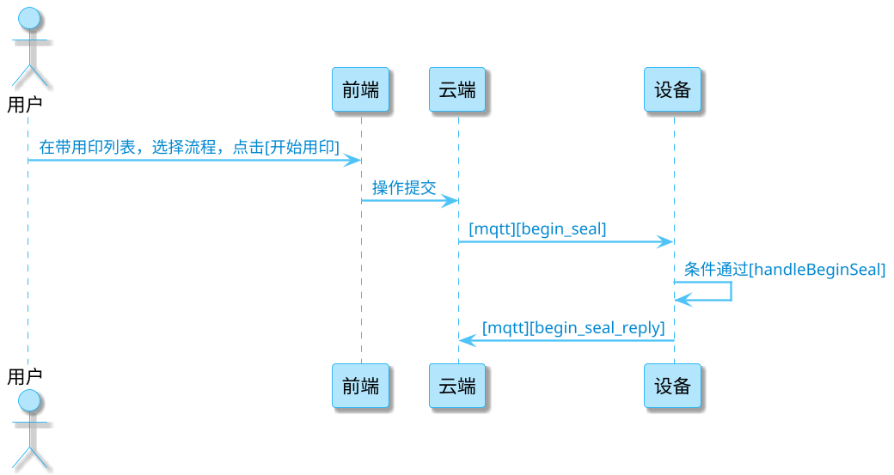

## 需求概览

视频打点：关键点记录

1. 后台相关配置开关 条件满足的情况下，天玺设备在进行视频录制时，需要记录用印过程中 在盖印时，以及存在风险时的时间点，将数据记录到视频的json数据文件中，随视频一同上传

视频切片：生成视频文件时，自动按某种条件滚动生成新名称的文件

1. 类似日志系统，视频切片的动作存在于 视频开始录制和视频结束录制这两个动作之间，是在进行编码数据io时，按某种规则自动处理的，非上层业务逻辑触发，上层业务逻辑仅决定规则配置，比如按大小进行切片或者按时间

## 任务背景

1. 该需求实现目前已经在天玺ydn aplus上进行了实现，由设备端开发梁丙政和后端开发晏磊涛进行协作开发，需求定制方：产品经理朱朦凯
2. 资料搜集:
   1. [[天玺视频录制新增自动切片，用印信息视频展示优化]]
   2. [[V3.11.0（印控仪支持有线连接天玺用印及数据传输）概要设计 ]]
3. 缺失
   1. 设备端与后端交互的协议描述缺少
4. 通过设备端代码进行协议逻辑的还原

## 1126 与云端 交互逻辑和时序

