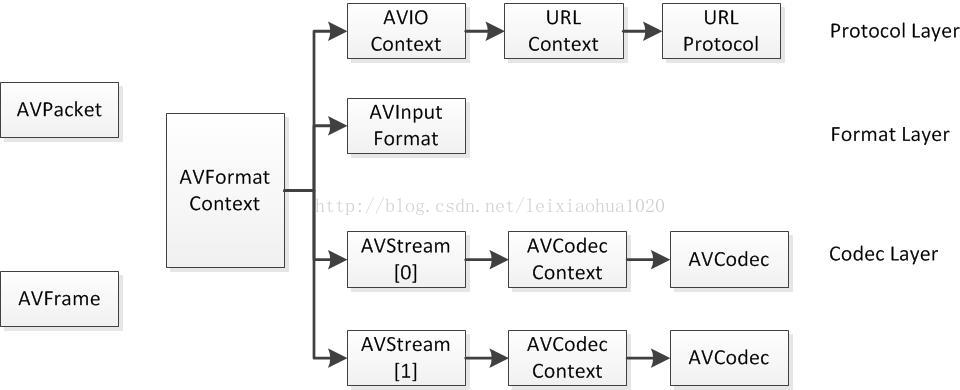
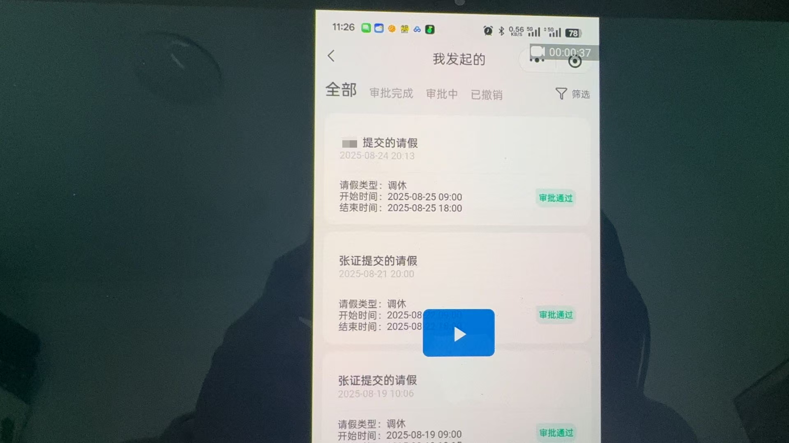

### 资料文件结构
```bash
─01 板卡硬件驱动
│  └─ASR_Drivers_220422
│      └─Drv
│          ├─MDiagUSB
│          │  ├─amd64
│          │  └─i386
│          ├─MUSBSer
│          │  ├─amd64
│          │  └─i386
│          ├─Win10
│          │  ├─MDiagUSB
│          │  │  ├─amd64
│          │  │  └─i386
│          │  ├─MUSBSer
│          │  │  ├─amd64
│          │  │  └─i386
│          │  └─WinUSB
│          │      ├─amd64
│          │      └─i386
│          └─WinUSB
│              ├─amd64
│              └─i386
├─02 AT指令资料
└─03 测试上位机
    └─admintoos
        └─Release
            ├─data
            ├─iconengines
            ├─imageformats
            ├─log
            ├─platforms
            └─styles
```

### 准备

#### 驱动安装

1. 安装用于连接模组的use转串口 驱动，安装成功并连接后，将在设备管理器的端口项出现对应 `COM`, 如图 `COM4`
2. 安装 `板卡硬件驱动`文件夹下的驱动程序 `DrvInstaller_x64.exe`

#### 上位机登录

1. 打开 `adminTools.exe` 程序
2. 检查模组设备列表, 选择 `ASR Modem Device`, 若无此项，说明驱动未正常安装
3. 修改配置文件，位于程序目录下的 `data/config.ini`, 修改其中 `UserPole` 字段为0
4. 输入UKey口令: `12345678`
5. 登录后进入

#### 密钥生成和充注

1. 按文档流程，获取`签名公钥`，生成`充注请求文件`后，将文件发送给模组厂商由他们的充注软件进行充注 `充注密钥`生成
2. 通过上位机导入密钥和配置文件，连接设备，自动完成充注。
3. **注意事项: 进行充注前，需要关闭上位机的日志(在基础信息面板进行关闭)，若充注失败，需要将上位机重启后继续** 


#### sim卡绑定 以及验证
1. 翻过模组pcb看，使用左边卡槽，并且插入时sim卡的缺口超卡槽外侧
2. 若sim卡槽位置和插入方向错误，则以下部分AT指令发送后无返回
3. 验证指令
```bash
AT+CFUN?  //值为 1（完整功能）。
AT+CPIN? //查询是否识卡 READY：已识卡。
AT+CIMI //查询 IMSI 号。
AT+CGSN //查询 EIMI 号。
AT+COPS? //查询注册网络。
AT+CEREG? //查询网络状态
AT+CGDCONT? //存在的默认承载的 PDP 上下文
```
4. 预期的正常输出
```bahs
2025-02-24 15:44:38 :  发送AT指令:AT+CPIN?
2025-02-24 15:44:38 :  接收AT指令:
RDY

+CPIN: READY

OK

2025-02-24 15:45:44 :  发送AT指令:AT+CFUN? 
2025-02-24 15:45:44 :  接收AT指令:
+CFUN: 1

OK

2025-02-24 15:45:51 :  发送AT指令:AT+CIMI
2025-02-24 15:45:51 :  接收AT指令:
460088796107048

OK

2025-02-24 15:45:59 :  发送AT指令:AT+CGSN
2025-02-24 15:45:59 :  接收AT指令:
863361066742620

OK

2025-02-24 15:46:06 :  发送AT指令:AT+COPS?
2025-02-24 15:46:06 :  接收AT指令:
+COPS: 0,2,"46000",7

OK

2025-02-24 15:46:15 :  发送AT指令:AT+CEREG? 
2025-02-24 15:46:15 :  接收AT指令:
+CEREG: 0,1

OK

2025-02-24 15:46:21 :  发送AT指令:AT+CGDCONT?
2025-02-24 15:46:21 :  接收AT指令:
+CGDCONT: 1,"IP","cmiotgtrss.js","10.201.218.226",0,0,,,,

OK
```

#### 上位机字符问题
1. 当前上位机的指令输入窗口，只能输入 `+=,` 三种符号，其余会被过滤，所以需要使用其他串口工具进行具体测试(后续版本的上位机已修复)

2. 使用`SSCOM`可以进行串口发送调试，注意: 勾选该上位机的`加回车换行`的选项


#### 原工程工程指令验证
```bash
### pass
AT+CPIN?
AT+QICLOSE=0
AT+QICLOSE=1
AT+CREG=2
AT+QCCID
AT+QENG=servingcell
AT+CREG?
AT+QCCID
AT+CREG?
AT+GSN
AT+CIMI
AT+CSQ
### error
AT+QGPS=1
### not verify
AT+QCFG=\"urc/ri/other\",\"off\",120,1\r\n
```