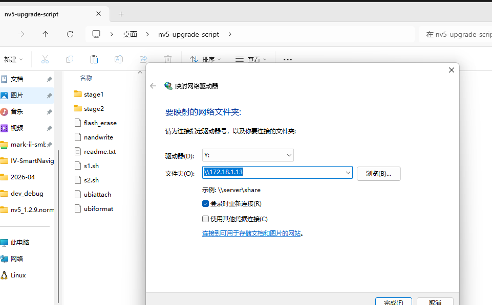

## loging compile server

1. 192.168.10.10
2. garfield
3. 12345678
4. user root: /home/jfxu/

## nvs 工程结构和git管理方案

## project sync / docker config / compile

## project compile

关键：要source /etc/profile 将编译工具链路径加载到环境变量中

```bash
1.xs_docker_run.sh choose XXXXX (目前有两种平台编译环境——海思OR瑞芯微)
hisi选择：xs_sw_ubuntu-22.04_hisi，rk选择：xs_sw_ubuntu-22.04
2.xs_docker_run.sh kill                    （清除原先镜像）
3. xs_docker_run.sh run                    (需要执行两次，加载现在选择的镜像)
4.编译环境配置
RK      :    source /opt/cross_toolchains/cross_toolchains_env_setup.sh
Hisi    :    source /etc/profile
/*
注意：
1.每次重新登录服务器需重启dockers，若没有变动【平台编译环境】，直接执行【3和4】步骤；否则需要重新【1->2->3->4】
2.exit 用于退出容器
*/
```

实操记录

```bash
xs_docker_run.sh choose xs_sw_ubuntu-22.04_hisi
xs_docker_run.sh run 
source /etc/profile

```


## docker 和 设备编译产物传输

1. windows 安装ssh服务
2. 查询用户名：`whoami`
3. 查询ip: `ifconfig`
4. ssh免密设置
   1. 在 Linux 服务器上生成密钥
   2. 将 Linux 的公钥拷贝到 Windows

        ```bash
        jfxu@xssw-ubuntu:~/codespace/demo/prj-helloworld-3519/build$ ssh-keygen -t rsa -b 4096
        Generating public/private rsa key pair.
        Enter file in which to save the key (/home/jfxu/.ssh/id_rsa): 
        Enter passphrase (empty for no passphrase): 
        Enter same passphrase again: 
        Your identification has been saved in /home/jfxu/.ssh/id_rsa
        Your public key has been saved in /home/jfxu/.ssh/id_rsa.pub
        The key fingerprint is:
        SHA256:ce1EwinYBaekuFskKda5pXPUQKpLTOeFsCoFrP3oR2w jfxu@xssw-ubuntu
        The key's randomart image is:
        +---[RSA 4096]----+
        |o .  .ooo++..    |
        | o + *.=ooo+     |
        |..* X * +.. o    |
        |.*.= X   o o     |
        |o ++* o S   .    |
        |....E=           |
        | ..o.            |
        |  . .            |
        |   .             |
        +----[SHA256]-----+
        ```

   3. 在 Windows 上创建授权文件：
    在 Windows 上进入你的用户目录：C:\Users\default-user-xs\。
    看有没有一个叫 .ssh 的文件夹（没有就建一个）。
    在 .ssh 文件夹里新建一个文本文件，起名为 authorized_keys (注意：不要有 .txt 后缀)。
    用记事本打开它，把刚才从 Linux 复制的那串代码粘贴进去，保存。

   4. 第三步：解决 Windows 特有的权限坑（非常重要）
    Windows 版的 OpenSSH 对权限检查非常严格，如果你的账户是管理员（根据你的路径，很可能是），默认的 authorized_keys 往往不起作用。
    请在 Windows 管理员模式的 PowerShell 中执行以下两步：
    修改配置文件：
    打开 C:\ProgramData\ssh\sshd_config（用记事本以管理员身份打开）：
    找到文件最末尾的这两行，在前面加 # 注释掉它们：
        code
        Text

        ```bash
        # Match Group administrators
        #       AuthorizedKeysFile __PROGRAMDATA__/ssh/administrators_authorized_keys
        ```

    确保文件中这一行是没有 # 的：
    code
    Text
    PubkeyAuthentication yes
    保存文件。
    重启 SSH 服务：
    在 PowerShell 中执行：
    code
    Powershell
    Restart-Service sshd

设置linux端scp便捷脚本

```bash
#!/bin/bash

# ================= 配置区 =================
# Windows 用户名
WIN_USER="default-user-xs"
# Windows IP 地址
WIN_IP="192.168.10.88"
# Windows 目标存放目录 (注意路径写法)
WIN_DEST_DIR="E:/share/share_for_compile_server/"
# SSH 端口 (默认是 22)
WIN_PORT="22"
# ==========================================

# 检查是否输入了文件名参数
if [ -z "$1" ]; then
    echo "用法: ./push.sh <文件名>"
    echo "示例: ./push.sh helloworld"
    exit 1
fi

FILE_TO_SEND=$1

# 检查本地文件是否存在
if [ ! -f "$FILE_TO_SEND" ]; then
    echo "错误: 找不到文件 '$FILE_TO_SEND'"
    exit 1
fi

echo "正在推送 [$FILE_TO_SEND] 到 Windows ($WIN_IP)..."

# 执行 SCP 命令
# 如果你之前设置了非 22 端口，请开启下面的 -P 参数
scp -P $WIN_PORT "$FILE_TO_SEND" "${WIN_USER}@${WIN_IP}:${WIN_DEST_DIR}"

# 检查执行结果
if [ $? -eq 0 ]; then
    echo "----------------------------------------"
    echo "成功: 文件已存放到 $WIN_DEST_DIR"
    echo "----------------------------------------"
else
    echo "----------------------------------------"
    echo "失败: 请检查网络连接或 Windows SSH 服务状态。"
    echo "----------------------------------------"
fi
```

添加执行权限
`chmod +x push.sh`

执行参考
`./push.sh helloworld`

```bash
# linux将文件push到windows中
scp ./helloworld default-user-xs@192.168.10.88:E:/share/share_for_compile_server/
```

windows tftp server自启流程
TODO

共享目录：E:\share\share_for_compile_server

## ref

[代码仓库](http://gitlab.linuxtechi.net/xssw/app/nvs.git)
[工程同步+docker编译](http://172.18.1.12/wiki/spaces/RJKF/pages/NuY6s3AX)
[windows ssh服务客户端安装](https://linkchain.github.io/posts/windows-install-openssh-server/)
[tftp下载连接](https://github.com/PJO2/tftpd64/releases/)

## TODO

0. 自建工程，hello world 编译运行通过
1. 利用现有docker image dev container环境创建
2. 尝试将docker克隆到本地支持本地编译

