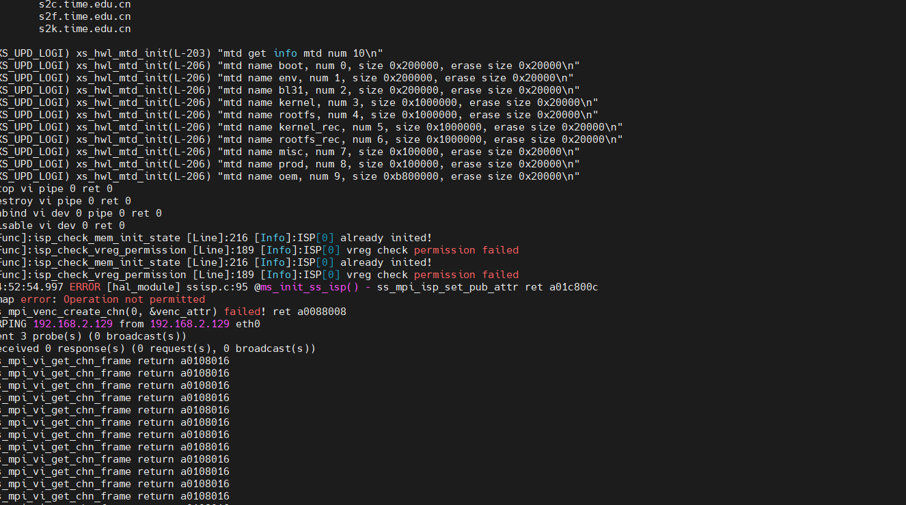

## orc 调试设备

ip: 192.168.2.129
用户名: admin
密码: Xs@Gate*666_

## 固件-上位机包发布路径

ip:\\172.18.1.13\Firmware

名称:xujf
密码:6Sq*r$[a

ip:\\172.18.1.13\Firmware
名称:sw_public
密码:SWpub_123

## 常见工具包

\\192.168.10.10\share\tools

## WIFI

## gitlab

http://192.168.10.10/xssw/app/nvs/-/blob/main/src/app/main.c?ref_type=heads

garfield Xjf.4776289g

## 编译服务器

192.168.10.10

jfxu 12345678

## tmp

