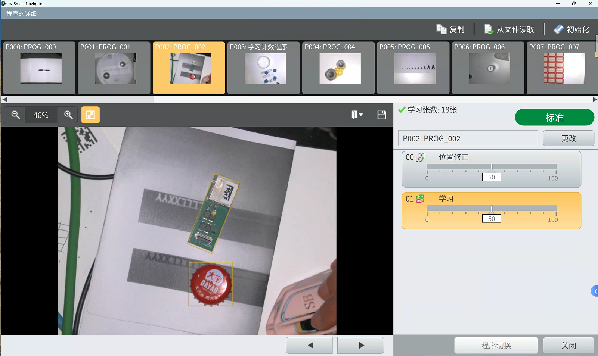
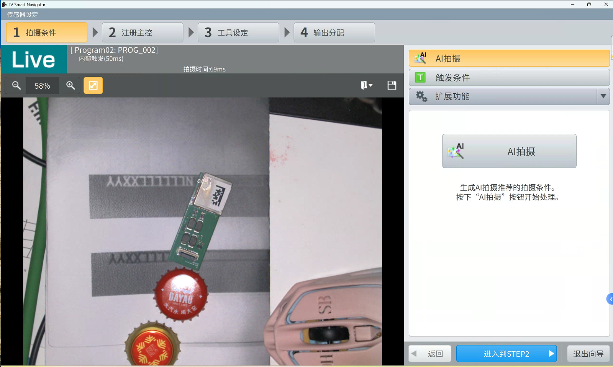
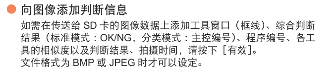
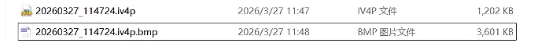
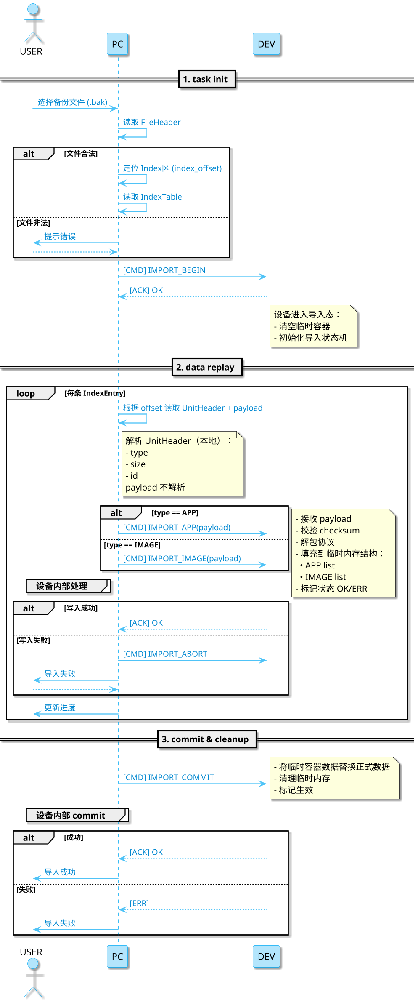
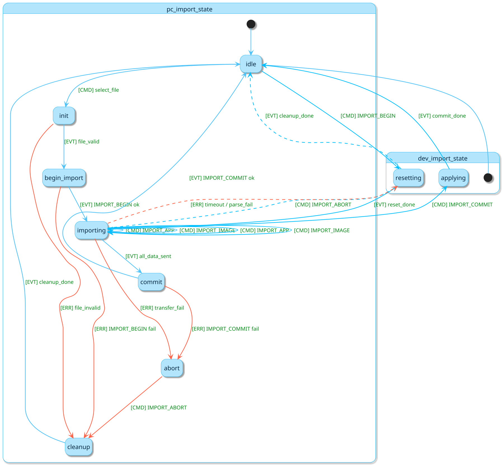

## 基础界面

程序设定
  

程序详细



传感器设定


## 导入导出

个别备份

1. 备份条件：
   1. 可在【运行中】或者【设定中】触发保存
   2. 多态监控设备仅一台可触发备份

统计数据以及耗时是否会备份？

1. 只备份程序数据，导入后运行不会保留原有的统计数据
2. 同时备份程序和运行图像，导入后运行不会保留原有的统计数据
3. 实验上位机在运行时关闭后一段时间再打开，统计数据不会重置，并且在断联期间是一直累加的，说明统计数据是由下位机运行管理 上位机仅获取后显示，属于程序实例的运行时数据，程序导出导入后，再运行属于新的运行实例，统计数据从零开始

运行图像历史 数据的 存储位置 生成过程 以及相关机制
上位机显示的运行图像历史 与 下位机运行历史的关系

！！！传感器断电后，哪些信息会持久化保存，哪些初始化？对比初始化传感器有哪些差异？

1. 手册p194，下位机保存了该数据，并且是易失性，上位机负责读取
2. 在【运行中】打开【运行图像历史】，发现显示的图像时间戳晚于现实几分钟
3. 【全部删除】触发后，导入备份也无效？备份运行图像历史仅仅是在设备断电后，存储有效
   1. 所以目前推测出来的，【运行图像历史备份】的语义：用于设备断电后，运行图像历史的恢复，该恢复对【全部删除】操作无效
   2. 【全部删除】操作的实现原理假设：上位机存储操作触发的时间戳，下发全部删除指令 下位机执行，当备份导入以后，判断时间戳，晚于则不执行备份运行图像恢复
4. 上位机做一个筛选显示，从下位机获取目标id的运行图像进行显示更新

实验：为何【全部删除】后，导入备份也无效？

1. 猜测：上位机存储了【全部删除】的信息，触发【全部删除】后，即使备份导入，也无效
   1. 上位机在连接状态下
   2. 备份单个程序+运行图像历史
   3. 运行图像历史 全部删除
   4. 导入备份
   5. 历史未恢复
   6. 重复1-5，仅在步骤3-4之间插入步骤：关闭和重新打开上位机
2. 猜测：下位机做了【全部删除】的信息记录，备份导入，上位机获取不到运行图像历史

程序数据

支持向sd卡备份，通过ftp备份

导入导出撤销恢复机制

## other



由此可推测 `.iv4p` 格式通常存储并压缩原图

## 状态机归属问题

原则：谁受中断影响，谁负责完整性

由于备份可能发生在 传感器运行中，设定中，那么意味着很多数据会实时更新的， 那么适用的模式应该是上位机先一次性获取到传感器的数据快照，程序 程序 id 以及图像id等，然后再按时序进行流式传输，完整性补充

数据快照 由下位机生成，一次性提供给上位机，上位机通过调用数据单元

下位机 接受导入后超时 自动清空

具体的数据关系还没有梳理好

上位机做“透明搬运”，可以保持一定的灵活性
协议录制 + 回放（record & replay）模型
存协议: 强制加版本号,每条数据必须标记类型,每条数据加轻量头,保留“最小元信息”(重点)  为了确保协议的回放可靠性，需要最小元信息保证
当前阶段采用“协议录制回放”方案，是因为业务数据结构尚未稳定，为避免过早绑定数据模型，先保证功能闭环与一致性，后续再演进为结构化存储
目前只在看需求和架构，没有深入代码实现，
业务数据结构（程序、工具、图像之间的关系）还不清晰，也不稳定。
存数据

说辞：
目前在导入导出设计上，我优先选择了“协议录制回放”的方案。

主要原因是当前阶段还在需求分析，没有深入到具体代码，
程序、工具、图像以及结果之间的数据结构还不够明确，
如果现在就做结构化拆分，存在较大不确定性，后续可能需要推翻。

因此第一阶段采用协议级数据单元进行存储，
即直接保存设备返回的原始协议数据，并通过索引进行管理。

这种方式可以保证：
1. 数据导入导出的一致性（与设备协议完全一致）
2. 上位机实现简单，不依赖复杂解析逻辑
3. 降低与设备内部数据结构的耦合

后续在业务模型稳定后，可以再演进为结构化存储（JSON + 数据块），
以支持更细粒度的数据操作，比如部分导入、增量同步等能力。

再来和上位机约定一个export-import version，版本号不变，意味着指令和流程可以兼容

## 实行路径

1. iv4上位机，交互时序图，区分不同状态下，功能的执行(运行中，设定中)





### 截图

导出时序
  

导入时序
  

上位机导出
  

下位机导出
  

上位机导入
  

下位机导入


```bash
+-------------------+
| File Header        |  <- 固定长度
|-------------------|
| Data Unit 1        |  <- UnitHeader + payload (主控/原图/缩略图等)
| Data Unit 2        |  
| Data Unit 3        |  
| ...                |
|-------------------|
| Index Table        |  <- 支持随机访问
+-------------------+
```

1. 二进制备份格式定义 
2. 数据单元定义
3. 下位机操作过程


gpt
不是的，现在方案还是有问题，之前我想着，把步骤由上位机组合，复用现有的部分命令，然后一个一个unit传输，后面发现及时这样，还是会很乱的，并且没有形成标准，而且这边下位机的工作并没有简单，反而混乱。和同事沟通以后，还是得采用，包都在下位机整理，写入，读取，上下位机就直接传输包，当作二进制传输，然后包本身的思路还是我们开始的，自定义的二进制的思路，只是下位机写和整理。另外目前主要分为这几类数据，程序本身的数据，已经能够完全序列化为json了，里面涉及的图像会有一个图像id占位，程序就用pro_json表示，然后涉及的图像就有三类，主控图像，追加学习图像和缩略图，并且数量都不固定。然后就是学习图像历史，里面也是有一份完整json的，每张图像，并且也有缩略图，每个程序上线50张，所以学习图像历史，作为另一种类型数据，run_history_json + 图像。所以在之前的时序图和状态机的基础上改，核心还是交互，以及自定义文件格式更具体的分类